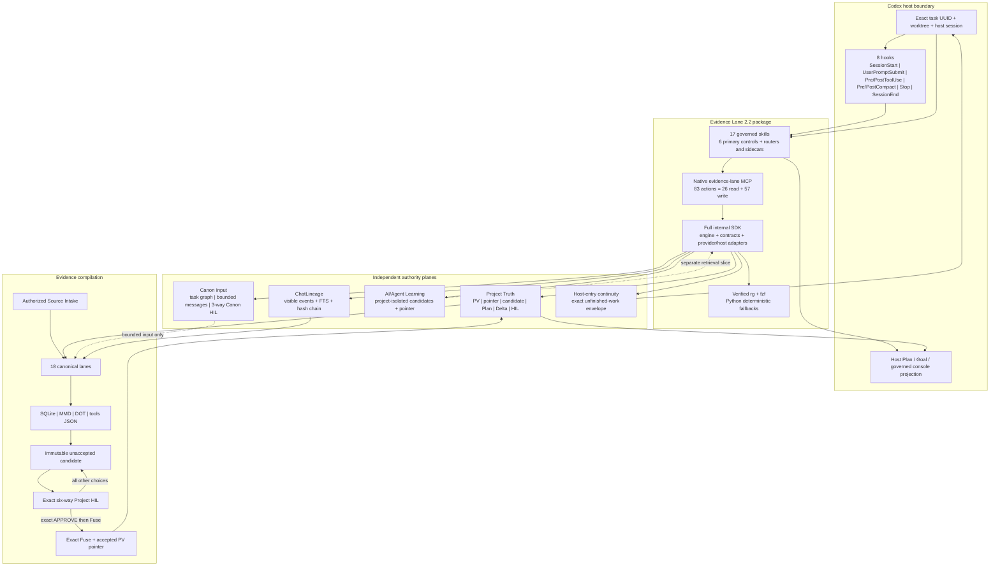

# Evidence Lane 2.2.0 architecture

Evidence Lane is a Codex-native, local-first evidence lifecycle. Version 2.2.0
is the current pre-HIL source line. Accepted Project Truth remains PV12 on the
2.1.0 base until a fresh six-way Project HIL authorizes a different result.
Source version, installed stable version, disabled fallback version, candidate
identity, and accepted PV identity are separate facts.

## Authority model

Evidence Lane keeps these authorities independent:

1. **Project Truth** owns accepted source claims, immutable PVs, the accepted
   pointer, candidates, the Project HIL, Plan Lane, tasks, and Deltas.
2. **Canon Input** carries typed, bounded communication between exact governed
   tasks. It supports upstream, downstream, lateral, fan-out, fan-in, result,
   conditional backfire, and State Travel context, but cannot promote Project
   Truth or Agent Learning.
3. **AI/Agent Learning** owns project-isolated semantic, episodic, and
   procedural learning candidates plus its own decisions and pointer. It never
   overwrites Project Truth.
4. **ChatLineage** stores secret-redacted visible prompts, steers, responses,
   operational events, locators, receipts, and hash-chain provenance. It never
   stores private reasoning.
5. **Host-entry continuity** moves exact unfinished context into a bound host
   entry without replaying HIL, accepting Canon, promoting Learning, or moving
   a Project pointer.

Each authority has its own schema, namespace, replay ledger, receipts, tests,
and failure states. Shared hashes or vocabulary do not merge authority.

## Source, evidence, candidate, and accepted flow

```text
Authorized source + visible task lineage
                  |
                  v
        policy, redaction, hashing
                  |
                  v
      bounded 18-lane evidence build
                  |
                  v
      immutable unaccepted candidate
                  |
                  v
          exact six-way Project HIL
                  |
                  +-- APPROVE -> exact Fuse -> accepted PV pointer
                  +-- every other decision -> no implicit promotion
```

Lane computation may run concurrently behind one deterministic source-hash
barrier. Candidate sealing, HIL, Fuse, pointer movement, Git writes,
installation, and publication remain serial governed operations. A test,
commit, push, package, install, preview, or polished website is evidence only;
none implies acceptance.

## Plugin-maintainer release cycle and downstream projects

Evidence Lane's own release route is scoped to an authorized logical plugin
release commit batch: exact branch commit and governed push, clean CI/security,
Git-triggered preview, exact package build, Stable-slot install/hot reattach,
and persistent-or-no-window Evidence Lane helper/tunnel proof. Its intermediate
or final plugin PV gate follows that evidence. A full public-site narrative,
navigation, page, or animation refresh still belongs only to its assigned
website Delta; updating the live Plan/PV projection is not that delivery.

The current Row196 edge is the exact-commit prerequisite: required clean CI and
the Git-triggered preview must both bind the reviewed v2.2 branch commit. The
immediate Row197/PV13 install-HIL edge then replaces the enabled Stable selector
with that exact 2.2 package and requires installed UI/native readback of 83
actions (26 read/57 write), 17 skills, eight hook events, and the migrated
command surface before the PV13 HIL is shown. Neither edge merges main or writes
the disabled fallback.

A downstream user's project PV does not reinstall or release Evidence Lane and
does not inherit the plugin maintainer's tunnel or CI topology. The project may
choose, replace, or implement its own Git/CI/deploy workflow, evolve its
governed schemas or lanes, add bounded plugins, and select storage connectors.
ENV/UOP may be inspected, routed, offloaded, or evolved through a new sealed
identity. An already accepted locked ENV/UOP identity cannot be edited in
place.

This maintainer route also owns version-bound Windows support processes. The
release updater is private to Evidence Lane development; governed users receive
the Goal-recovery helper and, when host classification requires transport, the
Stable tunnel. They run persistently or with a true no-window launch. Older
versioned copies remain retained and disabled. The pre-final-HIL fallback stays
at its observed 2.0 identity. Only an exact final PV14 human approval and Fuse
may begin the serial rotation that proves main equals the accepted commit,
hydrates both Stable and disabled fallback from the same accepted 2.2 package,
rotates matching helper/tunnel identities, and leaves one active runtime. The
same rule repeats for later plugin-maintainer releases, never for downstream
project PVs.

Goal lifetime is a different human authority. `MARK GOAL COMPLETE` with
`COMPLETE_THIS_TASK_AND_STATE_TRAVEL` closes only the current task boundary and
requests an exact successor; `COMPLETE_FULLY` closes the whole Goal. No HIL,
candidate, test, Plan transition, automation, pause, or stall may complete a
Goal, and Goal completion grants no HIL, Fuse, pointer, Git, install, merge, or
deployment authority.

## Plan, Canon, and task coordination

Plan Lane is the sole row and lifecycle-status authority. Its host Step Task
List is a complete projection with one visible item per executable row, exact
task ID and description, derived class/group/batch/commit/version/dependency
markers, exactly one active row, and the physically final HIL last. Linked
steers append immutable Deltas; completed and superseded history is never
silently reopened.

Canon links exact project/task UUIDs and deep links, contracts, revisions,
source PV seals, expiry, route trace, and result requirements. Exact expected
input may auto-admit. Undefined or incompatible input stops only the receiving
top-level task at the three-way Canon Input HIL: `ACCEPT`, `REJECT`, or
`MORE_RESEARCH`. A linked top-level task may own its own independent HIL;
subagents never own HIL. Canon backfire is conditional, deduplicated, bounded,
and addressed to the exact task that can supply the missing input.

## Full internal SDK

The private internal Codex SDK is the full engine-and-contract layer, not a
small retrieval wrapper. Its independently namespaced arms cover Project
Truth, Canon Input, AI/Agent Learning, ChatLineage, host-entry continuity,
lifecycle and hooks, Plan/Delta/tasks, source and lane retrieval, ENV/UOP plus
Formula/PCM/MBA routing, storage/connectors, candidate/HIL/pointer operations,
and provider/host adapters. Unsupported provider capabilities return
`HOST_CAPABILITY_UNAVAILABLE`; one arm is never used as a substitute for
another.

## Native plugin surface



The arrows show data and control flow, not merged authority. Canon cannot
promote Project Truth, Learning cannot overwrite it, hooks cannot govern it,
the website cannot execute it, and the host Plan surface cannot accept a PV.

The 2.2.0 package contains one package-local MCP server named
`evidence-lane`, exactly 83 canonical actions (26 read-only and 57
write-capable), 17 governed skills, six primary controls, and eight lifecycle
events. The six controls are Boot, Rollback, Build, Refresh, Mode, and Source
Intake. State Travel is a conditional exact-resume path; it is not a seventh
primary control.

Hooks transport `SessionStart`, `UserPromptSubmit`, `PreToolUse`,
`PostToolUse`, `PreCompact`, `PostCompact`, `Stop`, and best-effort
`SessionEnd`. Skills own PREPARE, native reads, classification, Plan refresh,
and HIL behavior. The host owns UI rendering and permission prompts.

Package-owned search uses hash-pinned ripgrep 15.2.0 and fzf 0.74.2 where a
matching platform binary is packaged. The resolution order is package-local
verified binary, explicitly configured absolute host binary with exact SHA-256,
then a deterministic bounded Python fallback. PATH guessing, shell execution,
and downloads during MCP startup are forbidden.

## Host and storage boundary

Durable Codex Desktop, local CLI, and persistent workspaces use project-scoped
local SQLite. Ephemeral hosts require a durable mount or explicitly configured
transactional storage connector. Google Drive is at most an optional sealed
artifact carrier or mirror. The eight additional-plugin slots are a different
surface and never select storage.

Stable/current and Beta desktop packages may expose multiple product surfaces.
Evidence Lane 2.2.0 governs only a positively proven Codex layer. A package
name, process, title, or current working directory alone cannot prove that
surface. Local durable Codex uses the package-local MCP and does not need an
Evidence Lane network tunnel. Any separately classified interactive ephemeral
tunnel helper must remain persistently hidden and cannot become lifecycle
authority.

## Git, install, and release topology

The current source branch is
`agent/evi-v220-systemwide-release-hil-v2.2.0`. A bounded exact-commit route
may push that branch, run governed Python CI, CodeQL, dependency checks, a
Vercel Git preview, package verification, and stable-slot verification before
the final HIL. Main promotion, fallback replacement, production publication,
and Project Truth acceptance remain separate post-HIL operations.

The disabled fallback was directly observed at 2.0.0. That is a measured host
fact, not a display-cache assumption and not proof that it already contains
accepted PV12/2.1 bytes. It remains untouched until the later explicitly
governed fallback-rotation step.

## Public documentation source law

Every public website route exposes the exact Git-tracked Markdown authority
from which its current story is derived. The website is a projection, never a
lifecycle authority. Route coverage and source-file existence are tested in
clean CI. See [the public site source map](docs/PUBLIC_SITE_SOURCE_MAP.md).

## Detailed contracts

- [Detailed system architecture](docs/ARCHITECTURE.md)
- [Canon task graph and Canon Input HIL](docs/CANON_TASK_GRAPH_AND_INPUT_HIL.md)
- [Internal full-layer Codex SDK](docs/INTERNAL_CODEX_SDK.md)
- [Host, storage, ENV/UOP, and Agent Learning](docs/HOST_STORAGE_ENV_MODE_CONTINUITY.md)
- [Skills](docs/SKILLS.md)
- [Native MCP](docs/MCP.md)
- [Hooks](docs/HOOKS.md)
- [Implementation traceability](docs/IMPLEMENTATION_TRACEABILITY.md)
- [Security](SECURITY.md)
