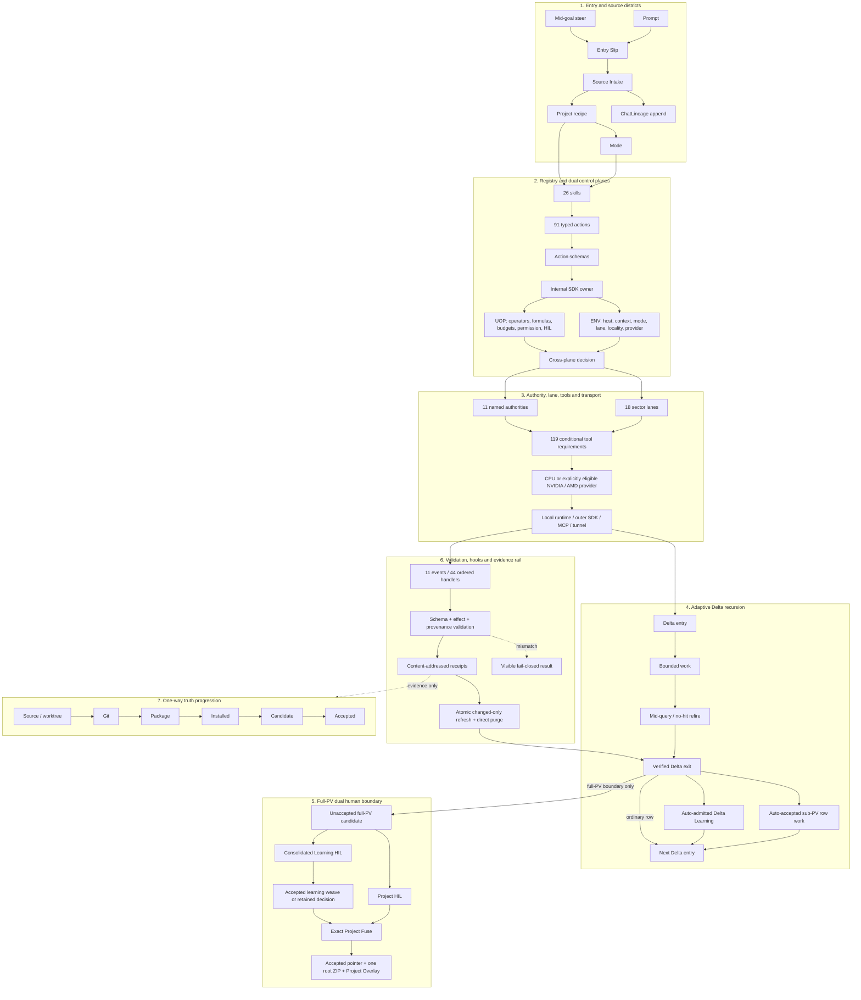
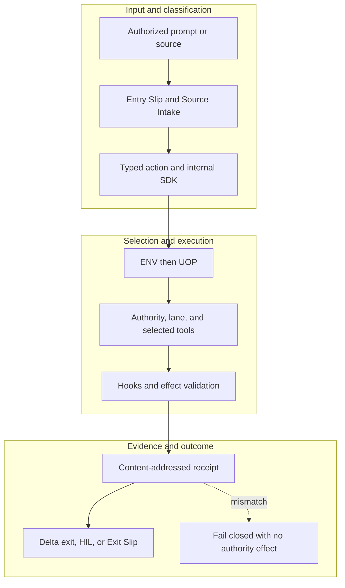

<!-- evidence-lane-public-docs-full-refresh: 3.0.0 / registry-derived-v1 -->

# Evidence Lane 3.0.0 architecture

Evidence Lane is a registry-driven Codex execution and evidence architecture. It keeps environment selection, governance, project authorities, sector lanes, tools, transports, hooks, results, and human decisions distinct while connecting them through typed receipts.

Current counts are derived release facts, not permanent ceilings.

## Plugin-maintainer release cycle and downstream projects

A downstream user's project PV does not reinstall, cache-bust, restart, promote, or otherwise inherit the plugin-maintainer release cycle. Downstream Project/PV work consumes an already verified installed contract and preserves its own Plan, Goal, HIL, pointer, and accepted-state authorities.

## Current executable topology

| Registry surface | Current value |
| --- | ---: |
| Public actions | 91 |
| Skills | 26 |
| Hook events / handlers | 11 / 44 |
| Sector lanes | 18 |
| Named authorities | 11 |
| Source modules | 144 |
| Schemas | 170 |
| Tool requirements | 119 |

## Routing stages

1. `intent_and_skill_resolution` from `skill_surface_registry`
2. `typed_action_resolution` from `public_and_internal_action_schemas`
3. `internal_execution_owner` from `internal_sdk_registry`
4. `environment_decision` from `env_authority`
5. `operator_and_gate_decision` from `uop_authority`
6. `authority_and_lane_resolution` from `authority_and_sector_registries`
7. `conditional_tool_resolution` from `tool_execution_routing`
8. `outer_transport_resolution` from `outer_sdk_and_mcp_bindings`
9. `ordered_hook_handling` from `hook_event_registry`
10. `result_validation_and_receipt` from `schemas_and_receipt_ledger`

## ENV and UOP

ENV is the environment decision authority: host profile, context, locality, availability, grants, Mode, project recipe, and eligible ordered pipeline. UOP is the governance authority: operators, formulas, project-class HIL, work/privacy/disclosure gates, and declared same-class fallback. UOP cannot override ENV, Project Truth, Plan, Goal, or HIL.

Both are clean Codex-native schema-version-17 SQLite action planes with bounded FTS and MMD/DOT traversal maps. They store no prompt corpus, discussion history, ChatLineage payload, uploaded artifact packet, foreign path, or external-model agent authority.

ENV selects CPU, NVIDIA CUDA, AMD ROCm, or AMD DirectML only from an explicit user-enabled provider grant and compatible runtime probe. UOP independently enforces action eligibility, telemetry, throttle state, configured VRAM budget, and visible CPU fallback. Accelerators are execution providers, not tools, MCP actions, models, or authorities.

## Named authorities

| Authority | Role |
| --- | --- |
| `agent_learning` | Project-isolated learning candidates, decisions, accepted lessons, and revocations. |
| `canon_input` | Typed task contracts, envelopes, receiver decisions, edges, and results. |
| `project_memory` | Bounded memory locators and typed cross-authority links. |
| `project_overlay` | Full-PV proposal overlay at the owning Project HIL only. |
| `source_authority` | Exact source identities, occurrences, provenance, and source graph. |
| `project_universe` | Per-project relationship graph. |
| `connector_brain` | Connector grants and hash-only federated mini-brain links. |
| `project_authority` | Project root, layout, membership, pointer, and registration. |
| `receipt_ledger` | Exact input, route, result, provenance, and linkage receipts. |
| `session_authority` | Session, host, attachment, State Travel, and Goal continuity. |
| `instructions` | AGENTS.md and host MEMORY.md instruction chain. |

## Project-sector lanes

| Lane | Role |
| --- | --- |
| `github_code` | Git refs, commits, trees, blobs, changes, and repository history. |
| `local_code` | Working-tree files, code structure, chunks, and dependencies. |
| `chat_lineage` | Prompts, responses, steers, and task entry/exit evidence. |
| `discussion` | Bounded discussion claims and decisions. |
| `analysis` | Source-backed findings, relationships, and uncertainty. |
| `plan` | Canonical Plan rows, dependencies, transitions, and projections. |
| `mode` | Operating-mode classification and intersection. |
| `docs` | Documentation hierarchy, text, relationships, and citations. |
| `data_excel` | Tabular and spreadsheet structure, formulas, and typed facts. |
| `ppt` | Slides, notes, shapes, tables, and media references. |
| `pdf_ocr` | PDF structure, native text, page geometry, and OCR fallback. |
| `images_ocr` | Image metadata, OCR, and visual locators. |
| `artifacts` | Generated deliverables and exact artifact identities. |
| `custom` | Explicit user-defined source schemas. |
| `brain_loader` | Imported Evidence Lane/SQLite brain packages. |
| `research` | Web and research evidence, citations, and provenance. |
| `project_engulf` | Initial project classification and lane registration plan. |
| `sqlite_brain` | Existing SQLite schema, relationships, and bounded queries. |

## Tool roles

| Role class | Count | Boundary |
| --- | ---: | --- |
| `TASK_EXECUTION` | 82 | Selected only when the exact action phase makes the condition true |
| `TRANSPORT_OR_ORCHESTRATION` | 12 | Selected only when the exact action phase makes the condition true |
| `OBSERVABILITY_OR_EVALUATION_ATTACHMENT` | 8 | Selected only when the exact action phase makes the condition true |
| `EXTERNAL_SERVICE_OR_STORE` | 17 | Selected only when the exact action phase makes the condition true |

FastMCP, native/domain MCP, the outer SDK, and the tunnel are transport or composition layers. They never become the acting agent or project authority. OpenAI Agents SDK is a subordinate Codex-owned function-tool/MCP client library only.

## Storage and refresh

Project/PV roots own or link project authorities. Source bytes and chunks are content-addressed once; SQLite/FTS indexes, lane facts, and graphs are refreshed atomically; unchanged atoms are reused. A replacement route directly purges superseded executable/schema/generated/test/doc references in the same Delta while immutable receipts remain non-executable history.

## Source-bound workflow map

This page is projected from the same current executable snapshot as the rest of the documentation set. The map is deliberately two-directional: each horizontal district shows peer stages while vertical edges show ownership and state progression.

## Contract and readback

| Phase | Current contract | Required readback |
| --- | --- | --- |
| Input | Authorized prompt or source | Exact identity, provenance, and scope |
| Classification | Entry Slip and Source Intake | Owning schema, action, lane, skill, or authority |
| Owner | Typed action and internal SDK | One canonical implementation owner |
| Route | ENV then UOP | Condition-true ordered route with no hidden alias |
| Execution | Authority, lane, and selected tools | Real execution or a visible fail-closed result |
| Validation | Hooks and effect validation | Hash, schema, authority-effect, and negative-case checks |
| Receipt | Content-addressed receipt | Content-addressed result and provenance receipt |
| Downstream | Delta exit, HIL, or Exit Slip | Only the explicitly eligible next state |
| Failure | Fail closed with no authority effect | No inferred HIL, candidate acceptance, or pointer movement |

## Canonical source owners

- `toolchains/universal-plugin-architecture.v1.json`
- `sdk/sdk-manifest.v1.json`
- `authorities/authority-surface-registry.v1.json`

### Exact backend readback

| Source contract | Bytes | SHA-256 |
| --- | ---: | --- |
| `toolchains/universal-plugin-architecture.v1.json` | 1802575 | `C06F59826A30C39C14B973AA043BABCB84FFF8758C73F0B8B6A1C847A38A3B29` |
| `sdk/sdk-manifest.v1.json` | 76103 | `B97D608619CE2EFD385D96F17FC655F8FDD43782F3EC8715B2C91566BA696340` |
| `authorities/authority-surface-registry.v1.json` | 5022 | `C10CCF0AD086D13F8D73FA627101CA2349D82D44404E0AC508E4FD51E2432B43` |

## Cross-surface invariants

- The current snapshot contains 91 public actions, 26 skills, 11 hook events / 44 handlers, 119 tool requirements, 18 sector lanes, and 11 named authorities. These are derived counts, not fixed ceilings.
- Executable ownership stays one-way: skills select, MCP exposes, the outer SDK routes, the internal SDK executes, ENV selects, UOP governs, tools perform bounded work, hooks emit receipts, and the owning authority validates effects.
- Any missing identity, schema, grant, capability, dependency, receipt, or authority proof must fail closed at its owning phase; a later green check cannot retroactively authorize the skipped boundary.
- A changed route refreshes every dependent schema, manifest, generator, test, diagram, and documentation reference; the superseded executable route is directly purged in the same Delta.
- Tests, Git, CI, installation, restart, deployment, discussion, or a rendered page never imply Project HIL, Learning HIL, Goal completion, or pointer movement.

---

This page is a Git-tracked documentation projection. Executable source, SQLite authorities, installed-runtime receipts, and explicit human gates remain the governing evidence.
