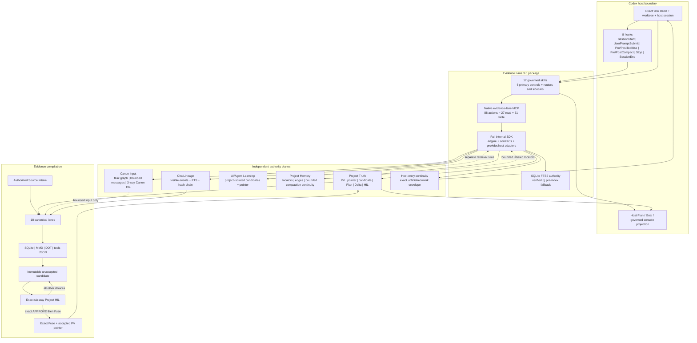

# Evidence Lane 3.0.0 architecture

Evidence Lane is a Codex-native, local-first evidence lifecycle. Version 3.0.0
is the current pre-HIL source line. Accepted Project Truth remains PV12 at
generation 12 until a fresh six-way Project HIL authorizes a different result.
Source, installed package slots, candidate identity, and accepted PV identity
remain separate measured facts.

## Authority model

Evidence Lane keeps these authorities independent:

1. **Project Truth** owns accepted source claims, immutable PVs, the accepted
   pointer, candidates, the Project HIL, Plan Lane, tasks, and Deltas.
2. **Canon Input** carries typed, bounded communication between exact governed
   tasks. It supports upstream, downstream, lateral, fan-out, fan-in, result,
   conditional backfire, and State Travel context, but cannot promote Project
   Truth or Agent Learning.
3. **AI/Agent Learning** owns project-isolated semantic, episodic, and
   procedural learning candidates plus its own decisions and pointer. It never
   overwrites Project Truth.
4. **Project Memory** owns content-addressed locators, typed cross-authority
   relationships, bounded retrieval receipts, and compaction checkpoint and
   rehydration continuity. It stores no raw source payloads and cannot promote
   Project Truth or Agent Learning.
5. **ChatLineage** stores secret-redacted visible prompts, steers, responses,
   operational events, locators, receipts, and hash-chain provenance. It never
   stores private reasoning.
6. **Host-entry continuity** moves exact unfinished context into a bound host
   entry without replaying HIL, accepting Canon, promoting Learning, or moving
   a Project pointer.

Each authority has its own schema, namespace, replay ledger, receipts, tests,
and failure states. Shared hashes or vocabulary do not merge authority.

## Source, evidence, candidate, and accepted flow

```text
Authorized source + visible task lineage
                  |
                  v
        policy, redaction, hashing
                  |
                  v
      bounded 18-lane evidence build
                  |
                  v
      immutable unaccepted candidate
                  |
                  v
          exact six-way Project HIL
                  |
                  +-- APPROVE -> exact Fuse -> accepted PV pointer
                  +-- every other decision -> no implicit promotion
```

Lane computation may run concurrently behind one deterministic source-hash
barrier. Candidate sealing, HIL, Fuse, pointer movement, Git writes,
installation, and publication remain serial governed operations. A test,
commit, push, package, install, preview, or polished website is evidence only;
none implies acceptance.

## Plugin-maintainer release cycle and downstream projects

Evidence Lane's own release route is scoped to an authorized logical plugin
release commit batch: exact branch commit and governed push, clean CI/security,
Git-triggered preview, exact package build, Stable-slot install/hot reattach,
and persistent-or-no-window Evidence Lane helper/tunnel proof. Its intermediate
or final plugin PV gate follows that evidence. A full public-site narrative,
navigation, page, or animation refresh still belongs only to its assigned
website Delta; updating the live Plan/PV projection is not that delivery.

An intermediate branch checkpoint binds the complete reviewed v3.0 source
scope, exact commit and tree, governed push, Actions head, deterministic
package, and branch-commit recovery slot. It creates no candidate, invokes no
HIL, moves no accepted pointer, and does not merge `main`. A later release HIL
may be presented only after the exact package is installed and native readback
proves 88 actions (27 read/61 write), 17 skills, eight distinct hook events,
and the migrated command surface.

A downstream user's project PV does not reinstall or release Evidence Lane and
does not inherit the plugin maintainer's tunnel or CI topology. The project may
choose, replace, or implement its own Git/CI/deploy workflow, evolve its
governed schemas or lanes, add bounded plugins, and select storage connectors.
ENV/UOP may be inspected, routed, offloaded, or evolved through a new sealed
identity. An already accepted locked ENV/UOP identity cannot be edited in
place.

This maintainer route also owns version-bound Windows support processes. The
release updater is private to Evidence Lane development; governed users receive
the Goal-recovery helper and, when host classification requires transport, the
Stable tunnel. They run persistently or with a true no-window launch. Older
versioned copies remain retained and disabled. The pre-final-HIL fallback stays
byte-frozen at its last verified identity. Only an exact final human release
approval and Fuse may begin the serial rotation that proves main equals the accepted commit,
hydrates both Stable and disabled fallback from the same accepted 3.0 package,
rotates matching helper/tunnel identities, and leaves one active runtime. The
same rule repeats for later plugin-maintainer releases, never for downstream
project PVs.

Goal lifetime is a different human authority. `MARK GOAL COMPLETE` with
`COMPLETE_THIS_TASK_AND_STATE_TRAVEL` closes only the current task boundary and
requests an exact successor; `COMPLETE_FULLY` closes the whole Goal. No HIL,
candidate, test, Plan transition, automation, pause, or stall may complete a
Goal, and Goal completion grants no HIL, Fuse, pointer, Git, install, merge, or
deployment authority.

State Travel is strictly a no-restart task transition. Phase 1 must prove one
unchanged Codex host-process instance, the exact source and destination task
UUID/deep-link pair, the initial destination shell's source/destination binding,
the exact host creation result, and one live canonical destination identity.
Any renderer reload/freeze, app restart, stale or duplicate task activation,
unexpected navigation, or background-agent activation is
`STATE_TRAVEL_HOST_CONTINUITY_FAILURE`: stop before handoff consumption, do not
retry, and preserve all bytes. The maintainer release helper, governed-user Goal
recovery helper, tunnel helper, scheduled recovery task, and subagents are not
State Travel executors.

Destination entry and panel recovery use a bounded sealed handoff plus the
canonical Plan Lane, never full chat-history hydration. Unbounded `thread/read`,
collaboration/avatar-overlay hydration, or a React-root rerender is a
first-class continuity failure even when the Codex root process remains alive.
The critical section is serialized to one active task and zero subagents; on a
renderer reset it fails closed, revalidates the complete native ledger, and
reactivates the exact current host window before work.
The plugin can enforce and attest this boundary but cannot guarantee survival
of host-owned renderer state.

The host Step Task List and exact task/worktree-bound Changes surface remain a
durable visible pair while the Goal is human-active. Every missing, partial,
stale, compacted, or renderer-dropped observation triggers exact native Plan
rehydration and task binding before work. If the host cannot perform or attest
that action, fail closed rather than treating native backlog or Sources presence
as UI proof. The pair may be released only when the human completes the Goal or
an exact task-completion-and-State-Travel handoff passes to its successor.

The Step Task List is a bounded execution projection, not the whole ledger. Its
host explanation carries a compact continuity header: accepted PV/pointer
generation, absolute ACTIVE row, current ten-row-or-smaller window, total
executable rows, next HIL boundary, and physical-final row.
Each visible task is a maximum three-line UI projection. The full Plan row,
description, metadata, linked Deltas, dependencies, and evidence remain in the
canonical Plan authority and are retrieved by exact task identity plus bounded
FTS only when needed; UI wrapping or overflow never creates a canonical row.
Detailed next and queued HIL records, proposed PV identities, six-way choices,
and exact dependency/continuation connections live only in the Evidence Lane
project renderer. Neither surface can accept HIL or move a pointer.

## Plan, Canon, and task coordination

Plan Lane is the sole row and lifecycle-status authority. The host Step Task
List contains only the aligned current window of at most ten executable rows,
with exact task ID and description plus derived class/group/batch/commit/
version/dependency markers. Earlier windows remain sealed completed-window
history and the next window activates only after the current one is terminal;
the final window contains the exact remainder. The full native ledger retains
exactly one active row and one physically final HIL as its last row. Linked
steers append immutable Deltas; completed and superseded history is never
silently reopened.

Canon links exact project/task UUIDs and deep links, contracts, revisions,
source PV seals, expiry, route trace, and result requirements. Exact expected
input may auto-admit. Undefined or incompatible input stops only the receiving
top-level task at the three-way Canon Input HIL: `ACCEPT`, `REJECT`, or
`MORE_RESEARCH`. A linked top-level task may own its own independent HIL;
subagents never own HIL. Canon backfire is conditional, deduplicated, bounded,
and addressed to the exact task that can supply the missing input.

## Full internal SDK

The private internal Codex SDK is the full engine-and-contract layer, not a
small retrieval wrapper. Its independently namespaced arms cover Project
Truth, Canon Input, AI/Agent Learning, Project Memory, ChatLineage,
host-entry continuity,
lifecycle and hooks, Plan/Delta/tasks, source and lane retrieval, ENV/UOP plus
Formula/PCM/MBA routing, storage/connectors, candidate/HIL/pointer operations,
and provider/host adapters. Unsupported provider capabilities return
`HOST_CAPABILITY_UNAVAILABLE`; one arm is never used as a substitute for
another.

## Native plugin surface



The arrows show data and control flow, not merged authority. Canon cannot
promote Project Truth, Learning cannot overwrite it, hooks cannot govern it,
the website cannot execute it, and the host Plan surface cannot accept a PV.

The 3.0.0 package contains one package-local MCP server named
`evidence-lane`, exactly 88 canonical actions (27 read-only and 61
write-capable), 17 governed skills, six primary controls, and eight lifecycle
events. The six controls are Boot, Rollback, Build, Refresh, Mode, and Source
Intake. State Travel is a conditional exact-resume path; it is not a seventh
primary control.

Hooks transport `SessionStart`, `UserPromptSubmit`, `PreToolUse`,
`PostToolUse`, `PreCompact`, `PostCompact`, `Stop`, and best-effort
`SessionEnd`. Skills own PREPARE, native reads, classification, Plan refresh,
and HIL behavior. The host owns UI rendering and permission prompts.

SQLite FTS5/BM25 is the indexed query authority for Plan, lane, ChatLineage,
and project-sector data. Queries return only bounded rows carrying pointer and
locator provenance; full PV packages and databases never enter model context.
Package-owned ripgrep 15.2.0 is only the bounded pre-index file/content helper,
with an exact configured-host route and deterministic Python fallback. PATH
guessing, shell execution, and downloads during MCP startup are forbidden.

## Host and storage boundary

Durable Codex Desktop, local CLI, and persistent workspaces use project-scoped
local SQLite. Ephemeral hosts require a durable mount or explicitly configured
transactional storage connector. Google Drive is at most an optional sealed
artifact carrier or mirror. The eight additional-plugin slots are a different
surface and never select storage.

Project authority and plugin runtime are physically distinct. The user-selected
project root owns the accepted pointer, current accepted PV, Plan, ChatLineage,
Learning, Canon, Memory, Universe, source registry, receipts, and exactly the 18
registry-defined sector directories. Study Brain is a bounded routing profile
over those sectors, not a nineteenth stored lane. ENV/UOP, tunnel, MCP/SDK
runtime, installed-selector controls, and generated Python dependencies remain
host-managed runtime state. `F:\SOURCES` is immutable evidence intake and can
never become project authority.

An existing combined legacy root moves only through the existing governed
project registration route with the exact relocation confirmation plus accepted
PV and pointer-generation preconditions. The move stages and hashes active
authority, copies only the current accepted PV, switches the registered route,
then removes only byte-verified active duplicates. Older accepted versions and
candidate history remain explicitly non-authoritative until the later
content-addressed snapshot Delta; relocation never creates a candidate, infers
HIL, or moves the accepted pointer.

Stable/current and Beta desktop packages may expose multiple product surfaces.
Evidence Lane 3.0.0 governs only a positively proven Codex layer. A package
name, process, title, or current working directory alone cannot prove that
surface. Local durable Codex uses the package-local MCP and does not need an
Evidence Lane network tunnel. Any separately classified interactive ephemeral
tunnel helper must remain persistently hidden and cannot become lifecycle
authority.

## Git, install, and release topology

The current source branch is
`agent/evi-v300-systemwide-release-hil-v3.0.0`. A bounded exact-commit route
may push that branch, run governed Python CI, CodeQL, dependency checks, a
Vercel Git preview, package verification, and stable-slot verification before
the final HIL. Main promotion, fallback replacement, production publication,
and Project Truth acceptance remain separate post-HIL operations.

Selector names are labels, not package authority. Exact package, cache,
registry, helper, tunnel, hook, and native-runtime readback determines each
slot's identity. A maintainer may use separately named local-test and recovery
slots, but no local installation changes accepted Project Truth. Slot rotation
or duplicate-registration cleanup requires its own exact receipt and never
deletes immutable evidence.

## Public documentation source law

Every public website route exposes the exact Git-tracked Markdown authority
from which its current story is derived. The website is a projection, never a
lifecycle authority. Route coverage and source-file existence are tested in
clean CI. See [the public site source map](docs/PUBLIC_SITE_SOURCE_MAP.md).

## Detailed contracts

- [Detailed system architecture](docs/ARCHITECTURE.md)
- [Canon task graph and Canon Input HIL](docs/CANON_TASK_GRAPH_AND_INPUT_HIL.md)
- [Internal full-layer Codex SDK](docs/INTERNAL_CODEX_SDK.md)
- [Host, storage, ENV/UOP, and Agent Learning](docs/HOST_STORAGE_ENV_MODE_CONTINUITY.md)
- [Skills](docs/SKILLS.md)
- [Native MCP](docs/MCP.md)
- [Hooks](docs/HOOKS.md)
- [Implementation traceability](docs/IMPLEMENTATION_TRACEABILITY.md)
- [Security](SECURITY.md)
