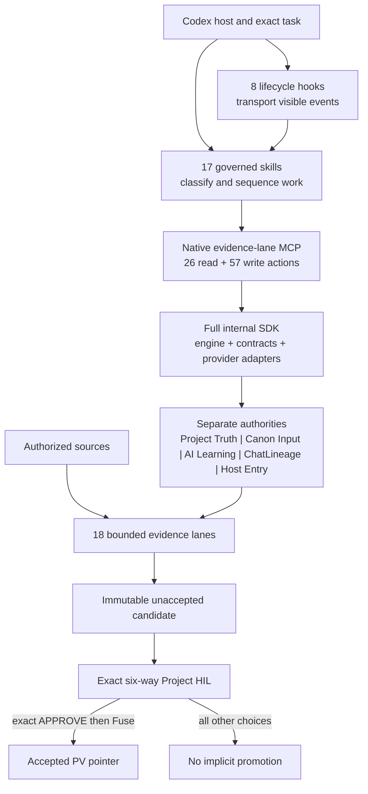

<p align="center">
  
</p>

<p align="center">
  
</p>

# Evidence Lane 2.2.0

Evidence Lane is a local-first, Git-backed evidence lifecycle for Codex. It
keeps source identity, project memory, task state, Deltas, candidate packages,
accepted project versions, and human decisions traceable across long-running
work.

The current pre-HIL Codex source release is **2.2.0** on
`agent/evi-v220-systemwide-release-hil-v2.2.0`. The product name remains
**Evidence Lane**. Accepted Project Truth remains PV12/generation 12 on the
2.1.0 base. The disabled fallback host surface was directly observed at
**2.0.0**; that observation is not PV12/2.1 installation proof and its repair
remains a separately governed later-row operation. Historical commits,
packages, accepted project versions, and sealed receipts remain immutable
provenance rather than current source identity.

## v2.2.0 source and historical compatibility invariants

Version 2.2.0 advances the governed source line from accepted PV12/2.1 without
claiming that either installed slot has already changed. The exact-commit
CI/preview/package route later updates the same stable selector. The intermediate
PV13 gate may Fuse PV13 only after a fresh exact APPROVE; it cannot merge main or
replace the disabled fallback. Only the physically final PV14 gate may, after a
fresh exact APPROVE, authorize PV14 Fuse, governed non-force main promotion, and
exact 2.2 package proof in both the enabled stable slot and the disabled
recoverable fallback slot. Version 2.3 belongs to a later user-started cycle
after this Goal closes; accepted PV14 is that cycle's entry pointer, not work in
the current 2.2 release. Historical labels such as `pre-v1.1`,
v1.1 corrections, dependency
versions, accepted PVs, candidate receipts, and State Travel packages retain
their original identities. Compatibility evidence may explain ancestry; it
cannot override the current source, installed package, native ledger, or HIL.

The commit/CI/Git-preview/package/install/tunnel sequence above is the
**Evidence Lane plugin-maintainer release cycle**, applied once per authorized
logical release commit batch. It is not inherited by downstream governed
projects when they create their own PVs. Those projects retain their own Git,
CI, deployment, lane/schema, plugin, and storage-connector choices. A normal
Plan/PV projection update also does not perform the separately queued full
Vercel guide refresh. ENV/UOP may be inspected, routed, offloaded, or evolved
only through a new sealed identity; an accepted locked identity is immutable.

Row196 establishes the exact-commit prerequisite: the reviewed commit on
`agent/evi-v220-systemwide-release-hil-v2.2.0` must pass required clean CI and
its Git-triggered Vercel preview. The immediate Row197/PV13 install-HIL route
then installs that exact package as **2.2.0** in
`evidence-lane-plugin@evidence-lane-github` and must read back 83 actions
(26 read/57 write), 17 skills, eight hook events, and the migrated command
surface before presenting the PV13 HIL. This intermediate install cannot merge
main, mutate fallback, or impose an install cycle on a downstream project.

Goal completion is human-owned and independent of PV/HIL state. Only the exact
visible `MARK GOAL COMPLETE` command may close a governed Goal, with either
`COMPLETE_THIS_TASK_AND_STATE_TRAVEL` or `COMPLETE_FULLY`. HIL, candidates,
tests, automation, task transitions, pauses, and stalls cannot complete it and
completion itself authorizes no Fuse, pointer, Git, install, merge, or deploy.

Evidence Lane also keeps two Windows-helper audiences separate. The release
updater is maintainer-only; governed users receive the version-bound Goal
recovery helper and, only on hosts whose classifier requires it, the matching
Stable tunnel. Prior versioned helpers and tunnels are retained but disabled,
never silently deleted, and only one version may be active. Before the final
PV14 decision the observed fallback remains 2.0. After an exact final PV14
APPROVE and Fuse, the maintainer route must promote the exact accepted commit,
install that same 2.2 package in both enabled Stable and disabled fallback,
rotate their matching helper/tunnel identities, and re-prove one active
runtime. Downstream project PVs never inherit this release-slot rotation.

## Current Codex contract

The packaged Codex plugin contains:

- one package-local native MCP server named `evidence-lane`;
- exactly 83 canonical actions: 26 read-only and 57 write-capable;
- exactly 17 governed skills;
- six primary controls in order: Boot, Rollback, Build, Refresh, Mode, and
  Source Intake;
- eight registered lifecycle events across nine hook package files: warm attach,
  PREPARE, pre/post tool receipts, pre/post compaction, Stop COMMIT, and
  best-effort SessionEnd flush;
- durable local SQLite as the default project authority;
- a persistent Plan panel paired with the active linked Delta/change display;
- the governed console resource `ui://evidence-lane/governed-console-v5.html`,
  sealed consistently across runtime prewarm and release installation;
- a lock-digest/Python-ABI keyed derived runtime under the durable
  `EvidenceLanePV/runtime/codex` root, so Codex may reconstruct its marketplace
  cache without triggering dependency installation during the MCP handshake;
- exact State Travel receipts for fresh-task continuation;
- a six-way human gate before any candidate can become accepted truth.

The native lifecycle route is `mcp__evidence_lane__*`. Generated namespaces,
app connectors, direct-stdio compatibility aliases, and unrelated storage
connectors are not lifecycle proof.

### Complete skill surface

| Skill | Surface | Primary control | Governed role |
| --- | --- | --- | --- |
| `evi` | Root router | No | Presents the six controls and conditional State Travel without silently selecting one. |
| `evi-boot` | Lifecycle | Yes | Verifies runtime, ENV/UOP Flash, host, storage, session, and accepted pointer. |
| `evi-rollback` | Lifecycle | Yes | Performs pointer-only movement among immutable accepted PVs. |
| `evi-build` | Lifecycle | Yes | Seals an unaccepted candidate and stops at exact six-way HIL. |
| `evi-refresh` | Lifecycle | Yes | Rebuilds changed evidence while preserving content-addressed history. |
| `evi-mode` | Mode | Yes | Applies ordered ENV/UOP mode and operator intersections. |
| `evi-source-intake` | Source | Yes | Classifies and routes bounded sources across all canonical lanes. |
| `evi-state-travel` | Continuity | No | Seals or resumes exact unfinished work through a bound fresh task. |
| `evi-canon` | Task coordination | No | Governs typed task-to-task Canon envelopes, linked tasks/subagents, receiver-owned three-way Canon HIL, backfire, results, and graph continuity. |
| `evi-learning` | AI learning | No | Governs project-isolated Learning retrieval, candidates, Learning HIL, and revocation without changing Project Truth. |
| `evi-storage` | Storage | No | Inspects and selects eligible project-scoped persistence. |
| `evi-change-storage-connector` | Storage | No | Preserves the compatibility route for an explicit connector change. |
| `evi-plugin` | Connector administration | No | Governs the bounded additional-plugin/toolchain catalog. |
| `evi-additional-plugin` | Connector grant | No | Adds one purpose-, role-, scope-, and expiry-bound grant. |
| `evi-drop-additional-plugin` | Connector revocation | No | Revokes one exact active grant without erasing history. |
| `evi-exit-boot` | Session | No | Closes the exact governed session while retaining installation and evidence. |
| `evidence-lane-code-lifecycle` | Code lifecycle | No | Applies the complete one-writer Code-mode build, test, package, and HIL law. |

### Complete native MCP surface summary

| Native surface | Exact 2.2.0 value | Authority boundary |
| --- | --- | --- |
| Server | `evidence-lane` | One package-local Codex MCP; website and tunnel routes are not substitutes. |
| Canonical namespace | `mcp__evidence_lane__*` | Collision-safe display suffixes never change canonical identity. |
| Read-only actions | 26 | Inspect authority without lifecycle mutation. |
| Write-capable actions | 57 | Each call proves its own project, session, task, host, and lifecycle preconditions. |
| Total canonical actions | 83 | Visibility is capability discovery, not permission or approval. |
| Governed console | `ui://evidence-lane/governed-console-v5.html` | Read-only rendering cannot decide HIL or move a pointer. |
| Durable default | Project-scoped local SQLite | Storage connectors and Google Drive remain separate surfaces. |

## Architecture and public documentation

The current architecture is available at [ARCHITECTURE.md](ARCHITECTURE.md).
The website exposes the exact Git-tracked source document for every public
route; its complete route-to-document contract is
[docs/PUBLIC_SITE_SOURCE_MAP.md](docs/PUBLIC_SITE_SOURCE_MAP.md). Separate
current contracts cover [skills](docs/SKILLS.md), [native MCP](docs/MCP.md),
[hooks](docs/HOOKS.md), [Canon](docs/CANON_TASK_GRAPH_AND_INPUT_HIL.md),
[AI/Agent Learning and host continuity](docs/HOST_STORAGE_ENV_MODE_CONTINUITY.md),
and the [full internal SDK](docs/INTERNAL_CODEX_SDK.md).



## What problem it solves

Long AI-assisted projects cross tasks, context windows, repositories, source
packages, and host restarts. A narrative summary cannot prove which source
bytes were used, which task is active, which Deltas remain open, which
candidate was tested, or whether a human accepted anything.

Evidence Lane separates those states:

1. **Source truth** is registered, hashed, and routed into bounded lanes.
2. **Project memory** is stored as queryable SQLite and sealed artifacts.
3. **Plan truth** is linear: one active task, append-only steers, and a final
   HIL row.
4. **Candidate truth** remains unaccepted until explicit HIL.
5. **Accepted truth** moves only through the exact Fuse contract.

AI is the reasoning layer, not the source of truth.

## Public controls

Root `/evi` exposes exactly these six controls:

1. `/evi-boot`
2. `/evi-rollback`
3. `/evi-build`
4. `/evi-refresh`
5. `/evi-mode`
6. `/evi-source-intake`

`/evi-state-travel` is available only when the user explicitly requests it or
the host genuinely exhausts context. It is not a seventh root control and is
never auto-selected merely because a handoff exists.

`/evi-plan` is a Codex Plan-mode sidecar. It pairs a completed Codex plan with
the durable Plan Lane. Linked steers append to the active task without creating
duplicate rows; unrelated work creates one complete new row before the final
HIL.

## Lifecycle

```text
Boot + locked ENV/UOP Flash
        |
        v
Source Intake -> accepted entry pointer
        |
        v
Plan / task / Delta execution
        |
        v
Build or Refresh -> unaccepted candidate
        |
        v
Six-way HIL
        |
        +-- APPROVE + exact Fuse -> accepted PV and pointer movement
        +-- APPROVE_WITH_DELTA   -> correction remains explicit
        +-- MORE_RESEARCH        -> research remains explicit
        +-- ROLLBACK             -> pointer-only governed rollback
        +-- REJECT / FAIL        -> no promotion
```

Natural-language approval is never enough for Fuse. Only exact,
case-sensitive `APPROVE` at the correct pending-candidate HIL can authorize the
promotion operation.

An `APPROVE_WITH_DELTA` follow-up from one completed Plan task may bind the
first queued successor only when the immutable decision receipt, non-promoted
candidate hashes, exact correction contract, completed task ledger, accepted
pointer generation, host/session writer identity, and live runtime binding all
match. That reconciliation creates no candidate, infers no approval, and moves
no pointer. A missing or altered receipt fails closed; completed batch work
continues to require its separate sealed batch-completion receipt.

## Source Intake and lanes

Source Intake accepts one or more ordered sources, detects suitable lane routes,
and always includes Chat Lineage. The universal brain supports eighteen lane
contracts plus Project Engulf, including code, Git history, documents, PDFs,
images/OCR, spreadsheets, research, discussion, plans, SQLite brains, and
custom schemas.

Every lane retains source identity, parser/tool capability status, hashes,
provenance edges, and bounded failure states. Unsupported or missing
capabilities remain visible and fail closed.

Each new lane bundle also carries one ordered, hash-bound disposition row for
all eighteen canonical lanes. A loaded lane is `PRESERVED` or truthfully
`PARTIAL`; a lane with no current source is `MISSING`; and a lane removed from
the current source set is `DEFERRED` while its earlier evidence remains
history. Missing or deferred lanes emit no directory or four-file placeholder.
Every emitted row distinguishes required, conditional, and optional parser or
tool capabilities and binds deterministic chunks/FTS, SQLite, MMD, DOT,
`tools.json`, topology, and receipts. Historical V1/V2/V3 packages remain
readable without being rewritten.

## Persistent task and change display

The Codex task panel and its active change notice are one continuity pair:

- the task panel shows the global linear position;
- the change display shows the active task, linked Delta IDs, source/install/
  runtime identity, activation and Refresh state, tool counts, hook inventory,
  and skill inventory;
- both rehydrate from durable Plan and Chat Lineage state after the exact task
  is reopened;
- a row advances only through an acceptance-backed checkpoint from current-run
  test or build evidence covering that row's exact acceptance contract; the
  transition changes only the Plan backlog and never creates a candidate,
  infers HIL, or moves the accepted PV pointer;
- the plugin emits only supported hook output and does not claim ownership of
  host UI placement.

Package changes require a supported Codex restart because a running task may
hold a frozen capability snapshot. The restart helper binds the exact project,
Evidence Lane session, Codex task UUID, host session, installation receipt, and
root `ChatGPT (Beta)` Codex process before it activates the exact
`OpenAI.CodexBeta_2p2nqsd0c76g0!App` identity and reopens the same task. This
preserves the existing task-owned Git workspace and native Changes surface; the
plugin neither recreates nor claims ownership of Codex's `+added/-deleted` UI.

## Hooks

The v2 package registers:

| Event | Purpose |
| --- | --- |
| `SessionStart` | Verify installed identity and prepare bounded runtime context. |
| `UserPromptSubmit` | Bind the visible task turn without storing private reasoning. |
| `PreToolUse` | Guard bounded governed tool activity before execution. |
| `PostToolUse` | Reproject the linked Plan/Delta change display after relevant native actions. |
| `PreCompact` | Seal the visible compaction boundary before context is compacted. |
| `PostCompact` | Rehydrate the governed context after compaction. |
| `Stop` | Preserve the response/exit boundary without inventing a HIL decision. |
| `SessionEnd` | Best-effort flush of the lifecycle boundary when the host emits the event. |

The inventory is eight registered events, six command handlers, and nine files
including the dispatcher, Windows wrapper, and `hooks.json`. The 17 skills are
independently counted; file count is not
used to inflate either number.

## Host and storage matrix

| Codex execution profile | Primary PV storage | Network tunnel |
| --- | --- | --- |
| Desktop Codex on a local/persistent host with the active `CODEX` surface proven | Durable local SQLite | Not required; package-local native MCP is the lifecycle route |
| Local CLI without the interactive app | Durable local SQLite | Not required by the API layer |
| Headless API/CLI on a local or persistent VM | Local durable PV store when available | Not required by the API layer |
| Headless API on an ephemeral VM with durable mount | Mounted durable SQLite | Not required by the API layer |
| Headless API on an ephemeral VM without durable mount | Explicit transactional durable connector | Not required by the API layer |
| Interactive Codex app on an ephemeral VM | Durable mount or transactional connector | Environment setup may be required once per VM lifetime |

An ephemeral or stateless invocation also requires an exact host-entry
envelope persisted by a transactional connector. The envelope preserves the
accepted pointer, active Plan row, task/worktree binding, locked ENV/UOP, and
separate authority heads without becoming a new PV. It is expiring and
single-consumption; exact retries are idempotent, and stale or mismatched entry
fails closed. Proven durable local Codex uses local SQLite directly and does not
create an unnecessary external entry dependency.

Account tier and API billing are independent classification axes. They do not
select project storage or change the HIL law.

## Bounded Windows tunnel setup

This setup is only for a runtime classification that explicitly requires the
separate tunnel support channel, such as an interactive ephemeral Codex VM. A
durable local Codex desktop, local CLI, or headless API route does **not** use it
for the native Evidence Lane lifecycle. The classifier must first prove the
desktop container channel, `active_surface=CODEX`, workspace class, durability,
and exact host/session namespace; package name, process title, CWD, or a
ChatGPT/Work surface cannot select this route.

1. In the OpenAI Platform, create a tunnel for this Windows user and keep its
   `tunnel_...` ID and Runtime API key private. Use a Runtime key, never an
   Admin key.
2. Open PowerShell in the reviewed Evidence Lane checkout and run the exact
   host-classified setup. This ephemeral example is bound to one VM lifetime:

   ```powershell
   & ".\plugins\evidence-lane-plugin\scripts\windows_tunnel\Install-EvidenceLaneTunnel.ps1" `
     -SlotRole stable-build `
     -InteractionProfile CODEX_APP_INTERACTIVE `
     -HostLifetime Ephemeral `
     -VmInstanceId "<exact-vm-instance-id>" `
     -Activate
   ```

3. Paste the Tunnel ID when prompted, then paste the Runtime API key into the
   masked prompt. The script never prints the key or writes its plaintext to
   Git, Chat Lineage, project SQLite, receipts, or logs. It stores only a
   current-user Windows DPAPI envelope.
4. The installer verifies or acquires the pinned tunnel client, registers the
   versioned `EvidenceLane-Tunnel-v220-stable-build` scheduled task, and binds
   it to Windows sign-in. Installation alone does not accept a candidate or
   move a PV pointer.
5. After activation, verify live readiness without exposing the key:

   ```powershell
   & "$env:USERPROFILE\EvidenceLanePV\tunnel-runtime-v220-stable-build\Manage-EvidenceLaneTunnel.ps1" `
     -Action Status `
     -RuntimeRoot "$env:USERPROFILE\EvidenceLanePV\tunnel-runtime-v220-stable-build" `
     -ProfileName evidence_lane_v220_stable_build_transport `
     -TaskName EvidenceLane-Tunnel-v220-stable-build `
     -ReleaseToken v220
   ```

   Accept only `status = PASS`, with the scheduled task present, the pinned
   binary hash valid, the process live, and the control-plane poll ready.
6. Open Codex and verify the installed Evidence Lane plugin through its native
   `mcp__evidence_lane__*` catalog and project panel. The tunnel is a separate
   versioned transport channel; it does not replace or prove the package-local
   Codex lifecycle route and is never Evidence Lane lifecycle authority.

For ephemeral interactive Windows VMs, use `-HostLifetime Ephemeral` and an
exact `-VmInstanceId`; the key envelope and tunnel last only for that VM.
Dependency acquisition, isolated tester setup, activation receipts, repair,
and removal are documented in the
[complete Windows tunnel guide](docs/WINDOWS_TUNNEL_PERSISTENCE.md).

## Observed two-slot state and governed recovery boundary

The intended live Codex topology is exactly two Evidence Lane slots: enabled
`stable-build` and disabled `fallback`. The current source contract does not
pretend the host has already reached that desired identity. Direct host evidence
showed the disabled fallback at the historical PV11/2.0 package while the
accepted/base release had advanced to PV12/2.1. The later fallback-split-brain
row must reconcile UI, CLI, selector, cache, package, and hash readback before
calling it current. This row neither changes nor activates either slot. At most
one plugin/MCP and one matching tunnel may run, and historical Git, PV, package,
receipt, and Delta evidence remains preserved outside the live cache.

The two installed plugin slots remain source authority. Their generated Python
dependencies live outside the reconstructable marketplace cache in one sealed,
content-addressed runtime projection. Every launch validates the full lock and
Python identity marker, then imports source from the exact active slot.

`Switch-EvidenceLaneCodexSlot.ps1` can prepare failover after either an explicit
operator command or a sealed multi-probe stable failure. It rejects one
transient error, stops the source tunnel before starting the target, switches
the two exact Codex config sections atomically, and uses the controlled restart
helper to reopen the same task. Returning to stable requires verified package,
installed-byte, native-catalog, and clean-CI proof. A pre-restart failure
restores the original slot; post-restart native catalog and project/session
proof are mandatory.

## Git and CI/CD boundary

Repository writes use the governed native Git actions. On the explicitly
configured non-default test branch, a prepared fast-forward push can use
host-managed credentials and the project policy's standing authorization
without a repeated one-use prompt. The receipt still binds the exact project,
branch, commit, tree, remote, and action ID.

That standing test-branch policy does **not** authorize:

- pushing or rewriting the default/protected branch;
- force-push;
- merging to `main`;
- creating or accepting a project-version candidate;
- moving the accepted pointer;
- publication, deployment, or Fuse.

GitHub Actions run one coherent CI cycle per dependency-coherent integration
bundle, not one commit, workflow loop, preview, package, or stable reinstall per
Delta row or file. Each row still keeps independent acceptance evidence and
lifecycle status, PREPARE/retrieval, native PV reads, visible ChatLineage,
classification, and persistent Plan/CURRENT CHANGE refresh. Bundle boundaries
are derived from coupled source, schema, runtime, and test scope; roughly a
small handful for a long correction wave, never a fixed quota. At each boundary,
one cross-Delta matrix maps every included task to changed surfaces, local tests,
remote checks, installed-host checks, outcome, and exact failure ownership; any
included-row failure fails the bundle closed. The same behavior-bearing commit
updates the root README, affected repository-level contracts, tests, and public
Plan/Delta projection before the governed push. The deterministic
`sync_website_plan_projection.py` generator reads the passing native
`PLAN_LANE`; its `--check` mode must match the same durable authority before the
commit is eligible for push. The generated public snapshot and metadata may be
rendered by the feature-branch preview, but production publication remains a
separate post-HIL action. A local or dirty-worktree package is rehearsal
evidence only and cannot update the stable slot. The one stable selector is
updated once per logical bundle, only from the exact Git commit package after
every configured commit check and exact-SHA preview gate passes. The active
workflows cover governed Python tests, source/MCP tests, lifecycle tests, lane
tests, preview compilation, and CodeQL.

Evidence Lane does not configure or invoke the usage-based GitHub Sandbox
product. Local agent work remains inside the bounded local project work
directory, and GitHub Actions supplies clean-checkout CI; paid overages and
separate hosted-agent products are not implied. The Vercel project is a public
documentation site only. The selected Vercel account plan does not change
Evidence Lane authority, and Vercel is not used to install Codex, route the
native lifecycle, persist project truth, create candidates, or move pointers.

## Install the Codex plugin

Install from a reviewed branch or exact commit:

```powershell
codex plugin marketplace add rathee000001/evidence_lane_plugin --ref REVIEWED_REF
codex plugin add evidence-lane-plugin@evidence-lane-github --json
```

The supported v2 verification sequence is:

1. build a deterministic local package from the exact commit;
2. verify source, commit, tree, package, catalog, skill, hook, and secret seals;
3. stage and activate through the supported Codex marketplace route;
4. run the pre-restart installed-package acceptance check;
5. prepare a restart receipt bound to the exact task and root ChatGPT Beta
   process;
6. restart the exact Beta AppUserModelID and pass it the exact
   `codex://threads/<task-id>` deep link;
7. verify the native catalog, hooks, project/runtime panels, icon, persistent
   task/change display, task-owned Git workspace and native Changes UI, and
   local store from the installed package;
8. stop at the six-way HIL.

See [Codex v2 local installation](docs/CODEX_V200_LOCAL_INSTALL_AND_RELOAD.md).
The current machine-checked catalog and the required per-Delta classification
law are in the
[2.2 public-surface parity matrix](docs/V220_PUBLIC_SURFACE_PARITY_MATRIX.json).

## Build and test locally

```powershell
python -m venv .venv
.venv\Scripts\python -m pip install -e .[dev]
.venv\Scripts\python -m pytest -q
```

Focused release checks live under `tests/` and the reusable Code-mode action at
`.github/actions/evidence-lane-ci`.

## Repository map

| Path | Role |
| --- | --- |
| `plugins/evidence-lane-plugin/.codex-plugin/plugin.json` | Codex product identity and UI metadata |
| `plugins/evidence-lane-plugin/.mcp.json` | Package-local native MCP launch contract |
| `plugins/evidence-lane-plugin/src/evidence_lane_plugin/` | Lifecycle engine and native server |
| `plugins/evidence-lane-plugin/skills/` | Seventeen governed skills |
| `plugins/evidence-lane-plugin/hooks/` | Eight lifecycle events across nine package files |
| `plugins/evidence-lane-plugin/scripts/codex_release/` | Deterministic package install, restart, and acceptance checks |
| `docs/` | Current Codex architecture, runbooks, security, and provenance |
| `tests/` | Unit, integration, package, and contract verification |

## Security and claim boundary

- Secrets are never written into receipts, Git commits, task panels, or source
  packages.
- Private reasoning is not stored.
- Dirty and untracked source bytes are preserved unless the user explicitly
  authorizes their mutation.
- A passing test, push, package, install, restart, or preview is evidence, not
  candidate acceptance.
- Host-owned icon or panel placement must be observed at installed-host HIL; a
  manifest alone cannot prove the UI.
- Exact counts and hashes are release-specific and must be read from the sealed
  receipt rather than inferred.

## Ownership and license

Evidence Lane is independently developed by Praveen Rathee. Repository access,
tester authorization, contribution terms, and third-party notices are defined
in [LICENSE.md](LICENSE.md), [SECURITY.md](SECURITY.md),
[plugin third-party notices](plugins/evidence-lane-plugin/THIRD_PARTY_NOTICES.md), and
[docs/TESTER_ACCESS_AND_GIT_AUTH.md](docs/TESTER_ACCESS_AND_GIT_AUTH.md).
The direct dependency and PDF renderer review is preserved in
[docs/DEPENDENCY_LICENSE_AUDIT.md](docs/DEPENDENCY_LICENSE_AUDIT.md).

The public story remains linked to only the existing Devpost project
`1348634/evidence_os`; no new submission or publication is implied by source,
CI, installation, or this README.

## Current release boundary

The source branch may call 2.2.0 the current pre-HIL source release only when
its version fields agree. It may call GitLane Stable 2.2 installed only after
the exact commit, clean CI, exact-SHA preview, package, same-selector update,
supported restart, and native-route readback all pass. No README statement
substitutes for those proofs, and no pre-HIL source change rotates fallback.
