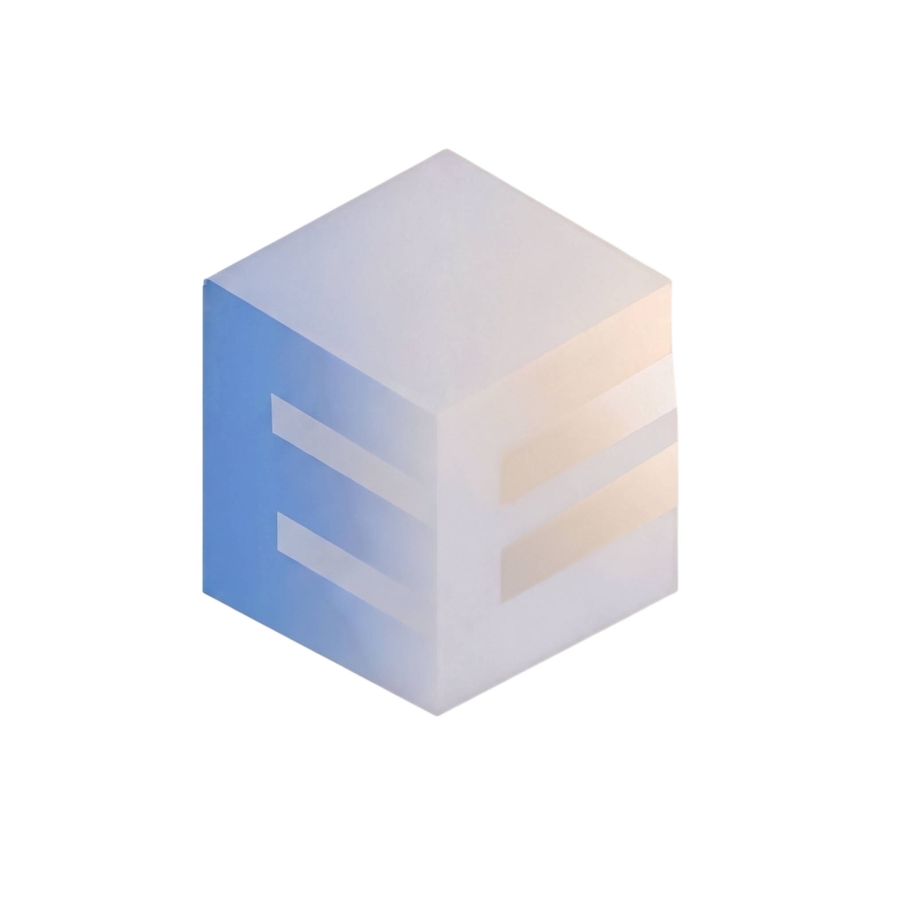

<p align="center">
  
</p>

<p align="center">
  
</p>

# Evidence Lane 2.0.0

Evidence Lane is a local-first, Git-backed evidence lifecycle for Codex. It
keeps source identity, project memory, task state, Deltas, candidate packages,
accepted project versions, and human decisions traceable across long-running
work.

The single active Codex product release is **2.0.0**. The product name remains
**Evidence Lane**. Historical 1.5.0 commits, packages, accepted project
versions, and sealed receipts remain immutable provenance; they are not current
runtime identity.

## v2.0.0 release and historical compatibility invariants

Version 2.0.0 replaces the active Codex release slot without rewriting prior
evidence. Historical labels such as `pre-v1.1`, v1.1 corrections, dependency
versions, accepted PVs, candidate receipts, and State Travel packages retain
their original identities. Compatibility evidence may explain ancestry; it
cannot override the current source, installed package, native ledger, or HIL.

## Current Codex contract

The packaged Codex plugin contains:

- one package-local native MCP server named `evidence-lane`;
- exactly 62 canonical actions: 21 read-only and 41 write-capable;
- exactly 15 governed skills;
- six primary controls in order: Boot, Rollback, Build, Refresh, Mode, and
  Source Intake;
- four registered hook events and four handlers across five hook package files;
- durable local SQLite as the default project authority;
- a persistent Plan panel paired with the active linked Delta/change display;
- exact State Travel receipts for fresh-task continuation;
- a six-way human gate before any candidate can become accepted truth.

The native lifecycle route is `mcp__evidence_lane__*`. Generated namespaces,
app connectors, direct-stdio compatibility aliases, and unrelated storage
connectors are not lifecycle proof.

## What problem it solves

Long AI-assisted projects cross tasks, context windows, repositories, source
packages, and host restarts. A narrative summary cannot prove which source
bytes were used, which task is active, which Deltas remain open, which
candidate was tested, or whether a human accepted anything.

Evidence Lane separates those states:

1. **Source truth** is registered, hashed, and routed into bounded lanes.
2. **Project memory** is stored as queryable SQLite and sealed artifacts.
3. **Plan truth** is linear: one active task, append-only steers, and a final
   HIL row.
4. **Candidate truth** remains unaccepted until explicit HIL.
5. **Accepted truth** moves only through the exact Fuse contract.

AI is the reasoning layer, not the source of truth.

## Public controls

Root `/evi` exposes exactly these six controls:

1. `/evi-boot`
2. `/evi-rollback`
3. `/evi-build`
4. `/evi-refresh`
5. `/evi-mode`
6. `/evi-source-intake`

`/evi-state-travel` is available only when the user explicitly requests it or
the host genuinely exhausts context. It is not a seventh root control and is
never auto-selected merely because a handoff exists.

`/evi-plan` is a Codex Plan-mode sidecar. It pairs a completed Codex plan with
the durable Plan Lane. Linked steers append to the active task without creating
duplicate rows; unrelated work creates one complete new row before the final
HIL.

## Lifecycle

```text
Boot + locked ENV/UOP Flash
        |
        v
Source Intake -> accepted entry pointer
        |
        v
Plan / task / Delta execution
        |
        v
Build or Refresh -> unaccepted candidate
        |
        v
Six-way HIL
        |
        +-- APPROVE + exact Fuse -> accepted PV and pointer movement
        +-- APPROVE_WITH_DELTA   -> correction remains explicit
        +-- MORE_RESEARCH        -> research remains explicit
        +-- ROLLBACK             -> pointer-only governed rollback
        +-- REJECT / FAIL        -> no promotion
```

Natural-language approval is never enough for Fuse. Only exact,
case-sensitive `APPROVE` at the correct pending-candidate HIL can authorize the
promotion operation.

## Source Intake and lanes

Source Intake accepts one or more ordered sources, detects suitable lane routes,
and always includes Chat Lineage. The universal brain supports eighteen lane
contracts plus Project Engulf, including code, Git history, documents, PDFs,
images/OCR, spreadsheets, research, discussion, plans, SQLite brains, and
custom schemas.

Every lane retains source identity, parser/tool capability status, hashes,
provenance edges, and bounded failure states. Unsupported or missing
capabilities remain visible and fail closed.

## Persistent task and change display

The Codex task panel and its active change notice are one continuity pair:

- the task panel shows the global linear position;
- the change display shows the active task, linked Delta IDs, source/install/
  runtime identity, activation and Refresh state, tool counts, hook inventory,
  and skill inventory;
- both rehydrate from durable Plan and Chat Lineage state after the exact task
  is reopened;
- the plugin emits only supported hook output and does not claim ownership of
  host UI placement.

Package changes require a supported Codex restart because a running task may
hold a frozen capability snapshot. The restart helper binds the exact project,
Evidence Lane session, Codex task UUID, host session, installation receipt, and
root Codex process before it can relaunch the same task deep link.

## Hooks

The v2 package registers:

| Event | Purpose |
| --- | --- |
| `SessionStart` | Verify installed identity and prepare bounded runtime context. |
| `UserPromptSubmit` | Bind the visible task turn without storing private reasoning. |
| `PostToolUse` | Reproject the linked Plan/Delta change display after relevant native actions. |
| `Stop` | Preserve the response/exit boundary without inventing a HIL decision. |

The inventory is four registered events, four handlers, and five files when
`hooks.json` is included. The 15 skills are unchanged; file count is not used to
inflate either number.

## Host and storage matrix

| Codex execution profile | Primary PV storage | Network tunnel |
| --- | --- | --- |
| Desktop Codex on a local/persistent host | Durable local SQLite | Version-bound host tunnel is installed once, starts with Windows, and has zero setup wait when warm |
| Local CLI without the interactive app | Durable local SQLite | Not required by the API layer |
| Headless API/CLI on a local or persistent VM | Local durable PV store when available | Not required by the API layer |
| Headless API on an ephemeral VM with durable mount | Mounted durable SQLite | Not required by the API layer |
| Headless API on an ephemeral VM without durable mount | Explicit transactional durable connector | Not required by the API layer |
| Interactive Codex app on an ephemeral VM | Durable mount or transactional connector | Environment setup may be required once per VM lifetime |

Account tier and API billing are independent classification axes. They do not
select project storage or change the HIL law.

## First-time Windows tunnel setup

This setup is for the interactive Codex desktop profile on a local PC or
persistent Windows VM. Headless API and direct CLI/API profiles do **not** need
a tunnel at the API layer; they should keep using the appropriate durable PV
storage route.

1. In the OpenAI Platform, create a tunnel for this Windows user and keep its
   `tunnel_...` ID and Runtime API key private. Use a Runtime key, never an
   Admin key.
2. Open PowerShell in the reviewed Evidence Lane checkout and run:

   ```powershell
   & ".\plugins\evidence-lane-plugin\scripts\windows_tunnel\Install-EvidenceLaneTunnel.ps1" `
     -InteractionProfile CODEX_APP_INTERACTIVE `
     -HostLifetime Persistent
   ```

3. Paste the Tunnel ID when prompted, then paste the Runtime API key into the
   masked prompt. The script never prints the key or writes its plaintext to
   Git, Chat Lineage, project SQLite, receipts, or logs. It stores only a
   current-user Windows DPAPI envelope.
4. The installer verifies or acquires the pinned tunnel client, registers the
   versioned `EvidenceLane-Tunnel-v200` scheduled task, and binds it to Windows
   sign-in. A newly installed future-test channel remains disabled until its
   required health, public-route, and host-proof receipts are supplied for
   governed activation; installation alone is not promotion.
5. After activation, verify live readiness without exposing the key:

   ```powershell
   & "$env:USERPROFILE\EvidenceLanePV\tunnel-runtime-v200\Manage-EvidenceLaneTunnel.ps1" -Action Status
   ```

   Accept only `status = PASS`, with the scheduled task present, the pinned
   binary hash valid, the process live, and the control-plane poll ready.
6. Open Codex and verify the installed Evidence Lane plugin through its native
   `mcp__evidence_lane__*` catalog and project panel. The tunnel is a separate
   versioned transport channel; it does not replace or prove the package-local
   Codex lifecycle route.

For ephemeral interactive Windows VMs, use `-HostLifetime Ephemeral` and an
exact `-VmInstanceId`; the key envelope and tunnel last only for that VM.
Dependency acquisition, isolated tester setup, activation receipts, repair,
and removal are documented in the
[complete Windows tunnel guide](docs/WINDOWS_TUNNEL_PERSISTENCE.md).

## Git and CI/CD boundary

Repository writes use the governed native Git actions. On the explicitly
configured non-default test branch, a prepared fast-forward push can use
host-managed credentials and the project policy's standing authorization
without a repeated one-use prompt. The receipt still binds the exact project,
branch, commit, tree, remote, and action ID.

That standing test-branch policy does **not** authorize:

- pushing or rewriting the default/protected branch;
- force-push;
- merging to `main`;
- creating or accepting a project-version candidate;
- moving the accepted pointer;
- publication, deployment, or Fuse.

GitHub Actions run one coherent CI cycle per completed correction commit, not
one workflow loop per Delta or file. The active workflows cover governed Python
tests, source/MCP tests, lifecycle tests, lane tests, preview compilation, and
CodeQL.

Evidence Lane does not configure or invoke the usage-based GitHub Sandbox
product. Local agent work remains inside the bounded local project work
directory, and GitHub Actions supplies clean-checkout CI; paid overages and
separate hosted-agent products are not implied. The Vercel project is a public
documentation site only. The selected Vercel account plan does not change
Evidence Lane authority, and Vercel is not used to install Codex, route the
native lifecycle, persist project truth, create candidates, or move pointers.

## Install the Codex plugin

Install from a reviewed branch or exact commit:

```powershell
codex plugin marketplace add rathee000001/evidence_lane_plugin --ref REVIEWED_REF
codex plugin add evidence-lane-plugin@evidence-lane-github --json
```

The supported v2 verification sequence is:

1. build a deterministic local package from the exact commit;
2. verify source, commit, tree, package, catalog, skill, hook, and secret seals;
3. stage and activate through the supported Codex marketplace route;
4. run the pre-restart installed-package acceptance check;
5. prepare a restart receipt bound to the exact task and root process;
6. restart Codex and reopen the exact `codex://threads/<task-id>` deep link;
7. verify the native catalog, hooks, project/runtime panels, icon, persistent
   task/change display, and local store from the installed package;
8. stop at the six-way HIL.

See [Codex v2 local installation](docs/CODEX_V200_LOCAL_INSTALL_AND_RELOAD.md).

## Build and test locally

```powershell
python -m venv .venv
.venv\Scripts\python -m pip install -e .[dev]
.venv\Scripts\python -m pytest -q
```

Focused release checks live under `tests/` and the reusable Code-mode action at
`.github/actions/evidence-lane-ci`.

## Repository map

| Path | Role |
| --- | --- |
| `plugins/evidence-lane-plugin/.codex-plugin/plugin.json` | Codex product identity and UI metadata |
| `plugins/evidence-lane-plugin/.mcp.json` | Package-local native MCP launch contract |
| `plugins/evidence-lane-plugin/src/evidence_lane_plugin/` | Lifecycle engine and native server |
| `plugins/evidence-lane-plugin/skills/` | Fifteen governed skills |
| `plugins/evidence-lane-plugin/hooks/` | Four hook events and their handlers |
| `plugins/evidence-lane-plugin/scripts/codex_release/` | Deterministic package install, restart, and acceptance checks |
| `docs/` | Current Codex architecture, runbooks, security, and provenance |
| `tests/` | Unit, integration, package, and contract verification |

## Security and claim boundary

- Secrets are never written into receipts, Git commits, task panels, or source
  packages.
- Private reasoning is not stored.
- Dirty and untracked source bytes are preserved unless the user explicitly
  authorizes their mutation.
- A passing test, push, package, install, restart, or preview is evidence, not
  candidate acceptance.
- Host-owned icon or panel placement must be observed at installed-host HIL; a
  manifest alone cannot prove the UI.
- Exact counts and hashes are release-specific and must be read from the sealed
  receipt rather than inferred.

## Ownership and license

Evidence Lane is independently developed by Praveen Rathee. Repository access,
tester authorization, contribution terms, and third-party notices are defined
in [LICENSE.md](LICENSE.md), [SECURITY.md](SECURITY.md),
[plugin third-party notices](plugins/evidence-lane-plugin/THIRD_PARTY_NOTICES.md), and
[docs/TESTER_ACCESS_AND_GIT_AUTH.md](docs/TESTER_ACCESS_AND_GIT_AUTH.md).
The direct dependency and PDF renderer review is preserved in
[docs/DEPENDENCY_LICENSE_AUDIT.md](docs/DEPENDENCY_LICENSE_AUDIT.md).

The public story remains linked to only the existing Devpost project
`1348634/evidence_os`; no new submission or publication is implied by source,
CI, installation, or this README.

## Current release boundary

The source branch may call 2.0.0 the active stable Codex slot only when its
version fields agree. Installed-host readiness still requires the exact package
receipt, clean CI for that commit, supported restart, native route readback, and
explicit six-way HIL. No README statement substitutes for those proofs.
