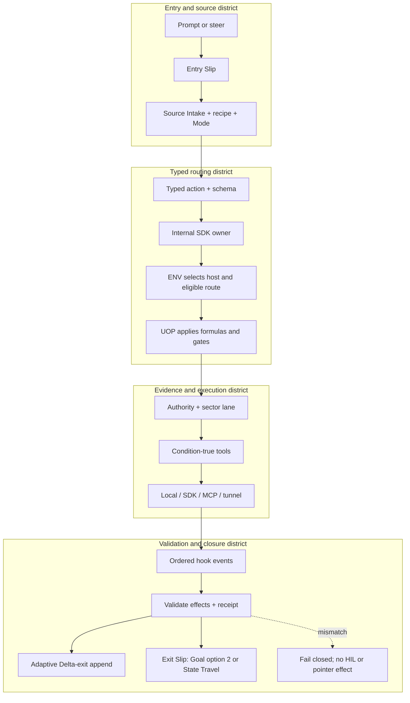

<!-- evidence-lane-public-docs-full-refresh: 3.0.0 / registry-derived-v1 -->

<p align="center">
  
</p>

<p align="center">
  
</p>

# Evidence Lane

<p align="center">
  <a href="https://evidencelane.org"><strong>evidencelane.org</strong></a> ·
  <a href="https://rathee000001.github.io/evidence_lane_plugin/">GitHub Pages</a>
</p>

<p align="center">
  <a href="ARCHITECTURE.md">Architecture</a> ·
  <a href="docs/CANON_TASK_GRAPH_AND_INPUT_HIL.md">Canon</a> ·
  <a href="docs/AI_LEARNING.md">Agent Learning</a> ·
  <a href="docs/MEMORY.md">Memory</a> ·
  <a href="docs/PROJECT_UNIVERSE.md">Project Universe</a> ·
  <a href="docs/PROJECT_PV_CONTENT_ADDRESSED_STORAGE.md">PV Storage</a> ·
  <a href="docs/HOST_AND_STORAGE_MATRIX.md">Host Matrix</a> ·
  <a href="docs/SKILLS.md">Skills</a> ·
  <a href="docs/MCP.md">MCP</a> ·
  <a href="docs/TOOLS.md">Tools</a> ·
  <a href="docs/HOOKS.md">Hooks</a> ·
  <a href="docs/PLAN_AND_CHANGE_DISPLAY.md">Plan and Changes</a> ·
  <a href="docs/SOURCE_INTAKE_AND_LANES.md">Source Intake and Lanes</a> ·
  <a href="docs/USER_TUNNEL_GUIDE.md">Tunnel</a> ·
  <a href="docs/CODEX_V300_LOCAL_INSTALL_AND_RELOAD.md">Installation</a> ·
  <a href="docs/GIT_AND_CI_CD.md">Git and CI</a> ·
  <a href="docs/LIFECYCLE_AND_HIL.md">Lifecycle and HIL</a> ·
  <a href="docs/RELEASE_AND_COMPATIBILITY.md">Release</a> ·
  <a href="docs/REPOSITORY_MAP.md">Repository Map</a>
</p>

The canonical Devpost publication has not been created yet. No branch, preview, or candidate should publish or link to a provisional entry.

The AI model is rarely the only bottleneck in a serious long-running project. The harder failure is the fragmented project around it: repositories, local dirty work, documents, databases, research, plans, installed runtimes, deployments, and human decisions drift into separate realities while the human becomes the integration layer.

Evidence Lane is a local-first project control plane for that fragmented state. It keeps source, worktree, project, Plan, ChatLineage, installed-runtime, candidate, accepted, Project Memory, Canon, and Agent Learning authorities distinct while making the exact slice needed by the active Delta queryable across tasks, context windows, tools, and Codex hosts.

The current Codex source release is **3.0.0**. Source identity, Git commit/tree, package identity, installed runtime, Project/PV proposals, accepted state, and human release or HIL decisions remain separate facts. Maintained documentation describes the current executable contract; exact installed-host and HIL receipts determine whether that contract is active for a task.

## 3.0 source and historical compatibility invariants

Current executable routes, schemas, counts, and documentation are derived from the 3.0 source graph. Historical versions and immutable receipts retain their original identities for traceability, but they cannot re-enter the active runtime, revive a purged route, or override the current installed and Project/PV authorities.

## Five product failures Evidence Lane addresses

1. **Every new task can charge a re-explanation tax.** A fresh task does not automatically inherit the exact files, accepted state, active work, pending decisions, or prior task boundary. Evidence Lane keeps queryable ChatLineage, exact task boundaries, the accepted pointer, pending candidates, and unresolved human gates so a new task can retrieve the relevant state instead of reconstructing the whole narrative.
2. **Unchanged sources are repeatedly read and reparsed.** Reprocessing the same inputs spends time and context while increasing classification drift. Evidence Lane stores content-addressed lane facts and retrieves bounded matches through SQLite, FTS5, BM25, linked topology, and condition-selected semantic indexes; Refresh reprocesses changed sections and emits a new receipt for unchanged members without reauthoring them.
3. **Human direction and AI output blur together.** A polished response, successful test, deployment, or commit can be mistaken for a human decision. Evidence Lane preserves actor lineage, keeps candidates separate from accepted truth, and requires the exact authority-owned human gate before accepted state can move.
4. **The model needs a bounded corpus while the user needs action authority.** Dumping a Plan, backlog, Markdown history, or project folder into context hides the decision surface inside data volume. Evidence Lane classifies project recipe and Mode, queries only relevant evidence, applies condition-true tools and gates, and returns bounded facts for the current action.
5. **Hosts do not share one storage or accelerator reality.** A persistent workstation, durable VM, ephemeral host, CPU-only runtime, NVIDIA CUDA runtime, and AMD runtime cannot safely pretend to have the same files, mounts, drivers, memory, or transport. Evidence Lane binds the eligible storage, transport, and user-enabled accelerator profile to the detected host and seals visible fallback receipts.

The conversation remains the reasoning surface. Durable, queryable evidence remains the authority, and Git remains source history rather than a substitute for worktree, Plan, ChatLineage, installed runtime, candidate, or human-decision state.

## What Evidence Lane separates

- **Source truth** — ordered inputs, exact bytes, parsers, tools, provenance, and failures.
- **Worktree truth** — Git identity plus preserved dirty and untracked bytes.
- **Project truth** — durable lane databases, graphs, pointers, and receipts.
- **Plan truth** — one canonical order, one active row, queued work, history, dependencies, and physically final HIL.
- **ChatLineage** — prompts, responses, task lineage, Entry/Exit Slips, and bounded retrieval.
- **Installed truth** — exact package, slot, MCP catalog, skills, hooks, tunnel, accelerator profile, and runtime identity; the maintainer restart helper stays outside executable authority.
- **Candidate truth** — immutable evidence that remains unaccepted.
- **Accepted truth** — the Project Version pointer moved only by the exact governed human decision.
- **Canon** — cross-task contracts and mapped consequences without inferred acceptance.
- **Agent Learning** — project-isolated learning proposals and receipts, separate from Project Truth and Canon.

Codex performs the work; it is not itself the evidence authority. A response, test, commit, deployment, package, or installation is evidence only. Project and Learning acceptance remain explicit human decisions owned by their respective authorities.

## Current source contract

These values are derived from the current executable registries. They are a release snapshot, not hard ceilings; adding or removing a registered action, skill, hook, lane, authority, tool, or workflow must regenerate this page.

| Surface | Current source value | Authority |
| --- | ---: | --- |
| Package base version | `3.0.0` | `.codex-plugin/plugin.json` (`3.0.0+codex.20260829234050` current cache-busted source identity) |
| Canonical native actions | **91** | 30 read-only + 61 write-capable; public schema, MCP, and SDK agree |
| Governed skills | **26** | Registry-derived; no separate command layer |
| Hook structure | **11 events / 44 ordered handlers** | Hooks are ordered event adapters, not business-logic owners |
| Project-sector lanes | **18** | Each lane owns a distinct schema, SQLite template, workflow, MMD, DOT, tools, and manifest |
| Named root authorities | **11** | Separate from the sector-lane count |
| Declared AI/toolchain capabilities | **119** | Conditional primary/fallback selection; presence is not execution |
| Internal SDK modules | **145** | Internal execution ownership |
| Registered skill workflow steps | **127** | Current workflow registry, not a ceiling |

The 30-row `SPECIALIZED_NATIVE_ACTIONS` tuple in the server source is an explicit specialized subset (9 reads / 21 writes), not the canonical total. The complete native catalog remains the source-derived 91-action registry above.

## How one action is routed



The executable routing stages are:

1. `intent_and_skill_resolution`
2. `typed_action_resolution`
3. `internal_execution_owner`
4. `environment_decision`
5. `operator_and_gate_decision`
6. `authority_and_lane_resolution`
7. `conditional_tool_resolution`
8. `outer_transport_resolution`
9. `ordered_hook_handling`
10. `result_validation_and_receipt`

ENV and UOP are not synonyms. ENV selects the execution environment and eligible route. UOP applies governance without overriding ENV, Project Truth, Plan, Goal, or HIL. Both are clean Codex action-plane SQLite authorities (schema version 17) with MMD/DOT traversal maps and bounded FTS indexes; predecessor ChatGPT payload databases are not copied into them.

## Entry, Delta, and Exit

- Every user prompt or steer produces an Entry Slip that binds intent, focus, source route, owning authority/lane, workflow, gates, and the next bounded action.
- Delta Entry begins the active task unit. Mid-Delta queries read bounded current authority without pretending the task has exited.
- Adaptive Delta-exit append records continuing-work refresh. It is not an Exit Slip.
- Exit Slip is reserved for completed State Travel or Goal completion through the explicit option-2 path.
- When a current executable route replaces an older one, the stale implementation, schema field, generated artifact, test, manifest, and documentation references are directly purged in the same Delta. Immutable external receipts may remain only as non-executable history.

## Authority model

A Project/PV root is the project baseline connection. It contains or links the separate authorities required by that project; it does not flatten them into one database or prose memory. ENV/UOP remain hidden runtime authorities and are represented in a project only through their current bindings and receipts.

| Named authority | Role |
| --- | --- |
| `agent_learning` | Project-isolated learning candidates, decisions, accepted lessons, and revocations. |
| `canon_input` | Typed task-to-task contracts, envelopes, receiver decisions, edges, and result continuity. |
| `project_memory` | Bounded project-memory locators and links; never a merged replacement for other authorities. |
| `project_overlay` | Full-PV proposal overlay used only at the owning HIL boundary. |
| `source_authority` | Exact source identities, occurrences, provenance, and source graph. |
| `project_universe` | Per-project relationship graph that remains separate from Bigger Universe federation. |
| `connector_brain` | Bounded connector grants and hash-only cross-project mini-brain links. |
| `project_authority` | Project registration, root layout, current pointer, and authority membership. |
| `receipt_ledger` | Exact result and provenance receipts with content-addressed linkage. |
| `session_authority` | Session, attachment, host, State Travel, and Goal continuity records. |
| `instructions` | AGENTS.md and host MEMORY.md instruction chain, separate from Project Memory. |

Project Truth, Project Memory, Canon, Agent Learning, ChatLineage, instructions, sessions, receipts, connector grants, and Project Universe can cross-link through exact hashes and receipts. They do not merge authority or inherit one another's HIL.

## Project-sector lanes

Source Intake classifies actual authorized content into the applicable lanes. No universal workflow runs every lane or every tool; each project recipe, mode, source shape, and user intent selects a different conditional path.

| Lane | Current role |
| --- | --- |
| `github_code` | Git refs, commits, parents, blobs, changes, and repository history. |
| `local_code` | Current working-tree files, structural code facts, chunks, and dependency relationships. |
| `chat_lineage` | Task prompts, responses, steers, entry/exit boundaries, and linked turn evidence. |
| `discussion` | Bounded discussion claims and decisions that remain distinct from accepted Project Truth. |
| `analysis` | Source-backed findings, relationships, uncertainty, and validation evidence. |
| `plan` | Canonical Plan rows, dependencies, transitions, and bounded task projections. |
| `mode` | Detected or explicit operating-mode classifications and intersections. |
| `docs` | Markdown, DOCX, and other documentation structure and citations. |
| `data_excel` | Tabular, spreadsheet, and dataset structure with typed facts and formulas. |
| `ppt` | Presentation structure, slide content, notes, and media references. |
| `pdf_ocr` | PDF text, page structure, OCR fallbacks, and document locators. |
| `images_ocr` | Image metadata, OCR results, and visual-source locators. |
| `artifacts` | Generated deliverables and exact artifact identities without treating them as approval. |
| `custom` | User-defined source shapes compiled through an explicit schema. |
| `brain_loader` | Imported Evidence Lane/SQLite brain packages kept separate from live authority. |
| `research` | Web and research evidence with provenance, citations, and bounded retrieval. |
| `project_engulf` | Initial project classification and source-to-lane registration planning. |
| `sqlite_brain` | Existing SQLite structures, schema relationships, and bounded query surfaces. |

Each emitted lane has a lane-specific workflow and topology rather than a generic horizontal copy. Content-addressed source bytes and chunks are stored once, FTS indexes are refreshed atomically, unchanged atoms are reused, and superseded unpointed generations are directly purged after readback.

## Toolchain capabilities, accelerators, and MCP actions

The current matrix declares **119** capabilities across the supported host profiles: `CODEX_DESKTOP`, `CODEX_CLI`, `CODEX_VM`.

| Tool role | Current count | Selection law |
| --- | ---: | --- |
| Task execution | 82 | May own a condition-true action phase |
| Transport or orchestration | 12 | Carries a selected route; never becomes the acting agent or authority |
| Observability or evaluation attachment | 8 | Attaches evidence to an action; never owns it |
| External service or store | 17 | Requires the applicable project grant, locality, credential, and expiry contract |

The **119 tool capabilities** above are separate from the **91 MCP actions**. Hardware accelerators are a third inventory: execution providers that speed eligible tools without becoming tools or actions.

Current accelerator providers: `CPU`, `NVIDIA_CUDA`, `AMD_ROCM`, `AMD_DIRECTML`. CPU is the universal baseline. NVIDIA CUDA or AMD ROCm/DirectML activates only after an explicit vendor-plugin grant, compatible hardware/driver/runtime, action eligibility, bounded telemetry, no active throttle, and the configured VRAM budget. The current default GPU memory ceiling is 80%; it is not a forced utilization target. Every failure falls back visibly to CPU.

FastMCP is the preferred MCP composition path when the selected action and host support it. Native or domain MCP routes and the version-bound tunnel are ordered alternatives for exact transport needs. SQLite remains durable authority; Pinecone, Weaviate, Milvus, OpenSearch, FAISS, sqlite-vec, and other retained indexes are optional bounded retrieval projections, never replacements for Project Truth.

The OpenAI Agents SDK is used only as a Codex-owned typed function-tool/MCP client library. It does not instantiate another acting agent, model, memory, lifecycle, Plan, Goal, HIL, or project authority. Anthropic, Claude, Gemini, and other external AI agents are not part of this Codex plugin plane.

See the [complete tool matrix](plugins/evidence-lane-plugin/toolchains/TOOLCHAIN_EXECUTION_MATRIX.md), [MCP contract](docs/MCP.md), and [tunnel guide](docs/USER_TUNNEL_GUIDE.md).

## Governed skills

The current skill registry contains:

`evi`, `evi-additional-plugin`, `evi-bigger-universe`, `evi-boot`, `evi-brain-scaling`, `evi-build`, `evi-canon`, `evi-drop-additional-plugin`, `evi-exit-boot`, `evi-formula`, `evi-fuse`, `evi-instructions`, `evi-learning`, `evi-memory`, `evi-mode`, `evi-plan`, `evi-plugin`, `evi-project-recipe`, `evi-refresh`, `evi-rollback`, `evi-source-intake`, `evi-state-travel`, `evi-storage`, `evi-toolchain`, `evi-universe`, `evidence-lane-code-lifecycle`.

Skills select registered workflows and typed actions. They are not a second command implementation layer, and their current count is not a permanent limit. Every first-class action must remain paired with its schema, SDK/MCP route, conditional tools, hooks, authority effects, and receipt contract.

## Hook events

`SessionStart`, `SubagentStart`, `UserPromptSubmit`, `PreToolUse`, `PermissionRequest`, `PostToolUse`, `PreCompact`, `PostCompact`, `SubagentStop`, `Stop`, `SessionEnd`.

Hooks improve timing and continuity, but explicit skills and native actions remain callable while hooks are disabled for repair. A hook may observe or dispatch its ordered event contract; it cannot infer HIL, acceptance, completion, or pointer movement.

## Project versions, HIL, and rollback

Build and full-PV Refresh create immutable unaccepted proposals. Project HIL and Learning HIL remain separate. Only the exact owning approval contract may authorize Fuse and accepted-pointer movement. Natural-language agreement, Plan acceptance, tests, Git, CI, package creation, installation, restart, preview, or deployment never substitutes for HIL.

Rollback is a governed pointer move among immutable accepted versions. Hard ZIP restore is a separate explicit recovery operation. Ordinary Delta refresh does not create Project Overlay or silently promote Project Truth.

## State Travel and task continuity

State Travel resumes the exact unfinished project boundary in a fresh task. It verifies source task, destination task, workspace/worktree, dirty bytes, installed runtime, accepted pointer, active Plan/Goal row, and required continuity receipts. It does not replay HIL, consume caller-composed authority, or infer completion from a title, process ID, working directory, or successful test.

The canonical Plan remains durable SQLite authority. Host task lists are bounded projections and can be rehydrated after panel loss, restart, or State Travel without replacing the Plan ledger.

## Host, storage, and tunnel

The current package supports Codex Desktop, Codex CLI, and Codex VM profiles. Host lifetime, storage durability, model, reasoning effort, account tier, and transport are separate classification axes. Persistent local work normally uses local project SQLite. Ephemeral hosts require a proven durable mount or transactional connector.

A downstream project does not inherit the plugin release cycle, local package installation, maintainer restart, or Git promotion workflow. One project-neutral tunnel may be prewarmed when a host lacks the required direct transport. The tunnel is not an MCP catalog, project registry, scheduler, lifecycle owner, or second agent.

### Bounded Windows tunnel setup

The Windows tunnel is capability-gated and project-neutral. Follow the [tunnel guide](docs/USER_TUNNEL_GUIDE.md); setup never grants Project/PV authority, lifecycle ownership, or permission to expose secrets. Use `Install-EvidenceLaneTunnel.ps1` only for a host classified as `CODEX_APP_INTERACTIVE`, or with `-HostLifetime Ephemeral` plus the `exact-vm-instance-id` on an eligible VM. A Headless API or local CLI follows its separately detected route; tunnel setup is considered only when the host route lacks direct MCP transport.

The Runtime API key is displayed only masked, stored with DPAPI, and never written to project authority. Verify with `Manage-EvidenceLaneTunnel.ps1 -Action Status`; require `status = PASS` before using `mcp__evidence_lane__*` through the tunnel.

## Public compute and deployment cost boundary

Evidence Lane does not configure or invoke the usage-based GitHub Sandbox product. Governed development uses a bounded local project work directory unless the user separately authorizes another exact runtime; paid overages and external compute remain explicit user decisions.

The selected Vercel account plan does not change Evidence Lane authority. Vercel hosts the public documentation site only; Vercel is not used to install Codex, route the native lifecycle, own Project/PV state, or replace Git and local runtime receipts.

## Install and verify

Install only a reviewed branch or exact commit. Follow the [Codex 3.0 installation and reload guide](docs/CODEX_V300_LOCAL_INSTALL_AND_RELOAD.md). A valid release requires the exact Git tree, passing required CI, deterministic package, installed catalog/skill/hook/tool parity, runtime prewarm, same-task restart evidence when required, and the separate human release decision.

For source development:

```powershell
python -m venv .venv
.venv\Scripts\python -m pip install -e .[dev]
.venv\Scripts\python -m pytest -q
```

## Repository map

| Path | Role |
| --- | --- |
| `plugins/evidence-lane-plugin/` | Installable Codex plugin: skills, native MCP, internal/outer SDK, ENV/UOP, authorities, lanes, schemas, tools, tunnel, and runtime contracts |
| `apps/evidence-lane-app/` | Public documentation application; never lifecycle or Project/PV authority |
| `docs/` | Maintained GitHub documentation pages |
| `scripts/` | Repository-level documentation, GitHub Pages, and release projection generators |
| `tests/` | Repository-wide executable, package, schema, security, and source-parity tests |
| `github-pages/` | GitHub Pages assets/projection, rebuilt only from reviewed GitHub Markdown |

## Documentation map

- [Architecture](ARCHITECTURE.md)
- [Lifecycle and HIL](docs/LIFECYCLE_AND_HIL.md)
- [Source Intake and lanes](docs/SOURCE_INTAKE_AND_LANES.md)
- [Plan and changes](docs/PLAN_AND_CHANGE_DISPLAY.md)
- [Skills](docs/SKILLS.md), [MCP](docs/MCP.md), [Tools](docs/TOOLS.md), and [Hooks](docs/HOOKS.md)
- [Canon](docs/CANON_TASK_GRAPH_AND_INPUT_HIL.md), [AI Learning](docs/AI_LEARNING.md), [Memory](docs/MEMORY.md), and [Project Universe](docs/PROJECT_UNIVERSE.md)
- [Project/PV storage](docs/PROJECT_PV_CONTENT_ADDRESSED_STORAGE.md) and [host/storage matrix](docs/HOST_AND_STORAGE_MATRIX.md)
- [Installation](docs/CODEX_V300_LOCAL_INSTALL_AND_RELOAD.md), [Git and CI](docs/GIT_AND_CI_CD.md), and [release compatibility](docs/RELEASE_AND_COMPATIBILITY.md)
- [Repository map](docs/REPOSITORY_MAP.md), [provenance](docs/UPSTREAM_REFERENCE_PROVENANCE.md), and [credits](docs/CREDITS_AND_CONTRIBUTIONS.md)
- [Security](SECURITY.md), [license](LICENSE.md), [copyright](docs/COPYRIGHT.md), [third-party licenses](docs/THIRD_PARTY_LICENSES.md), and [terms](docs/TERMS_AND_CONDITIONS.md)

## Security and claim boundary

- Secrets and credential values never enter receipts, prompts, source packages, or project SQLite.
- Private chain-of-thought is not stored.
- Dirty and untracked bytes are preserved unless their exact mutation is authorized.
- Public website, GitHub Pages, Vercel, tests, CI, packages, and installed caches are evidence surfaces, not Project/PV or HIL authority.
- Historical receipts retain their original identities as non-executable evidence; they cannot revive superseded current routes.
- Counts and hashes are derived release facts and must be regenerated from current registries.

Evidence Lane is independently conceived, directed, funded, and owned by Praveen Rathee. Third-party software, services, models, assets, and trademarks remain governed by their respective owners and licenses.
