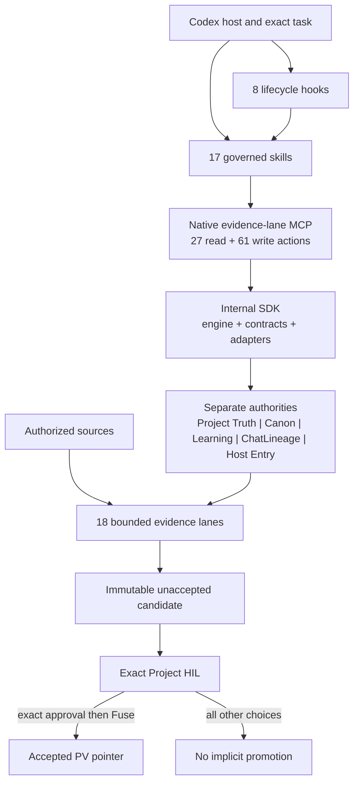

<p align="center">
  
</p>

<p align="center">
  
</p>

# Evidence Lane 3.0.0

<p align="center">
  <a href="https://evidencelane.org"><strong>evidencelane.org</strong></a><br />
  <a href="https://rathee000001.github.io/evidence_lane_plugin/">GitHub Pages</a>
</p>

The canonical Devpost publication has not been created yet. No branch, preview,
or candidate should publish or link to a provisional entry.

<p align="center">
  <a href="ARCHITECTURE.md">Architecture</a> ·
  <a href="docs/CANON_TASK_GRAPH_AND_INPUT_HIL.md">Canon</a> ·
  <a href="docs/AI_LEARNING.md">AI Learning</a> ·
  <a href="docs/MEMORY.md">Memory</a> ·
  <a href="docs/SKILLS.md">Skills</a> ·
  <a href="docs/MCP.md">MCP</a> ·
  <a href="docs/TOOLS.md">Tools</a> ·
  <a href="docs/COMMANDS.md">Commands</a> ·
  <a href="docs/HOOKS.md">Hooks</a> ·
  <a href="docs/USER_HELPER_GUIDE.md">Helper</a> ·
  <a href="docs/USER_TUNNEL_GUIDE.md">Tunnel</a> ·
  <a href="docs/UPSTREAM_REFERENCE_PROVENANCE.md">Provenance</a> ·
  <a href="docs/CREDITS_AND_CONTRIBUTIONS.md">Contributors</a> ·
  <a href="LICENSE.md">License</a> ·
  <a href="docs/COPYRIGHT.md">Copyright</a> ·
  <a href="docs/THIRD_PARTY_LICENSES.md">Third-party licenses</a> ·
  <a href="docs/TERMS_AND_CONDITIONS.md">Terms</a> ·
  <a href="SECURITY.md">Security</a>
</p>

The AI model is rarely the only bottleneck in a serious long-running project.
The harder failure is the fragmented project around it: repositories, local
dirty work, documents, databases, research, plans, installed runtimes,
deployments, and human decisions all drift into separate realities while the
human becomes the integration layer.

Evidence Lane is a local-first project control plane for that fragmented state.
It keeps source, worktree, project, Plan, ChatLineage, installed-runtime,
candidate, accepted, Memory, Canon, and AI Learning authorities distinct while
making the exact slice needed by the active Delta queryable across tasks,
context windows, tools, and hosts.

The current pre-HIL Codex source release is **3.0.0**. This forward release
identity applies to the branch, package, helper, tunnel, Git, website, future
Devpost publication, and maintained current documentation; sealed historical
receipts retain their original identities only inside the historical evidence
boundary.

> **Testing status:** Version 3.0.0 is a candidate source line under branch
> verification; it has not completed the governed release and installed-package
> gate. Lifecycle hooks remain off in the maintainer test environment while all
> eight events are repaired and verified one at a time. Canon and AI Learning
> cross-lane automation remain in development. Memory storage and bounded query
> contracts can run explicitly without hooks, while automatic pre-compaction
> sealing and post-compaction rehydration remain off with their hooks.

## Five product failures Evidence Lane addresses

Long-running AI work does not have one continuity problem. It has five related
failure modes that compound when project state lives only in a conversation or
a repository checkout:

1. **Every new task can charge a re-explanation tax.** A fresh task does not
   automatically inherit the exact files, accepted state, active work, pending
   decisions, or prior task boundary. Users repeat the project while the model
   reconstructs a plausible but potentially different state. Evidence Lane
   records queryable ChatLineage, exact task boundaries, the accepted pointer,
   pending candidates, and unresolved human gates so the next task can retrieve
   the relevant state instead of rebuilding the whole narrative.
2. **Unchanged sources are repeatedly read and reparsed.** Reprocessing the same
   large inputs spends time and context while increasing the chance that two
   passes classify identical evidence differently. Evidence Lane stores
   content-addressed lane facts and retrieves bounded matches through SQLite,
   FTS5, BM25, and linked topology; Refresh reprocesses changed sections and
   records their Delta rather than treating every turn as a first intake.
3. **Human direction and AI output blur together.** A polished model response,
   successful test, deployment, or commit can be mistaken for a human decision.
   Evidence Lane preserves actor lineage, keeps candidates separate from
   accepted truth, and requires the exact human-controlled gate before accepted
   state can move.
4. **The model needs a bounded corpus while the user needs command authority.**
   Dumping a Plan, backlog, Markdown history, or project folder into the context
   hides the decision surface inside data volume. Evidence Lane classifies the
   operating mode, queries only the relevant evidence, applies the permitted
   tools and gates, and returns the bounded facts needed for the current action.
5. **Hosts do not share one storage reality.** A persistent local workstation,
   durable VM, and ephemeral host cannot safely pretend to have the same files,
   mounts, or lifecycle. Evidence Lane binds an eligible local, mounted, or
   transactional authority to the detected host profile and seals entry and
   exit boundaries so a host transition does not silently change project truth.

The conversation remains the reasoning surface. Durable, queryable evidence
remains the authority, and Git remains source history rather than a substitute
for worktree, Plan, ChatLineage, installed-runtime, candidate, or human-decision
state.

## What Evidence Lane separates

1. **Source truth** — ordered inputs, exact bytes, parsers, tools, provenance,
   and failures.
2. **Worktree truth** — Git identity plus preserved dirty and untracked bytes.
3. **Project truth** — durable lane databases, graphs, pointers, and receipts.
4. **Plan truth** — one canonical order, one active row, queued work, history,
   dependencies, and physically final HIL.
5. **ChatLineage** — prompts, responses, task lineage, entry/exit boundaries,
   and bounded retrieval.
6. **Installed truth** — exact package, slot, MCP catalog, skills, hooks,
   helper, tunnel, and runtime identity.
7. **Candidate truth** — immutable evidence that remains unaccepted.
8. **Accepted truth** — the Project Version pointer moved only by the exact
   governed human decision.
9. **Canon** — cross-task contracts and mapped consequences without inferred
   acceptance.
10. **AI Learning** — project-isolated learning proposals and receipts, kept
    distinct from Project Truth and Canon authority.

AI reasons over these authorities. It is not itself the evidence authority.

## Current Codex package contract

The 3.0 source package defines:

- one package-local native MCP server named `evidence-lane`;
- exactly **88 canonical actions**: 27 read-only and 61 write-capable;
- exactly **17 governed skills**;
- six primary controls in order: Boot, Rollback, Build, Refresh, Mode, and
  Source Intake;
- eight lifecycle hook events: `PreToolUse`, `PostToolUse`, `PreCompact`,
  `PostCompact`, `SessionStart`, `SessionEnd`, `UserPromptSubmit`, and `Stop`;
- durable local SQLite as the default project authority;
- a canonical Plan ledger and bounded 1+9 Step projection;
- queryable ChatLineage, FTS5/BM25 retrieval, MMD and DOT topology, pointers,
  receipts, and content hashes;
- exact State Travel continuity for a fresh task without replaying HIL; and
- human-owned promotion gates before a candidate can become accepted truth.

These are source/package contracts. A running Codex task may retain an older
MCP snapshot until the supported same-task restart route proves the new
installed package. A manifest, cache directory, or README claim is not
installed-host evidence.

### Complete skill surface

| Skill | Surface | Primary control | Governed role |
| --- | --- | --- | --- |
| `evi` | Root router | No | Presents the six controls and conditional State Travel without silently selecting one. |
| `evi-boot` | Lifecycle | Yes | Verifies runtime, ENV/UOP Flash, host, storage, session, and accepted pointer. |
| `evi-rollback` | Lifecycle | Yes | Performs pointer-only movement among immutable accepted PVs. |
| `evi-build` | Lifecycle | Yes | Seals an unaccepted candidate and stops at exact Project HIL. |
| `evi-refresh` | Lifecycle | Yes | Rebuilds changed evidence while preserving content-addressed history. |
| `evi-mode` | Mode | Yes | Applies ordered ENV/UOP mode and operator intersections. |
| `evi-source-intake` | Source | Yes | Classifies and routes bounded sources across canonical lanes. |
| `evi-state-travel` | Continuity | No | Resumes exact unfinished work through a bound fresh task. |
| `evi-canon` | Task coordination | No | Governs typed task contracts, receiver-owned Canon decisions, backfire, results, and graph continuity. |
| `evi-learning` | AI Learning | No | Governs project-isolated Learning retrieval, candidates, HIL, and revocation without changing Project Truth. |
| `evi-storage` | Storage | No | Inspects and selects eligible project-scoped persistence. |
| `evi-change-storage-connector` | Storage | No | Preserves the explicit compatibility route for a connector change. |
| `evi-plugin` | Connector administration | No | Governs the bounded additional-plugin/toolchain catalog. |
| `evi-additional-plugin` | Connector grant | No | Adds one purpose-, role-, scope-, and expiry-bound grant. |
| `evi-drop-additional-plugin` | Connector revocation | No | Revokes one exact active grant without erasing history. |
| `evi-exit-boot` | Session | No | Closes the exact governed session while retaining installation and evidence. |
| `evidence-lane-code-lifecycle` | Code lifecycle | No | Applies the one-writer Code-mode build, test, package, and HIL law. |

### Complete native MCP surface

| Native surface | Exact 3.0 source value | Authority boundary |
| --- | --- | --- |
| Server | `evidence-lane` | One package-local Codex MCP; website and tunnel routes are not substitutes. |
| Canonical namespace | `mcp__evidence_lane__*` | Display suffixes never change canonical identity. |
| Read-only actions | 27 | Inspect authority without lifecycle mutation. |
| Write-capable actions | 61 | Each call proves its project, session, task, host, and lifecycle preconditions. |
| Total canonical actions | 88 | Visibility is capability discovery, not permission or approval. |
| Governed console | `ui://evidence-lane/governed-console-v5.html` | Read-only rendering cannot decide HIL or move a pointer. |
| Durable default | Project-scoped local SQLite | Storage connectors remain separate surfaces. |

## Architecture and public documentation

The complete source architecture is [ARCHITECTURE.md](ARCHITECTURE.md). The
named documentation surfaces at the top of this README are separate,
Git-tracked authorities projected into GitHub Pages; they are not generated
claims detached from source.



## Public controls and routing

Root `/evi` exposes six primary controls:

1. `/evi-boot`
2. `/evi-rollback`
3. `/evi-build`
4. `/evi-refresh`
5. `/evi-mode`
6. `/evi-source-intake`

State Travel, Canon, Learning, Storage, plugin governance, and the code
lifecycle are bounded sidecars and routers. Their presence does not inflate the
six-control product surface or give them authority outside their contracts.

The native lifecycle route is `mcp__evidence_lane__*`. Skills describe the
human workflow; MCP actions implement bounded reads and writes; commands expose
supported entry points; SDK arms provide typed internal calls; hooks improve
continuity around host events. A declaration on one surface is not parity until
the installed package routes it to executable behavior and tests prove it.

## Lifecycle

```text
Boot + locked ENV/UOP Flash
        |
        v
Source Intake -> project and source identity
        |
        v
Plan / Goal / Delta execution
        |
        v
Build or Refresh -> immutable unaccepted candidate
        |
        v
Human HIL decision
        |
        +-- APPROVE + exact Fuse -> accepted PV and pointer movement
        +-- APPROVE_WITH_DELTA   -> explicit correction remains queued
        +-- MORE_RESEARCH        -> research remains explicit
        +-- ROLLBACK             -> pointer-only governed rollback
        +-- REJECT / FAIL        -> no promotion
```

Natural-language agreement is never enough for Fuse. A test pass, commit,
push, preview, package, install, restart, or task transition is evidence, not
approval. Plan acceptance in the Codex UI is also not Evidence Lane HIL.

## Source Intake and lane sectors

Source Intake accepts one or more ordered sources, identifies the project type,
selects the required lanes, and always preserves ChatLineage. A lane is created
only when that source class is actually detected or explicitly requested;
unloaded lanes do not receive empty placeholder databases.

The project sector can represent code, Git history, documents, PDFs,
images/OCR, spreadsheets, research, discussions, plans, SQLite brains, custom
schemas, and other governed evidence. Each active lane keeps the artifacts
needed for both machine retrieval and human inspection, including its SQLite
authority, searchable content, hashes, topology, pointer/manifest state,
tool-capability record, and mutation receipts.

Each project refresh also carries an ordered, hash-bound disposition for all
canonical lanes. A loaded lane is truthfully preserved or partial; a lane with
no current source is missing; a lane removed from the current source set is
deferred while its earlier evidence remains history. Missing or deferred lanes
emit no directory or placeholder artifacts. Every emitted lane distinguishes
required, conditional, and optional tools and binds deterministic chunks/FTS,
SQLite, MMD, DOT, `tools.json`, topology, pointers, and receipts. Historical
V1/V2/V3 packages remain readable without being rewritten.

Lane schemas start from versioned package contracts. Non-code schemas may grow
additively when the classified project need requires a new table, column,
relation, registry, or FTS projection. Git and local-code schema changes remain
explicitly user-gated. Migrations are additive, hash-chained, recorded, and
relocked; raw ad-hoc SQL is not treated as a schema-evolution contract.

## Bounded query law

Project data exists outside model context so it can be queried—not so it can be
dumped back into a prompt.

- Reads use exact IDs, bounded status windows, FTS5, BM25, graph pointers, and
  explicit result limits.
- Parallel lane and cross-lane queries return bounded aggregates with exact
  provenance.
- Cross-project reads require an explicit read grant and immutable project/PV
  identity.
- Writes persist the full transaction in SQLite but return only compact
  receipts and the fields required for the next decision.
- Plan writes never return the full Plan, backlog, history, or PV package.
- Raw Markdown, full ChatLineage, full lane databases, and receipt archives are
  never loaded merely to discover where a bounded row lives.

Oversized tool payloads are first-class contract failures, not a cosmetic UI
problem. The repair belongs in the read/write boundary so every caller—skill,
command, MCP action, SDK arm, hook, and lifecycle route—receives the same
bounded behavior.

## Persistent Plan, Goal, and Step display

The canonical Plan lives in durable SQLite. Markdown summaries and the Codex
Step UI are projections, never replacement authority.

The visible task display follows a fixed **1+9** contract:

- Step 1 is the compact PV/progress/header tracker.
- Steps 2–10 are the active executable row plus the next eight canonical rows.
- Each Delta uses a compact three-line maximum presentation: stable task ID and
  status; class/group/dependency/graph/FTS coordinates; then a one- or two-line
  human-readable description.
- Exactly one row is in progress; later rows remain pending.
- The physically final HIL remains physically final in canonical authority.

Completing one row does not reconstruct or arbitrarily slide the whole batch.
The native UI may mark finished lines complete as work advances. A full 1+9
rehydration occurs when the displayed batch boundary is reached, when a Plan
mutation changes the current window, or when the host drops the panel and it
must be restored. If the Plan is reordered, the Goal must bind to the same new
active row before work resumes.

Plan steering is append-only or explicit reorder/supersession; rows are not
silently deleted. Completed and superseded records remain queryable history.
Git appears only on the row where Git actually executes.

## ChatLineage, entry, and exit

ChatLineage records task identity, user prompts, model responses, linked
steers, source references, and lifecycle boundaries as queryable rows. Entry
classification selects the relevant lanes and operators before work begins.
Intermediate turns append lineage without pretending the project has exited.
An exit boundary is emitted only for a real governed pause, completion, or
State Travel transition.

ChatLineage is not the Plan and is not Project Truth. It connects them through
stable task, row, source, receipt, and graph IDs. A State Travel destination may
query the exact transferred lineage without copying an entire archived chat
into its context window.

## Canon, AI Learning, and Memory

Canon governs bounded task-to-task contracts: expected inputs, destination
ownership, dependency edges, revisions, conflicts, backfire consequences, and
human mapping decisions. Canon may inform a Plan; it cannot accept a PV, move a
pointer, or decide another task's HIL.

AI Learning records project-isolated observations and proposed improvements.
Delta-level learning may accumulate between HILs, but accepted learning remains
separate from accepted Project Truth. Learning, Canon mapping, and PV promotion
must each expose their own decision fields when the lifecycle requires human
authority.

Memory is the bounded connective layer across active project sectors. It uses
ChatLineage, Plan, Canon, Learning, source, and receipt identities to retrieve
the smallest useful state for the current row. It does not replace those
authorities or compact the whole project into one prose blob.

Before host compaction, the lifecycle seals the visible active-state boundary.
After compaction, it restores the same bounded Plan/Goal/task/source coordinates
and resumes from SQLite rather than reconstructing from conversational memory.

## Hooks

The package defines eight events:

| Event | Purpose |
| --- | --- |
| `SessionStart` | Verify installed identity and prepare bounded runtime context. |
| `UserPromptSubmit` | Classify and bind the visible task turn without storing private reasoning. |
| `PreToolUse` | Guard bounded tool activity before execution. |
| `PostToolUse` | Append compact receipts and refresh affected projections. |
| `PreCompact` | Seal the active continuity boundary before compaction. |
| `PostCompact` | Rehydrate the same bounded state after compaction. |
| `Stop` | Preserve the response boundary without inventing HIL or completion. |
| `SessionEnd` | Best-effort flush when the host emits a real session-end event. |

Hooks improve lifecycle continuity; the plugin remains operable through its
explicit skills and native actions while hooks are disabled for repair. A
hidden eighth event must not remain active when the seven visible controls are
off. Hook configuration, host UI count, command mapping, execution, and
installed-package bytes must agree before hooks are re-enabled.

## Host and storage matrix

| Codex execution profile | Primary project storage | Tunnel requirement |
| --- | --- | --- |
| Desktop Codex on a local/persistent host | Durable local SQLite | Version-bound tunnel only when the detected host route requires it |
| Local CLI without the interactive app | Durable local SQLite | Required when the host route lacks direct MCP transport or required host tools |
| Headless API service on a persistent VM | Durable local PV store | Not required by the API layer |
| Ephemeral VM with durable mount | Mounted durable SQLite | Not required by the API layer |
| Ephemeral VM without durable mount | Explicit transactional durable connector | Not required by the API layer |
| Interactive Codex on an ephemeral VM | Durable mount or transactional connector | One VM-lifetime setup may be required |

Model, reasoning effort, account tier, billing route, host lifetime, storage,
and transport are separate classification axes. They do not change the HIL
law. A future ChatGPT host profile is not claimed by the current Codex release.

An ephemeral or stateless invocation additionally requires an exact host-entry
envelope persisted through the selected transactional connector. The envelope
preserves the accepted pointer, active Plan row, task/worktree binding, locked
ENV/UOP, and separate authority heads without becoming a new PV. It expires,
is single-consumption, treats an exact retry idempotently, and fails closed on a
stale or mismatched entry. Proven durable local Codex uses its local SQLite
authority directly and creates no unnecessary external dependency.

## Maintainer slots and recovery

The maintainer workflow separates three 3.0 roles:

1. **Local testing slot** — receives reviewed working-tree packages only when a
   governed local-install test is actually scheduled.
2. **Branch stable-recovery slot** — receives the exact clean branch commit
   package and provides recovery while later source work continues.
3. **Git/main release slot** — receives the exact accepted release commit only
   through the governed Git/package route.

Only one plugin/MCP route and its matching helper/tunnel identity may be active
for one task at a time. Multiple Codex apps may work on different tasks and
projects; helpers bind the calling app and exact task rather than globally
redirecting every app.

Historical slots remain provenance, not live fallbacks. A broken testing slot
may fail over only after the configured multi-probe failure contract, and it
returns only after exact package, catalog, helper/tunnel, and task/session proof.
At the final authorized main promotion, all maintained slots may be normalized
to the same accepted bytes; that operation is not inferred from CI.

## Helper and tunnel lifecycle

The user helper does not build or install the plugin. Installation completes
first. The maintainer verifies package and hook configuration, then calls the
version-matched helper to close the calling Codex app, reopen the same app in
the same task and workspace, restore the full window, and attach the matching
MCP snapshot. It should not introduce an arbitrary multi-minute wait.

The tunnel is a separate transport process, not the MCP catalog. It is
installed only for host profiles that require it, starts hidden, may survive
Windows sign-in through its versioned scheduled task, and never absorbs
unrelated OpenAI tools. Older helper and tunnel identities are disabled when a
new version becomes active; they are not allowed to race the current task.

See [Helper installation](docs/USER_HELPER_GUIDE.md), the
[user tunnel guide](docs/USER_TUNNEL_GUIDE.md), and the complete
[tunnel persistence contract](docs/WINDOWS_TUNNEL_PERSISTENCE.md).

### Bounded Windows tunnel setup

Local Codex and local CLI profiles may require the version-bound tunnel when
the detected host route lacks direct MCP transport or required host tools.
Headless API requests do not require the tunnel merely because they use API
billing. The tunnel carries only the Evidence Lane transport selected by the
host matrix; it never absorbs unrelated OpenAI tooling or changes project
authority.

The 3.0 installer is
`plugins/evidence-lane-plugin/scripts/windows_tunnel/Install-EvidenceLaneTunnel.ps1`.
For an ephemeral interactive host, pass `CODEX_APP_INTERACTIVE`,
`-HostLifetime Ephemeral`, and the exact `-VmInstanceId
"<exact-vm-instance-id>"`. The prompt for the user's Runtime API key is masked;
the encrypted value uses Windows DPAPI and is never written to a receipt.
Inspect or start the installed tunnel with `Manage-EvidenceLaneTunnel.ps1
-Action Status`; success must report `status = PASS` before any
`mcp__evidence_lane__*` route is treated as available. The helper remains a
separate process and never installs the plugin.

## Git and CI/CD boundary

Repository writes use the governed Git route. A configured non-default branch
may use standing authorization for an exact fast-forward push or a deliberate
same-checkpoint amend with an exact lease. That does not authorize:

- rewriting or merging the protected `main` branch;
- creating or accepting a Project Version candidate;
- moving the accepted pointer;
- production publication, Fuse, or HIL; or
- deleting unrelated dirty or untracked bytes.

Source tests run at the scope needed by each Delta. Reinstalling the plugin
after every row is not required. The release pre-HIL gate performs the exact Git
commit, clean CI, package build, Git-based installation, installed-host proof,
and preview checks as one governed release boundary. Any failed check belongs
to the exact failing surface and blocks that gate.

GitHub Pages is the branch documentation projection. The Vercel preview is a
separate Git-triggered documentation build. Neither surface installs Codex,
persists Project Truth, accepts candidates, or moves pointers. Production
website refresh and main promotion remain later, explicitly authorized work.

Evidence Lane does not configure or invoke the usage-based GitHub Sandbox
product. Local agent work remains inside the bounded local project work
directory, and GitHub Actions supplies clean-checkout CI; paid overages and
separate hosted-agent products are not implied. The Vercel project is a public
documentation site only. The selected Vercel account plan does not change
Evidence Lane authority, and Vercel is not used to install Codex, route the
native lifecycle, persist Project Truth, create candidates, or move pointers.

## Install the Codex plugin

Install only a reviewed branch or exact commit:

```powershell
codex plugin marketplace add rathee000001/evidence_lane_plugin --ref REVIEWED_REF
codex plugin add evidence-lane-plugin@evidence-lane-github --json
```

The maintainer verification sequence is:

1. build a deterministic package from the exact commit;
2. verify source, commit, tree, package, schema, catalog, skill, hook, helper,
   tunnel, and secret boundaries;
3. stage and activate the requested existing slot;
4. run the pre-restart installed-package acceptance check;
5. prepare the exact same-task restart receipt;
6. reopen the calling Codex app and exact task;
7. verify the native catalog, hooks, project/runtime panels, persistent Step
   display, workspace, and installed store; and
8. stop at the required human gate.

The plugin wheel owns every runtime schema it reads. Repository schema files
may provide public and skill-facing projections, but deterministic tests require
their bytes to match the package-owned authorities so an installed wheel never
depends on a source-checkout path.

## Build and test locally

```powershell
python -m venv .venv
.venv\Scripts\python -m pip install -e .[dev]
.venv\Scripts\python -m pytest -q
```

Focused release checks live under `tests/`. Clean GitHub Actions additionally
prove the exact checkout, built wheel, container/runtime startup, documentation
projection, preview compilation, and CodeQL surfaces configured for the commit.

## Repository map

| Path | Role |
| --- | --- |
| `plugins/evidence-lane-plugin/.codex-plugin/plugin.json` | Codex product identity and UI metadata |
| `plugins/evidence-lane-plugin/.mcp.json` | Package-local native MCP launch contract |
| `plugins/evidence-lane-plugin/src/evidence_lane_plugin/` | Lifecycle engine and native server |
| `plugins/evidence-lane-plugin/src/evidence_lane_plugin/schemas/` | Installed-runtime schema authorities |
| `plugins/evidence-lane-plugin/schemas/` | Repository and skill-facing schema projections |
| `plugins/evidence-lane-plugin/skills/` | Seventeen governed skills |
| `plugins/evidence-lane-plugin/hooks/` | Eight lifecycle events and their commands |
| `plugins/evidence-lane-plugin/scripts/` | Package, helper, tunnel, release, and verification routes |
| `docs/` | Architecture, product surfaces, runbooks, legal pages, and provenance |
| `github-pages/` | GitHub Pages layout and assets |
| `scripts/prepare_github_pages.py` | Deterministic Git-tracked Pages projection |
| `tests/` | Unit, integration, package, source, and contract verification |

## Security and claim boundary

- Secrets are never written into receipts, Git commits, task panels, or source
  packages.
- Private chain-of-thought is not stored.
- Dirty and untracked bytes are preserved unless the user explicitly
  authorizes their mutation.
- A passed test, CI run, push, package, install, restart, or preview is evidence,
  not candidate acceptance.
- Host-owned UI placement must be observed; a manifest cannot prove rendering.
- Exact counts and hashes are release-specific and must be read from bounded
  receipts rather than inferred.
- ENV/UOP identities remain locked and are not offloaded into project folders
  or exposed as ordinary project data.

## 3.0 source and historical compatibility invariants

Version 3.0 advances the governed source and package contract without rewriting
historical releases, receipts, commits, State Travel packages, or failure
evidence. Those artifacts retain their original identities as provenance; they
cannot override the current source, installed package, native ledger, or human
decision boundary.

The commit, CI, preview, package, install, helper, and tunnel sequence is the
Evidence Lane **plugin-maintainer release cycle**. A downstream project does not
inherit that installation cycle; it retains its own Git, CI, deployment,
lane/schema, plugin, and storage choices.

Goal completion is human-owned and independent of candidate acceptance. Only
the visible Goal-completion action may close a governed Goal. Tests, automation,
task transitions, pauses, and stalls cannot complete it, and Goal completion
authorizes no pointer movement, Git action, installation, merge, or deployment.

Release-maintainer helpers and governed-user recovery helpers serve separate
audiences. A governed user receives only the version-bound helper and, when the
host classifier requires it, the matching tunnel. Maintainer slot rotation is
not imposed on downstream users or projects.

## Ownership, contribution, and licenses

Evidence Lane is independently conceived, directed, funded, and owned by
Praveen Rathee. Repository access and evaluation do not grant permission to
redistribute, sublicense, commercialize, or create derivative releases.

The relevant authorities are:

- [Contributing](CONTRIBUTING.md)
- [Proprietary source license](LICENSE.md)
- [Copyright and ownership](docs/COPYRIGHT.md)
- [Third-party tool licenses](docs/THIRD_PARTY_LICENSES.md)
- [Terms and conditions](docs/TERMS_AND_CONDITIONS.md)
- [Security policy](SECURITY.md)
- [Credits and contributions](docs/CREDITS_AND_CONTRIBUTIONS.md)
- [Dependency license audit](docs/DEPENDENCY_LICENSE_AUDIT.md)
- [Upstream provenance](docs/UPSTREAM_REFERENCE_PROVENANCE.md)

Third-party software, services, models, assets, and trademarks remain governed
by their respective owners. Listing a tool or service records provenance and a
supported role; it transfers neither ownership nor Evidence Lane authority.

## Current release boundary

Version 3.0.0 is the current candidate source line, not yet a released or
installed package claim. A release claim requires the exact reviewed commit,
all required CI checks, the built package, the governed Git-route installation,
installed-host catalog proof, and the explicit human release decision.
Documentation, a preview deployment, a package cache, or a passing test does
not substitute for that evidence.

Main promotion, production presentation, and maintained-slot normalization are
separate operations. Each requires its own verified inputs and explicit
authority; none is inferred from this README or from an earlier lifecycle step.
