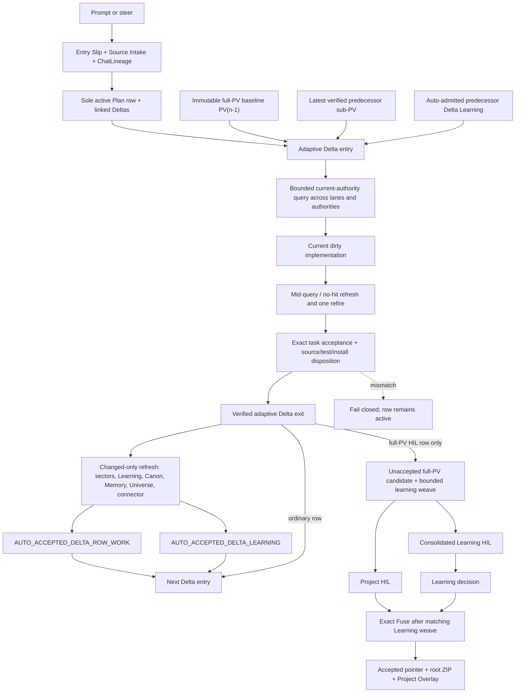
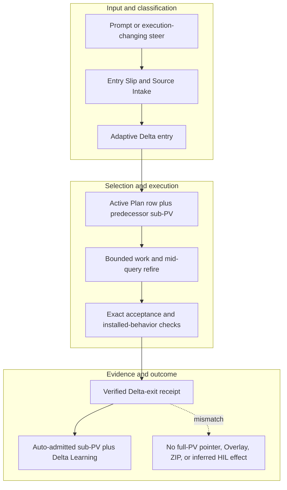

<!-- evidence-lane-public-docs-full-refresh: 3.0.0 / registry-derived-v1 -->

# Adaptive Delta execution, sub-PV, and Delta Learning

Every executable Plan row uses one recursive Delta contract: exact entry, bounded work, optional mid-query refire, verified exit, auto-admitted row work and learning, then either the next Delta or a separate full-PV dual-HIL boundary.

Current counts are derived release facts, not permanent ceilings.

## Complete recursive flow

## Entry contract

`DELTA_ENTRY_AND_CURRENT_AUTHORITY_QUERY` fires on `ACTIVE_PLAN_ROW_ENTRY`. It binds the active Plan row, linked steers, immutable full-PV baseline, latest verified sub-PV, accepted Delta Learning, live sector lanes, Agent Learning, Canon, Project Memory, Project Universe, connector integrity, AGENTS.md, and host MEMORY.md.

| Entry action | SDK binding role |
| --- | --- |
| `task_classify` | `sdk/actions/task_classify.action.v1.json` |
| `pv_status` | `sdk/actions/pv_status.action.v1.json` |
| `pv_task_backlog` | `sdk/actions/pv_task_backlog.action.v1.json` |
| `pv_query` | `sdk/actions/pv_query.action.v1.json` |
| `search` | `sdk/actions/search.action.v1.json` |
| `learning_retrieve` | `sdk/actions/learning_retrieve.action.v1.json` |
| `project_memory_query` | `sdk/actions/project_memory_query.action.v1.json` |
| `canon_graph` | `sdk/actions/canon_graph.action.v1.json` |

Hooks are optional for explicit entry actions. Accepted archives are never queried. Re-entry reuses the existing entry formula; it does not append a second entry or rebuild the Plan from chat.

## Mid-query contract

`IN_DELTA_BOUNDED_QUERY_AND_NO_HIT_REFIRE` is triggered only by `TASK_SCOPE_CHANGE`, `BOUNDED_NO_HIT`. Its no-hit order is `LIVE_SECTOR_FALLBACK` → `AI_LEARNING` → `CANON` → `PROJECT_MEMORY` → `PROJECT_UNIVERSE` → `CONNECTOR_BRAIN`. It refires at most once and never substitutes an accepted ZIP.

## Exit contract

`DELTA_EXIT_APPEND_REFRESH` uses `task_confirm_source_update, adaptive_delta_exit, pv_task_transition` and refreshes the exact changed authorities only after targeted validation passes. Ordinary rows cannot refresh Project Overlay.

| Exit fact | Current rule |
| --- | --- |
| Full-PV pointer while row is open | `IMMUTABLE_PV_N_MINUS_1_BASELINE` |
| Live sectors | `PROGRESSIVE_THROUGH_PREDECESSOR_DELTA_EXIT_SUBPV` |
| Predecessor learning | `AUTO_ADMITTED_DELTA_LEARNING` |
| Current dirty Delta already in lanes | `false` |
| Source tests prove installed behavior | `false` |
| Installed proof | `true` |

## Auto-admitted states versus full-PV HIL

Sub-PV row work and Delta Learning are verified continuing-work inputs, not miniature full-PV approvals. They are automatically admitted at Delta exit, reused by the next Delta, and retain exact receipts. They create no individual HIL, candidate, Overlay, accepted ZIP, or full-PV pointer movement.

`FULL_PV_DUAL_HIL` is distinct and requires two explicit human decisions. The Fuse contract declares `individual_delta_learning_hil=false`, `project_and_learning_decisions_separate=true`, and acceptance authority `PLAN_ROW_DUAL_HIL_STAMP`.

The accepted ZIP is post-approval snapshot storage only and is never an entry, query, Learning, or State Travel source. Project Overlay is created only by the full-PV HIL path after the exact Project decision permits it.

## Source-bound workflow map

This page is projected from the same current executable snapshot as the rest of the documentation set. The map is deliberately two-directional: each horizontal district shows peer stages while vertical edges show ownership and state progression.

## Contract and readback

| Phase | Current contract | Required readback |
| --- | --- | --- |
| Input | Prompt or execution-changing steer | Exact identity, provenance, and scope |
| Classification | Entry Slip and Source Intake | Owning schema, action, lane, skill, or authority |
| Owner | Adaptive Delta entry | One canonical implementation owner |
| Route | Active Plan row plus predecessor sub-PV | Condition-true ordered route with no hidden alias |
| Execution | Bounded work and mid-query refire | Real execution or a visible fail-closed result |
| Validation | Exact acceptance and installed-behavior checks | Hash, schema, authority-effect, and negative-case checks |
| Receipt | Verified Delta-exit receipt | Content-addressed result and provenance receipt |
| Downstream | Auto-admitted sub-PV plus Delta Learning | Only the explicitly eligible next state |
| Failure | No full-PV pointer, Overlay, ZIP, or inferred HIL effect | No inferred HIL, candidate acceptance, or pointer movement |

## Canonical source owners

- `sdk/delta/entry-mid-exit.v1.json`
- `sdk/delta/entry.workflow.v1.json`
- `sdk/delta/exit.workflow.v1.json`

### Exact backend readback

| Source contract | Bytes | SHA-256 |
| --- | ---: | --- |
| `sdk/delta/entry-mid-exit.v1.json` | 2700 | `D2657B3E8446D8F7C4B229824A5863C581E968EDD688D7C265F36A70745F1259` |
| `sdk/delta/entry.workflow.v1.json` | 2398 | `A50E2BBE9BE0B816E325A3B0F393C02F020C66B261BE617845A0E8DA1AC7E180` |
| `sdk/delta/exit.workflow.v1.json` | 1652 | `317AC3643DD41001C6614C79F0279813883AADFFFF1285AA99BDB20960E48F88` |

## Cross-surface invariants

- The current snapshot contains 91 public actions, 26 skills, 11 hook events / 44 handlers, 119 tool requirements, 18 sector lanes, and 11 named authorities. These are derived counts, not fixed ceilings.
- Executable ownership stays one-way: skills select, MCP exposes, the outer SDK routes, the internal SDK executes, ENV selects, UOP governs, tools perform bounded work, hooks emit receipts, and the owning authority validates effects.
- Any missing identity, schema, grant, capability, dependency, receipt, or authority proof must fail closed at its owning phase; a later green check cannot retroactively authorize the skipped boundary.
- A changed route refreshes every dependent schema, manifest, generator, test, diagram, and documentation reference; the superseded executable route is directly purged in the same Delta.
- Tests, Git, CI, installation, restart, deployment, discussion, or a rendered page never imply Project HIL, Learning HIL, Goal completion, or pointer movement.

---

This page is a Git-tracked documentation projection. Executable source, SQLite authorities, installed-runtime receipts, and explicit human gates remain the governing evidence.
