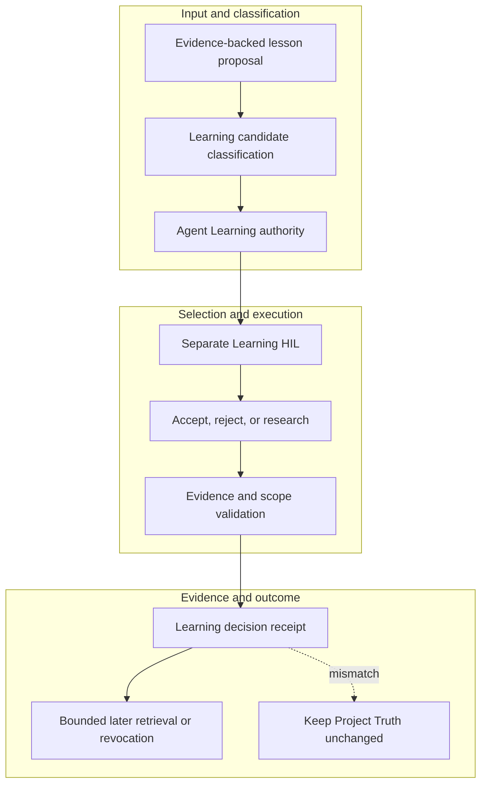

<!-- evidence-lane-public-docs-full-refresh: 3.0.0 / registry-derived-v1 -->

# AI Agent Learning authority

Agent Learning is a project-isolated authority for evidence-backed procedural, failure-avoidance, relational, tool-routing, and host-compatibility lessons. It never becomes Project Truth.

Current counts are derived release facts, not permanent ceilings.

| Action | Access | Internal owner |
| --- | --- | --- |
| `learning_decide_candidate` | write-capable | `agent_learning:decide_candidate` |
| `learning_inspect` | read | `agent_learning:inspect` |
| `learning_record_host_memory_import` | write-capable | `agent_learning:record_host_memory_import` |
| `learning_retrieve` | read | `agent_learning:retrieve` |
| `learning_revoke` | write-capable | `agent_learning:revoke` |
| `learning_seal_candidate` | write-capable | `agent_learning:seal_candidate` |
## Two learning lifecycles

| Learning surface | Admission | Reuse | Human decision | Project effect |
| --- | --- | --- | --- | --- |
| Per-Delta Learning | `AUTO_ACCEPTED_DELTA_LEARNING` only at verified Delta exit | Bounded input to the next Delta entry | No individual Learning HIL | No Project pointer, Overlay, or accepted-ZIP effect |
| Full-PV consolidated weave | `PENDING_LEARNING_HIL` after the full-PV candidate is sealed | Accepted weave can inform later work | Separate six-way Learning HIL | Moves only the Learning pointer |
| Evidence-backed reusable lesson candidate | Explicit `learning_seal_candidate` route | Bounded retrieval after acceptance | Separate Learning HIL | Never becomes Project Truth |

Automatic Delta Learning exists so verified procedural evidence from one row can inform the next row without forcing a human decision after every Delta. It remains distinct from the row's auto-accepted sub-PV work receipt and from the later consolidated full-PV Learning weave.

Candidates remain unaccepted until the separate Learning HIL records the exact decision. Accepted Learning moves only the Learning pointer; revocation is append-only and does not erase historical evidence. Host MEMORY.md can be linked only through an explicit nonauthoritative provenance receipt.

Learning may inform later work through bounded retrieval. It cannot change a Project pointer, accept a Project proposal, alter Canon, replace Project Memory, or infer HIL from repetition or model confidence.

## Source-bound workflow map

This page is projected from the same current executable snapshot as the rest of the documentation set. The map is deliberately two-directional: each horizontal district shows peer stages while vertical edges show ownership and state progression.

## Contract and readback

| Phase | Current contract | Required readback |
| --- | --- | --- |
| Input | Evidence-backed lesson proposal | Exact identity, provenance, and scope |
| Classification | Learning candidate classification | Owning schema, action, lane, skill, or authority |
| Owner | Agent Learning authority | One canonical implementation owner |
| Route | Separate Learning HIL | Condition-true ordered route with no hidden alias |
| Execution | Accept, reject, or research | Real execution or a visible fail-closed result |
| Validation | Evidence and scope validation | Hash, schema, authority-effect, and negative-case checks |
| Receipt | Learning decision receipt | Content-addressed result and provenance receipt |
| Downstream | Bounded later retrieval or revocation | Only the explicitly eligible next state |
| Failure | Keep Project Truth unchanged | No inferred HIL, candidate acceptance, or pointer movement |

## Canonical source owners

- `authorities/agent_learning/manifest.v1.json`
- `skills/evi-learning/SKILL.md`
- `schemas/actions/learning_seal_candidate.schema.json`

### Exact backend readback

| Source contract | Bytes | SHA-256 |
| --- | ---: | --- |
| `authorities/agent_learning/manifest.v1.json` | 7742 | `A23A8299F02569AEA1934BAA2B4D2A55BA018A157470757906F1C6C4D778F521` |
| `skills/evi-learning/SKILL.md` | 10124 | `42AB4B361F38BD7744078B647190D28FB642D1F701CC90D79C53BEA12913E8E5` |
| `schemas/actions/learning_seal_candidate.schema.json` | 3782 | `1701BFA110AD78A7AA299B333E0BBF0DA4E59A7E1478F7247BED1BE306F7C1E0` |

## Cross-surface invariants

- The current snapshot contains 91 public actions, 26 skills, 11 hook events / 44 handlers, 119 tool requirements, 18 sector lanes, and 11 named authorities. These are derived counts, not fixed ceilings.
- Executable ownership stays one-way: skills select, MCP exposes, the outer SDK routes, the internal SDK executes, ENV selects, UOP governs, tools perform bounded work, hooks emit receipts, and the owning authority validates effects.
- Any missing identity, schema, grant, capability, dependency, receipt, or authority proof must fail closed at its owning phase; a later green check cannot retroactively authorize the skipped boundary.
- A changed route refreshes every dependent schema, manifest, generator, test, diagram, and documentation reference; the superseded executable route is directly purged in the same Delta.
- Tests, Git, CI, installation, restart, deployment, discussion, or a rendered page never imply Project HIL, Learning HIL, Goal completion, or pointer movement.

---

This page is a Git-tracked documentation projection. Executable source, SQLite authorities, installed-runtime receipts, and explicit human gates remain the governing evidence.
