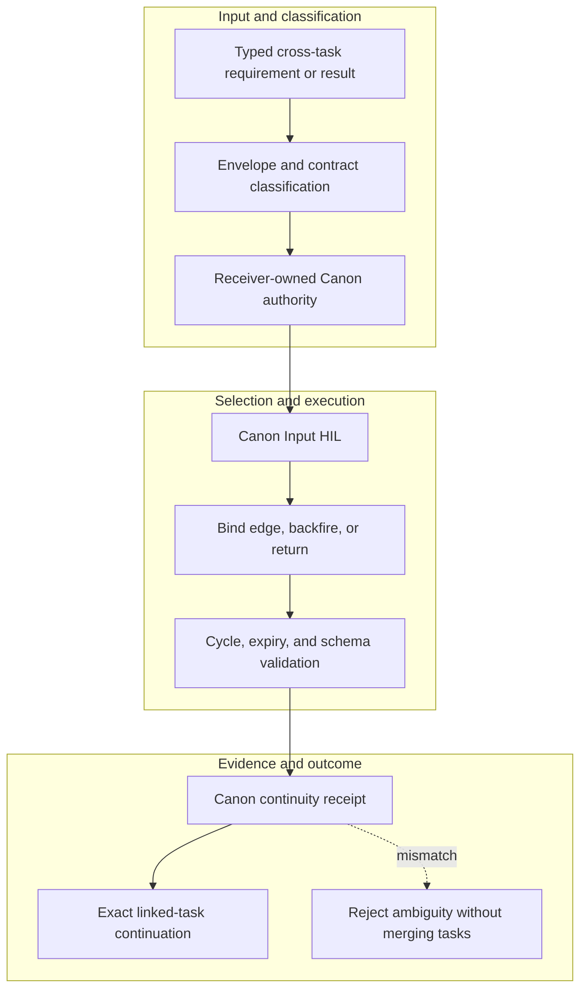

<!-- evidence-lane-public-docs-full-refresh: 3.0.0 / registry-derived-v1 -->

# Canon task graph and input HIL

Canon coordinates typed evidence, requirements, corrections, plans, and results between exact governed tasks without merging their Project Truth, Learning, Plan, Goal, ownership, or HIL.

Current counts are derived release facts, not permanent ceilings.

| Action | Access | Internal owner |
| --- | --- | --- |
| `canon_backfire_hil` | write-capable | `canon_input:backfire_hil` |
| `canon_bind_edge` | write-capable | `canon_input:bind_edge` |
| `canon_classify` | write-capable | `canon_input:classify` |
| `canon_decide` | write-capable | `canon_input:decide` |
| `canon_dispatch_linked_task` | write-capable | `canon_input:dispatch_linked_task` |
| `canon_graph` | read | `canon_input:graph` |
| `canon_inbox` | read | `canon_input:inbox` |
| `canon_inspect` | read | `canon_input:inspect` |
| `canon_receive` | write-capable | `canon_input:receive` |
| `canon_register_contract` | write-capable | `canon_input:register_contract` |
| `canon_register_edge` | write-capable | `canon_input:register_edge` |
| `canon_restore_continuity` | write-capable | `canon_input:restore_continuity` |
| `canon_seal_continuity` | write-capable | `canon_input:seal_continuity` |
| `canon_seal_envelope` | write-capable | `canon_input:seal_envelope` |
| `canon_seal_result` | write-capable | `canon_input:seal_result` |
| `canon_supersede` | write-capable | `canon_input:supersede` |
Each envelope binds source/destination task identity, direction, schema, expected contract, dependency, expiry, evidence, and result requirements. The receiver owns classification and the three-way Canon Input HIL: ACCEPT, REJECT, or MORE_RESEARCH.

Linked top-level tasks may own independent HIL. Explicitly authorized subagents may perform bounded work but never own HIL. Backfire is deduplicated and addressed to the task that can supply the missing input. State Travel continuity preserves the graph; it does not execute State Travel or replay decisions.

## Source-bound workflow map

This page is projected from the same current executable snapshot as the rest of the documentation set. The map is deliberately two-directional: each horizontal district shows peer stages while vertical edges show ownership and state progression.

## Contract and readback

| Phase | Current contract | Required readback |
| --- | --- | --- |
| Input | Typed cross-task requirement or result | Exact identity, provenance, and scope |
| Classification | Envelope and contract classification | Owning schema, action, lane, skill, or authority |
| Owner | Receiver-owned Canon authority | One canonical implementation owner |
| Route | Canon Input HIL | Condition-true ordered route with no hidden alias |
| Execution | Bind edge, backfire, or return | Real execution or a visible fail-closed result |
| Validation | Cycle, expiry, and schema validation | Hash, schema, authority-effect, and negative-case checks |
| Receipt | Canon continuity receipt | Content-addressed result and provenance receipt |
| Downstream | Exact linked-task continuation | Only the explicitly eligible next state |
| Failure | Reject ambiguity without merging tasks | No inferred HIL, candidate acceptance, or pointer movement |

## Canonical source owners

- `authorities/canon_input/manifest.v1.json`
- `authorities/canon_input/consequence_graph/manifest.v1.json`
- `skills/evi-canon/SKILL.md`

## Cross-surface invariants

- The current snapshot contains 91 public actions, 26 skills, 11 hook events / 44 handlers, 119 tool requirements, 18 sector lanes, and 11 named authorities. These are derived counts, not fixed ceilings.
- Executable ownership stays one-way: skills select, MCP exposes, the outer SDK routes, the internal SDK executes, ENV selects, UOP governs, tools perform bounded work, hooks emit receipts, and the owning authority validates effects.
- Any missing identity, schema, grant, capability, dependency, receipt, or authority proof must fail closed at its owning phase; a later green check cannot retroactively authorize the skipped boundary.
- A changed route refreshes every dependent schema, manifest, generator, test, diagram, and documentation reference; the superseded executable route is directly purged in the same Delta.
- Tests, Git, CI, installation, restart, deployment, discussion, or a rendered page never imply Project HIL, Learning HIL, Goal completion, or pointer movement.

---

This page is a Git-tracked documentation projection. Executable source, SQLite authorities, installed-runtime receipts, and explicit human gates remain the governing evidence.
