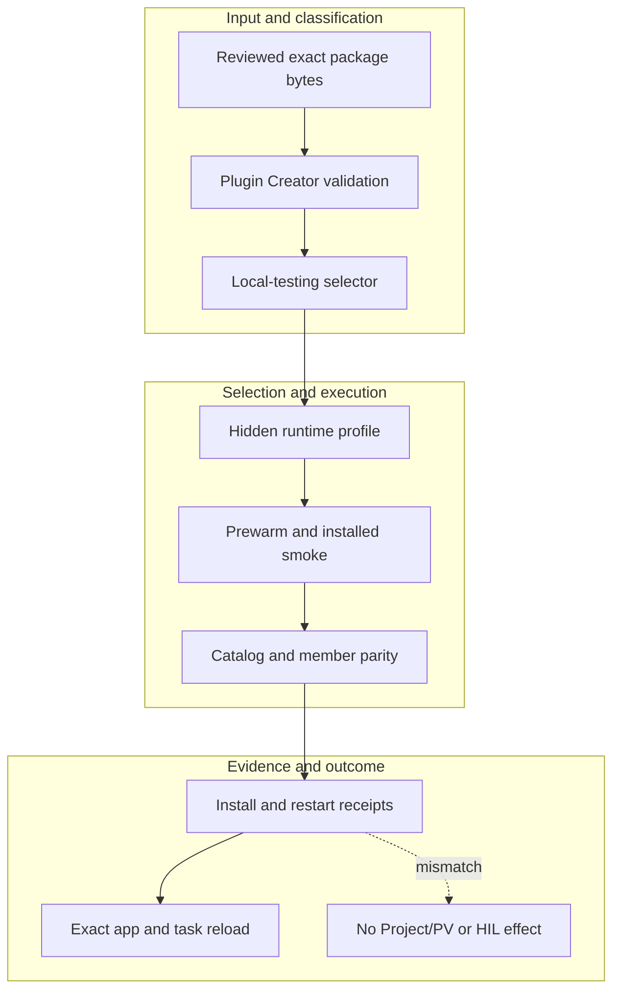

<!-- evidence-lane-public-docs-full-refresh: 3.0.0 / registry-derived-v1 -->

# Codex 3.0 local installation and reload

Installation is a maintainer release operation over exact reviewed package bytes. It is not a downstream project workflow and does not create or accept a Project Version.

Current counts are derived release facts, not permanent ceilings.

## Required order

1. Verify the exact Git commit/tree and clean required CI results.
2. Build the deterministic installable plugin package and executable manifest.
3. Verify action/schema/SDK/MCP, skill, hook, authority, lane, tool, lock, license, and secret boundaries.
4. Cache-bust and install into the explicitly selected existing local slot.
5. Build the hidden hash-keyed runtime from the base/toolchain locks plus the exact selected CPU, NVIDIA CUDA, or AMD DirectML provider lock. Each profile has a distinct runtime key.
6. Install/probe native dependencies and prewarm applicable grammar/model/tunnel capabilities.
7. Run pre-restart package/catalog/runtime acceptance.
8. After the response is complete, use the maintainer-local restart helper only when the host requires a same-task restart.
9. Reopen the same Codex app, task, and workspace, then prove installed member/catalog/skill/hook/tool/authority parity.

The universal default is CPU. A GPU profile requires the user's enabled vendor plugin/grant and compatible host proof; it never silently changes the package for every user. The helper is not installed as plugin business logic and owns no Plan, Goal, HIL, State Travel, package, or Git behavior. The tunnel is separate transport and does not install the plugin.

The marketplace Upgrade button is used only after the exact main release/package route reaches its assigned row. A branch test install and main-slot install remain separately receipted until deliberate normalization.

## Source-bound workflow map

This page is projected from the same current executable snapshot as the rest of the documentation set. The map is deliberately two-directional: each horizontal district shows peer stages while vertical edges show ownership and state progression.

## Contract and readback

| Phase | Current contract | Required readback |
| --- | --- | --- |
| Input | Reviewed exact package bytes | Exact identity, provenance, and scope |
| Classification | Plugin Creator validation | Owning schema, action, lane, skill, or authority |
| Owner | Local-testing selector | One canonical implementation owner |
| Route | Hidden runtime profile | Condition-true ordered route with no hidden alias |
| Execution | Prewarm and installed smoke | Real execution or a visible fail-closed result |
| Validation | Catalog and member parity | Hash, schema, authority-effect, and negative-case checks |
| Receipt | Install and restart receipts | Content-addressed result and provenance receipt |
| Downstream | Exact app and task reload | Only the explicitly eligible next state |
| Failure | No Project/PV or HIL effect | No inferred HIL, candidate acceptance, or pointer movement |

## Canonical source owners

- `.codex-plugin/plugin.json`
- `scripts/codex_release/install_codex_stable.py`
- `manifests/executable-surface-registry.v1.json`

### Exact backend readback

| Source contract | Bytes | SHA-256 |
| --- | ---: | --- |
| `.codex-plugin/plugin.json` | 3049 | `757AB0CA7396811CB3AB3EDC83535FF1E7729AA61289D52062029F8EC2F3A9CD` |
| `scripts/codex_release/install_codex_stable.py` | 247493 | `C08E7BC9EDAC221AA724A6854DFD967DCB60E49D378C4DD32E3E5075D7467311` |
| `manifests/executable-surface-registry.v1.json` | 374970 | `F765A5FC61A4D9FD36151DBFD7FDDC320AAC396471E7E98EE8870CEE705E72CE` |

## Cross-surface invariants

- The current snapshot contains 91 public actions, 26 skills, 11 hook events / 44 handlers, 119 tool requirements, 18 sector lanes, and 11 named authorities. These are derived counts, not fixed ceilings.
- Executable ownership stays one-way: skills select, MCP exposes, the outer SDK routes, the internal SDK executes, ENV selects, UOP governs, tools perform bounded work, hooks emit receipts, and the owning authority validates effects.
- Any missing identity, schema, grant, capability, dependency, receipt, or authority proof must fail closed at its owning phase; a later green check cannot retroactively authorize the skipped boundary.
- A changed route refreshes every dependent schema, manifest, generator, test, diagram, and documentation reference; the superseded executable route is directly purged in the same Delta.
- Tests, Git, CI, installation, restart, deployment, discussion, or a rendered page never imply Project HIL, Learning HIL, Goal completion, or pointer movement.

---

This page is a Git-tracked documentation projection. Executable source, SQLite authorities, installed-runtime receipts, and explicit human gates remain the governing evidence.
