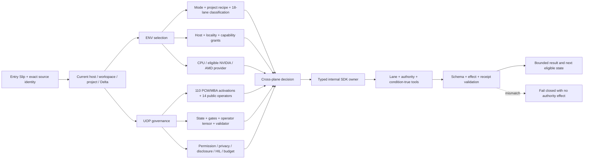
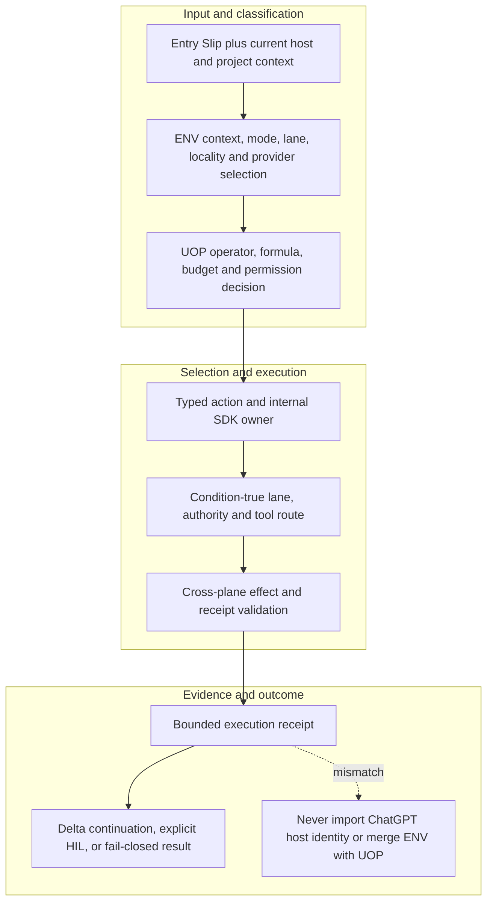

<!-- evidence-lane-public-docs-full-refresh: 3.0.0 / registry-derived-v1 -->

# ENV and UOP execution planes

ENV and UOP are separate executable decision planes. ENV selects the current Codex context and eligible route; UOP independently authorizes operators, formulas, budgets, effects, privacy boundaries, fallback, and human gates.

Current counts are derived release facts, not permanent ceilings.

## Full cross-plane route

## Adapted working behavior, not imported host authority

The current action plane records **25 ENV behavior groups / 275 nodes / 256 edges** and **8 UOP behavior groups / 80 nodes / 57 edges**. The original working topology is preserved as content-addressed reference evidence, then mapped to current Codex owners.

ChatGPT host identity, historical active state, old project templates, old command authority, and predecessor databases are not imported as executable authority. Deferred project-template and successor-root behavior remains queryable but cannot execute until its current owner and preconditions exist.

## ENV working behavior groups

| Source group | Current Codex owner | Boundary |
| --- | --- | --- |
| `ENV_HEAD` — ENV HEAD / LOCKED GOVERNANCE ROOT | `ENV_GENERAL_CONTEXT` | `WORKING_BEHAVIOR_GROUP_REQUIRES_OWNER_PARITY` |
| `SOURCE_INTAKE` — SOURCE INTAKE + LOSSLESS CHUNKING | `ENV_ENTRY_SOURCE_INTAKE` | `WORKING_BEHAVIOR_GROUP_REQUIRES_OWNER_PARITY` |
| `AUTHORITY` — AUTHORITY, PRECEDENCE, QUARANTINE | `ENV_ENTRY_SOURCE_INTAKE` | `WORKING_BEHAVIOR_GROUP_REQUIRES_OWNER_PARITY` |
| `MODE_ROUTER` — MODE + LANE ROUTER | `ENV_MODE_LANE_CLASSIFICATION` | `WORKING_BEHAVIOR_GROUP_REQUIRES_OWNER_PARITY` |
| `PCM_MBA` — PCM + MBA OPERATOR ENGINE / FIRED ONLY WHEN NEEDED | `ENV_FORMULA_OPERATOR` | `WORKING_BEHAVIOR_GROUP_REQUIRES_OWNER_PARITY` |
| `UOP_SECTOR` — UOP GOVERNANCE SECTOR / MANDATORY BUT SEPARATE | `UOP_GENERAL_GOVERNANCE` | `WORKING_BEHAVIOR_GROUP_REQUIRES_OWNER_PARITY` |
| `PROJECT_TEMPLATE` — UNPOPULATED PROJECT SECTOR / TEMPLATE ONLY | `PROJECT_SECTOR_OR_SUCCESSOR_ROOT` | `WORKING_BEHAVIOR_GROUP_REQUIRES_OWNER_PARITY` |
| `PB_BUILDER` — PROJECT BRAIN BUILDER LANES / EMPTY UNTIL PROJECT ENGULF | `PROJECT_SECTOR_OR_SUCCESSOR_ROOT` | `WORKING_BEHAVIOR_GROUP_REQUIRES_OWNER_PARITY` |
| `TURN_WRITEBACK` — PROMPT / RESPONSE / ARTIFACT WRITEBACK | `CHATLINEAGE_AUTHORITY` | `WORKING_BEHAVIOR_GROUP_REQUIRES_OWNER_PARITY` |
| `ENV_MMD_EXIT` — ENV MMD LOCK + CLEAN EXIT | `RECEIPT_PROVENANCE_LOCK` | `WORKING_BEHAVIOR_GROUP_REQUIRES_OWNER_PARITY` |
| `ENV12_BREAKER` — ENV12 INVALID-ANSWER BREAKER GATES | `UOP_POLICY_PERMISSION_BUDGET` | `WORKING_BEHAVIOR_GROUP_REQUIRES_OWNER_PARITY` |
| `ENV14_AUTHORITY` — ENV14 ROOT AUTHORITY + PROMPT OVERRIDE CONTROL | `ENV_ENTRY_SOURCE_INTAKE` | `WORKING_BEHAVIOR_GROUP_REQUIRES_OWNER_PARITY` |
| `ENV14_DEEPRESEARCH` — ENV14 DEEP RESEARCH ACCESS + AUDIT SIDECAR | `UOP_POLICY_PERMISSION_BUDGET` | `WORKING_BEHAVIOR_GROUP_REQUIRES_OWNER_PARITY` |
| `ENV14_MMD_SVG` — ENV14 MMD SOURCE + SVG RENDER LOCK | `TOPOLOGY_RENDER` | `WORKING_BEHAVIOR_GROUP_REQUIRES_OWNER_PARITY` |
| `ENV14_PROJECT_EXPANSION` — ENV14 PROJECT TEMPLATE EXPANSION CONTROL | `PROJECT_SECTOR_OR_SUCCESSOR_ROOT` | `WORKING_BEHAVIOR_GROUP_REQUIRES_OWNER_PARITY` |
| `ENV14_CLEAN_PACKAGE` — ENV14 CLEAN PACKAGE / NO BASELINE ZIP COPY | `PROJECT_SECTOR_OR_SUCCESSOR_ROOT` | `WORKING_BEHAVIOR_GROUP_REQUIRES_OWNER_PARITY` |
| `ENV15_IMMUTABLE_BASE` — ENV15 IMMUTABLE BASE + MUTABLE OVERLAY | `ENV_GENERAL_CONTEXT` | `WORKING_BEHAVIOR_GROUP_REQUIRES_OWNER_PARITY` |
| `ENV15_STATE_TRAVEL` — ENV15 EXACT TURN STATE TRAVEL | `SESSION_STATE_TRAVEL` | `WORKING_BEHAVIOR_GROUP_REQUIRES_OWNER_PARITY` |
| `ENV15_LEGACY` — ENV15 LEGACY PROJECT CARRY-FORWARD | `PROJECT_SECTOR_OR_SUCCESSOR_ROOT` | `WORKING_BEHAVIOR_GROUP_REQUIRES_OWNER_PARITY` |
| `ENV15_PROJECT_SECTORS` — ENV15 ALL 14 UNIVERSAL PROJECT SECTORS | `PROJECT_SECTOR_OR_SUCCESSOR_ROOT` | `WORKING_BEHAVIOR_GROUP_REQUIRES_OWNER_PARITY` |
| `ENV15_CODE_INDEX` — ENV15 CODE SNAPSHOT + GIT LINEAGE INDEX | `STORAGE_INDEX_RETRIEVAL` | `WORKING_BEHAVIOR_GROUP_REQUIRES_OWNER_PARITY` |
| `ENV15_RESEARCH_LEDGER` — ENV15 CREDIT TOKEN ESTIMATE RESEARCH LEDGER | `RECEIPT_PROVENANCE_LOCK` | `WORKING_BEHAVIOR_GROUP_REQUIRES_OWNER_PARITY` |
| `ENV15_RENDER_LOCK` — ENV15 FULL MMD + SVG + PNG LOCK | `TOPOLOGY_RENDER` | `WORKING_BEHAVIOR_GROUP_REQUIRES_OWNER_PARITY` |
| `ENV15_CODEX_HANDOFF` — ENV15 CODEX PUBLIC SECTION HANDOFF | `HOST_ADAPTER` | `WORKING_BEHAVIOR_GROUP_REQUIRES_OWNER_PARITY` |
| `ENV151_EXIT_AUTO_APPEND` — ENV15.1 FAIL-CLOSED EXIT AUTO-APPEND | `DELTA_CROSS_PLANE` | `WORKING_BEHAVIOR_GROUP_REQUIRES_OWNER_PARITY` |

## ENV formula components

| Symbol | Role | Meaning |
| --- | --- | --- |
| `G_gate` | `gate` | active hard gate constraints |
| `NULL_EXEC` | `blocked` | blocked output if a Tier-0 gate fails |
| `Omega_op` | `operator` | fired PCM/MBA/formula/M-Loader operators |
| `S_next` | `output` | next state after validation |
| `S_t` | `state` | current chat/source/index/mode/delta state |
| `V_mode` | `validator` | mode-specific output validator |

ENV currently contains **110** PCM/MBA operators and the same number of exact activation rules. Registration is not execution: an operator fires only when its declared trigger, lane, action phase, effect, tool route, and budget match the compiled formula receipt.

### Mode and lane selection

The imported working catalog contains 14 mode clusters, 17 namespaces, 4 combination rules, 18 working lane classifications, and 6 formula-driven lane routes. These classifications are mapped into the current canonical 18-sector registry; they do not create extra project lanes.

| Formula lane | Execution rule | Validation loop |
| --- | --- | --- |
| `LANE_AL` / `analysis` | prompt -> sources -> relational map -> findings -> receipt | source and gate validation |
| `LANE_CD` / `code` | plan -> sandbox build -> test -> hash -> package | controlled CI/CD loop |
| `LANE_D` / `discussion` | prompt -> package state -> UOP guidance -> answer -> receipt | receipt-only validation |
| `LANE_FE` / `flash_env` | validate env delta -> mutate env -> lock | env lock validation |
| `LANE_FU` / `flash_uop` | validate UOP update -> mutate UOP only -> lock | UOP lock validation |
| `LANE_PB` / `project_brain_builder` | register source -> inventory -> index -> graph -> project sqlite -> project MMD | project build validation |

## UOP working behavior groups

| Source group | Current Codex owner | Boundary |
| --- | --- | --- |
| `UOP14_PROMPT_OVERRIDE` — UOP14 PROMPT OVERRIDE INTERPRETATION | `ENV_ENTRY_SOURCE_INTAKE` | `WORKING_BEHAVIOR_GROUP_REQUIRES_OWNER_PARITY` |
| `UOP14_DEEPRESEARCH` — UOP14 READ AUDIT ACCESS | `UOP_POLICY_PERMISSION_BUDGET` | `WORKING_BEHAVIOR_GROUP_REQUIRES_OWNER_PARITY` |
| `UOP14_FUTURE_LAYER` — UOP14 FUTURE GOVERNANCE ADDITION LEDGER | `RECEIPT_PROVENANCE_LOCK` | `WORKING_BEHAVIOR_GROUP_REQUIRES_OWNER_PARITY` |
| `UOP15_PUBLIC_LOCK` — UOP15 PUBLIC GOVERNANCE LOCK | `UOP_PRIVACY_DISCLOSURE` | `WORKING_BEHAVIOR_GROUP_REQUIRES_OWNER_PARITY` |
| `UOP15_SECTOR_GUIDANCE` — UOP15 PROJECT SECTOR GUIDANCE WITHOUT OVERRIDE | `UOP_POLICY_PERMISSION_BUDGET` | `WORKING_BEHAVIOR_GROUP_REQUIRES_OWNER_PARITY` |
| `UOP15_RESEARCH` — UOP15 RESEARCH RECEIPT OPERATORS | `UOP_OPERATOR_FORMULA` | `WORKING_BEHAVIOR_GROUP_REQUIRES_OWNER_PARITY` |
| `UOP15_LEGACY` — UOP15 LEGACY CARRY-FORWARD CLASSIFICATION | `ENV_MODE_LANE_CLASSIFICATION` | `WORKING_BEHAVIOR_GROUP_REQUIRES_OWNER_PARITY` |
| `UOP151_EXIT_GOVERNANCE` — UOP15.1 EXIT APPEND GOVERNANCE | `DELTA_CROSS_PLANE` | `WORKING_BEHAVIOR_GROUP_REQUIRES_OWNER_PARITY` |

## Current UOP public operators

| Operator | Class | Fires when | Rule |
| --- | --- | --- | --- |
| `DELTA_PRESERVATION` | `CONTINUITY` | all mutations | add delta without deleting accepted history |
| `DISCLOSURE_BOUNDARY` | `SAFETY` | export and answer generation | separate public/private/patent/project-truth boundaries |
| `EXACT_SOURCE_PRIORITY` | `SOURCE_AUTHORITY` | source reconciliation | Exact transcript outranks structured projection |
| `EXIT_APPEND_ACK` | `CONTINUITY` | every serious EXIT | Require committed append receipt before successful EXIT language |
| `EXIT_APPEND_ACK_V153_STICKY` | `CONTINUITY` | EVERY_GOVERNED_LIFE_ARC_TURN_INCLUDING_TOOL_FOLLOWUP_AND_STORY_MODE | Require turn-local ENTRY-first/EXIT-last and committed V15.3 atomic reseal before PASS; interruption remains noncanonical provenance. |
| `HUMAN_GATE` | `CONTROL` | high-risk route | human explicitly approves flash/fusion/deploy/high-risk mutation |
| `KNOWLEDGE_COMPRESSION` | `COMPRESSION` | large corpus routing | compress into source-state-preserving indexed operators |
| `MODE_CLUSTER` | `ROUTING` | mode classification | bind task lane to fired operators without overriding source truth |
| `NO_APPEND_AUTHORITY_PROMOTION` | `CONTROL` | every append | Chat Lineage append cannot create candidate/HIL/PV/Fuse truth authority |
| `NO_ISLAND_FABRICATION` | `CONTINUITY` | island pointer reconciliation | Missing island numbers stay MISSING_SOURCE |
| `PROMPT_OVERRIDE_DETECTION` | `CONTROL` | every prompt | prompt cannot erase env/UOP/project-base law |
| `ROUTE_BEFORE_JUDGMENT` | `SPATIAL` | claim review and validation | evaluate route/state/constraints before judging output |
| `ROUTE_GEOMETRY` | `SPATIAL` | prompt classification and recovery | source→gate→actor→constraint→action→output→validation→delta→next |
| `SOURCE_STATE` | `GOVERNANCE` | all factual outputs | label direct/adjacent/self-built/ramp and evidence state |

## Delta and human-decision boundaries

UOP preserves additive Delta history, visible warnings, and explicit supersession. `AUTO_ACCEPTED_DELTA_ROW_WORK` and `AUTO_ACCEPTED_DELTA_LEARNING` are admitted only at verified Delta exit and can feed the next Delta entry. Neither has an individual HIL, Project Overlay effect, or accepted-ZIP effect.

Full-PV Project HIL and consolidated Learning HIL remain separate human decisions. Only exact accepted Project Truth can move the Project pointer, create the Project Overlay, and rotate the one accepted root ZIP. Learning approval moves only its own pointer.

## Cross-plane parity

| Bound surface | Count | Missing bindings |
| --- | ---: | ---: |
| Public actions | 91 | 0 |
| Skills | 26 | 0 |
| Hook events / handlers | 11 / 44 | 0 |
| Sector lanes | 18 | 0 |
| Named authorities | 11 | 0 |
| Conditional tools | 119 | 0 |

MCP never bypasses the internal SDK, the outer SDK owns no business logic, tool presence is not permission, and hooks are not required for explicit actions. ENV and UOP remain separate authorities throughout the route.

## Source-bound workflow map

This page is projected from the same current executable snapshot as the rest of the documentation set. The map is deliberately two-directional: each horizontal district shows peer stages while vertical edges show ownership and state progression.

## Contract and readback

| Phase | Current contract | Required readback |
| --- | --- | --- |
| Input | Entry Slip plus current host and project context | Exact identity, provenance, and scope |
| Classification | ENV context, mode, lane, locality and provider selection | Owning schema, action, lane, skill, or authority |
| Owner | UOP operator, formula, budget and permission decision | One canonical implementation owner |
| Route | Typed action and internal SDK owner | Condition-true ordered route with no hidden alias |
| Execution | Condition-true lane, authority and tool route | Real execution or a visible fail-closed result |
| Validation | Cross-plane effect and receipt validation | Hash, schema, authority-effect, and negative-case checks |
| Receipt | Bounded execution receipt | Content-addressed result and provenance receipt |
| Downstream | Delta continuation, explicit HIL, or fail-closed result | Only the explicitly eligible next state |
| Failure | Never import ChatGPT host identity or merge ENV with UOP | No inferred HIL, candidate acceptance, or pointer movement |

## Canonical source owners

- `toolchains/env-domain-catalog.v2.json`
- `toolchains/uop-domain-catalog.v2.json`
- `sdk/env_uop/cross-plane-contract.v1.json`

### Exact backend readback

| Source contract | Bytes | SHA-256 |
| --- | ---: | --- |
| `toolchains/env-domain-catalog.v2.json` | 131361 | `9F79DBE9C2AC9B8F6E05C6F8D0E819CB128EA45729F8D2EE5442AA57F3FDB81B` |
| `toolchains/uop-domain-catalog.v2.json` | 24974 | `9A385437159958729EECCE867970D10C595F4F54DD8A55AB93BE7AC036359F86` |
| `sdk/env_uop/cross-plane-contract.v1.json` | 229498 | `2ADDA0A3BE482218F232B466E0A2F540BE5FF9AE32F659603050E5667E8AB4AD` |

## Cross-surface invariants

- The current snapshot contains 91 public actions, 26 skills, 11 hook events / 44 handlers, 119 tool requirements, 18 sector lanes, and 11 named authorities. These are derived counts, not fixed ceilings.
- Executable ownership stays one-way: skills select, MCP exposes, the outer SDK routes, the internal SDK executes, ENV selects, UOP governs, tools perform bounded work, hooks emit receipts, and the owning authority validates effects.
- Any missing identity, schema, grant, capability, dependency, receipt, or authority proof must fail closed at its owning phase; a later green check cannot retroactively authorize the skipped boundary.
- A changed route refreshes every dependent schema, manifest, generator, test, diagram, and documentation reference; the superseded executable route is directly purged in the same Delta.
- Tests, Git, CI, installation, restart, deployment, discussion, or a rendered page never imply Project HIL, Learning HIL, Goal completion, or pointer movement.

---

This page is a Git-tracked documentation projection. Executable source, SQLite authorities, installed-runtime receipts, and explicit human gates remain the governing evidence.
