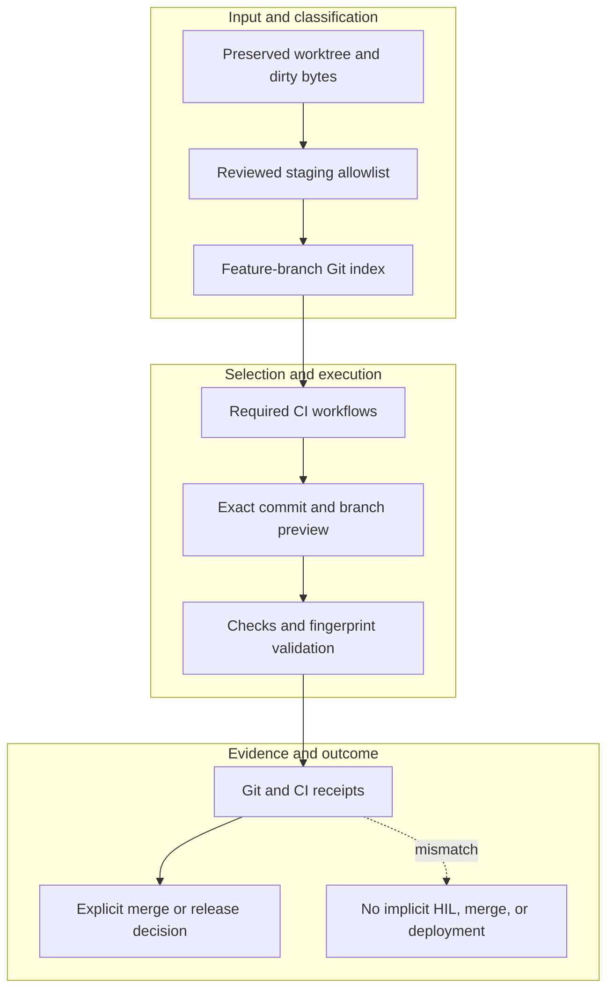

<!-- evidence-lane-public-docs-full-refresh: 3.0.0 / registry-derived-v1 -->

# Git, CI, and merge boundary

All repository delivery originates from the local worktree through the governed Git route. Git evidence never implies Project/PV acceptance or HIL.

Current counts are derived release facts, not permanent ceilings.

1. Preserve the exact dirty/untracked working tree and build a reviewed staging allowlist.
2. Run the required focused gates and Code-mode recursive Boolean correction loop until all applicable gates pass.
3. Run one complete system-wide regression; after it, rerun only affected suites for bounded corrections.
4. Run executable-plugin and full staged-tree fingerprint Refresh so changed and unchanged files receive current receipts.
5. Commit and push the feature branch through the exact GitHub App/local Git route.
6. Make every required GitHub check pass. Skipped checks are valid only when their workflow contract explicitly makes them inapplicable.
7. Merge `main` only after required CI is green and the assigned release authority permits it.
8. Install the exact main package into the main slot and refresh the local slot so local bytes cannot lag the merged release.

No force-push, protected-branch rewrite, implicit merge, secret output, candidate acceptance, Fuse, production publication, or pointer movement is authorized by this workflow.

## Source-bound workflow map

This page is projected from the same current executable snapshot as the rest of the documentation set. The map is deliberately two-directional: each horizontal district shows peer stages while vertical edges show ownership and state progression.

## Contract and readback

| Phase | Current contract | Required readback |
| --- | --- | --- |
| Input | Preserved worktree and dirty bytes | Exact identity, provenance, and scope |
| Classification | Reviewed staging allowlist | Owning schema, action, lane, skill, or authority |
| Owner | Feature-branch Git index | One canonical implementation owner |
| Route | Required CI workflows | Condition-true ordered route with no hidden alias |
| Execution | Exact commit and branch preview | Real execution or a visible fail-closed result |
| Validation | Checks and fingerprint validation | Hash, schema, authority-effect, and negative-case checks |
| Receipt | Git and CI receipts | Content-addressed result and provenance receipt |
| Downstream | Explicit merge or release decision | Only the explicitly eligible next state |
| Failure | No implicit HIL, merge, or deployment | No inferred HIL, candidate acceptance, or pointer movement |

## Canonical source owners

- `schemas/github-app-manifest.schema.json`
- `src/evidence_lane_plugin/remote_git.py`
- `scripts/codex_release/push_github_app_exact_commit.py`

### Exact backend readback

| Source contract | Bytes | SHA-256 |
| --- | ---: | --- |
| `schemas/github-app-manifest.schema.json` | 1614 | `1DBE95B64B74C60AB78E5F752EB1E144F144D96C32D06F545F2093BB6AC93FC2` |
| `src/evidence_lane_plugin/remote_git.py` | 13448 | `5146955FB1FC17239F941EFC9DF244F236886291428A5CAE54C4D8119A748D8C` |
| `scripts/codex_release/push_github_app_exact_commit.py` | 15059 | `E4EAA56A1F4004253A36108CC7EB74F8071A6F211A456E830F425A0055B3E1B4` |

## Cross-surface invariants

- The current snapshot contains 91 public actions, 26 skills, 11 hook events / 44 handlers, 119 tool requirements, 18 sector lanes, and 11 named authorities. These are derived counts, not fixed ceilings.
- Executable ownership stays one-way: skills select, MCP exposes, the outer SDK routes, the internal SDK executes, ENV selects, UOP governs, tools perform bounded work, hooks emit receipts, and the owning authority validates effects.
- Any missing identity, schema, grant, capability, dependency, receipt, or authority proof must fail closed at its owning phase; a later green check cannot retroactively authorize the skipped boundary.
- A changed route refreshes every dependent schema, manifest, generator, test, diagram, and documentation reference; the superseded executable route is directly purged in the same Delta.
- Tests, Git, CI, installation, restart, deployment, discussion, or a rendered page never imply Project HIL, Learning HIL, Goal completion, or pointer movement.

---

This page is a Git-tracked documentation projection. Executable source, SQLite authorities, installed-runtime receipts, and explicit human gates remain the governing evidence.
