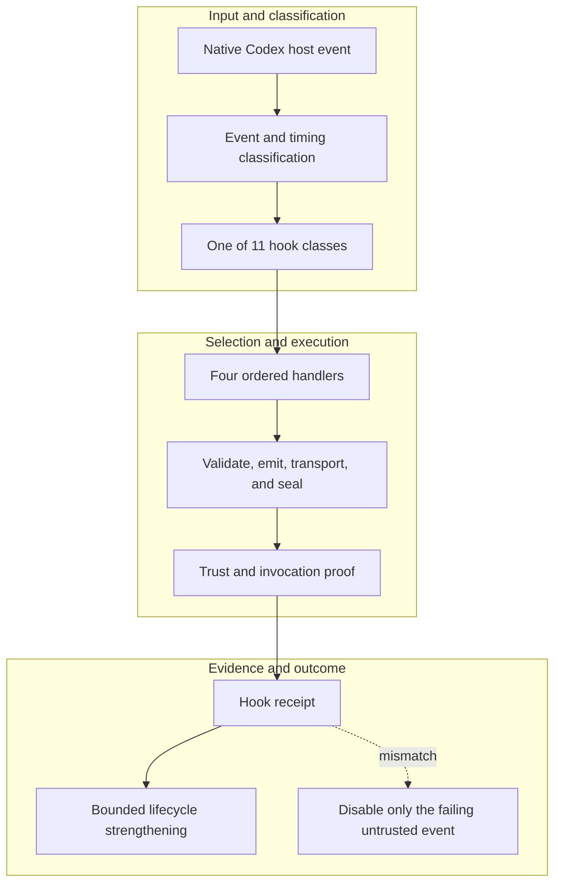

<!-- evidence-lane-public-docs-full-refresh: 3.0.0 / registry-derived-v1 -->

# Lifecycle hook events

Hooks are ordered host-event adapters. They improve capture and continuity but do not own business logic, HIL, completion, or pointer movement.

Current counts are derived release facts, not permanent ceilings.

| Event | Order | Handlers |
| --- | ---: | ---: |
| `SessionStart` | 1 | 4 |
| `SubagentStart` | 2 | 4 |
| `UserPromptSubmit` | 3 | 4 |
| `PreToolUse` | 4 | 4 |
| `PermissionRequest` | 5 | 4 |
| `PostToolUse` | 6 | 4 |
| `PreCompact` | 7 | 4 |
| `PostCompact` | 8 | 4 |
| `SubagentStop` | 9 | 4 |
| `Stop` | 10 | 4 |
| `SessionEnd` | 11 | 4 |

The current registry contains 11 event classes and 44 ordered handlers. Explicit skills and native actions remain available when hooks are disabled for repair. An event runs only when the host emits it, and a failing event can be isolated without granting unrelated hooks authority.

## Source-bound workflow map

This page is projected from the same current executable snapshot as the rest of the documentation set. The map is deliberately two-directional: each horizontal district shows peer stages while vertical edges show ownership and state progression.

## Contract and readback

| Phase | Current contract | Required readback |
| --- | --- | --- |
| Input | Native Codex host event | Exact identity, provenance, and scope |
| Classification | Event and timing classification | Owning schema, action, lane, skill, or authority |
| Owner | One of 11 hook classes | One canonical implementation owner |
| Route | Four ordered handlers | Condition-true ordered route with no hidden alias |
| Execution | Validate, emit, transport, and seal | Real execution or a visible fail-closed result |
| Validation | Trust and invocation proof | Hash, schema, authority-effect, and negative-case checks |
| Receipt | Hook receipt | Content-addressed result and provenance receipt |
| Downstream | Bounded lifecycle strengthening | Only the explicitly eligible next state |
| Failure | Disable only the failing untrusted event | No inferred HIL, candidate acceptance, or pointer movement |

## Canonical source owners

- `hooks/hook-event-registry.v1.json`
- `hooks/hooks.json`
- `schemas/hooks/hook-runtime.v1.json`

### Exact backend readback

| Source contract | Bytes | SHA-256 |
| --- | ---: | --- |
| `hooks/hook-event-registry.v1.json` | 8476 | `67DDC5EBD44F858D53C207F773C2893CC0C79D5AD64A87CE2F2A41B2B29E7549` |
| `hooks/hooks.json` | 18829 | `C37DB05DD4701087EAD0BD31203C843AAFA79ED39A081F2E9DFF313A77631EEF` |
| `schemas/hooks/hook-runtime.v1.json` | 18435 | `1D6F173942EB94C6E26FB3E50628001B4854391FC9B72BE15528A998FEFE6F34` |

## Cross-surface invariants

- The current snapshot contains 91 public actions, 26 skills, 11 hook events / 44 handlers, 119 tool requirements, 18 sector lanes, and 11 named authorities. These are derived counts, not fixed ceilings.
- Executable ownership stays one-way: skills select, MCP exposes, the outer SDK routes, the internal SDK executes, ENV selects, UOP governs, tools perform bounded work, hooks emit receipts, and the owning authority validates effects.
- Any missing identity, schema, grant, capability, dependency, receipt, or authority proof must fail closed at its owning phase; a later green check cannot retroactively authorize the skipped boundary.
- A changed route refreshes every dependent schema, manifest, generator, test, diagram, and documentation reference; the superseded executable route is directly purged in the same Delta.
- Tests, Git, CI, installation, restart, deployment, discussion, or a rendered page never imply Project HIL, Learning HIL, Goal completion, or pointer movement.

---

This page is a Git-tracked documentation projection. Executable source, SQLite authorities, installed-runtime receipts, and explicit human gates remain the governing evidence.
