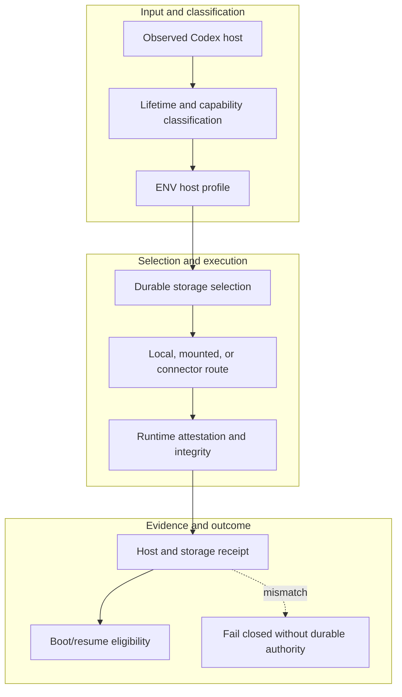

<!-- evidence-lane-public-docs-full-refresh: 3.0.0 / registry-derived-v1 -->

# Host and storage matrix

Host profile, lifetime, storage durability, model, reasoning effort, account tier, and transport are separate axes. None changes HIL law.

Current counts are derived release facts, not permanent ceilings.

| Host profile | Durable project authority | Transport |
| --- | --- | --- |
| `CODEX_DESKTOP_STABLE`, persistent local host | Project-scoped local SQLite | Stable app-channel task/runtime binding; native/local route; tunnel only for a proven gap |
| `CODEX_DESKTOP_BETA`, persistent local host | Project-scoped local SQLite | Beta app-channel task/runtime binding; native/local route; tunnel only for a proven gap |
| Codex CLI, persistent local host | Project-scoped local SQLite | Native/local route or version-bound tunnel |
| Persistent Codex VM | Mounted/local durable SQLite | Direct transport when available |
| Ephemeral Codex VM with durable mount | Mounted SQLite | Exact VM-lifetime route |
| Ephemeral Codex VM without durable mount | Explicit transactional connector | Fail closed without durable storage |

Stable and Beta are separate Codex Desktop host identities. Installation, restart preparation, task reattachment, and runtime attestation bind the exact selected channel; neither channel may borrow the other's task or runtime proof. The broader current host plane is Codex Desktop Stable, Codex Desktop Beta, Codex CLI, and Codex VM. ChatGPT and external model-agent planes are not mixed into this package. A caller-supplied PID, title, CWD, or host ID is not runtime attestation.

The maintainer release registry exposes exactly two selectors: the verified Git-main stable slot and the versioned local-testing slot. Selector identity is a locator, not Project/PV, Plan, Goal, HIL, or runtime attestation.

A storage connector owns persistence only for its explicit grant. It never becomes Project Truth, Plan, Goal, HIL, or MCP authority. Secrets remain in the host secret provider and are referenced by opaque handles only.

## Source-bound workflow map

This page is projected from the same current executable snapshot as the rest of the documentation set. The map is deliberately two-directional: each horizontal district shows peer stages while vertical edges show ownership and state progression.

## Contract and readback

| Phase | Current contract | Required readback |
| --- | --- | --- |
| Input | Observed Codex host | Exact identity, provenance, and scope |
| Classification | Lifetime and capability classification | Owning schema, action, lane, skill, or authority |
| Owner | ENV host profile | One canonical implementation owner |
| Route | Durable storage selection | Condition-true ordered route with no hidden alias |
| Execution | Local, mounted, or connector route | Real execution or a visible fail-closed result |
| Validation | Runtime attestation and integrity | Hash, schema, authority-effect, and negative-case checks |
| Receipt | Host and storage receipt | Content-addressed result and provenance receipt |
| Downstream | Boot/resume eligibility | Only the explicitly eligible next state |
| Failure | Fail closed without durable authority | No inferred HIL, candidate acceptance, or pointer movement |

## Canonical source owners

- `env/authority-manifest.v1.json`
- `schemas/install/local-install.v1.json`
- `src/evidence_lane_plugin/storage_selection.py`

### Exact backend readback

| Source contract | Bytes | SHA-256 |
| --- | ---: | --- |
| `env/authority-manifest.v1.json` | 1801 | `5CE9C8D4469FC25AB541964EA5EC6D24C8DE3AB118A4C57FE54FFC8475CC6263` |
| `schemas/install/local-install.v1.json` | 715 | `EECE0A620DA2BF17E0F79ECFC0099C2854F838F0B1BF45B62568C3DFDA233C11` |
| `src/evidence_lane_plugin/storage_selection.py` | 8948 | `72B03657EDC1822E6B3A2059A04D2A170EAE3E228280927CB566EE6828B05910` |

## Cross-surface invariants

- The current snapshot contains 91 public actions, 26 skills, 11 hook events / 44 handlers, 119 tool requirements, 18 sector lanes, and 11 named authorities. These are derived counts, not fixed ceilings.
- Executable ownership stays one-way: skills select, MCP exposes, the outer SDK routes, the internal SDK executes, ENV selects, UOP governs, tools perform bounded work, hooks emit receipts, and the owning authority validates effects.
- Any missing identity, schema, grant, capability, dependency, receipt, or authority proof must fail closed at its owning phase; a later green check cannot retroactively authorize the skipped boundary.
- A changed route refreshes every dependent schema, manifest, generator, test, diagram, and documentation reference; the superseded executable route is directly purged in the same Delta.
- Tests, Git, CI, installation, restart, deployment, discussion, or a rendered page never imply Project HIL, Learning HIL, Goal completion, or pointer movement.

---

This page is a Git-tracked documentation projection. Executable source, SQLite authorities, installed-runtime receipts, and explicit human gates remain the governing evidence.
