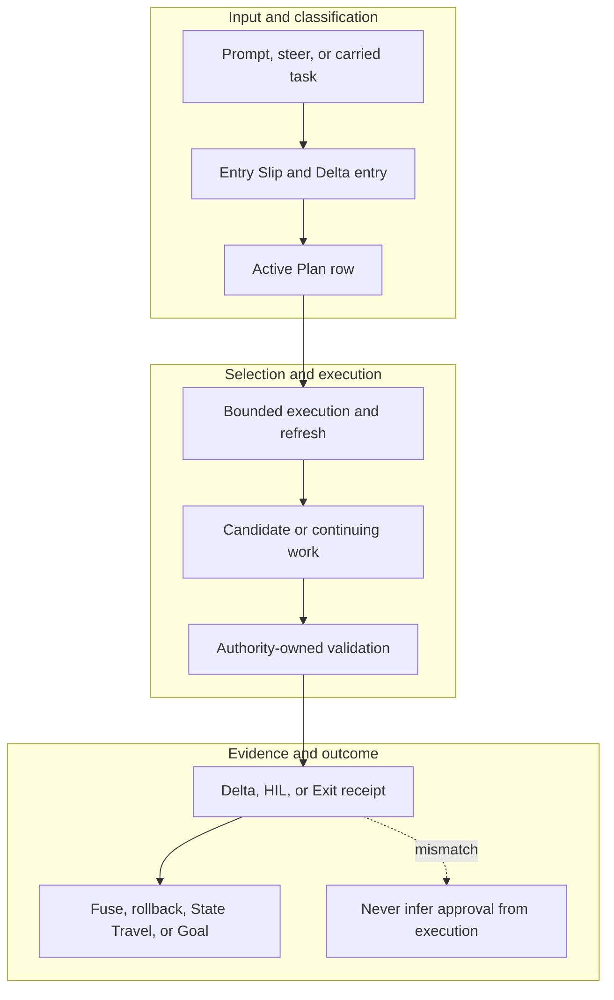

<!-- evidence-lane-public-docs-full-refresh: 3.0.0 / registry-derived-v1 -->

# Lifecycle, Delta flow, and human gates

Evidence Lane separates entry classification, bounded work, continuing-work refresh, full-PV proposals, authority-owned human decisions, pointer movement, State Travel, and Goal completion.

Current counts are derived release facts, not permanent ceilings.

## Turn and Delta flow

```text
Prompt or steer
    -> Entry Slip
    -> Source Intake / project recipe / Mode
    -> typed action and owning authority
    -> ENV selection
    -> UOP operators, formulas and gates
    -> condition-true tools and transport
    -> validate result and authority effects
    -> adaptive Delta-exit append for continuing work
```

Entry Slip is emitted for every prompt or steer. Adaptive Delta-exit append is not an Exit Slip. Exit Slip is emitted only when State Travel completes or the Goal is explicitly completed through option 2.

## Project and Learning HIL

Build and full-PV Refresh can seal an immutable unaccepted proposal. Project HIL and Learning HIL are separate pending decisions. Plan acceptance, natural language, tests, Git, CI, packaging, installation, restart, deployment, or a website preview cannot satisfy either gate.

Exact Fuse may move the accepted Project pointer only after the current Project decision contract passes. Learning acceptance moves only its separate Learning pointer. Ordinary Delta refresh never creates or promotes Project Overlay.

## Canon Input HIL

Canon input is receiver-owned and uses the exact current contract for ACCEPT, REJECT, or MORE_RESEARCH. It admits or rejects bounded task input only; it cannot decide Project HIL, Learning HIL, Goal completion, or pointer movement.

## Rollback

Logical rollback moves an accepted pointer among immutable accepted PVs under its exact gate. Hard ZIP restore is a separate explicit recovery operation.

## State Travel

State Travel resumes exact unfinished work in a fresh task after task, workspace/worktree, dirty-byte, source, runtime, Plan/Goal, accepted-pointer, and continuity bindings pass. It does not restart the app, reconstruct the Plan from chat, replay HIL, or infer identity from a title, CWD, PID, or successful test.

## Goal completion

Goal completion is human-owned and independent of every HIL. Only the explicit Goal completion path can close it. Completion authorizes no Project acceptance, pointer movement, Git action, installation, merge, or deployment.

## Source-bound workflow map

This page is projected from the same current executable snapshot as the rest of the documentation set. The map is deliberately two-directional: each horizontal district shows peer stages while vertical edges show ownership and state progression.



## Contract and readback

| Phase | Current contract | Required readback |
| --- | --- | --- |
| Input | Prompt, steer, or carried task | Exact identity, provenance, and scope |
| Classification | Entry Slip and Delta entry | Owning schema, action, lane, skill, or authority |
| Owner | Active Plan row | One canonical implementation owner |
| Route | Bounded execution and refresh | Condition-true ordered route with no hidden alias |
| Execution | Candidate or continuing work | Real execution or a visible fail-closed result |
| Validation | Authority-owned validation | Hash, schema, authority-effect, and negative-case checks |
| Receipt | Delta, HIL, or Exit receipt | Content-addressed result and provenance receipt |
| Downstream | Fuse, rollback, State Travel, or Goal | Only the explicitly eligible next state |
| Failure | Never infer approval from execution | No inferred HIL, candidate acceptance, or pointer movement |

## Canonical source owners

- `schemas/lifecycle/runtime-workflow-registry.v1.json`
- `skills/evidence-lane-code-lifecycle/SKILL.md`
- `schemas/fuse/dual-hil-fuse.v1.json`

## Cross-surface invariants

- The current snapshot contains 91 public actions, 26 skills, 11 hook events / 44 handlers, 119 tool requirements, 18 sector lanes, and 11 named authorities. These are derived counts, not fixed ceilings.
- Executable ownership stays one-way: skills select, MCP exposes, the outer SDK routes, the internal SDK executes, ENV selects, UOP governs, tools perform bounded work, hooks emit receipts, and the owning authority validates effects.
- Any missing identity, schema, grant, capability, dependency, receipt, or authority proof must fail closed at its owning phase; a later green check cannot retroactively authorize the skipped boundary.
- A changed route refreshes every dependent schema, manifest, generator, test, diagram, and documentation reference; the superseded executable route is directly purged in the same Delta.
- Tests, Git, CI, installation, restart, deployment, discussion, or a rendered page never imply Project HIL, Learning HIL, Goal completion, or pointer movement.

---

This page is a Git-tracked documentation projection. Executable source, SQLite authorities, installed-runtime receipts, and explicit human gates remain the governing evidence.
