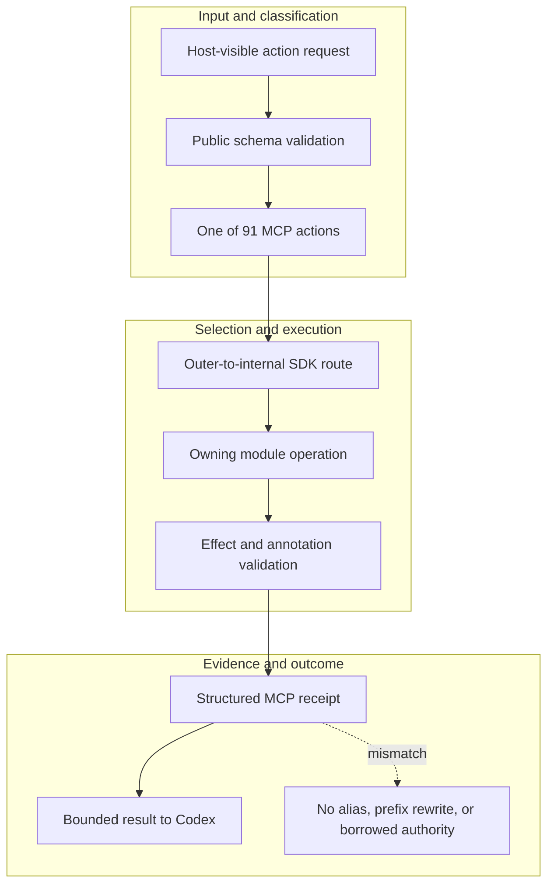

<!-- evidence-lane-public-docs-full-refresh: 3.0.0 / registry-derived-v1 -->

# Native MCP and outer routing

Evidence Lane exposes one package-local native MCP identity and pairs every public action one-for-one with its schema, internal SDK route, outer binding, skill workflow, authority effects, conditional tools, hooks, and receipt contract.

Current counts are derived release facts, not permanent ceilings.

| Surface | Current value |
| --- | ---: |
| Canonical actions | 91 |
| Read-only | 30 |
| Write-capable | 61 |
| SDK action bindings | 91 |
| MCP action bindings | 91 |

The 30-row `SPECIALIZED_NATIVE_ACTIONS` tuple is only the specialized Canon/Learning/Memory/first-class subset (9 reads and 21 writes). It is not the canonical action total.

## Routing law

- FastMCP is preferred when the exact action and host support that composition route.
- Native or domain MCP servers are conditional transports for their declared scope.
- The outer SDK selects local versus transport routing; the internal SDK owns execution.
- One project-neutral tunnel may bridge a proven host tool gap; it is not the catalog, scheduler, project registry, or lifecycle owner.
- Missing capability, grant, credential, locality, version, or schema proof fails visibly. No prefix rewrite or hidden alias revives a removed action.
- Public visibility is capability discovery, never permission, HIL, or acceptance.

## Agent boundary

Codex is the sole acting agent. OpenAI Agents SDK is a subordinate typed function-tool and MCP client library; it has zero independent action, lane, Plan, Goal, HIL, memory, or project authority. External model-agent planes are not part of this plugin.

## Source-bound workflow map

This page is projected from the same current executable snapshot as the rest of the documentation set. The map is deliberately two-directional: each horizontal district shows peer stages while vertical edges show ownership and state progression.

## Contract and readback

| Phase | Current contract | Required readback |
| --- | --- | --- |
| Input | Host-visible action request | Exact identity, provenance, and scope |
| Classification | Public schema validation | Owning schema, action, lane, skill, or authority |
| Owner | One of 91 MCP actions | One canonical implementation owner |
| Route | Outer-to-internal SDK route | Condition-true ordered route with no hidden alias |
| Execution | Owning module operation | Real execution or a visible fail-closed result |
| Validation | Effect and annotation validation | Hash, schema, authority-effect, and negative-case checks |
| Receipt | Structured MCP receipt | Content-addressed result and provenance receipt |
| Downstream | Bounded result to Codex | Only the explicitly eligible next state |
| Failure | No alias, prefix rewrite, or borrowed authority | No inferred HIL, candidate acceptance, or pointer movement |

## Canonical source owners

- `mcp/mcp-manifest.v1.json`
- `schemas/public-action-schemas.v001.json`
- `sdk/sdk-manifest.v1.json`

### Exact backend readback

| Source contract | Bytes | SHA-256 |
| --- | ---: | --- |
| `mcp/mcp-manifest.v1.json` | 7258 | `2A698E5E2295E1059EC363A27B5BC91002BADB1C7CAE1A1B7B32CA0FE8C85885` |
| `schemas/public-action-schemas.v001.json` | 360281 | `78BCC5C9797ECBCE3B5DAA5FCFC7B5E83E35315A912EDB5C34E7354CE4D68CED` |
| `sdk/sdk-manifest.v1.json` | 76239 | `79276732E6406D68C6EA78738FE0AE80E00D644285AF95D9D7AC3F64E7BF99E4` |

## Cross-surface invariants

- The current snapshot contains 91 public actions, 26 skills, 11 hook events / 44 handlers, 119 tool requirements, 18 sector lanes, and 11 named authorities. These are derived counts, not fixed ceilings.
- Executable ownership stays one-way: skills select, MCP exposes, the outer SDK routes, the internal SDK executes, ENV selects, UOP governs, tools perform bounded work, hooks emit receipts, and the owning authority validates effects.
- Any missing identity, schema, grant, capability, dependency, receipt, or authority proof must fail closed at its owning phase; a later green check cannot retroactively authorize the skipped boundary.
- A changed route refreshes every dependent schema, manifest, generator, test, diagram, and documentation reference; the superseded executable route is directly purged in the same Delta.
- Tests, Git, CI, installation, restart, deployment, discussion, or a rendered page never imply Project HIL, Learning HIL, Goal completion, or pointer movement.

---

This page is a Git-tracked documentation projection. Executable source, SQLite authorities, installed-runtime receipts, and explicit human gates remain the governing evidence.
