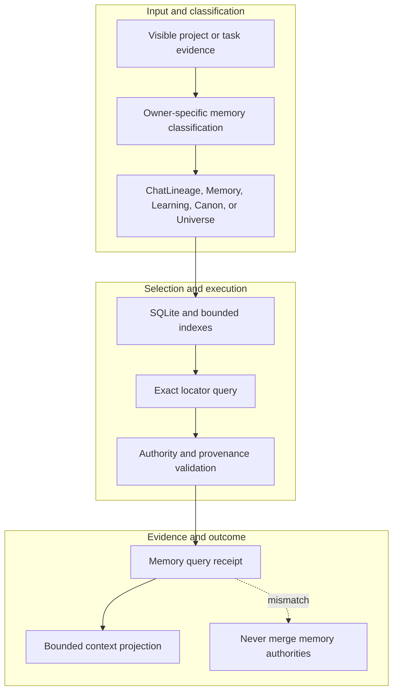

<!-- evidence-lane-public-docs-full-refresh: 3.0.0 / registry-derived-v1 -->

# Memory and knowledge boundaries

Evidence Lane uses several owner-specific memory surfaces. They cooperate through typed locators and receipts without becoming one generic agent memory.

Current counts are derived release facts, not permanent ceilings.

| Surface | Retention and role |
| --- | --- |
| Current prompt/steer | Short-lived input classified by Entry Slip and Source Intake |
| ChatLineage | Visible task prompts, responses, steers, events, and entry/exit boundaries |
| Project Memory | Durable bounded locators and relationships across project authorities |
| Agent Learning | Accepted reusable lessons under separate Learning HIL |
| Canon | Typed cross-task contracts, messages, and result continuity |
| Project Universe | Per-project relationship graph |
| Instructions | AGENTS.md and host MEMORY.md chain, nonauthoritative to Project Truth |

SQLite/FTS5/BM25 remains the durable bounded retrieval authority. Optional local semantic indexes can rank candidates but cannot replace canonical IDs or owning SQLite. Raw project databases, whole Markdown histories, or full chat archives are not dumped into model context.

PreCompact seals the active continuity boundary; PostCompact rehydrates the same bounded Plan/Goal/task/source coordinates. Compaction is not a new PV, decision, or Goal.

## Source-bound workflow map

This page is projected from the same current executable snapshot as the rest of the documentation set. The map is deliberately two-directional: each horizontal district shows peer stages while vertical edges show ownership and state progression.

## Contract and readback

| Phase | Current contract | Required readback |
| --- | --- | --- |
| Input | Visible project or task evidence | Exact identity, provenance, and scope |
| Classification | Owner-specific memory classification | Owning schema, action, lane, skill, or authority |
| Owner | ChatLineage, Memory, Learning, Canon, or Universe | One canonical implementation owner |
| Route | SQLite and bounded indexes | Condition-true ordered route with no hidden alias |
| Execution | Exact locator query | Real execution or a visible fail-closed result |
| Validation | Authority and provenance validation | Hash, schema, authority-effect, and negative-case checks |
| Receipt | Memory query receipt | Content-addressed result and provenance receipt |
| Downstream | Bounded context projection | Only the explicitly eligible next state |
| Failure | Never merge memory authorities | No inferred HIL, candidate acceptance, or pointer movement |

## Canonical source owners

- `authorities/project_memory/manifest.v1.json`
- `schemas/memory/project-memory.v1.sql`
- `skills/evi-memory/SKILL.md`

### Exact backend readback

| Source contract | Bytes | SHA-256 |
| --- | ---: | --- |
| `authorities/project_memory/manifest.v1.json` | 10717 | `B3844798A16FBF9E560768F851FF3007FED8495553113A81435447B94B464026` |
| `schemas/memory/project-memory.v1.sql` | 3281 | `4622D826BA67B21589255EB58211FA954C51AA4148FACCFEC2B498F0C491C17B` |
| `skills/evi-memory/SKILL.md` | 2153 | `6617AD64BDA4ABF6E4FA5EB62EAA614D5C609DF1332101420F32233181E7DC09` |

## Cross-surface invariants

- The current snapshot contains 91 public actions, 26 skills, 11 hook events / 44 handlers, 119 tool requirements, 18 sector lanes, and 11 named authorities. These are derived counts, not fixed ceilings.
- Executable ownership stays one-way: skills select, MCP exposes, the outer SDK routes, the internal SDK executes, ENV selects, UOP governs, tools perform bounded work, hooks emit receipts, and the owning authority validates effects.
- Any missing identity, schema, grant, capability, dependency, receipt, or authority proof must fail closed at its owning phase; a later green check cannot retroactively authorize the skipped boundary.
- A changed route refreshes every dependent schema, manifest, generator, test, diagram, and documentation reference; the superseded executable route is directly purged in the same Delta.
- Tests, Git, CI, installation, restart, deployment, discussion, or a rendered page never imply Project HIL, Learning HIL, Goal completion, or pointer movement.

---

This page is a Git-tracked documentation projection. Executable source, SQLite authorities, installed-runtime receipts, and explicit human gates remain the governing evidence.
