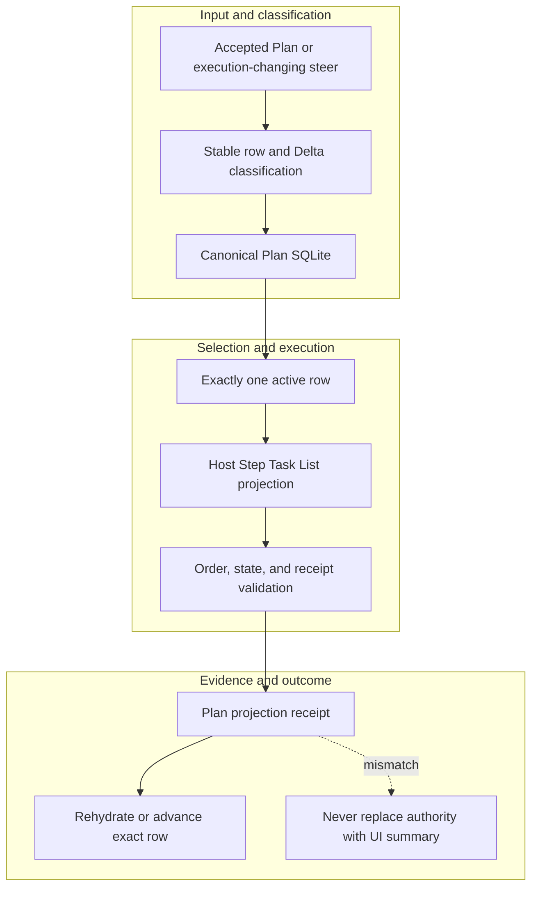

<!-- evidence-lane-public-docs-full-refresh: 3.0.0 / registry-derived-v1 -->

# Plan, Goal, Delta, and host task display

The canonical Plan is durable SQLite authority. Host Plan/Goal/task UI is a bounded projection and can be rehydrated without rewriting canonical rows.

Current counts are derived release facts, not permanent ceilings.

## Canonical authority

The Plan ledger owns row identity, order, status, dependencies, steers, Deltas, HIL boundaries, and physically final work. Exactly one executable row is active. Completed, dropped, corrected, and superseded records remain queryable history.

## Host projection

The normal plugin projection is a bounded header plus current executable window; its size is a presentation contract, not the Plan's total size. A temporary maintainer task list can remain authoritative through a release workflow when explicitly locked by the user. Panel loss, restart, compaction, or State Travel triggers rehydration from the same Plan identity rather than a duplicate fallback list.

## Steering and Delta law

A steer appends or explicitly reorders/supersedes work. Every Delta implements the current route and directly purges the executable/schema/generated/test/doc references it replaces. Git appears only on the row where Git actually runs.

Goal completion is a separate explicit human action. Plan completion, HIL, tests, automation, pauses, and task transitions cannot complete the Goal.

## Source-bound workflow map

This page is projected from the same current executable snapshot as the rest of the documentation set. The map is deliberately two-directional: each horizontal district shows peer stages while vertical edges show ownership and state progression.

## Contract and readback

| Phase | Current contract | Required readback |
| --- | --- | --- |
| Input | Accepted Plan or execution-changing steer | Exact identity, provenance, and scope |
| Classification | Stable row and Delta classification | Owning schema, action, lane, skill, or authority |
| Owner | Canonical Plan SQLite | One canonical implementation owner |
| Route | Exactly one active row | Condition-true ordered route with no hidden alias |
| Execution | Host Step Task List projection | Real execution or a visible fail-closed result |
| Validation | Order, state, and receipt validation | Hash, schema, authority-effect, and negative-case checks |
| Receipt | Plan projection receipt | Content-addressed result and provenance receipt |
| Downstream | Rehydrate or advance exact row | Only the explicitly eligible next state |
| Failure | Never replace authority with UI summary | No inferred HIL, candidate acceptance, or pointer movement |

## Canonical source owners

- `schemas/plan/project-bootstrap.v1.json`
- `src/evidence_lane_plugin/plan_runtime.py`
- `skills/evi-plan/SKILL.md`

## Cross-surface invariants

- The current snapshot contains 91 public actions, 26 skills, 11 hook events / 44 handlers, 119 tool requirements, 18 sector lanes, and 11 named authorities. These are derived counts, not fixed ceilings.
- Executable ownership stays one-way: skills select, MCP exposes, the outer SDK routes, the internal SDK executes, ENV selects, UOP governs, tools perform bounded work, hooks emit receipts, and the owning authority validates effects.
- Any missing identity, schema, grant, capability, dependency, receipt, or authority proof must fail closed at its owning phase; a later green check cannot retroactively authorize the skipped boundary.
- A changed route refreshes every dependent schema, manifest, generator, test, diagram, and documentation reference; the superseded executable route is directly purged in the same Delta.
- Tests, Git, CI, installation, restart, deployment, discussion, or a rendered page never imply Project HIL, Learning HIL, Goal completion, or pointer movement.

---

This page is a Git-tracked documentation projection. Executable source, SQLite authorities, installed-runtime receipts, and explicit human gates remain the governing evidence.
