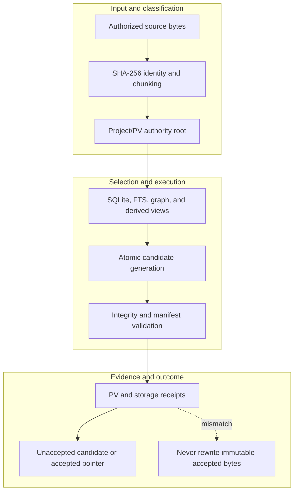

<!-- evidence-lane-public-docs-full-refresh: 3.0.0 / registry-derived-v1 -->

# Project/PV content-addressed storage

A user-selected Project/PV root is the durable project baseline. It keeps accepted versions, proposals, authorities, sectors, pointers, and receipts physically separate from the installed plugin runtime and task workspace.

Current counts are derived release facts, not permanent ceilings.

Exact source and chunk bytes are stored once by SHA-256 and reused across refreshes. SQLite remains canonical; MMD/DOT, vector indexes, renderings, and summaries are derived traversal/query surfaces. Atomic generation swap occurs only after schema, foreign-key, integrity, hash, and tool receipts pass.

## Sub-PV work versus full Project Version

Each verified ordinary Delta seals one auto-accepted sub-PV row-work receipt. The next Delta can reuse that predecessor without moving the immutable full-PV pointer. A sub-PV has no individual HIL, Project Overlay, or accepted-ZIP rotation.

A full Project Version is immutable. The accepted pointer moves only through its governed Project decision. An unaccepted full-PV candidate and its HIL-only Project Overlay remain outside accepted truth. Only exact accepted Project Truth creates or rotates the one deterministic accepted root ZIP and the accepted Project Overlay. The ZIP is post-approval snapshot storage; normal entry, query, Learning, and State Travel routes never open it.

Logical rollback moves the accepted pointer among immutable accepted versions; it does not rewrite historical PV bytes. Hard ZIP restore is a separate explicit recovery route with its own confirmation and validation.

Project registration records the hidden plugin runtime/control root, the external Project/PV root, and the task workspace as distinct identities. ENV/UOP remains hidden runtime state and is not copied into every project folder.

## Source-bound workflow map

This page is projected from the same current executable snapshot as the rest of the documentation set. The map is deliberately two-directional: each horizontal district shows peer stages while vertical edges show ownership and state progression.

## Contract and readback

| Phase | Current contract | Required readback |
| --- | --- | --- |
| Input | Authorized source bytes | Exact identity, provenance, and scope |
| Classification | SHA-256 identity and chunking | Owning schema, action, lane, skill, or authority |
| Owner | Project/PV authority root | One canonical implementation owner |
| Route | SQLite, FTS, graph, and derived views | Condition-true ordered route with no hidden alias |
| Execution | Atomic candidate generation | Real execution or a visible fail-closed result |
| Validation | Integrity and manifest validation | Hash, schema, authority-effect, and negative-case checks |
| Receipt | PV and storage receipts | Content-addressed result and provenance receipt |
| Downstream | Unaccepted candidate or accepted pointer | Only the explicitly eligible next state |
| Failure | Never rewrite immutable accepted bytes | No inferred HIL, candidate acceptance, or pointer movement |

## Canonical source owners

- `schemas/lane-artifact-contract.v001.json`
- `src/evidence_lane_plugin/store.py`
- `src/evidence_lane_plugin/project_overlay.py`

### Exact backend readback

| Source contract | Bytes | SHA-256 |
| --- | ---: | --- |
| `schemas/lane-artifact-contract.v001.json` | 5937 | `453CA9E6E2CFEFC9944FAC3F2969B638BD1E5A7DDD00484D5B3565374EFB6FC2` |
| `src/evidence_lane_plugin/store.py` | 419069 | `FBAA8E89943A49639290C405313734BD08315742E0C79E3C9AFD780E850AA2D0` |
| `src/evidence_lane_plugin/project_overlay.py` | 54320 | `F9C2D4D6339DEA0EC413A28F16F03AB8D99CF083F796B5B73815974490EAEF86` |

## Cross-surface invariants

- The current snapshot contains 91 public actions, 26 skills, 11 hook events / 44 handlers, 119 tool requirements, 18 sector lanes, and 11 named authorities. These are derived counts, not fixed ceilings.
- Executable ownership stays one-way: skills select, MCP exposes, the outer SDK routes, the internal SDK executes, ENV selects, UOP governs, tools perform bounded work, hooks emit receipts, and the owning authority validates effects.
- Any missing identity, schema, grant, capability, dependency, receipt, or authority proof must fail closed at its owning phase; a later green check cannot retroactively authorize the skipped boundary.
- A changed route refreshes every dependent schema, manifest, generator, test, diagram, and documentation reference; the superseded executable route is directly purged in the same Delta.
- Tests, Git, CI, installation, restart, deployment, discussion, or a rendered page never imply Project HIL, Learning HIL, Goal completion, or pointer movement.

---

This page is a Git-tracked documentation projection. Executable source, SQLite authorities, installed-runtime receipts, and explicit human gates remain the governing evidence.
