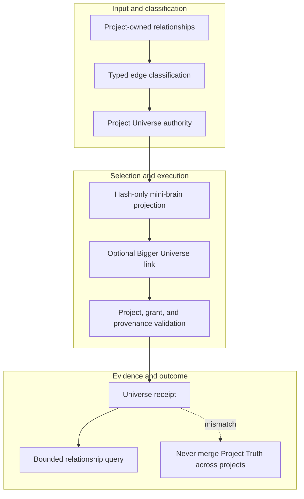

<!-- evidence-lane-public-docs-full-refresh: 3.0.0 / registry-derived-v1 -->

# Project Universe and Bigger Universe

Project Universe is the relationship graph inside one project. Bigger Universe is a separate federation of explicitly registered hash-only project mini-brains.

Current counts are derived release facts, not permanent ceilings.

| Action | Access | Internal owner |
| --- | --- | --- |
| `bigger_universe_link` | write-capable | `first_class_workflows:bigger_universe_link` |
| `bigger_universe_register` | write-capable | `first_class_workflows:bigger_universe_register` |
Neither surface merges per-project Project Truth, Memory, Learning, Canon, Plan, Goal, or HIL. A federation edge requires exact project identities, hash-bound summaries, scope, provenance, and an explicit link. Query results remain bounded and identify the owning project authority.

Connector Brain stores connector/grant/federation control separately. Project Universe may reference connector integrity but cannot inherit connector permissions or external service authority.

## Source-bound workflow map

This page is projected from the same current executable snapshot as the rest of the documentation set. The map is deliberately two-directional: each horizontal district shows peer stages while vertical edges show ownership and state progression.

## Contract and readback

| Phase | Current contract | Required readback |
| --- | --- | --- |
| Input | Project-owned relationships | Exact identity, provenance, and scope |
| Classification | Typed edge classification | Owning schema, action, lane, skill, or authority |
| Owner | Project Universe authority | One canonical implementation owner |
| Route | Hash-only mini-brain projection | Condition-true ordered route with no hidden alias |
| Execution | Optional Bigger Universe link | Real execution or a visible fail-closed result |
| Validation | Project, grant, and provenance validation | Hash, schema, authority-effect, and negative-case checks |
| Receipt | Universe receipt | Content-addressed result and provenance receipt |
| Downstream | Bounded relationship query | Only the explicitly eligible next state |
| Failure | Never merge Project Truth across projects | No inferred HIL, candidate acceptance, or pointer movement |

## Canonical source owners

- `authorities/project_universe/manifest.v1.json`
- `schemas/universe/project-universe.v1.sql`
- `skills/evi-bigger-universe/SKILL.md`

### Exact backend readback

| Source contract | Bytes | SHA-256 |
| --- | ---: | --- |
| `authorities/project_universe/manifest.v1.json` | 10601 | `8A66A7F056D7EC449C4F33E6DB277F99728A3ED1A0B851E158ED30CE77DC0E69` |
| `schemas/universe/project-universe.v1.sql` | 1536 | `4D622EF599FD738ADCA064EB02DDF6D1CA9564DDEEC0A86A7E054AF9C574AA98` |
| `skills/evi-bigger-universe/SKILL.md` | 1367 | `E95EBC5C8F430DC184435E0AC3A1C12BDB234341B4E92F8DFBD45C3D3F03F4C0` |

## Cross-surface invariants

- The current snapshot contains 91 public actions, 26 skills, 11 hook events / 44 handlers, 119 tool requirements, 18 sector lanes, and 11 named authorities. These are derived counts, not fixed ceilings.
- Executable ownership stays one-way: skills select, MCP exposes, the outer SDK routes, the internal SDK executes, ENV selects, UOP governs, tools perform bounded work, hooks emit receipts, and the owning authority validates effects.
- Any missing identity, schema, grant, capability, dependency, receipt, or authority proof must fail closed at its owning phase; a later green check cannot retroactively authorize the skipped boundary.
- A changed route refreshes every dependent schema, manifest, generator, test, diagram, and documentation reference; the superseded executable route is directly purged in the same Delta.
- Tests, Git, CI, installation, restart, deployment, discussion, or a rendered page never imply Project HIL, Learning HIL, Goal completion, or pointer movement.

---

This page is a Git-tracked documentation projection. Executable source, SQLite authorities, installed-runtime receipts, and explicit human gates remain the governing evidence.
