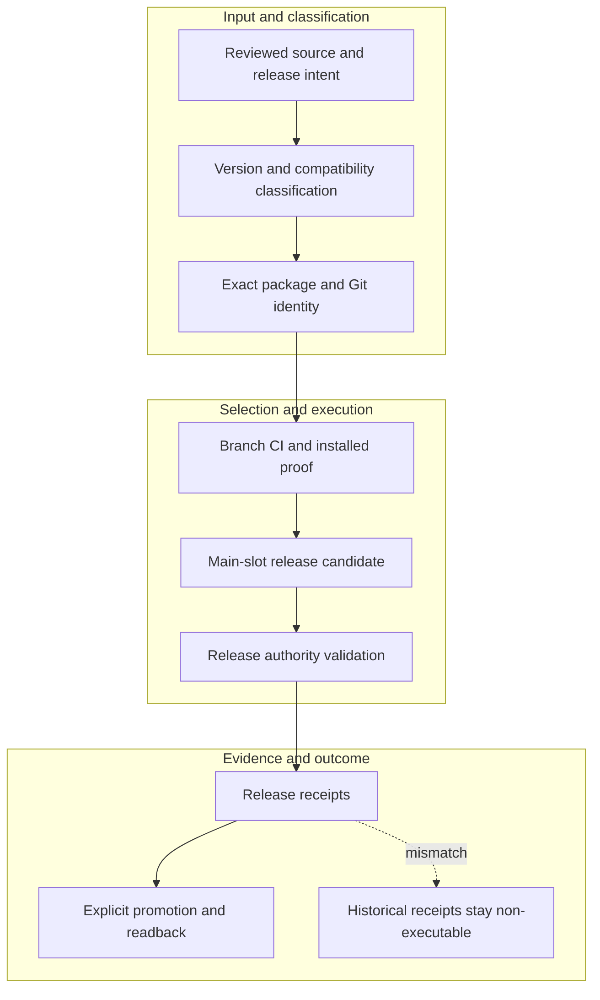

<!-- evidence-lane-public-docs-full-refresh: 3.0.0 / registry-derived-v1 -->

# Release and compatibility

The current source line is Evidence Lane 3.0.0. Source identity, local package identity, installed-host identity, Git commit/tree, runtime, candidate, accepted PV, website, and human release decision are separate facts.

Current counts are derived release facts, not permanent ceilings.

Historical commits, packages, receipts, and accepted PVs retain their original identities as non-executable provenance. They cannot override the current registry or revive a purged compatibility route.

A branch checkpoint, passing test, preview, or package is release evidence only. Main merge, main-slot installation, slot normalization, production website publication, Project HIL, Learning HIL, Fuse, and Goal completion remain separate operations.

Downstream projects keep their own Git, CI, deployment, storage, schema, lane, and connector choices. They do not inherit the Evidence Lane plugin-maintainer release cycle.

## Source-bound workflow map

This page is projected from the same current executable snapshot as the rest of the documentation set. The map is deliberately two-directional: each horizontal district shows peer stages while vertical edges show ownership and state progression.

## Contract and readback

| Phase | Current contract | Required readback |
| --- | --- | --- |
| Input | Reviewed source and release intent | Exact identity, provenance, and scope |
| Classification | Version and compatibility classification | Owning schema, action, lane, skill, or authority |
| Owner | Exact package and Git identity | One canonical implementation owner |
| Route | Branch CI and installed proof | Condition-true ordered route with no hidden alias |
| Execution | Main-slot release candidate | Real execution or a visible fail-closed result |
| Validation | Release authority validation | Hash, schema, authority-effect, and negative-case checks |
| Receipt | Release receipts | Content-addressed result and provenance receipt |
| Downstream | Explicit promotion and readback | Only the explicitly eligible next state |
| Failure | Historical receipts stay non-executable | No inferred HIL, candidate acceptance, or pointer movement |

## Canonical source owners

- `.codex-plugin/plugin.json`
- `release-channels.json`
- `scripts/codex_release/accept_codex_stable.py`

## Cross-surface invariants

- The current snapshot contains 91 public actions, 26 skills, 11 hook events / 44 handlers, 119 tool requirements, 18 sector lanes, and 11 named authorities. These are derived counts, not fixed ceilings.
- Executable ownership stays one-way: skills select, MCP exposes, the outer SDK routes, the internal SDK executes, ENV selects, UOP governs, tools perform bounded work, hooks emit receipts, and the owning authority validates effects.
- Any missing identity, schema, grant, capability, dependency, receipt, or authority proof must fail closed at its owning phase; a later green check cannot retroactively authorize the skipped boundary.
- A changed route refreshes every dependent schema, manifest, generator, test, diagram, and documentation reference; the superseded executable route is directly purged in the same Delta.
- Tests, Git, CI, installation, restart, deployment, discussion, or a rendered page never imply Project HIL, Learning HIL, Goal completion, or pointer movement.

---

This page is a Git-tracked documentation projection. Executable source, SQLite authorities, installed-runtime receipts, and explicit human gates remain the governing evidence.
