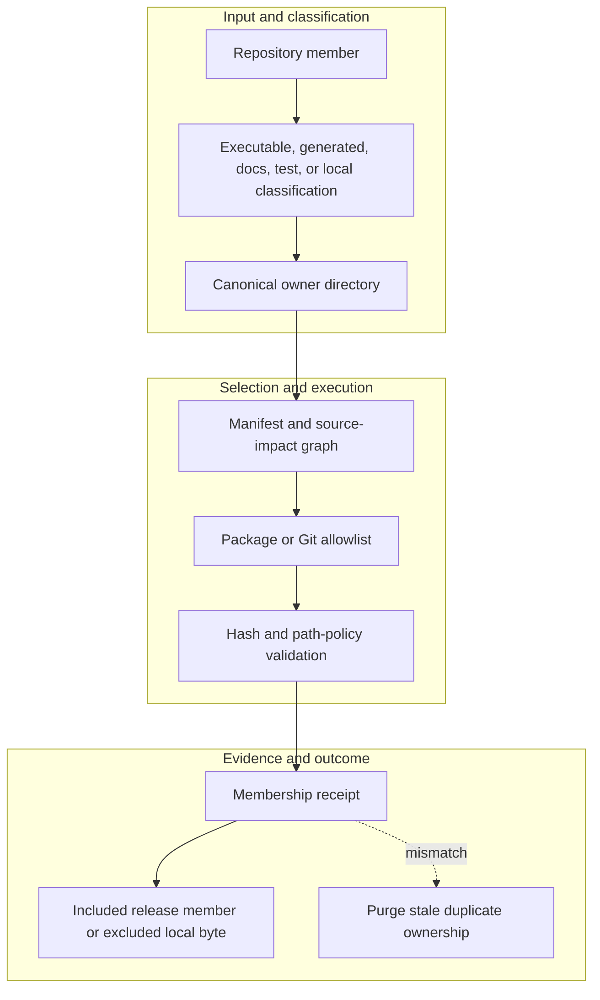

<!-- evidence-lane-public-docs-full-refresh: 3.0.0 / registry-derived-v1 -->

# Repository map

The repository separates the installable plugin, public documentation application, GitHub Markdown, Pages assets, tests, and repository-level generators.

Current counts are derived release facts, not permanent ceilings.

| Path | Role |
| --- | --- |
| `plugins/evidence-lane-plugin/` | Installable Codex plugin |
| `plugins/evidence-lane-plugin/src/evidence_lane_plugin/` | Canonical Python engine and internal SDK |
| `plugins/evidence-lane-plugin/skills/` | Governed skills and routing manifests |
| `plugins/evidence-lane-plugin/hooks/` | Host event classes and ordered handlers |
| `plugins/evidence-lane-plugin/env/` | Clean ENV v17 action plane |
| `plugins/evidence-lane-plugin/uop/` | Clean UOP v17 governance plane |
| `plugins/evidence-lane-plugin/authorities/` | Named authorities and 18 sector-lane templates/workflows |
| `plugins/evidence-lane-plugin/sdk/` | Internal/outer SDK bindings and workflows |
| `plugins/evidence-lane-plugin/mcp/` | Package-local MCP binding and 91 action bindings |
| `plugins/evidence-lane-plugin/toolchains/` | Conditional tool, accelerator-provider, license, routing, and architecture registries |
| `apps/evidence-lane-app/` | Public documentation application |
| `docs/` | Maintained GitHub Markdown pages |
| `github-pages/` | GitHub Pages assets and projection |
| `scripts/` | Repository-level docs/Pages/release generators |
| `tests/` | Repository-wide executable verification |

Local virtual environments, caches, runtimes, rehearsal evidence, RAG indexes, temporary support lanes, and secrets are excluded from release staging.

## Source-bound workflow map

This page is projected from the same current executable snapshot as the rest of the documentation set. The map is deliberately two-directional: each horizontal district shows peer stages while vertical edges show ownership and state progression.

## Contract and readback

| Phase | Current contract | Required readback |
| --- | --- | --- |
| Input | Repository member | Exact identity, provenance, and scope |
| Classification | Executable, generated, docs, test, or local classification | Owning schema, action, lane, skill, or authority |
| Owner | Canonical owner directory | One canonical implementation owner |
| Route | Manifest and source-impact graph | Condition-true ordered route with no hidden alias |
| Execution | Package or Git allowlist | Real execution or a visible fail-closed result |
| Validation | Hash and path-policy validation | Hash, schema, authority-effect, and negative-case checks |
| Receipt | Membership receipt | Content-addressed result and provenance receipt |
| Downstream | Included release member or excluded local byte | Only the explicitly eligible next state |
| Failure | Purge stale duplicate ownership | No inferred HIL, candidate acceptance, or pointer movement |

## Canonical source owners

- `manifests/executable-surface-registry.v1.json`
- `src/evidence_lane_plugin/source_fingerprint.py`
- `scripts/audit_repository_semantic_currentness.py`

### Exact backend readback

| Source contract | Bytes | SHA-256 |
| --- | ---: | --- |
| `manifests/executable-surface-registry.v1.json` | 374970 | `F765A5FC61A4D9FD36151DBFD7FDDC320AAC396471E7E98EE8870CEE705E72CE` |
| `src/evidence_lane_plugin/source_fingerprint.py` | 6916 | `EA31A7B001B85E2D8C19679D50004E88831C8E8635E032E012420F0588D33D16` |
| `scripts/audit_repository_semantic_currentness.py` | 25126 | `10C84091017B0A5626121F96ECF718BCF3D407C7D282B8A1000A2F860A24DBEC` |

## Cross-surface invariants

- The current snapshot contains 91 public actions, 26 skills, 11 hook events / 44 handlers, 119 tool requirements, 18 sector lanes, and 11 named authorities. These are derived counts, not fixed ceilings.
- Executable ownership stays one-way: skills select, MCP exposes, the outer SDK routes, the internal SDK executes, ENV selects, UOP governs, tools perform bounded work, hooks emit receipts, and the owning authority validates effects.
- Any missing identity, schema, grant, capability, dependency, receipt, or authority proof must fail closed at its owning phase; a later green check cannot retroactively authorize the skipped boundary.
- A changed route refreshes every dependent schema, manifest, generator, test, diagram, and documentation reference; the superseded executable route is directly purged in the same Delta.
- Tests, Git, CI, installation, restart, deployment, discussion, or a rendered page never imply Project HIL, Learning HIL, Goal completion, or pointer movement.

---

This page is a Git-tracked documentation projection. Executable source, SQLite authorities, installed-runtime receipts, and explicit human gates remain the governing evidence.
