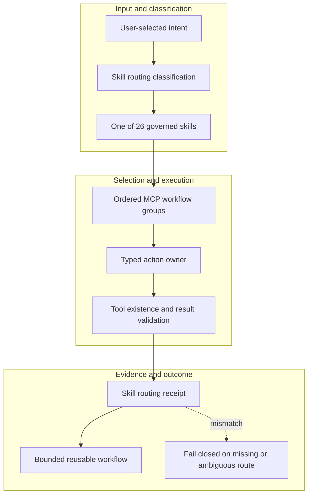

<!-- evidence-lane-public-docs-full-refresh: 3.0.0 / registry-derived-v1 -->

# Governed skills

Skills are registry-driven workflow selectors over typed public actions. They do not duplicate execution logic and there is no separate command layer.

Current counts are derived release facts, not permanent ceilings.

| Skill | Current purpose | Workflow groups |
| --- | --- | ---: |
| `evi` | Evidence Lane registry-driven root router with user-timed State Travel and current registry-derived human entrypoints over every first-class workflow. | 11 |
| `evi-additional-plugin` | Add one bounded host-specific connector or AI toolchain grant with purpose, role schema, actions, scope, runtime, and expiry. | 2 |
| `evi-bigger-universe` | Register or explicitly link hash-only project mini-brains in the separate Evidence Lane Bigger Universe federation without merging per-project Universe or Project Truth. | 2 |
| `evi-boot` | Evidence Lane atomic runtime doctor, ENV15/UOP15 Flash, host detection, and durable-storage Boot or resume. | 6 |
| `evi-brain-scaling` | Select a deterministic bounded indexed Evidence Lane brain slice when a large authority must fit an explicit token and item budget without training or merging authorities. | 1 |
| `evi-build` | Evidence Lane PV0 bootstrap and unaccepted proposal construction through dual-HIL presentation. | 2 |
| `evi-canon` | Govern bounded task-to-task Canon exchanges, linked top-level tasks or explicitly authorized subagents, receiver-owned Canon HIL decisions, backfire requests, result returns, and State Travel graph continuity. Use when one governed task must exchange typed evidence, requirements, corrections, plans, or results with another task without merging Project Truth, Agent Learning, task ownership, or HIL authority. | 16 |
| `evi-drop-additional-plugin` | Revoke one active Evidence Lane plugin grant while preserving its append-only history. | 1 |
| `evi-exit-boot` | Explicitly close one persistent Evidence Lane session and detach live Flash/capture without removing the installation or immutable evidence. | 1 |
| `evi-formula` | Compile or route the separate bounded Evidence Lane ENV/UOP Formula Engine when work needs explicit operator, formula, lane, tool, or budget governance. | 1 |
| `evi-fuse` | Govern separate Project and Learning HIL decisions and exact approved promotion. | 3 |
| `evi-instructions` | Resolve and use the separate AGENTS.md instruction chain and host conversation MEMORY.md recall arm under ENV/UOP without merging either into Project Memory, AI Learning, Canon, or Project Truth. | 3 |
| `evi-learning` | Govern the project-isolated AI Agent Learning arm: inspect and retrieve accepted lessons, seal evidence-backed learning candidates, run the separate Learning HIL, and revoke accepted learning without changing Project Truth. Use when an AI workflow proposes a reusable procedural, failure-avoidance, relational, tool-routing, or host-compatibility lesson. | 8 |
| `evi-memory` | Query and link the independent Project Memory DB through bounded FTS5/BM25 locators without merging Project Truth, AI Learning, Canon, AGENTS.md, or host MEMORY.md. | 5 |
| `evi-mode` | Evidence Lane Mode sidecar for ordered known intersections and explicit custom-mode schemas. | 1 |
| `evi-plan` | Pair a finished Codex Plan-mode plan with the canonical Evidence Lane Plan Lane and Goal. | 6 |
| `evi-plugin` | Govern persistent connector and AI-toolchain sidecars without changing Evidence Lane lifecycle state. | 4 |
| `evi-project-recipe` | Compile an Evidence Lane project-type recipe from exact source paths and the requested outcome during initial or explicitly reclassified work, without turning the recipe into Mode. | 1 |
| `evi-refresh` | Route the three current Evidence Lane refresh workflows without merging them: Source Intake steer/prompt refresh, adaptive Delta-exit append refresh, and full-PV-HIL Project Overlay refresh. | 3 |
| `evi-rollback` | Evidence Lane logical rollback across Plan-stamped full-PV and sub-PV states, with hard ZIP restore kept separate and explicit. | 1 |
| `evi-source-intake` | Evidence Lane generalized ordered source intake with optional Git history, auto-detection, exact overrides, registry-derived sector lanes, and Chat Lineage. | 15 |
| `evi-state-travel` | Fresh-native same-project direct State Travel from the exact verified governed work boundary. | 9 |
| `evi-storage` | Inspect or select Evidence Lane primary storage routing with an append-only, secret-free receipt. | 2 |
| `evi-toolchain` | Resolve and run one conditional Evidence Lane AI toolchain for an exact lane and Codex host profile, with explicit primary/fallback order and fail-visible missing dependencies. | 1 |
| `evi-universe` | Inspect the linked Project Universe and connector-brain integrity graph through the live ENV/UOP-governed query route without merging authority roles. | 3 |
| `evidence-lane-code-lifecycle` | Govern one universal Evidence Lane project across user-timed fresh-host State Travel, atomic Boot and locked ENV/UOP Flash, registry-derived public skill entrypoints and sector lanes, bounded linear work, unaccepted candidates, exact-APPROVE Fuse, Plan-stamped logical Rollback, and explicit Exit Boot. | 19 |

A first-class action requires a first-class skill/workflow binding. Counts can change with the registry. Missing actions fail closed; no command alias or prompt example creates an executable route.

## Source-bound workflow map

This page is projected from the same current executable snapshot as the rest of the documentation set. The map is deliberately two-directional: each horizontal district shows peer stages while vertical edges show ownership and state progression.

## Contract and readback

| Phase | Current contract | Required readback |
| --- | --- | --- |
| Input | User-selected intent | Exact identity, provenance, and scope |
| Classification | Skill routing classification | Owning schema, action, lane, skill, or authority |
| Owner | One of 26 governed skills | One canonical implementation owner |
| Route | Ordered MCP workflow groups | Condition-true ordered route with no hidden alias |
| Execution | Typed action owner | Real execution or a visible fail-closed result |
| Validation | Tool existence and result validation | Hash, schema, authority-effect, and negative-case checks |
| Receipt | Skill routing receipt | Content-addressed result and provenance receipt |
| Downstream | Bounded reusable workflow | Only the explicitly eligible next state |
| Failure | Fail closed on missing or ambiguous route | No inferred HIL, candidate acceptance, or pointer movement |

## Canonical source owners

- `skills/skill-surface-registry.v1.json`
- `skills/evi/references/mcp-tool-routing.v1.json`
- `sdk/workflows/skill-workflow-registry.v1.json`

## Cross-surface invariants

- The current snapshot contains 91 public actions, 26 skills, 11 hook events / 44 handlers, 119 tool requirements, 18 sector lanes, and 11 named authorities. These are derived counts, not fixed ceilings.
- Executable ownership stays one-way: skills select, MCP exposes, the outer SDK routes, the internal SDK executes, ENV selects, UOP governs, tools perform bounded work, hooks emit receipts, and the owning authority validates effects.
- Any missing identity, schema, grant, capability, dependency, receipt, or authority proof must fail closed at its owning phase; a later green check cannot retroactively authorize the skipped boundary.
- A changed route refreshes every dependent schema, manifest, generator, test, diagram, and documentation reference; the superseded executable route is directly purged in the same Delta.
- Tests, Git, CI, installation, restart, deployment, discussion, or a rendered page never imply Project HIL, Learning HIL, Goal completion, or pointer movement.

---

This page is a Git-tracked documentation projection. Executable source, SQLite authorities, installed-runtime receipts, and explicit human gates remain the governing evidence.
