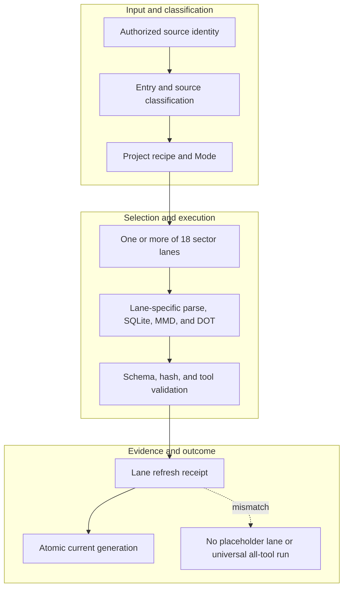

<!-- evidence-lane-public-docs-full-refresh: 3.0.0 / registry-derived-v1 -->

# Source Intake and project-sector lanes

Source Intake converts authorized source identities into a project recipe and the exact set of sector-lane workflows required by the user's current intent.

Current counts are derived release facts, not permanent ceilings.

## Intake sequence

1. Bind the prompt/steer Entry Slip and exact source identity.
2. Apply path/content policy, redaction, provenance, and project classification.
3. Compile or reuse the project recipe and Mode intersection.
4. Route each source to the applicable lane; a source can be overridden only through the explicit schema/route contract.
5. Parse and chunk exact bytes once, project lane-specific facts, refresh contentless FTS, and derive MMD/DOT from SQLite.
6. Validate hashes, schemas, conditional tool execution, authority effects, and receipts before atomic pointer swap.
7. Reuse unchanged content-addressed atoms and directly purge superseded unpointed generations after readback.

## Current lanes

| Lane | Role |
| --- | --- |
| `github_code` | Git refs, commits, trees, blobs, changes, and repository history. |
| `local_code` | Working-tree files, code structure, chunks, and dependencies. |
| `chat_lineage` | Prompts, responses, steers, and task entry/exit evidence. |
| `discussion` | Bounded discussion claims and decisions. |
| `analysis` | Source-backed findings, relationships, and uncertainty. |
| `plan` | Canonical Plan rows, dependencies, transitions, and projections. |
| `mode` | Operating-mode classification and intersection. |
| `docs` | Documentation hierarchy, text, relationships, and citations. |
| `data_excel` | Tabular and spreadsheet structure, formulas, and typed facts. |
| `ppt` | Slides, notes, shapes, tables, and media references. |
| `pdf_ocr` | PDF structure, native text, page geometry, and OCR fallback. |
| `images_ocr` | Image metadata, OCR, and visual locators. |
| `artifacts` | Generated deliverables and exact artifact identities. |
| `custom` | Explicit user-defined source schemas. |
| `brain_loader` | Imported Evidence Lane/SQLite brain packages. |
| `research` | Web and research evidence, citations, and provenance. |
| `project_engulf` | Initial project classification and lane registration plan. |
| `sqlite_brain` | Existing SQLite schema, relationships, and bounded queries. |
## Lane package contract

Every current lane owns a distinct SQLite schema/template, lane-specific workflow JSON, MMD, DOT, tools contract, manifest, reader, builder, pointer schema, and refresh receipt. Empty tables are classified as query-time materialization, condition-false, intentionally empty template/history, blocked upstream tool, or defect. Eligibility is not execution proof: every condition-true tool must execute or fail visibly.

Git history and local working-tree content remain separate lanes. Project Engulf registers/classifies a project and its baseline sources; it does not flatten all project material into ENV/UOP or create acceptance. ChatLineage is a sector source, not the Plan or Project Truth.

Project recipes and Modes are paired inputs to ENV selection; neither is a fixed workflow list. New project types, lanes, tools, and schema facts may be registered when current source and user intent require them.

## Source-bound workflow map

This page is projected from the same current executable snapshot as the rest of the documentation set. The map is deliberately two-directional: each horizontal district shows peer stages while vertical edges show ownership and state progression.

## Contract and readback

| Phase | Current contract | Required readback |
| --- | --- | --- |
| Input | Authorized source identity | Exact identity, provenance, and scope |
| Classification | Entry and source classification | Owning schema, action, lane, skill, or authority |
| Owner | Project recipe and Mode | One canonical implementation owner |
| Route | One or more of 18 sector lanes | Condition-true ordered route with no hidden alias |
| Execution | Lane-specific parse, SQLite, MMD, and DOT | Real execution or a visible fail-closed result |
| Validation | Schema, hash, and tool validation | Hash, schema, authority-effect, and negative-case checks |
| Receipt | Lane refresh receipt | Content-addressed result and provenance receipt |
| Downstream | Atomic current generation | Only the explicitly eligible next state |
| Failure | No placeholder lane or universal all-tool run | No inferred HIL, candidate acceptance, or pointer movement |

## Canonical source owners

- `authorities/project_sectors/lane-surface-registry.v1.json`
- `schemas/source-intake/source-intake-code-routing.v1.json`
- `src/evidence_lane_plugin/source_intake.py`

### Exact backend readback

| Source contract | Bytes | SHA-256 |
| --- | ---: | --- |
| `authorities/project_sectors/lane-surface-registry.v1.json` | 9856 | `ED6F8D898A7FB7744E9912368C72FB1E84084D46FEF4A56BD7F7974A419E9FF7` |
| `schemas/source-intake/source-intake-code-routing.v1.json` | 1555 | `896F98CC10794925B00EE6ADE8DC88317167340D9F3BF80C3F38494C62D245F4` |
| `src/evidence_lane_plugin/source_intake.py` | 33466 | `0923C977C48A74E84B0DF0D00948A9AB87F88B0BFA2006FEA283CE2CB39EEA47` |

## Cross-surface invariants

- The current snapshot contains 91 public actions, 26 skills, 11 hook events / 44 handlers, 119 tool requirements, 18 sector lanes, and 11 named authorities. These are derived counts, not fixed ceilings.
- Executable ownership stays one-way: skills select, MCP exposes, the outer SDK routes, the internal SDK executes, ENV selects, UOP governs, tools perform bounded work, hooks emit receipts, and the owning authority validates effects.
- Any missing identity, schema, grant, capability, dependency, receipt, or authority proof must fail closed at its owning phase; a later green check cannot retroactively authorize the skipped boundary.
- A changed route refreshes every dependent schema, manifest, generator, test, diagram, and documentation reference; the superseded executable route is directly purged in the same Delta.
- Tests, Git, CI, installation, restart, deployment, discussion, or a rendered page never imply Project HIL, Learning HIL, Goal completion, or pointer movement.

---

This page is a Git-tracked documentation projection. Executable source, SQLite authorities, installed-runtime receipts, and explicit human gates remain the governing evidence.
