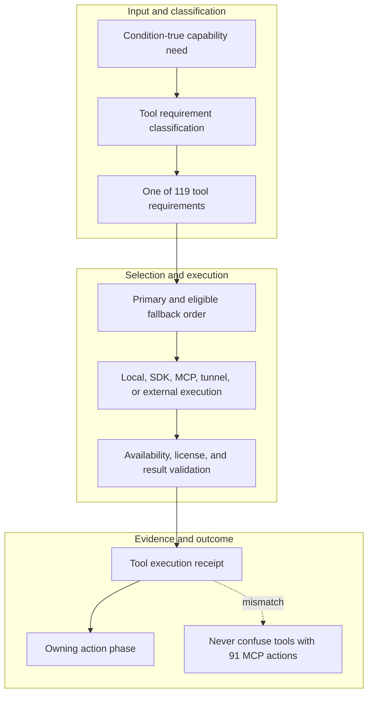

<!-- evidence-lane-public-docs-full-refresh: 3.0.0 / registry-derived-v1 -->

# Conditional AI and project toolchain

This page embeds the current generated execution matrix. The public MCP action inventory is separate from the tool-requirement inventory.

Current counts are derived release facts, not permanent ceilings.

## Hardware acceleration providers

| Provider | Activation boundary |
| --- | --- |
| `CPU` | Universal deterministic baseline and visible fallback |
| `NVIDIA_CUDA` | User-enabled NVIDIA plugin/grant + compatible NVIDIA hardware, driver, exact CUDA runtime, telemetry, budget, and eligible action |
| `AMD_ROCM` | User-enabled AMD plugin/grant + exact AMD hardware/OS/framework compatibility and HIP telemetry |
| `AMD_DIRECTML` | User-enabled AMD plugin/grant + Windows DirectML provider; sequential execution and disabled memory-pattern optimization |

The default GPU memory ceiling is **80%** with explicit headroom. It limits admitted VRAM; it never forces a utilization percentage. A missing/incompatible runtime, exhausted budget, thermal/throttle signal, or ineligible action yields a receipted CPU fallback.

Accelerators are not included in the tool count or MCP action count.

Derived tool count: **119**. Public MCP action count is separate.

Host plane: **Codex Desktop, Codex CLI, and Codex VM only**. ChatGPT is a separate future plane.

Execution law: tools run only when the active lane/action/source type selects them. Presence never means run everything. SQLite remains durable authority; analytical, vector, graph, and web tools produce bounded evidence for SQLite persistence.

## Eighteen project-sector lanes

| Lane | Action classes | Ordered eligible tools |
|---|---|---|
| `github_code` | CODE, RETRIEVAL, GRAPH, EVALUATION, DEPLOYMENT, OBSERVABILITY, SOURCE_ROUTING | Git, Python, NodeJS_TypeScript, GitPython, PyGithub, TreeSitter_LanguagePack, Python_structural_parser, GitHub_MCP_Server, Filesystem_MCP_Server, LlamaIndex_SQLite_indexer, APSW_SQLite_engine, SQLite_FTS5_BM25, sqlite_vec, rank_bm25, SentenceTransformers, FAISS_CPU, Pinecone, Weaviate, Milvus, OpenSearch, deterministic_TFIDF, LangGraph_Mermaid_engine, rustworkx, Python_Graphviz_DOT_engine, Graphviz_dot, Mermaid_CLI_mmdc, LangSmith, Docker, Kubernetes, OpenTelemetry, Langfuse, hashlib_pathlib, Secret_redactor |
| `local_code` | CODE, RETRIEVAL, GRAPH, EVALUATION, DEPLOYMENT, OBSERVABILITY, SOURCE_ROUTING | Git, Python, NodeJS_TypeScript, GitPython, TreeSitter_LanguagePack, Python_structural_parser, Filesystem_MCP_Server, LlamaIndex_SQLite_indexer, APSW_SQLite_engine, SQLite_FTS5_BM25, sqlite_vec, rank_bm25, SentenceTransformers, FAISS_CPU, Pinecone, Weaviate, Milvus, OpenSearch, deterministic_TFIDF, LangGraph_Mermaid_engine, rustworkx, Python_Graphviz_DOT_engine, Graphviz_dot, Mermaid_CLI_mmdc, LangSmith, Docker, Kubernetes, OpenTelemetry, Langfuse, hashlib_pathlib, Secret_redactor |
| `docs` | DOCUMENT, RETRIEVAL, GRAPH, OBSERVABILITY, SOURCE_ROUTING | Docling, PyMuPDF, lxml, DOCX_OpenXML, defusedxml, LlamaIndex_SQLite_indexer, APSW_SQLite_engine, SQLite_FTS5_BM25, sqlite_vec, rank_bm25, SentenceTransformers, FAISS_CPU, Pinecone, Weaviate, Milvus, OpenSearch, deterministic_TFIDF, LangGraph_Mermaid_engine, rustworkx, Python_Graphviz_DOT_engine, Graphviz_dot, Mermaid_CLI_mmdc, OpenTelemetry, Langfuse, hashlib_pathlib, Secret_redactor |
| `pdf_ocr` | DOCUMENT, OCR_MEDIA, RETRIEVAL, GRAPH, OBSERVABILITY, SOURCE_ROUTING | Docling, PyMuPDF, pdfplumber, pypdf, pypdfium2, RapidOCR_ONNX_Runtime, pytesseract_Tesseract, Pillow, Poppler_pdftotext_pdfinfo, Ghostscript, LlamaIndex_SQLite_indexer, APSW_SQLite_engine, SQLite_FTS5_BM25, sqlite_vec, rank_bm25, SentenceTransformers, FAISS_CPU, Pinecone, Weaviate, Milvus, OpenSearch, deterministic_TFIDF, LangGraph_Mermaid_engine, rustworkx, Python_Graphviz_DOT_engine, Graphviz_dot, Mermaid_CLI_mmdc, OpenTelemetry, Langfuse, hashlib_pathlib, Secret_redactor |
| `images_ocr` | OCR_MEDIA, RETRIEVAL, GRAPH, OBSERVABILITY, SOURCE_ROUTING | RapidOCR_ONNX_Runtime, pytesseract_Tesseract, OpenCV, Pillow, FFmpeg, LlamaIndex_SQLite_indexer, APSW_SQLite_engine, SQLite_FTS5_BM25, sqlite_vec, rank_bm25, SentenceTransformers, FAISS_CPU, Pinecone, Weaviate, Milvus, OpenSearch, deterministic_TFIDF, LangGraph_Mermaid_engine, rustworkx, Python_Graphviz_DOT_engine, Graphviz_dot, Mermaid_CLI_mmdc, OpenTelemetry, Langfuse, hashlib_pathlib, Secret_redactor |
| `ppt` | DOCUMENT, OCR_MEDIA, RETRIEVAL, GRAPH, OBSERVABILITY, SOURCE_ROUTING | Docling, lxml, PPTX_OpenXML, defusedxml, LlamaIndex_SQLite_indexer, APSW_SQLite_engine, SQLite_FTS5_BM25, sqlite_vec, rank_bm25, SentenceTransformers, FAISS_CPU, Pinecone, Weaviate, Milvus, OpenSearch, deterministic_TFIDF, LangGraph_Mermaid_engine, rustworkx, Python_Graphviz_DOT_engine, Graphviz_dot, Mermaid_CLI_mmdc, OpenTelemetry, Langfuse, hashlib_pathlib, Secret_redactor |
| `data_excel` | DATA, RETRIEVAL, GRAPH, OBSERVABILITY, SOURCE_ROUTING | DuckDB, Polars, APSW_SQLite_engine, pandas, pyarrow, openpyxl, python_calamine, Tableau_Hyper_API, SQLAlchemy, OpenXML_CSV_JSON_parser, PostgreSQL_MCP_Server, LlamaIndex_SQLite_indexer, SQLite_FTS5_BM25, sqlite_vec, rank_bm25, SentenceTransformers, FAISS_CPU, Pinecone, Weaviate, Milvus, OpenSearch, deterministic_TFIDF, LangGraph_Mermaid_engine, rustworkx, Python_Graphviz_DOT_engine, Graphviz_dot, Mermaid_CLI_mmdc, OpenTelemetry, Langfuse, hashlib_pathlib, Secret_redactor |
| `research` | WEB_RESEARCH, RETRIEVAL, GRAPH, EVALUATION, OBSERVABILITY, SOURCE_ROUTING | trafilatura, readability_lxml, BeautifulSoup4, markdownify, html2text, tldextract, DDGS, LlamaIndex_SQLite_indexer, APSW_SQLite_engine, SQLite_FTS5_BM25, sqlite_vec, rank_bm25, SentenceTransformers, FAISS_CPU, Pinecone, Weaviate, Milvus, OpenSearch, deterministic_TFIDF, LangGraph_Mermaid_engine, rustworkx, Python_Graphviz_DOT_engine, Graphviz_dot, Mermaid_CLI_mmdc, LangSmith, OpenTelemetry, Langfuse, hashlib_pathlib, Secret_redactor, Citation_binder |
| `brain_loader` | DOCUMENT, DATA, RETRIEVAL, GRAPH, OBSERVABILITY, SOURCE_ROUTING | SQLite_immutable_URI_reader, APSW_SQLite_engine, Tableau_Hyper_API, LlamaIndex_SQLite_indexer, SQLite_FTS5_BM25, sqlite_vec, rank_bm25, SentenceTransformers, FAISS_CPU, Pinecone, Weaviate, Milvus, OpenSearch, deterministic_TFIDF, LangGraph_Mermaid_engine, rustworkx, Python_Graphviz_DOT_engine, Graphviz_dot, Mermaid_CLI_mmdc, OpenTelemetry, Langfuse, hashlib_pathlib, Secret_redactor, Safe_archive_intake |
| `sqlite_brain` | DATA, RETRIEVAL, GRAPH, OBSERVABILITY, SOURCE_ROUTING | DuckDB, APSW_SQLite_engine, SQLAlchemy, SQLite_immutable_URI_reader, Compatibility_mapper, PostgreSQL_MCP_Server, LlamaIndex_SQLite_indexer, SQLite_FTS5_BM25, sqlite_vec, rank_bm25, SentenceTransformers, FAISS_CPU, Pinecone, Weaviate, Milvus, OpenSearch, deterministic_TFIDF, LangGraph_Mermaid_engine, rustworkx, Python_Graphviz_DOT_engine, Graphviz_dot, Mermaid_CLI_mmdc, OpenTelemetry, Langfuse, hashlib_pathlib, Secret_redactor |
| `project_engulf` | CODE, DOCUMENT, DATA, WEB_RESEARCH, RETRIEVAL, GRAPH, EVALUATION, OBSERVABILITY, SOURCE_ROUTING | Git, GitPython, TreeSitter_LanguagePack, Python_structural_parser, Polars, APSW_SQLite_engine, LlamaIndex_SQLite_indexer, SQLite_FTS5_BM25, sqlite_vec, rank_bm25, RapidFuzz, SentenceTransformers, FAISS_CPU, Pinecone, Weaviate, Milvus, OpenSearch, deterministic_TFIDF, LangGraph_Mermaid_engine, rustworkx, Python_Graphviz_DOT_engine, Graphviz_dot, Mermaid_CLI_mmdc, LangSmith, OpenTelemetry, Langfuse, hashlib_pathlib, Secret_redactor, Safe_archive_intake, Project_inventory, Git_detector |
| `artifacts` | DOCUMENT, OCR_MEDIA, DATA, RETRIEVAL, GRAPH, DEPLOYMENT, OBSERVABILITY, SOURCE_ROUTING | FFmpeg, Polars, APSW_SQLite_engine, LlamaIndex_SQLite_indexer, SQLite_FTS5_BM25, sqlite_vec, rank_bm25, SentenceTransformers, FAISS_CPU, Pinecone, Weaviate, Milvus, OpenSearch, deterministic_TFIDF, LangGraph_Mermaid_engine, rustworkx, Python_Graphviz_DOT_engine, Graphviz_dot, Mermaid_CLI_mmdc, Docker, Kubernetes, AWS_Lambda, Google_Cloud_Run, AWS, Azure, Google_Cloud, OpenTelemetry, Langfuse, hashlib_pathlib, Secret_redactor |
| `analysis` | DATA, RETRIEVAL, GRAPH, GOVERNANCE, EVALUATION, OBSERVABILITY, SOURCE_ROUTING | DuckDB, Polars, APSW_SQLite_engine, LlamaIndex_SQLite_indexer, SQLite_FTS5_BM25, sqlite_vec, rank_bm25, RapidFuzz, SentenceTransformers, FAISS_CPU, Pinecone, Weaviate, Milvus, OpenSearch, deterministic_TFIDF, LangGraph_Mermaid_engine, rustworkx, Python_Graphviz_DOT_engine, Graphviz_dot, Mermaid_CLI_mmdc, SQLite_CAS, LangSmith, OpenTelemetry, Langfuse, hashlib_pathlib, Secret_redactor |
| `discussion` | RETRIEVAL, GOVERNANCE, OBSERVABILITY, SOURCE_ROUTING | LlamaIndex_SQLite_indexer, APSW_SQLite_engine, SQLite_FTS5_BM25, sqlite_vec, rank_bm25, RapidFuzz, SentenceTransformers, FAISS_CPU, Pinecone, Weaviate, Milvus, OpenSearch, deterministic_TFIDF, SQLite_CAS, OpenTelemetry, Langfuse, hashlib_pathlib, Secret_redactor |
| `plan` | GOVERNANCE, RETRIEVAL, GRAPH, EVALUATION, OBSERVABILITY, SOURCE_ROUTING | SQLite_CAS, LlamaIndex_SQLite_indexer, APSW_SQLite_engine, SQLite_FTS5_BM25, sqlite_vec, rank_bm25, SentenceTransformers, FAISS_CPU, Pinecone, Weaviate, Milvus, OpenSearch, deterministic_TFIDF, LangGraph_Mermaid_engine, rustworkx, Python_Graphviz_DOT_engine, Graphviz_dot, Mermaid_CLI_mmdc, LangSmith, OpenTelemetry, Langfuse, hashlib_pathlib, Secret_redactor |
| `mode` | GOVERNANCE, RETRIEVAL, GRAPH, OBSERVABILITY, SOURCE_ROUTING | ENV_UOP_classifier, PCM_MBA_operators, SQLite_CAS, LlamaIndex_SQLite_indexer, APSW_SQLite_engine, SQLite_FTS5_BM25, sqlite_vec, rank_bm25, SentenceTransformers, FAISS_CPU, Pinecone, Weaviate, Milvus, OpenSearch, deterministic_TFIDF, LangGraph_Mermaid_engine, rustworkx, Python_Graphviz_DOT_engine, Graphviz_dot, Mermaid_CLI_mmdc, OpenTelemetry, Langfuse, hashlib_pathlib, Secret_redactor |
| `chat_lineage` | GOVERNANCE, RETRIEVAL, GRAPH, OBSERVABILITY, SOURCE_ROUTING | SQLite_CAS, Hash_chain_writer, LlamaIndex_SQLite_indexer, APSW_SQLite_engine, SQLite_FTS5_BM25, sqlite_vec, rank_bm25, SentenceTransformers, FAISS_CPU, Pinecone, Weaviate, Milvus, OpenSearch, deterministic_TFIDF, LangGraph_Mermaid_engine, rustworkx, Python_Graphviz_DOT_engine, Graphviz_dot, Mermaid_CLI_mmdc, OpenTelemetry, Langfuse, hashlib_pathlib, Secret_redactor |
| `custom` | GOVERNANCE, DATA, RETRIEVAL, GRAPH, EVALUATION, OBSERVABILITY, SOURCE_ROUTING | SQLite_CAS, APSW_SQLite_engine, SQLAlchemy, Custom_schema_compiler, PostgreSQL_MCP_Server, LlamaIndex_SQLite_indexer, SQLite_FTS5_BM25, sqlite_vec, rank_bm25, SentenceTransformers, FAISS_CPU, Pinecone, Weaviate, Milvus, OpenSearch, deterministic_TFIDF, LangGraph_Mermaid_engine, rustworkx, Python_Graphviz_DOT_engine, Graphviz_dot, Mermaid_CLI_mmdc, LangSmith, OpenTelemetry, Langfuse, hashlib_pathlib, Secret_redactor |

## Named/root authority surfaces

| Authority | Execution role |
|---|---|
| Agent Learning | Learning SQLite + MMD/DOT + LlamaIndex/FTS; vector side index only by policy |
| Canon Input/Consequence | Canon SQLite and nested consequence graph; LangGraph, Graphviz, rustworkx |
| Project Memory | Memory SQLite, LlamaIndex, FTS5/BM25, optional local semantic retrieval |
| Project Overlay | HIL-only progressive blast-radius SQLite + graph analytics |
| Source Authority | CAS/source identities, extraction, FTS, citations, changed-only refresh |
| Project Universe | Per-project relationship graph only |
| Connector Brain | Project-to-project mini-brain federation with explicit grants and hashes |
| Project Authority | Registration, layout, pointer/member identities and project routing |
| Receipt Ledger | Append-only exact receipt bytes, links, FTS and hash chain |
| Session Authority | Sessions, attachments, State Travel and Goal projection |
| Instructions | AGENTS.md + host MEMORY.md instruction arm; separate non-SQLite authority |

## Git, search, JSON, CI, and public adapter

| Tool | Requirement | Exact role | Declared surfaces | ENV-eligible lanes | Primary/fallback | Implementation owner | License/terms evidence |
|---|---|---|---|---|---|---|---|
| `Git` | `REQUIRED_OPTIONAL_FOR_PROJECT_ENGULF` | Refs, commits, parents, blobs, changes, and reviewed delivery. | `github_code`, `local_code`, `project_engulf`, `runtime_git_delivery` | `github_code`, `local_code`, `project_engulf` | primary: CODE | `git_optional.py + git_history.py` | GPL-2.0-only — host Git version probe; Git is not redistributed by the plugin |
| `NodeJS_TypeScript` | `REQUIRED_REPOSITORY_ONLY` | JavaScript and TypeScript manifests, routes, and site build. | `github_code`, `local_code`, `public_adapter` | `github_code`, `local_code` | primary: DEPLOYMENT; fallback/conditional: CODE | `repository CI and remote_adapter build` | EXTERNAL_SERVICE_OR_REPOSITORY_TERMS — validated at the repository/delivery gate; no binary redistributed |
| `Git_detector` | `OPTIONAL_INTERNAL` | Repository identity when a readable Git worktree exists. | `project_engulf` | `project_engulf` | fallback/conditional: SOURCE_ROUTING | `git_optional.py` | LicenseRef-Proprietary — LICENSE.md |
| `ripgrep_15_2_0` | `PACKAGED_PRE_INDEX_HELPER` | Exact hash-pinned file and content search; never the FTS authority. | `bounded_source_discovery` | Non-lane gate | fallback/conditional: CODE | `search_toolchain.py` | MIT OR Unlicense — toolchains/native-tools.v1.json plus the installed native-tool license receipt |
| `SevenZip_NSIS_extractor` | `REQUIRED_HIDDEN_RUNTIME_BINARY` | Hash-pinned non-elevated extraction of the pinned Tesseract NSIS payload into the hidden plugin runtime. | `local_update_native_toolchain` | Non-lane gate | fallback/conditional: RUNTIME_API | `install_native_toolchain.py non-elevated Tesseract extraction` | LicenseRef-7-Zip — toolchains/native-tools.v1.json plus the installed native-tool license receipt |
| `jq` | `REQUIRED_HIDDEN_RUNTIME_BINARY` | Deterministic bounded JSON projection and verification. | `json_tooling`, `manifests`, `receipts`, `routing` | Non-lane gate | fallback/conditional: CODE | `native_toolchain.py JSON validation/projection` | MIT — toolchains/native-tools.v1.json plus the installed native-tool license receipt |
| `PyGithub` | `REQUIRED_DEPENDENCY` | GitHub API inspection and reviewed delivery support. | `github_code`, `git_delivery` | `github_code` | fallback/conditional: CODE | `github_toolchain.py` | EXACT_INSTALLED_DISTRIBUTION_METADATA — runtime/licenses/<runtime_key>/manifest.v1.json with copied license files, metadata, classifiers, version, bytes, and SHA-256 |
| `GitPython` | `REQUIRED_DEPENDENCY` | Repository graph and object inspection beside the Git CLI. | `github_code`, `local_code`, `project_engulf` | `github_code`, `local_code`, `project_engulf` | fallback/conditional: CODE | `git_optional.py parity` | EXACT_INSTALLED_DISTRIBUTION_METADATA — runtime/licenses/<runtime_key>/manifest.v1.json with copied license files, metadata, classifiers, version, bytes, and SHA-256 |
| `NextJS_React_ThreeJS_FramerMotion` | `REPOSITORY_PUBLIC_ADAPTER_ONLY` | Static documentation, interaction, and visual rendering; no project authority. | `documentation_adapter` | Non-lane gate | fallback/conditional: DEPLOYMENT | `remote_adapter documentation projection` | EXTERNAL_SERVICE_OR_REPOSITORY_TERMS — validated at the repository/delivery gate; no binary redistributed |
| `GitHub_Actions` | `CONFIGURED_EXTERNAL_SERVICE` | Clean CI and release evidence. | `reviewed_branch_ci` | Non-lane gate | fallback/conditional: DEPLOYMENT | `.github/workflows delivery proof` | EXTERNAL_SERVICE_OR_REPOSITORY_TERMS — validated at the repository/delivery gate; no binary redistributed |
| `Vercel_Git_integration` | `CONFIGURED_EXTERNAL_SERVICE` | Deployment evidence only; no lifecycle authority. | `preview_production_documentation` | Non-lane gate | fallback/conditional: DEPLOYMENT | `branch preview delivery proof` | EXTERNAL_SERVICE_OR_REPOSITORY_TERMS — validated at the repository/delivery gate; no binary redistributed |
| `Docker` | `CONFIGURED_EXTERNAL_SERVICE` | Conditional host container build/run/inspect tool selected only at an approved runtime or delivery gate. | `github_code`, `local_code`, `artifacts`, `deployment` | `github_code`, `local_code`, `artifacts` | fallback/conditional: DEPLOYMENT | `deployment_toolchain.py + delivery gate` | EXTERNAL_SERVICE_OR_REPOSITORY_TERMS — validated at the repository/delivery gate; no binary redistributed |
| `Kubernetes` | `CONFIGURED_EXTERNAL_SERVICE` | Conditional manifest validation and approved rollout evidence; no Plan or scheduler authority. | `github_code`, `local_code`, `artifacts`, `deployment` | `github_code`, `local_code`, `artifacts` | fallback/conditional: DEPLOYMENT | `deployment_toolchain.py + delivery gate` | EXTERNAL_SERVICE_OR_REPOSITORY_TERMS — validated at the repository/delivery gate; no binary redistributed |
| `AWS_Lambda` | `CONFIGURED_EXTERNAL_SERVICE` | Conditional serverless package/deploy/invoke evidence route with external AWS identity. | `artifacts`, `deployment` | `artifacts` | fallback/conditional: DEPLOYMENT | `deployment_toolchain.py + deployment evidence route` | EXTERNAL_SERVICE_OR_REPOSITORY_TERMS — validated at the repository/delivery gate; no binary redistributed |
| `Google_Cloud_Run` | `CONFIGURED_EXTERNAL_SERVICE` | Conditional container revision deployment evidence route with external Google Cloud identity. | `artifacts`, `deployment` | `artifacts` | fallback/conditional: DEPLOYMENT | `deployment_toolchain.py + deployment evidence route` | EXTERNAL_SERVICE_OR_REPOSITORY_TERMS — validated at the repository/delivery gate; no binary redistributed |
| `AWS` | `CONFIGURED_EXTERNAL_SERVICE` | Conditional AWS identity/artifact/deployment evidence provider; no lifecycle authority. | `artifacts`, `deployment` | `artifacts` | fallback/conditional: DEPLOYMENT | `deployment_toolchain.py + deployment evidence route` | EXTERNAL_SERVICE_OR_REPOSITORY_TERMS — validated at the repository/delivery gate; no binary redistributed |
| `Azure` | `CONFIGURED_EXTERNAL_SERVICE` | Conditional Azure identity/artifact/deployment evidence provider; no lifecycle authority. | `artifacts`, `deployment` | `artifacts` | fallback/conditional: DEPLOYMENT | `deployment_toolchain.py + deployment evidence route` | EXTERNAL_SERVICE_OR_REPOSITORY_TERMS — validated at the repository/delivery gate; no binary redistributed |
| `Google_Cloud` | `CONFIGURED_EXTERNAL_SERVICE` | Conditional Google Cloud identity/artifact/deployment evidence provider; no lifecycle authority. | `artifacts`, `deployment` | `artifacts` | fallback/conditional: DEPLOYMENT | `deployment_toolchain.py + deployment evidence route` | EXTERNAL_SERVICE_OR_REPOSITORY_TERMS — validated at the repository/delivery gate; no binary redistributed |

## Hidden runtime, MCP, API, and tunnel

| Tool | Requirement | Exact role | Declared surfaces | ENV-eligible lanes | Primary/fallback | Implementation owner | License/terms evidence |
|---|---|---|---|---|---|---|---|
| `Python` | `REQUIRED` | Polyglot projection and native server runtime. | `github_code`, `local_code`, `package_runtime` | `github_code`, `local_code` | primary: RUNTIME_API; fallback/conditional: CODE | `scripts/bootstrap.py hidden runtime` | PSF-2.0 — exact hidden-runtime Python distribution and runtime license manifest |
| `MCP_Python_SDK` | `REQUIRED_DEPENDENCY` | Typed native tool transport and results. | `native_mcp`, `internal_sdk` | Non-lane gate | fallback/conditional: RUNTIME_API, MCP_COMPOSITION | `mcp_server.py + internal_sdk.py` | EXACT_INSTALLED_DISTRIBUTION_METADATA — runtime/licenses/<runtime_key>/manifest.v1.json with copied license files, metadata, classifiers, version, bytes, and SHA-256 |
| `Pydantic` | `REQUIRED_DEPENDENCY` | Request and result validation. | `native_mcp`, `internal_sdk` | Non-lane gate | fallback/conditional: GOVERNANCE, RUNTIME_API | `typed tool/request/result modules` | EXACT_INSTALLED_DISTRIBUTION_METADATA — runtime/licenses/<runtime_key>/manifest.v1.json with copied license files, metadata, classifiers, version, bytes, and SHA-256 |
| `Cryptography_PyJWT` | `REQUIRED_PROTECTED_REMOTE_PROFILES` | Envelope and JWT verification primitives. | `headless_api_authentication` | Non-lane gate | fallback/conditional: RUNTIME_API | `auth.py + protected remote profiles` | EXACT_INSTALLED_DISTRIBUTION_METADATA — runtime/licenses/<runtime_key>/manifest.v1.json with copied license files, metadata, classifiers, version, bytes, and SHA-256 |
| `PowerShell_Win32_APIs` | `REQUIRED_WINDOWS_HOST` | Hidden background launch, task binding, and current-user recovery. | `installer`, `maintainer_helper`, `tunnel`, `hook_host` | Non-lane gate | fallback/conditional: RUNTIME_API | `codex_release scripts + hook/tunnel hosts` | HOST_PLATFORM_TERMS — Windows host capability probe; no host binary redistributed |
| `FastAPI` | `REQUIRED_DEPENDENCY` | Typed private runtime API host. | `tunnel`, `remote_adapter`, `headless_api` | Non-lane gate | fallback/conditional: RUNTIME_API | `runtime_api.py` | EXACT_INSTALLED_DISTRIBUTION_METADATA — runtime/licenses/<runtime_key>/manifest.v1.json with copied license files, metadata, classifiers, version, bytes, and SHA-256 |
| `Uvicorn` | `REQUIRED_DEPENDENCY` | Hidden runtime ASGI server. | `tunnel`, `remote_adapter`, `headless_api` | Non-lane gate | fallback/conditional: RUNTIME_API | `runtime_api.py` | EXACT_INSTALLED_DISTRIBUTION_METADATA — runtime/licenses/<runtime_key>/manifest.v1.json with copied license files, metadata, classifiers, version, bytes, and SHA-256 |
| `Pydantic_Settings` | `REQUIRED_DEPENDENCY` | Typed secret-free runtime configuration. | `tunnel`, `runtime_configuration` | Non-lane gate | fallback/conditional: RUNTIME_API | `runtime_api.py` | EXACT_INSTALLED_DISTRIBUTION_METADATA — runtime/licenses/<runtime_key>/manifest.v1.json with copied license files, metadata, classifiers, version, bytes, and SHA-256 |
| `python_multipart` | `REQUIRED_DEPENDENCY` | Bounded multipart source intake. | `source_intake`, `headless_api` | Non-lane gate | fallback/conditional: RUNTIME_API | `runtime_api.py source staging` | EXACT_INSTALLED_DISTRIBUTION_METADATA — runtime/licenses/<runtime_key>/manifest.v1.json with copied license files, metadata, classifiers, version, bytes, and SHA-256 |
| `aiofiles` | `REQUIRED_DEPENDENCY` | Bounded asynchronous file streaming. | `tunnel`, `source_intake` | Non-lane gate | fallback/conditional: RUNTIME_API | `runtime_api.py bounded staging` | EXACT_INSTALLED_DISTRIBUTION_METADATA — runtime/licenses/<runtime_key>/manifest.v1.json with copied license files, metadata, classifiers, version, bytes, and SHA-256 |
| `orjson` | `REQUIRED_DEPENDENCY` | Fast deterministic JSON transport; canonical hashing still uses the internal serializer. | `tunnel`, `remote_adapter`, `manifests` | Non-lane gate | fallback/conditional: RUNTIME_API | `runtime_api.py response transport` | EXACT_INSTALLED_DISTRIBUTION_METADATA — runtime/licenses/<runtime_key>/manifest.v1.json with copied license files, metadata, classifiers, version, bytes, and SHA-256 |
| `python_dotenv` | `REQUIRED_DEPENDENCY` | Development configuration loader; secrets are never committed or copied into project authority. | `maintainer_development_only` | Non-lane gate | fallback/conditional: RUNTIME_API | `runtime_api.py maintainer-only loader` | EXACT_INSTALLED_DISTRIBUTION_METADATA — runtime/licenses/<runtime_key>/manifest.v1.json with copied license files, metadata, classifiers, version, bytes, and SHA-256 |
| `psutil` | `REQUIRED_DEPENDENCY` | Bounded process and resource telemetry; never turn authority, interruption, or restart control. | `runtime_doctor`, `runtime_resource_telemetry` | Non-lane gate | fallback/conditional: RUNTIME_API | `runtime_toolchain.py bounded process/resource telemetry` | EXACT_INSTALLED_DISTRIBUTION_METADATA — runtime/licenses/<runtime_key>/manifest.v1.json with copied license files, metadata, classifiers, version, bytes, and SHA-256 |
| `OpenAI_Agents_SDK` | `REQUIRED_DEPENDENCY` | Codex-owned typed function-tool and MCP client library only; it never instantiates or authorizes a second agent, model, memory, lifecycle, Plan, Goal, HIL, or project authority. | `internal_sdk`, `outer_sdk`, `native_mcp` | Non-lane gate | fallback/conditional: GOVERNANCE, RETRIEVAL, CODE, DOCUMENT, OCR_MEDIA, DATA, WEB_RESEARCH, GRAPH, RUNTIME_API | `ecosystem_toolchain.py + internal_sdk.py` | EXACT_INSTALLED_DISTRIBUTION_METADATA — runtime/licenses/<runtime_key>/manifest.v1.json with copied license files, metadata, classifiers, version, bytes, and SHA-256 |
| `FastMCP` | `REQUIRED_DEPENDENCY` | MCP server/client composition and transport beneath the unchanged governed public action catalog; never action or lifecycle authority. | `native_mcp`, `tunnel`, `outer_sdk` | Non-lane gate | primary: MCP_COMPOSITION; fallback/conditional: RUNTIME_API | `ecosystem_toolchain.py + mcp_server.py` | EXACT_INSTALLED_DISTRIBUTION_METADATA — runtime/licenses/<runtime_key>/manifest.v1.json with copied license files, metadata, classifiers, version, bytes, and SHA-256 |
| `GitHub_MCP_Server` | `CONFIGURED_EXTERNAL_SERVICE` | Official GitHub MCP connector with exact toolset allowlists and external GitHub App credentials; existing Git/PyGithub evidence and governance remain authoritative. | `github_code`, `git_delivery`, `outer_sdk`, `tunnel` | `github_code` | fallback/conditional: CODE, RUNTIME_API | `mcp_adapter_routing.py + outer SDK tunnel route` | EXTERNAL_SERVICE_OR_REPOSITORY_TERMS — validated at the repository/delivery gate; no binary redistributed |
| `Filesystem_MCP_Server` | `CONFIGURED_EXTERNAL_SERVICE` | Root-scoped filesystem MCP transport with bounded read/write/destructive annotations; never broad host or Project/PV authority. | `github_code`, `local_code`, `docs`, `data_excel`, `outer_sdk`, `tunnel` | `github_code`, `local_code` | fallback/conditional: CODE, RUNTIME_API | `mcp_adapter_routing.py + root-scoped outer SDK route` | EXTERNAL_SERVICE_OR_REPOSITORY_TERMS — validated at the repository/delivery gate; no binary redistributed |
| `PostgreSQL_MCP_Server` | `CONFIGURED_EXTERNAL_SERVICE` | Configured PostgreSQL schema/query evidence connector; cannot replace owning SQLite authorities. | `data_excel`, `sqlite_brain`, `custom`, `outer_sdk`, `tunnel` | `data_excel`, `sqlite_brain`, `custom` | fallback/conditional: DATA, RUNTIME_API | `mcp_adapter_routing.py + database outer SDK route` | EXTERNAL_SERVICE_OR_REPOSITORY_TERMS — validated at the repository/delivery gate; no binary redistributed |
| `Slack_MCP_Server` | `CONFIGURED_EXTERNAL_SERVICE` | Configured Slack read/draft/approved-send connector; never implicit external messaging or lifecycle authority. | `discussion`, `custom`, `outer_sdk`, `tunnel` | Non-lane gate | fallback/conditional: RUNTIME_API | `mcp_adapter_routing.py + approved-message outer SDK route` | EXTERNAL_SERVICE_OR_REPOSITORY_TERMS — validated at the repository/delivery gate; no binary redistributed |

## Authority, indexing, and retrieval

| Tool | Requirement | Exact role | Declared surfaces | ENV-eligible lanes | Primary/fallback | Implementation owner | License/terms evidence |
|---|---|---|---|---|---|---|---|
| `hashlib_pathlib` | `REQUIRED_INTERNAL` | Exact hashing and bounded path handling. | `all_18_project_sectors`, `plan`, `canon`, `learning`, `memory`, `receipts` | `github_code`, `local_code`, `docs`, `pdf_ocr`, `images_ocr`, `ppt`, `data_excel`, `research`, `brain_loader`, `sqlite_brain`, `project_engulf`, `artifacts`, `analysis`, `discussion`, `plan`, `mode`, `chat_lineage`, `custom` | primary: SOURCE_ROUTING | `hashing.py` | LicenseRef-Proprietary — LICENSE.md |
| `SQLite_CAS` | `REQUIRED` | Durable facts, immutable content identity, sessions, state travel, and receipts. | `all_18_project_sectors`, `project_authority`, `plan`, `chat_lineage`, `canon`, `learning`, `memory`, `sources`, `universe`, `project_overlay`, `connector_brain`, `receipt_ledger`, `session_authority` | `analysis`, `discussion`, `plan`, `mode`, `chat_lineage`, `custom` | fallback/conditional: GOVERNANCE | `lane_engine.py + store.py` | LicenseRef-SQLite-Public-Domain AND LicenseRef-Proprietary — SQLite runtime identity plus LICENSE.md for Evidence Lane implementation |
| `SQLite_FTS5_BM25` | `REQUIRED` | Bounded indexed retrieval without loading a database or PV package into model context. | `all_18_project_sectors`, `every_queryable_project_authority` | `github_code`, `local_code`, `docs`, `pdf_ocr`, `images_ocr`, `ppt`, `data_excel`, `research`, `brain_loader`, `sqlite_brain`, `project_engulf`, `artifacts`, `analysis`, `discussion`, `plan`, `mode`, `chat_lineage`, `custom` | fallback/conditional: RETRIEVAL | `sqlite_indexing.py + lane_reader.py` | LicenseRef-SQLite-Public-Domain AND LicenseRef-Proprietary — SQLite runtime identity plus LICENSE.md for Evidence Lane implementation |
| `APSW_SQLite_engine` | `REQUIRED_DEPENDENCY` | Full SQLite API, backup/serialize/session/RBU/tracing, best-practice diagnostics, and per-lane benchmarked bulk-build option. | `all_18_project_sectors`, `every_sqlite_authority`, `receipt_ledger`, `session_authority` | `github_code`, `local_code`, `docs`, `pdf_ocr`, `images_ocr`, `ppt`, `data_excel`, `research`, `brain_loader`, `sqlite_brain`, `project_engulf`, `artifacts`, `analysis`, `discussion`, `plan`, `mode`, `chat_lineage`, `custom` | fallback/conditional: RETRIEVAL, DATA | `sqlite_execution.py` | EXACT_INSTALLED_DISTRIBUTION_METADATA — runtime/licenses/<runtime_key>/manifest.v1.json with copied license files, metadata, classifiers, version, bytes, and SHA-256 |
| `deterministic_TFIDF` | `REQUIRED_INTERNAL` | Explicit term statistics and retrieval parity. | `all_18_project_sectors` | `github_code`, `local_code`, `docs`, `pdf_ocr`, `images_ocr`, `ppt`, `data_excel`, `research`, `brain_loader`, `sqlite_brain`, `project_engulf`, `artifacts`, `analysis`, `discussion`, `plan`, `mode`, `chat_lineage`, `custom` | fallback/conditional: RETRIEVAL | `lane_engine.py` | LicenseRef-Proprietary — LICENSE.md |
| `LlamaIndex_SQLite_indexer` | `REQUIRED_DEPENDENCY` | Deterministic document/node construction stored in each owning SQLite with FTS5/BM25 and append-only refresh receipts. | `all_18_project_sectors`, `project_authority`, `canon`, `learning`, `memory`, `sources`, `universe`, `project_overlay`, `connector_brain`, `receipt_ledger`, `session_authority` | `github_code`, `local_code`, `docs`, `pdf_ocr`, `images_ocr`, `ppt`, `data_excel`, `research`, `brain_loader`, `sqlite_brain`, `project_engulf`, `artifacts`, `analysis`, `discussion`, `plan`, `mode`, `chat_lineage`, `custom` | fallback/conditional: RETRIEVAL | `sqlite_indexing.py` | EXACT_INSTALLED_DISTRIBUTION_METADATA — runtime/licenses/<runtime_key>/manifest.v1.json with copied license files, metadata, classifiers, version, bytes, and SHA-256 |
| `Hash_chain_writer` | `REQUIRED_INTERNAL` | Idempotent visible-turn commit and lineage continuity. | `chat_lineage`, `receipts` | `chat_lineage` | fallback/conditional: GOVERNANCE | `lineage.py + receipt_ledger.py` | LicenseRef-Proprietary — LICENSE.md |
| `SentenceTransformers` | `REQUIRED_DEPENDENCY` | Local semantic embedding primary where the lane permits vectors. | `all_queryable_authorities`, `research`, `memory` | `github_code`, `local_code`, `docs`, `pdf_ocr`, `images_ocr`, `ppt`, `data_excel`, `research`, `brain_loader`, `sqlite_brain`, `project_engulf`, `artifacts`, `analysis`, `discussion`, `plan`, `mode`, `chat_lineage`, `custom` | fallback/conditional: RETRIEVAL | `semantic_retrieval.py` | EXACT_INSTALLED_DISTRIBUTION_METADATA — runtime/licenses/<runtime_key>/manifest.v1.json with copied license files, metadata, classifiers, version, bytes, and SHA-256 |
| `FAISS_CPU` | `REQUIRED_DEPENDENCY` | Local ephemeral/vector-sidecar retrieval; SQLite remains durable authority. | `all_queryable_authorities`, `research`, `memory` | `github_code`, `local_code`, `docs`, `pdf_ocr`, `images_ocr`, `ppt`, `data_excel`, `research`, `brain_loader`, `sqlite_brain`, `project_engulf`, `artifacts`, `analysis`, `discussion`, `plan`, `mode`, `chat_lineage`, `custom` | fallback/conditional: RETRIEVAL | `hybrid_retrieval.py` | EXACT_INSTALLED_DISTRIBUTION_METADATA — runtime/licenses/<runtime_key>/manifest.v1.json with copied license files, metadata, classifiers, version, bytes, and SHA-256 |
| `rank_bm25` | `REQUIRED_DEPENDENCY` | Lexical parity/fallback verification beside SQLite FTS5 BM25. | `all_queryable_authorities` | `github_code`, `local_code`, `docs`, `pdf_ocr`, `images_ocr`, `ppt`, `data_excel`, `research`, `brain_loader`, `sqlite_brain`, `project_engulf`, `artifacts`, `analysis`, `discussion`, `plan`, `mode`, `chat_lineage`, `custom` | fallback/conditional: RETRIEVAL | `hybrid_retrieval.py + sqlite_indexing.py` | EXACT_INSTALLED_DISTRIBUTION_METADATA — runtime/licenses/<runtime_key>/manifest.v1.json with copied license files, metadata, classifiers, version, bytes, and SHA-256 |
| `sqlite_vec` | `CONDITIONAL_SQLITE_VECTOR_EXTENSION` | Optional SQLite-local vector index when extension loading and the active lane policy pass; FTS5/BM25 remains mandatory and SQLite identities remain canonical. | `every_queryable_project_authority`, `memory`, `research`, `learning` | `github_code`, `local_code`, `docs`, `pdf_ocr`, `images_ocr`, `ppt`, `data_excel`, `research`, `brain_loader`, `sqlite_brain`, `project_engulf`, `artifacts`, `analysis`, `discussion`, `plan`, `mode`, `chat_lineage`, `custom` | fallback/conditional: RETRIEVAL | `semantic_retrieval.py` | EXACT_INSTALLED_DISTRIBUTION_METADATA — runtime/licenses/<runtime_key>/manifest.v1.json with copied license files, metadata, classifiers, version, bytes, and SHA-256 |
| `HuggingFace_Hub_ModelSnapshot` | `REQUIRED_LOCAL_UPDATE_MODEL_ACQUISITION` | Local-update-only revision-pinned BAAI/bge-small-en-v1.5 snapshot acquisition into the hidden runtime; normal lane execution is offline and never calls the Hub. | `hidden_runtime_model_install`, `all_queryable_authorities` | Non-lane gate | fallback/conditional: RUNTIME_API | `install_native_toolchain.py model prefetch` | EXACT_INSTALLED_DISTRIBUTION_METADATA — runtime/licenses/<runtime_key>/manifest.v1.json with copied license files, metadata, classifiers, version, bytes, and SHA-256 |
| `Pinecone` | `CONFIGURED_EXTERNAL_SERVICE` | Conditional remote vector index adapter; content identities and durable truth remain in owning SQLite. | `all_queryable_authorities`, `research`, `memory` | `github_code`, `local_code`, `docs`, `pdf_ocr`, `images_ocr`, `ppt`, `data_excel`, `research`, `brain_loader`, `sqlite_brain`, `project_engulf`, `artifacts`, `analysis`, `discussion`, `plan`, `mode`, `chat_lineage`, `custom` | fallback/conditional: RETRIEVAL | `context_index_routing.py + hybrid_retrieval.py` | EXTERNAL_SERVICE_OR_REPOSITORY_TERMS — validated at the repository/delivery gate; no binary redistributed |
| `Weaviate` | `CONFIGURED_EXTERNAL_SERVICE` | Conditional remote hybrid/vector index adapter; rebuildable evidence index only. | `all_queryable_authorities`, `research`, `memory` | `github_code`, `local_code`, `docs`, `pdf_ocr`, `images_ocr`, `ppt`, `data_excel`, `research`, `brain_loader`, `sqlite_brain`, `project_engulf`, `artifacts`, `analysis`, `discussion`, `plan`, `mode`, `chat_lineage`, `custom` | fallback/conditional: RETRIEVAL | `context_index_routing.py + hybrid_retrieval.py` | EXTERNAL_SERVICE_OR_REPOSITORY_TERMS — validated at the repository/delivery gate; no binary redistributed |
| `Milvus` | `CONFIGURED_EXTERNAL_SERVICE` | Conditional remote vector collection adapter; rebuildable evidence index only. | `all_queryable_authorities`, `research`, `memory` | `github_code`, `local_code`, `docs`, `pdf_ocr`, `images_ocr`, `ppt`, `data_excel`, `research`, `brain_loader`, `sqlite_brain`, `project_engulf`, `artifacts`, `analysis`, `discussion`, `plan`, `mode`, `chat_lineage`, `custom` | fallback/conditional: RETRIEVAL | `context_index_routing.py + hybrid_retrieval.py` | EXTERNAL_SERVICE_OR_REPOSITORY_TERMS — validated at the repository/delivery gate; no binary redistributed |
| `OpenSearch` | `CONFIGURED_EXTERNAL_SERVICE` | Conditional remote lexical/vector search adapter; SQLite/FTS identities remain canonical. | `all_queryable_authorities`, `research`, `memory` | `github_code`, `local_code`, `docs`, `pdf_ocr`, `images_ocr`, `ppt`, `data_excel`, `research`, `brain_loader`, `sqlite_brain`, `project_engulf`, `artifacts`, `analysis`, `discussion`, `plan`, `mode`, `chat_lineage`, `custom` | fallback/conditional: RETRIEVAL | `context_index_routing.py + hybrid_retrieval.py` | EXTERNAL_SERVICE_OR_REPOSITORY_TERMS — validated at the repository/delivery gate; no binary redistributed |

## Graphs, AST, and reconciliation

| Tool | Requirement | Exact role | Declared surfaces | ENV-eligible lanes | Primary/fallback | Implementation owner | License/terms evidence |
|---|---|---|---|---|---|---|---|
| `LangGraph_Mermaid_engine` | `REQUIRED_DEPENDENCY` | System-wide semantic graph compilation and Mermaid export through langgraph==1.2.11 and its graph exporter. | `all_18_project_sectors`, `plan`, `canon_topology`, `all_named_authorities`, `all_workflows` | `github_code`, `local_code`, `docs`, `pdf_ocr`, `images_ocr`, `ppt`, `data_excel`, `research`, `brain_loader`, `sqlite_brain`, `project_engulf`, `artifacts`, `analysis`, `plan`, `mode`, `chat_lineage`, `custom` | fallback/conditional: GRAPH | `graph_pipeline.py` | EXACT_INSTALLED_DISTRIBUTION_METADATA — runtime/licenses/<runtime_key>/manifest.v1.json with copied license files, metadata, classifiers, version, bytes, and SHA-256 |
| `Python_Graphviz_DOT_engine` | `REQUIRED_DEPENDENCY` | System-wide DOT construction through graphviz==0.21. | `all_18_project_sectors`, `plan`, `canon_topology`, `all_named_authorities`, `all_workflows` | `github_code`, `local_code`, `docs`, `pdf_ocr`, `images_ocr`, `ppt`, `data_excel`, `research`, `brain_loader`, `sqlite_brain`, `project_engulf`, `artifacts`, `analysis`, `plan`, `mode`, `chat_lineage`, `custom` | fallback/conditional: GRAPH | `graph_pipeline.py` | EXACT_INSTALLED_DISTRIBUTION_METADATA — runtime/licenses/<runtime_key>/manifest.v1.json with copied license files, metadata, classifiers, version, bytes, and SHA-256 |
| `Mermaid_CLI_mmdc` | `OPTIONAL_HIDDEN_RUNTIME_RENDERER` | Derived Mermaid rendering; MMD source remains authoritative. | `all_graph_surfaces` | `github_code`, `local_code`, `docs`, `pdf_ocr`, `images_ocr`, `ppt`, `data_excel`, `research`, `brain_loader`, `sqlite_brain`, `project_engulf`, `artifacts`, `analysis`, `plan`, `mode`, `chat_lineage`, `custom` | fallback/conditional: GRAPH | `native_toolchain.py (optional renderer)` | EXACT_INSTALLED_DISTRIBUTION_METADATA — runtime/licenses/<runtime_key>/manifest.v1.json with copied license files, metadata, classifiers, version, bytes, and SHA-256 |
| `Graphviz_dot` | `REQUIRED_HIDDEN_RUNTIME_BINARY` | Strict DOT parse, validation, layout, and deterministic derived rendering for every Graphviz-generated DOT. | `all_graph_surfaces` | `github_code`, `local_code`, `docs`, `pdf_ocr`, `images_ocr`, `ppt`, `data_excel`, `research`, `brain_loader`, `sqlite_brain`, `project_engulf`, `artifacts`, `analysis`, `plan`, `mode`, `chat_lineage`, `custom` | fallback/conditional: GRAPH | `native_toolchain.py + graph_pipeline.py` | EPL-1.0 — toolchains/native-tools.v1.json plus the installed native-tool license receipt |
| `Python_structural_parser` | `REQUIRED_INTERNAL` | Bounded structural extraction. | `all_structured_project_sectors` | `github_code`, `local_code`, `project_engulf` | fallback/conditional: CODE | `lane_engine.py + ingest.py` | LicenseRef-Proprietary — LICENSE.md |
| `TreeSitter_LanguagePack` | `REQUIRED_DEPENDENCY` | Multi-language concrete syntax trees, symbols, imports, calls, and syntax-error-tolerant structural extraction; deterministic parser remains fallback. | `github_code`, `local_code`, `project_engulf` | `github_code`, `local_code`, `project_engulf` | fallback/conditional: CODE | `code_toolchain.py + ingest.py` | EXACT_INSTALLED_DISTRIBUTION_METADATA — runtime/licenses/<runtime_key>/manifest.v1.json with copied license files, metadata, classifiers, version, bytes, and SHA-256 |
| `RapidFuzz` | `REQUIRED_DEPENDENCY` | Bounded candidate entity/schema/name reconciliation with scores and thresholds; never auto-merges authority identities. | `project_engulf`, `sources`, `canon`, `memory`, `analysis`, `discussion` | `project_engulf`, `analysis`, `discussion` | fallback/conditional: RETRIEVAL | `entity_reconciliation.py + project_engulf` | EXACT_INSTALLED_DISTRIBUTION_METADATA — runtime/licenses/<runtime_key>/manifest.v1.json with copied license files, metadata, classifiers, version, bytes, and SHA-256 |
| `rustworkx` | `REQUIRED_DEPENDENCY` | High-performance graph connectivity, cycle, component, shortest-path, and centrality analysis over SQLite-derived graphs. | `all_18_project_sectors`, `canon_topology`, `all_named_authorities`, `project_universe`, `connector_brain`, `project_overlay` | `github_code`, `local_code`, `docs`, `pdf_ocr`, `images_ocr`, `ppt`, `data_excel`, `research`, `brain_loader`, `sqlite_brain`, `project_engulf`, `artifacts`, `analysis`, `plan`, `mode`, `chat_lineage`, `custom` | fallback/conditional: GRAPH | `graph_pipeline.py` | EXACT_INSTALLED_DISTRIBUTION_METADATA — runtime/licenses/<runtime_key>/manifest.v1.json with copied license files, metadata, classifiers, version, bytes, and SHA-256 |

## Internal governance, build, and quality

| Tool | Requirement | Exact role | Declared surfaces | ENV-eligible lanes | Primary/fallback | Implementation owner | License/terms evidence |
|---|---|---|---|---|---|---|---|
| `Package_sealer` | `REQUIRED_INTERNAL` | Four-file lane packages, candidates, manifests, and receipts. | `all_structured_project_sectors`, `candidate_lifecycle` | Non-lane gate | surface-owned | `sealing.py + pv_package.py` | LicenseRef-Proprietary — LICENSE.md |
| `pytest` | `REQUIRED_CODE_ACCEPTANCE` | Executable Python contracts. | `github_code`, `local_code`, `plugin_tests` | Non-lane gate | surface-owned | `plugin tests + repository tests` | EXACT_INSTALLED_DISTRIBUTION_METADATA — runtime/licenses/<runtime_key>/manifest.v1.json with copied license files, metadata, classifiers, version, bytes, and SHA-256 |
| `Ruff` | `REQUIRED_CONFIGURED_GATE` | Python quality checks. | `github_code`, `local_code` | Non-lane gate | surface-owned | `repository quality gate` | EXACT_INSTALLED_DISTRIBUTION_METADATA — runtime/licenses/<runtime_key>/manifest.v1.json with copied license files, metadata, classifiers, version, bytes, and SHA-256 |
| `MyPy` | `REQUIRED_CONFIGURED_GATE` | Typed-source checks. | `github_code`, `local_code` | Non-lane gate | surface-owned | `repository type gate` | EXACT_INSTALLED_DISTRIBUTION_METADATA — runtime/licenses/<runtime_key>/manifest.v1.json with copied license files, metadata, classifiers, version, bytes, and SHA-256 |
| `Secret_redactor` | `REQUIRED_INTERNAL` | Credential-shaped value exclusion. | `chat_lineage`, `every_source_policy` | `github_code`, `local_code`, `docs`, `pdf_ocr`, `images_ocr`, `ppt`, `data_excel`, `research`, `brain_loader`, `sqlite_brain`, `project_engulf`, `artifacts`, `analysis`, `discussion`, `plan`, `mode`, `chat_lineage`, `custom` | fallback/conditional: SOURCE_ROUTING | `redaction.py` | LicenseRef-Proprietary — LICENSE.md |
| `ENV_UOP_classifier` | `REQUIRED_INTERNAL_AI_ACTION_PLANE` | Ordered law intersection and operator routing. | `mode`, `lifecycle_entry`, `delta_entry`, `delta_mid`, `delta_exit` | `mode` | primary: GOVERNANCE | `mode_governance.py` | LicenseRef-Proprietary — LICENSE.md |
| `PCM_MBA_operators` | `REQUIRED_INTERNAL_AI_ACTION_PLANE` | Mode-specific execution governance. | `mode`, `code_execution` | `mode` | fallback/conditional: GOVERNANCE | `mode_governance.py + formula engine` | LicenseRef-Proprietary — LICENSE.md |
| `Custom_schema_compiler` | `REQUIRED_INTERNAL` | Bounded user-defined lane contract. | `custom` | `custom` | fallback/conditional: SOURCE_ROUTING, DATA | `custom_source_schema.py` | LicenseRef-Proprietary — LICENSE.md |
| `SQLite_immutable_URI_reader` | `REQUIRED_INTERNAL` | Read-only database and package inspection. | `brain_loader`, `sqlite_brain` | `brain_loader`, `sqlite_brain` | fallback/conditional: DOCUMENT, DATA | `lane_engine.py` | LicenseRef-SQLite-Public-Domain AND LicenseRef-Proprietary — SQLite runtime identity plus LICENSE.md for Evidence Lane implementation |
| `Safe_archive_intake` | `REQUIRED_INTERNAL` | Member, path, and manifest validation. | `brain_loader`, `project_engulf` | `brain_loader`, `project_engulf` | fallback/conditional: SOURCE_ROUTING | `lane_engine.py + source_authority.py` | LicenseRef-Proprietary — LICENSE.md |
| `Project_inventory` | `REQUIRED_INTERNAL` | Files, components, relationships, and conflicts. | `project_engulf` | `project_engulf` | fallback/conditional: SOURCE_ROUTING | `lane_engine.py project_engulf` | LicenseRef-Proprietary — LICENSE.md |
| `Compatibility_mapper` | `REQUIRED_INTERNAL` | Schema version and sector mapping. | `sqlite_brain` | `sqlite_brain` | fallback/conditional: SOURCE_ROUTING, DATA | `lane_engine.py sqlite_brain` | LicenseRef-Proprietary — LICENSE.md |

## Documents, OCR, and media

| Tool | Requirement | Exact role | Declared surfaces | ENV-eligible lanes | Primary/fallback | Implementation owner | License/terms evidence |
|---|---|---|---|---|---|---|---|
| `DOCX_OpenXML` | `REQUIRED_INTERNAL` | Hierarchy, text, relationships, and tables. | `docs` | `docs` | fallback/conditional: DOCUMENT | `lane_engine.py` | LicenseRef-Proprietary — LICENSE.md |
| `defusedxml` | `REQUIRED_DEPENDENCY` | Hardened XML parsing. | `docs`, `ppt` | `docs`, `ppt` | fallback/conditional: DOCUMENT | `lane_engine.py` | EXACT_INSTALLED_DISTRIBUTION_METADATA — runtime/licenses/<runtime_key>/manifest.v1.json with copied license files, metadata, classifiers, version, bytes, and SHA-256 |
| `PPTX_OpenXML` | `REQUIRED_INTERNAL` | Slides, notes, shapes, tables, and relationships. | `ppt` | `ppt` | fallback/conditional: DOCUMENT | `lane_engine.py` | LicenseRef-Proprietary — LICENSE.md |
| `pypdf` | `REQUIRED_DEPENDENCY` | Native PDF text and embedded-image extraction. | `pdf_ocr` | `pdf_ocr` | fallback/conditional: DOCUMENT | `lane_engine.py` | EXACT_INSTALLED_DISTRIBUTION_METADATA — runtime/licenses/<runtime_key>/manifest.v1.json with copied license files, metadata, classifiers, version, bytes, and SHA-256 |
| `pypdfium2` | `REQUIRED_DEPENDENCY` | Full-page PDF raster fallback. | `pdf_ocr` | `pdf_ocr` | fallback/conditional: DOCUMENT | `lane_engine.py` | EXACT_INSTALLED_DISTRIBUTION_METADATA — runtime/licenses/<runtime_key>/manifest.v1.json with copied license files, metadata, classifiers, version, bytes, and SHA-256 |
| `pdfplumber` | `REQUIRED_DEPENDENCY` | Structural PDF extraction. | `pdf_ocr` | `pdf_ocr` | fallback/conditional: DOCUMENT | `lane_engine.py` | EXACT_INSTALLED_DISTRIBUTION_METADATA — runtime/licenses/<runtime_key>/manifest.v1.json with copied license files, metadata, classifiers, version, bytes, and SHA-256 |
| `RapidOCR_ONNX_Runtime` | `REQUIRED_DEPENDENCY` | Local OCR. | `pdf_ocr`, `images_ocr` | `pdf_ocr`, `images_ocr` | primary: OCR_MEDIA | `lane_engine.py` | EXACT_INSTALLED_DISTRIBUTION_METADATA — runtime/licenses/<runtime_key>/manifest.v1.json with copied license files, metadata, classifiers, version, bytes, and SHA-256 |
| `pytesseract_Tesseract` | `REQUIRED_HIDDEN_RUNTIME_BINARY_AND_DEPENDENCY` | Secondary local OCR. | `pdf_ocr`, `images_ocr` | `pdf_ocr`, `images_ocr` | fallback/conditional: OCR_MEDIA | `lane_engine.py + native_toolchain.py` | Apache-2.0 — toolchains/native-tools.v1.json plus the installed native-tool license receipt |
| `Pillow` | `REQUIRED_DEPENDENCY` | Page and image pixels plus metadata. | `pdf_ocr`, `images_ocr` | `pdf_ocr`, `images_ocr` | fallback/conditional: OCR_MEDIA | `lane_engine.py` | EXACT_INSTALLED_DISTRIBUTION_METADATA — runtime/licenses/<runtime_key>/manifest.v1.json with copied license files, metadata, classifiers, version, bytes, and SHA-256 |
| `Poppler_pdftotext_pdfinfo` | `REQUIRED_HIDDEN_RUNTIME_BINARY` | Local PDF text extraction and metadata fallback as separate GPL executables with exact license/source receipt. | `pdf_ocr` | `pdf_ocr` | fallback/conditional: OCR_MEDIA | `native_toolchain.py + PDF fallbacks` | GPL-2.0-or-later — toolchains/native-tools.v1.json plus the installed native-tool license receipt |
| `Ghostscript` | `OPTIONAL_EXTERNAL_LICENSE_GATED` | PostScript/PDF fallback only when a compatible AGPL deployment or Artifex commercial-license reference is explicitly configured; never bundled into the proprietary runtime by default. | `pdf_ocr` | `pdf_ocr` | fallback/conditional: OCR_MEDIA | `native_toolchain.py license-gated PDF fallback` | AGPL-3.0-or-later OR LicenseRef-Artifex-Commercial — toolchains/native-tools.v1.json plus the installed native-tool license receipt |
| `OpenCV` | `REQUIRED_DEPENDENCY` | Image-region preprocessing. | `images_ocr` | `images_ocr` | fallback/conditional: OCR_MEDIA | `lane_engine.py OCR preprocessing` | EXACT_INSTALLED_DISTRIBUTION_METADATA — runtime/licenses/<runtime_key>/manifest.v1.json with copied license files, metadata, classifiers, version, bytes, and SHA-256 |
| `FFmpeg` | `REQUIRED_HIDDEN_RUNTIME_BINARY_AND_DEPENDENCY` | Media metadata, bounded frame/audio extraction, and codec inspection through the hidden imageio-ffmpeg wheel binary. | `artifacts`, `images_ocr`, `project_engulf` | `images_ocr`, `artifacts` | fallback/conditional: OCR_MEDIA | `native_toolchain.py media probe/extraction` | BSD-2-Clause wrapper; bundled FFmpeg license reported at install — toolchains/native-tools.v1.json plus the installed native-tool license receipt |
| `PyMuPDF` | `REQUIRED_DEPENDENCY` | Primary high-fidelity PDF extraction and page geometry. | `pdf_ocr`, `docs` | `docs`, `pdf_ocr` | fallback/conditional: DOCUMENT | `lane_engine.py PDF primary` | EXACT_INSTALLED_DISTRIBUTION_METADATA — runtime/licenses/<runtime_key>/manifest.v1.json with copied license files, metadata, classifiers, version, bytes, and SHA-256 |
| `Docling` | `REQUIRED_DEPENDENCY` | Primary rich document structure conversion; lane-specific fallbacks remain explicit. | `docs`, `pdf_ocr`, `ppt`, `data_excel` | `docs`, `pdf_ocr`, `ppt` | primary: DOCUMENT | `document_toolchain.py` | EXACT_INSTALLED_DISTRIBUTION_METADATA — runtime/licenses/<runtime_key>/manifest.v1.json with copied license files, metadata, classifiers, version, bytes, and SHA-256 |

## Data, Excel, and databases

| Tool | Requirement | Exact role | Declared surfaces | ENV-eligible lanes | Primary/fallback | Implementation owner | License/terms evidence |
|---|---|---|---|---|---|---|---|
| `OpenXML_CSV_JSON_parser` | `REQUIRED_INTERNAL` | Deterministic structural extraction. | `data_excel` | `data_excel` | fallback/conditional: DOCUMENT, DATA | `lane_engine.py` | LicenseRef-Proprietary — LICENSE.md |
| `openpyxl` | `REQUIRED_DEPENDENCY` | Workbook fidelity. | `data_excel` | `data_excel` | fallback/conditional: DATA | `data_toolchain.py` | EXACT_INSTALLED_DISTRIBUTION_METADATA — runtime/licenses/<runtime_key>/manifest.v1.json with copied license files, metadata, classifiers, version, bytes, and SHA-256 |
| `pandas` | `REQUIRED_DEPENDENCY` | Bounded tabular inspection. | `data_excel` | `data_excel` | fallback/conditional: DATA | `data_toolchain.py` | EXACT_INSTALLED_DISTRIBUTION_METADATA — runtime/licenses/<runtime_key>/manifest.v1.json with copied license files, metadata, classifiers, version, bytes, and SHA-256 |
| `python_calamine` | `REQUIRED_DEPENDENCY` | Legacy Excel extraction. | `data_excel` | `data_excel` | fallback/conditional: DATA | `lane_engine.py` | EXACT_INSTALLED_DISTRIBUTION_METADATA — runtime/licenses/<runtime_key>/manifest.v1.json with copied license files, metadata, classifiers, version, bytes, and SHA-256 |
| `pyarrow` | `REQUIRED_DEPENDENCY` | Parquet schema and bounded samples. | `data_excel` | `data_excel` | fallback/conditional: DATA | `lane_engine.py + tabular_toolchain.py` | EXACT_INSTALLED_DISTRIBUTION_METADATA — runtime/licenses/<runtime_key>/manifest.v1.json with copied license files, metadata, classifiers, version, bytes, and SHA-256 |
| `DuckDB` | `REQUIRED_DEPENDENCY` | Analytical SQL over tabular/Parquet sources without replacing project SQLite authority. | `data_excel`, `sqlite_brain`, `analysis` | `data_excel`, `sqlite_brain`, `analysis` | primary: DATA | `tabular_toolchain.py` | EXACT_INSTALLED_DISTRIBUTION_METADATA — runtime/licenses/<runtime_key>/manifest.v1.json with copied license files, metadata, classifiers, version, bytes, and SHA-256 |
| `SQLAlchemy` | `REQUIRED_DEPENDENCY` | Typed external database inspection and dialect mediation. | `sqlite_brain`, `data_excel`, `custom` | `data_excel`, `sqlite_brain`, `custom` | fallback/conditional: DATA | `data_toolchain.py` | EXACT_INSTALLED_DISTRIBUTION_METADATA — runtime/licenses/<runtime_key>/manifest.v1.json with copied license files, metadata, classifiers, version, bytes, and SHA-256 |
| `Tableau_Hyper_API` | `REQUIRED_DEPENDENCY` | Tableau Hyper extraction and schema inspection. | `data_excel`, `brain_loader` | `data_excel`, `brain_loader` | fallback/conditional: DATA | `data_toolchain.py` | EXACT_INSTALLED_DISTRIBUTION_METADATA — runtime/licenses/<runtime_key>/manifest.v1.json with copied license files, metadata, classifiers, version, bytes, and SHA-256 |
| `Polars` | `REQUIRED_DEPENDENCY` | Lazy and streaming CSV/Parquet/NDJSON transforms with projection and predicate pushdown; DuckDB remains analytical SQL primary and results persist to owning SQLite. | `data_excel`, `analysis`, `project_engulf`, `artifacts` | `data_excel`, `project_engulf`, `artifacts`, `analysis` | fallback/conditional: DATA | `tabular_toolchain.py` | EXACT_INSTALLED_DISTRIBUTION_METADATA — runtime/licenses/<runtime_key>/manifest.v1.json with copied license files, metadata, classifiers, version, bytes, and SHA-256 |

## Web, research, and source intake

| Tool | Requirement | Exact role | Declared surfaces | ENV-eligible lanes | Primary/fallback | Implementation owner | License/terms evidence |
|---|---|---|---|---|---|---|---|
| `Citation_binder` | `REQUIRED_INTERNAL` | Claim, source, and date evidence binding. | `research` | `research` | fallback/conditional: SOURCE_ROUTING | `web_toolchain.py + research lane` | LicenseRef-Proprietary — LICENSE.md |
| `HTTPX` | `REQUIRED_FOR_CONFIGURED_NETWORK_ADAPTERS` | Bounded HTTP client transport. | `explicit_network_adapters` | Non-lane gate | fallback/conditional: WEB_RESEARCH | `web_toolchain.py + persistence.py + GitHub adapter` | EXACT_INSTALLED_DISTRIBUTION_METADATA — runtime/licenses/<runtime_key>/manifest.v1.json with copied license files, metadata, classifiers, version, bytes, and SHA-256 |
| `lxml` | `REQUIRED_DEPENDENCY` | Hardened structured XML and HTML parsing. | `docs`, `ppt`, `web` | `docs`, `ppt` | fallback/conditional: DOCUMENT, WEB_RESEARCH | `web_toolchain.py + lane XML processing` | EXACT_INSTALLED_DISTRIBUTION_METADATA — runtime/licenses/<runtime_key>/manifest.v1.json with copied license files, metadata, classifiers, version, bytes, and SHA-256 |
| `BeautifulSoup4` | `REQUIRED_DEPENDENCY` | Bounded HTML DOM extraction fallback. | `docs`, `research`, `web` | `research` | fallback/conditional: WEB_RESEARCH | `web_toolchain.py` | EXACT_INSTALLED_DISTRIBUTION_METADATA — runtime/licenses/<runtime_key>/manifest.v1.json with copied license files, metadata, classifiers, version, bytes, and SHA-256 |
| `markdownify` | `REQUIRED_DEPENDENCY` | HTML-to-Markdown projection. | `docs`, `research`, `web` | `research` | fallback/conditional: WEB_RESEARCH | `web_toolchain.py` | EXACT_INSTALLED_DISTRIBUTION_METADATA — runtime/licenses/<runtime_key>/manifest.v1.json with copied license files, metadata, classifiers, version, bytes, and SHA-256 |
| `html2text` | `REQUIRED_DEPENDENCY` | Secondary HTML-to-text conversion. | `docs`, `research`, `web` | `research` | fallback/conditional: WEB_RESEARCH | `web_toolchain.py` | EXACT_INSTALLED_DISTRIBUTION_METADATA — runtime/licenses/<runtime_key>/manifest.v1.json with copied license files, metadata, classifiers, version, bytes, and SHA-256 |
| `trafilatura` | `REQUIRED_DEPENDENCY` | Primary article/content extraction. | `research`, `web`, `source_intake` | `research` | primary: WEB_RESEARCH | `web_toolchain.py` | EXACT_INSTALLED_DISTRIBUTION_METADATA — runtime/licenses/<runtime_key>/manifest.v1.json with copied license files, metadata, classifiers, version, bytes, and SHA-256 |
| `Requests` | `REQUIRED_DEPENDENCY` | Synchronous bounded HTTP fallback behind HTTPX. | `configured_network_adapters` | Non-lane gate | fallback/conditional: WEB_RESEARCH | `web_toolchain.py fallback` | EXACT_INSTALLED_DISTRIBUTION_METADATA — runtime/licenses/<runtime_key>/manifest.v1.json with copied license files, metadata, classifiers, version, bytes, and SHA-256 |
| `Tenacity` | `REQUIRED_DEPENDENCY` | Bounded retry policy with explicit limits and receipts. | `bounded_network_adapters`, `tunnel` | Non-lane gate | fallback/conditional: RUNTIME_API | `web_toolchain.py bounded retry` | EXACT_INSTALLED_DISTRIBUTION_METADATA — runtime/licenses/<runtime_key>/manifest.v1.json with copied license files, metadata, classifiers, version, bytes, and SHA-256 |
| `DDGS` | `REQUIRED_DEPENDENCY` | Configured web discovery fallback; not used without the active lane and network policy. | `research`, `source_intake` | `research` | fallback/conditional: WEB_RESEARCH | `web_toolchain.py explicit discovery` | EXACT_INSTALLED_DISTRIBUTION_METADATA — runtime/licenses/<runtime_key>/manifest.v1.json with copied license files, metadata, classifiers, version, bytes, and SHA-256 |
| `tldextract` | `REQUIRED_DEPENDENCY` | Registrable-domain normalization. | `research`, `web`, `source_intake` | `research` | fallback/conditional: WEB_RESEARCH | `web_toolchain.py` | EXACT_INSTALLED_DISTRIBUTION_METADATA — runtime/licenses/<runtime_key>/manifest.v1.json with copied license files, metadata, classifiers, version, bytes, and SHA-256 |
| `validators` | `REQUIRED_DEPENDENCY` | Typed URL and locator validation. | `source_intake`, `web`, `routing` | Non-lane gate | fallback/conditional: WEB_RESEARCH | `web_toolchain.py` | EXACT_INSTALLED_DISTRIBUTION_METADATA — runtime/licenses/<runtime_key>/manifest.v1.json with copied license files, metadata, classifiers, version, bytes, and SHA-256 |
| `readability_lxml` | `REQUIRED_DEPENDENCY` | Readable-content extraction fallback after Trafilatura. | `research`, `web` | `research` | fallback/conditional: WEB_RESEARCH | `web_toolchain.py` | EXACT_INSTALLED_DISTRIBUTION_METADATA — runtime/licenses/<runtime_key>/manifest.v1.json with copied license files, metadata, classifiers, version, bytes, and SHA-256 |

## RAG and workflow composition

| Tool | Requirement | Exact role | Declared surfaces | ENV-eligible lanes | Primary/fallback | Implementation owner | License/terms evidence |
|---|---|---|---|---|---|---|---|
| `LangChain` | `REQUIRED_DEPENDENCY` | Runnable graph/tool composition used under the Evidence Lane SDK and ENV/UOP gates. | `internal_sdk`, `workflow_graphs`, `rag` | Non-lane gate | primary: RETRIEVAL, GRAPH | `hybrid_retrieval.py + graph_pipeline.py + SDK` | EXACT_INSTALLED_DISTRIBUTION_METADATA — runtime/licenses/<runtime_key>/manifest.v1.json with copied license files, metadata, classifiers, version, bytes, and SHA-256 |

## Evaluation and testing

| Tool | Requirement | Exact role | Declared surfaces | ENV-eligible lanes | Primary/fallback | Implementation owner | License/terms evidence |
|---|---|---|---|---|---|---|---|
| `LangSmith` | `REQUIRED_DEPENDENCY` | Dataset, evaluator, experiment, and trace evidence under redaction and exact action/route correlation. | `evaluation`, `testing`, `observability`, `all_workflows` | `github_code`, `local_code`, `research`, `project_engulf`, `analysis`, `plan`, `custom` | primary: EVALUATION | `evaluation_toolchain.py + ai_toolchain.py` | EXACT_INSTALLED_DISTRIBUTION_METADATA — runtime/licenses/<runtime_key>/manifest.v1.json with copied license files, metadata, classifiers, version, bytes, and SHA-256 |
| `TruLens` | `CONFIGURED_EXTERNAL_SERVICE` | Conditional feedback-function and evaluation evidence adapter; no production authority mutation. | `evaluation`, `testing` | Non-lane gate | fallback/conditional: EVALUATION | `evaluation_toolchain.py + ai_toolchain.py` | EXTERNAL_SERVICE_OR_REPOSITORY_TERMS — validated at the repository/delivery gate; no binary redistributed |
| `DeepEval` | `CONFIGURED_EXTERNAL_SERVICE` | Conditional metric/dataset/test-run adapter with exact inputs and bounded outputs. | `evaluation`, `testing` | Non-lane gate | fallback/conditional: EVALUATION | `evaluation_toolchain.py + ai_toolchain.py` | EXTERNAL_SERVICE_OR_REPOSITORY_TERMS — validated at the repository/delivery gate; no binary redistributed |
| `Promptfoo` | `CONFIGURED_EXTERNAL_SERVICE` | Conditional prompt/evaluation/red-team command adapter; never normal runtime authority. | `evaluation`, `testing`, `security_testing` | Non-lane gate | fallback/conditional: EVALUATION | `evaluation_toolchain.py + repository evaluation gate` | EXTERNAL_SERVICE_OR_REPOSITORY_TERMS — validated at the repository/delivery gate; no binary redistributed |

## Observability and telemetry

| Tool | Requirement | Exact role | Declared surfaces | ENV-eligible lanes | Primary/fallback | Implementation owner | License/terms evidence |
|---|---|---|---|---|---|---|---|
| `Langfuse` | `REQUIRED_DEPENDENCY` | Optional redacted trace/span/generation/score exporter with external credentials and fail-visible isolation. | `observability`, `all_workflows`, `tunnel` | `github_code`, `local_code`, `docs`, `pdf_ocr`, `images_ocr`, `ppt`, `data_excel`, `research`, `brain_loader`, `sqlite_brain`, `project_engulf`, `artifacts`, `analysis`, `discussion`, `plan`, `mode`, `chat_lineage`, `custom` | fallback/conditional: OBSERVABILITY | `observability_toolchain.py + runtime_toolchain.py` | EXACT_INSTALLED_DISTRIBUTION_METADATA — runtime/licenses/<runtime_key>/manifest.v1.json with copied license files, metadata, classifiers, version, bytes, and SHA-256 |
| `Helicone` | `CONFIGURED_EXTERNAL_SERVICE` | Optional request/cost/latency observation proxy; no unredacted authority or secret export. | `observability`, `configured_network_adapters` | Non-lane gate | fallback/conditional: OBSERVABILITY | `observability_toolchain.py + runtime_toolchain.py` | EXTERNAL_SERVICE_OR_REPOSITORY_TERMS — validated at the repository/delivery gate; no binary redistributed |
| `OpenTelemetry` | `REQUIRED_DEPENDENCY` | Standard trace/metric/log correlation and OTLP export with redaction; receipts remain Evidence Lane authority. | `observability`, `all_workflows`, `tunnel`, `runtime_doctor` | `github_code`, `local_code`, `docs`, `pdf_ocr`, `images_ocr`, `ppt`, `data_excel`, `research`, `brain_loader`, `sqlite_brain`, `project_engulf`, `artifacts`, `analysis`, `discussion`, `plan`, `mode`, `chat_lineage`, `custom` | primary: OBSERVABILITY | `observability_toolchain.py + runtime trace correlation` | EXACT_INSTALLED_DISTRIBUTION_METADATA — runtime/licenses/<runtime_key>/manifest.v1.json with copied license files, metadata, classifiers, version, bytes, and SHA-256 |
| `Grafana` | `CONFIGURED_EXTERNAL_SERVICE` | Configured dashboard/alert/trace-link evidence consumer; never execution authority. | `observability`, `runtime_resource_telemetry` | Non-lane gate | fallback/conditional: OBSERVABILITY | `observability_toolchain.py + runtime evidence route` | EXTERNAL_SERVICE_OR_REPOSITORY_TERMS — validated at the repository/delivery gate; no binary redistributed |

## Derived control facts

- Codex host profiles: CODEX_DESKTOP, CODEX_CLI, CODEX_VM.
- ChatGPT plane mixed: false.
- Public action count fixed by this matrix: false.
- Skill count fixed by this matrix: false.
- Hook class count fixed by this matrix: false.
- Every retained tool requires a package/runtime identity and an execution test before local install.
- License-classified tool requirements: 119 of 119.
- Exact copied runtime distribution licenses are materialized before tunnel startup; MCP actions remain a separate inventory.

## Source-bound workflow map

This page is projected from the same current executable snapshot as the rest of the documentation set. The map is deliberately two-directional: each horizontal district shows peer stages while vertical edges show ownership and state progression.

## Contract and readback

| Phase | Current contract | Required readback |
| --- | --- | --- |
| Input | Condition-true capability need | Exact identity, provenance, and scope |
| Classification | Tool requirement classification | Owning schema, action, lane, skill, or authority |
| Owner | One of 119 tool requirements | One canonical implementation owner |
| Route | Primary and eligible fallback order | Condition-true ordered route with no hidden alias |
| Execution | Local, SDK, MCP, tunnel, or external execution | Real execution or a visible fail-closed result |
| Validation | Availability, license, and result validation | Hash, schema, authority-effect, and negative-case checks |
| Receipt | Tool execution receipt | Content-addressed result and provenance receipt |
| Downstream | Owning action phase | Only the explicitly eligible next state |
| Failure | Never confuse tools with 91 MCP actions | No inferred HIL, candidate acceptance, or pointer movement |

## Canonical source owners

- `toolchains/tool-requirement-matrix.v1.json`
- `toolchains/tool-execution-routing.v1.json`
- `toolchains/tool-license-inventory.v1.json`

## Cross-surface invariants

- The current snapshot contains 91 public actions, 26 skills, 11 hook events / 44 handlers, 119 tool requirements, 18 sector lanes, and 11 named authorities. These are derived counts, not fixed ceilings.
- Executable ownership stays one-way: skills select, MCP exposes, the outer SDK routes, the internal SDK executes, ENV selects, UOP governs, tools perform bounded work, hooks emit receipts, and the owning authority validates effects.
- Any missing identity, schema, grant, capability, dependency, receipt, or authority proof must fail closed at its owning phase; a later green check cannot retroactively authorize the skipped boundary.
- A changed route refreshes every dependent schema, manifest, generator, test, diagram, and documentation reference; the superseded executable route is directly purged in the same Delta.
- Tests, Git, CI, installation, restart, deployment, discussion, or a rendered page never imply Project HIL, Learning HIL, Goal completion, or pointer movement.

---

This page is a Git-tracked documentation projection. Executable source, SQLite authorities, installed-runtime receipts, and explicit human gates remain the governing evidence.
