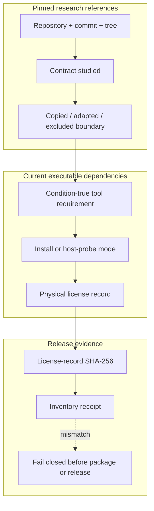

<!-- evidence-lane-public-docs-full-refresh: 3.0.0 / registry-derived-v2 -->

# Upstream reference provenance

This ledger has two deliberately separate layers. The pinned research layer
records public upstream material inspected during the Evidence Lane 1.3.0 PV6
research cycle: exact repository identity, the contract studied, the bounded
local implementation, and material explicitly not copied. The generated 3.0
layer records every current executable tool requirement and its physical
license evidence. Research credit is not source authority, dependency
execution, candidate acceptance, or proof of feature parity.

## Intake and verification boundary

- Evidence Lane Source Intake batch:
  `intake_0db599bb979fc0561db6ed3e4346dec8`
- Batch SHA-256:
  `0DB599BB979FC0561DB6ED3E4346DEC8A2C120F1815605BEAD3BF012116A1CE3`
- Intake result: six ordered URL references plus Chat Lineage; remote URLs were
  classified as `POINTER_TEXT_ONLY`. Source Intake copied no remote payload,
  created no candidate, and moved no accepted pointer.
- Git identity verification: each repository was cloned separately into an
  ignored read-only audit directory. The commits and trees below are the
  independently observed Git identities for that audit, not identities proven
  by the pointer-only intake receipt.

## Exact public reference ledger

### GitHub Agentic Workflows (`github/gh-aw`)

- Repository: <https://github.com/github/gh-aw>
- Audited commit: `5107b7bd547ce124f69084dc623e45a539cd17f5`
- Audited tree: `1fa5cd684c6906a2f7bca8468097292fe4f6a40a`
- License observed at that identity: MIT
- Role: workflow compiler, least-authority Actions boundary, safe-output, and
  cost-control research reference.
- Local use: its contract informed the explicit separation of an Actions run,
  a Copilot coding-agent session, a remote Git action, a deployment, and an
  Evidence Lane PV. The local workflows remain project-authored and pinned.
- Implementation surfaces: `.github/workflows/`,
  `.github/copilot-instructions.md`, and
  `github_automation_governance.py`.
- Boundary: no upstream workflow file is presented as Evidence Lane code and
  no passing Action is treated as an agent session or HIL approval.
- Verdict: **pursue selective safe-workflow and output contracts**. Confidence:
  high. A license conflict, a materially different upstream contract, or a
  failed local receipt-equivalence test would change this verdict.

### GitHub Agentic Workflows MCP Gateway (`github/gh-aw-mcpg`)

- Repository: <https://github.com/github/gh-aw-mcpg>
- Audited commit: `0edcc73107c5a08b5bd8cfd489e68400b5ef95db`
- Audited tree: `58482ae9b60a14327f48f77e71ffd2d1930cf8ea`
- License observed at that identity: MIT
- Role: MCP gateway isolation, validation, bounded transport, timeout, audit,
  and payload-handling research reference.
- Local use: selective fail-closed origin validation, non-public literal-host
  rejection, exact release identity, bounded request bodies, and sanitized
  health output are implemented in `remote_adapter/api/index.py`.
- Boundary: the Evidence Lane adapter is not the upstream gateway, does not
  claim feature parity, and does not import its source.
- Verdict: **pursue selective gateway-safety patterns**. Confidence: high. A
  failing adversarial adapter test or evidence that a selected pattern weakens
  the durable-origin boundary would change this verdict.

### GitHub Copilot SDK (`github/copilot-sdk`)

- Repository: <https://github.com/github/copilot-sdk>
- Audited commit: `4e95deee58f2712a9e75e66a1ffba4460cc9a1d5`
- Audited tree: `3cb5e3b004cc224a538bc17078b651cbe5fa2509`
- License observed at that identity: MIT
- Role: agent-session identity, lifecycle hooks, tool authorization, audit,
  redaction, and bounded-session research reference.
- Local use: Evidence Lane now records Actions evidence and coding-agent
  evidence as different classes and redacts bounded agent output before it can
  enter a remote Git receipt.
- Implementation surfaces: `github_automation_governance.py`,
  `remote_git.py`, `.github/agents/evidence-lane.agent.md`, and their tests.
- Boundary: an Evidence Lane task is not claimed to be a GitHub Copilot agent
  session; only a real GitHub session identifier can prove that surface.
- Verdict: **pursue selective session and hook contracts**. Confidence: high.
  An incompatible GitHub session model or a failed real-agent receipt test
  would change this verdict.

### GitHub Agentic Workflows threat detection (`github/gh-aw-threat-detection`)

- Repository: <https://github.com/github/gh-aw-threat-detection>
- Audited commit: `09cc2eed706368655776af394eab7146629f905a`
- Audited tree: `88003d9a48ba64c31f67cea827fe5ff726c472cf`
- License observed at that identity: MIT
- Role: post-output secret, prompt-injection, destructive-command, and
  infrastructure-failure classification research reference.
- Local use: complete captured remote output is scanned; only a redacted,
  bounded projection is persisted, with threat and infrastructure status kept
  separate. The receipt says `advisory_only` and `post_execution`; it is never
  represented as prevention.
- Implementation surfaces: `github_automation_governance.py`, `remote_git.py`,
  and `tests/test_github_automation_governance.py`.
- Boundary: the local scanner is a narrow project-authored classifier, not the
  upstream product and not a security guarantee.
- Verdict: **fix-then-pursue as advisory defense in depth only**. Confidence:
  high. Independent red-team results with measured false-negative and
  false-positive rates would be required before strengthening the claim.

### GitHub Agentic Workflows harness (`github/gh-aw-harness`)

- Repository: <https://github.com/github/gh-aw-harness>
- Audited commit: `75ed171c12321e0cf4249a732c9860386bdc46a0`
- Audited tree: `c0161d9c6f8a0b50aa00a34c0162b8ac3fbeb01d`
- License observed at that identity: MIT
- Role: research reference for repeatable agent-workflow execution and testing.
- Local use: Evidence Lane adopts a narrow project-authored v1 execution
  contract: exact registered in-process handlers, bounded JSON fixtures,
  explicit PASS/FAIL/ERROR expectations, post-output inspection, deterministic
  case receipts, and a sealed run receipt. Shell, command, executable, working
  directory, and script inputs are rejected before a fixture runs.
- Implementation surfaces: `github_automation_governance.py` and
  `tests/test_github_automation_governance.py`.
- Boundary: no upstream code is imported. The execution harness neither reads
  nor writes the SQLite continuity/retrieval brain; it proves repeatable fixture
  execution, while SQLite separately preserves and retrieves governed history.
- Verdict: **pursue the bounded testable execution contract**. Confidence:
  high. A reproducible failure, non-deterministic receipt, command-input bypass,
  or evidence of hidden SQLite coupling would change this verdict.

### Open WebUI (`open-webui/open-webui`)

- Repository: <https://github.com/open-webui/open-webui>
- Audited commit: `01f4282f1ffe0d6212f58d3afbeae21fffd0c4be`
- Audited tree: `89b6c6e20fd32f8df36309d2ffffc7c9e6043522`
- License observed at that identity: Open WebUI License.
- Role: user-stated conceptual reference for inspectable AI application
  surfaces and human review flows.
- Local use: conceptual credit only. This audit did not prove that current
  Open WebUI bytes were copied into Evidence Lane, and no such code import is
  claimed.
- Boundary: Open WebUI's current license and branding conditions apply to its
  source. Any future byte-level reuse requires a file-level provenance record,
  license review, and a separate accepted Git Delta before implementation.
- Verdict: **fix-then-pursue conceptual credit only; do not import code without
  exact provenance and rights review**. Confidence: high. A verified historical
  commit-to-file derivation and compatible written rights basis would change
  this verdict.

### Graphify (`Graphify-Labs/graphify`)

- Repository: <https://github.com/Graphify-Labs/graphify>
- Audited commit: `00efd6e7969837ae4a9f11d8d504dcd3b20b09df`
- Audited tree: `d1512b0250570474ee45b4169ba2d3b1b35376fa`
- License notices observed at that identity: Apache-2.0 and MIT
- Role: stable graph identities, extracted-versus-inferred provenance, diff
  coverage, and affected-subgraph research.
- Local use: project-authored stable node/edge identities, graph diff coverage,
  and bounded impact traversal with conformance tests.
- Boundary: no Neo4j service, LLM pipeline, installer, UI, or wholesale source
  transplant was adopted. V5.9 names the SQLite Brain Builder identity and is
  not represented as a Graphify version.
- Verdict: **pursue bounded graph contracts**. Confidence: high. A failed
  identity-stability or impact-coverage test, or incompatible license evidence,
  would change this verdict.

### GitHub CodeQL source (`github/codeql`)

- Repository: <https://github.com/github/codeql>
- Audited commit: `74c8994c9fa3ca4551c01879ef9f74e3e09e791a`
- Audited tree: `06e9890166e4ad4bd015439016a137f8f4099ca8`
- License observed at that identity: source MIT; CLI separately licensed
- Role: negative-test and static-analysis research model.
- Local use: project-authored security negative cases and explicit
  `NOT_RUN_LOCAL` receipts when the CodeQL CLI was unavailable.
- Boundary: the CLI was not installed or run, so no CodeQL scan result is
  claimed and no CLI bytes are bundled.
- Verdict: **pursue negative-test guidance only**. Confidence: high. An exact
  executable CLI receipt could justify a separately labeled scan claim.

### GitHub MCP Server (`github/github-mcp-server`)

- Repository: <https://github.com/github/github-mcp-server>
- Audited commit: `3778a41476e31a072430cfee7c5d31c5f72def60`
- Audited tree: `ae97fb877726d54334bebcaaa640e58bab3ca84e`
- License observed at that identity: MIT
- Role: read-only toolset bounds, validation, and connector-routing research.
- Local use: ordered connector guards, capability checks, exact preferred-route
  selection, and ambiguity failure.
- Boundary: Evidence Lane does not embed or execute a second MCP server and
  does not inherit that server's authority.
- Verdict: **pursue connector-boundary patterns**. Confidence: high. A routing
  ambiguity or authority-bypass test failure would change this verdict.

### GitHub Branch Deploy (`github/branch-deploy`)

- Repository: <https://github.com/github/branch-deploy>
- Audited commit: `7ad5ec6a7e19e3e341846e4d33c4ed779b3e8036`
- Audited tree: `5a901697cd7671a61db70f7f27787c6ba257deb8`
- License observed at that identity: MIT
- Role: no-op, commit-safety, and explicit deployment-action research.
- Local use: exact-SHA remote-action preparation, no-op detection, and
  commit-bound deployment receipts.
- Boundary: no automatic merge, main push, production promotion, or implicit
  HIL approval was adopted.
- Verdict: **pursue guarded deployment patterns**. Confidence: high. A receipt
  that can act beyond its bound branch or commit would change this verdict.

### GitHub Local Action (`github/local-action`)

- Repository: <https://github.com/github/local-action>
- Audited commit: `b9351d8a8f1e6eed27646f4d892b49a3847ba180`
- Audited tree: `77093c3aeb8b01bcc35f24c7160596b725a7421d`
- License observed at that identity: MIT
- Role: disposable fixture and secret-safe one-shot execution research.
- Local use: temporary fixture repositories, registered-secret suppression,
  and redacted project-authored proof logs.
- Boundary: no arbitrary JavaScript execution, persistent local runner, or
  host-secret inheritance was adopted.
- Verdict: **pursue bounded fixture patterns**. Confidence: high. A retained
  fixture, unredacted secret, or non-deterministic proof would change it.

<!-- EVIDENCE_LANE_CURRENT_UPSTREAM_INVENTORY_START -->

## Current 3.0 executable dependency and license ledger

The pinned repository research ledger below records inspected prior art. This separate current ledger is generated from the complete executable tool-requirement and physical license-record inventory. The two layers are intentionally not conflated: studying an upstream repository is different from conditionally using or redistributing a runtime capability.

The current inventory contains **119** tool requirements and **119** license classifications. All requirements have physical license records. MCP remains a separate **91-action** inventory and is not counted as 119 tools.

### Classification summary

| Classification | Count |
| --- | ---: |
| `EVIDENCE_LANE_INTERNAL_COMPONENT` | 17 |
| `EXTERNAL_OR_REPOSITORY_GATE` | 24 |
| `HIDDEN_RUNTIME_INTERPRETER` | 1 |
| `HOST_PLATFORM_CAPABILITY` | 1 |
| `HOST_SYSTEM_TOOL` | 1 |
| `NATIVE_RUNTIME_ASSET` | 8 |
| `PYTHON_OR_HOST_DISTRIBUTION` | 64 |
| `SYSTEM_CAPABILITY_WITH_PLUGIN_IMPLEMENTATION` | 3 |

### Complete current requirement ledger

| # | Tool or capability | Requirement | Classification | Install mode | License or terms | Redistributed by source package | Physical license record |
| ---: | --- | --- | --- | --- | --- | --- | --- |
| 1 | `Git` | `REQUIRED_OPTIONAL_FOR_PROJECT_ENGULF` | `HOST_SYSTEM_TOOL` | `host_probe_only` | GPL-2.0-only | no | `toolchains/licenses/requirements/001-git/LICENSE-RECORD.json` (`4CB37A54900E3E99BEA4DF8BA363298D43865D231962D361F5CAAFFF20B9C6C7`) |
| 2 | `Python` | `REQUIRED` | `HIDDEN_RUNTIME_INTERPRETER` | `hidden_runtime` | PSF-2.0 | no | `toolchains/licenses/requirements/002-python/LICENSE-RECORD.json` (`18E313DC4739CD56655A8582E90DE330016BDEEF1C5A9EDFF10DB8589815B629`) |
| 3 | `hashlib_pathlib` | `REQUIRED_INTERNAL` | `EVIDENCE_LANE_INTERNAL_COMPONENT` | `package_internal` | LicenseRef-Proprietary | yes | `toolchains/licenses/requirements/003-hashlib-pathlib/LICENSE-RECORD.json` (`6A92B76DCCD57C1138947A6CE1A4448C2C5F652D90A209E30F7BB5B03FEB67B6`) |
| 4 | `SQLite_CAS` | `REQUIRED` | `SYSTEM_CAPABILITY_WITH_PLUGIN_IMPLEMENTATION` | `hidden_runtime_and_internal_code` | LicenseRef-SQLite-Public-Domain AND LicenseRef-Proprietary | no | `toolchains/licenses/requirements/004-sqlite-cas/LICENSE-RECORD.json` (`7B38B1B1F6E160F81C0696647D04764712CCD6F712BBD9BF7D61B0C729B12751`) |
| 5 | `SQLite_FTS5_BM25` | `REQUIRED` | `SYSTEM_CAPABILITY_WITH_PLUGIN_IMPLEMENTATION` | `hidden_runtime_and_internal_code` | LicenseRef-SQLite-Public-Domain AND LicenseRef-Proprietary | no | `toolchains/licenses/requirements/005-sqlite-fts5-bm25/LICENSE-RECORD.json` (`743AE307C1540B3C1E7BD22C5910C34115302C6E9D8B2AC27B4FD8AADC54B63E`) |
| 6 | `APSW_SQLite_engine` | `REQUIRED_DEPENDENCY` | `PYTHON_OR_HOST_DISTRIBUTION` | `locked_hidden_runtime_or_applicable_build_gate` | EXACT_INSTALLED_DISTRIBUTION_METADATA | no | `toolchains/licenses/requirements/006-apsw-sqlite-engine/LICENSE-RECORD.json` (`4DCF24D7425BAC7365599957E8083B513F3D8B92AA4004DCA46419F2954658C0`) |
| 7 | `deterministic_TFIDF` | `REQUIRED_INTERNAL` | `EVIDENCE_LANE_INTERNAL_COMPONENT` | `package_internal` | LicenseRef-Proprietary | yes | `toolchains/licenses/requirements/007-deterministic-tfidf/LICENSE-RECORD.json` (`8AC2323D659A2C7B8ED6B9A9E6C361C7947C78F46D67C3F38C538F5CD2768D25`) |
| 8 | `LangGraph_Mermaid_engine` | `REQUIRED_DEPENDENCY` | `PYTHON_OR_HOST_DISTRIBUTION` | `locked_hidden_runtime_or_applicable_build_gate` | EXACT_INSTALLED_DISTRIBUTION_METADATA | no | `toolchains/licenses/requirements/008-langgraph-mermaid-engine/LICENSE-RECORD.json` (`FCFA75D3805454609D8956F8B2FCA981776772EEAB5E6C3F8EAD88247780A1BB`) |
| 9 | `Python_Graphviz_DOT_engine` | `REQUIRED_DEPENDENCY` | `PYTHON_OR_HOST_DISTRIBUTION` | `locked_hidden_runtime_or_applicable_build_gate` | EXACT_INSTALLED_DISTRIBUTION_METADATA | no | `toolchains/licenses/requirements/009-python-graphviz-dot-engine/LICENSE-RECORD.json` (`D4A31471647826816BED73BACEC456FADCCBCCF417DF6D1E43DFD3695F31A9C9`) |
| 10 | `LlamaIndex_SQLite_indexer` | `REQUIRED_DEPENDENCY` | `PYTHON_OR_HOST_DISTRIBUTION` | `locked_hidden_runtime_or_applicable_build_gate` | EXACT_INSTALLED_DISTRIBUTION_METADATA | no | `toolchains/licenses/requirements/010-llamaindex-sqlite-indexer/LICENSE-RECORD.json` (`7AC0CAB6CA4E784468A7B2465A767D43F7107D054B3546FC69AFED7FB043AF10`) |
| 11 | `Mermaid_CLI_mmdc` | `OPTIONAL_HIDDEN_RUNTIME_RENDERER` | `PYTHON_OR_HOST_DISTRIBUTION` | `locked_hidden_runtime_or_applicable_build_gate` | EXACT_INSTALLED_DISTRIBUTION_METADATA | no | `toolchains/licenses/requirements/011-mermaid-cli-mmdc/LICENSE-RECORD.json` (`6F70F7D5D12926D09EFABFFC278C69FCF816A159323F5A2DBCD8B36DBF27E37A`) |
| 12 | `Graphviz_dot` | `REQUIRED_HIDDEN_RUNTIME_BINARY` | `NATIVE_RUNTIME_ASSET` | `portable_zip` | EPL-1.0 | no | `toolchains/licenses/requirements/012-graphviz-dot/LICENSE-RECORD.json` (`74A27363589C07E60A2555926407F0D9A15BDB32CDE17EC39AE9BD5B478B6462`) |
| 13 | `Python_structural_parser` | `REQUIRED_INTERNAL` | `EVIDENCE_LANE_INTERNAL_COMPONENT` | `package_internal` | LicenseRef-Proprietary | yes | `toolchains/licenses/requirements/013-python-structural-parser/LICENSE-RECORD.json` (`DB53C1C08BB35FC51F1051F16CA1C88ABD0437FCA2A6031A8A245951B4FDADD7`) |
| 14 | `Package_sealer` | `REQUIRED_INTERNAL` | `EVIDENCE_LANE_INTERNAL_COMPONENT` | `package_internal` | LicenseRef-Proprietary | yes | `toolchains/licenses/requirements/014-package-sealer/LICENSE-RECORD.json` (`7410DF2189F3AF11806C031E20392B5CCC53AFB86E296F00C9CBBD8D1BEBE500`) |
| 15 | `NodeJS_TypeScript` | `REQUIRED_REPOSITORY_ONLY` | `EXTERNAL_OR_REPOSITORY_GATE` | `not_installed_by_tunnel` | EXTERNAL_SERVICE_OR_REPOSITORY_TERMS | no | `toolchains/licenses/requirements/015-nodejs-typescript/LICENSE-RECORD.json` (`BC06F8F07FF9295B8E9D23F847C7F72783D35C74334EEE91ABD1ACC36ADA4F2E`) |
| 16 | `pytest` | `REQUIRED_CODE_ACCEPTANCE` | `PYTHON_OR_HOST_DISTRIBUTION` | `locked_hidden_runtime_or_applicable_build_gate` | EXACT_INSTALLED_DISTRIBUTION_METADATA | no | `toolchains/licenses/requirements/016-pytest/LICENSE-RECORD.json` (`C72F4DD9BDD7DA958F6B8596E4D66D9C593ABDD3A9BFEAF1D720D416C3D97CBC`) |
| 17 | `Ruff` | `REQUIRED_CONFIGURED_GATE` | `PYTHON_OR_HOST_DISTRIBUTION` | `locked_hidden_runtime_or_applicable_build_gate` | EXACT_INSTALLED_DISTRIBUTION_METADATA | no | `toolchains/licenses/requirements/017-ruff/LICENSE-RECORD.json` (`0DCB19A9E3939B1B4C929D65E4CE65FEB70A721D08EDD6C2679D6540C1C2DE57`) |
| 18 | `MyPy` | `REQUIRED_CONFIGURED_GATE` | `PYTHON_OR_HOST_DISTRIBUTION` | `locked_hidden_runtime_or_applicable_build_gate` | EXACT_INSTALLED_DISTRIBUTION_METADATA | no | `toolchains/licenses/requirements/018-mypy/LICENSE-RECORD.json` (`190FC64A230A0F4C5F9517DB7FC5F925C886506E8E2813A59B49DA6A2A118CF7`) |
| 19 | `Secret_redactor` | `REQUIRED_INTERNAL` | `EVIDENCE_LANE_INTERNAL_COMPONENT` | `package_internal` | LicenseRef-Proprietary | yes | `toolchains/licenses/requirements/019-secret-redactor/LICENSE-RECORD.json` (`80A508CB23BFC7F4659A81F4E4061598017D9D5C215B32AC006A7B64F350B265`) |
| 20 | `Hash_chain_writer` | `REQUIRED_INTERNAL` | `EVIDENCE_LANE_INTERNAL_COMPONENT` | `package_internal` | LicenseRef-Proprietary | yes | `toolchains/licenses/requirements/020-hash-chain-writer/LICENSE-RECORD.json` (`001A3BE530B3FAE220E47D6CEFB94981577A85770DE38D7CBA843CA3E93EEA26`) |
| 21 | `ENV_UOP_classifier` | `REQUIRED_INTERNAL_AI_ACTION_PLANE` | `EVIDENCE_LANE_INTERNAL_COMPONENT` | `package_internal` | LicenseRef-Proprietary | yes | `toolchains/licenses/requirements/021-env-uop-classifier/LICENSE-RECORD.json` (`2462BC4C0E3ACC2602BC587F12DBB5EA3B8A461E79451AD6529785681457A46B`) |
| 22 | `PCM_MBA_operators` | `REQUIRED_INTERNAL_AI_ACTION_PLANE` | `EVIDENCE_LANE_INTERNAL_COMPONENT` | `package_internal` | LicenseRef-Proprietary | yes | `toolchains/licenses/requirements/022-pcm-mba-operators/LICENSE-RECORD.json` (`2151CCA4D90EE7AF0A3839859ADF76757492395BE212A5E2798A1E97032B7E35`) |
| 23 | `DOCX_OpenXML` | `REQUIRED_INTERNAL` | `EVIDENCE_LANE_INTERNAL_COMPONENT` | `package_internal` | LicenseRef-Proprietary | yes | `toolchains/licenses/requirements/023-docx-openxml/LICENSE-RECORD.json` (`54DDA0E1CE16440DEEBC86B43A8CD055AD88B704CF603B0BAE739059879BB99D`) |
| 24 | `defusedxml` | `REQUIRED_DEPENDENCY` | `PYTHON_OR_HOST_DISTRIBUTION` | `locked_hidden_runtime_or_applicable_build_gate` | EXACT_INSTALLED_DISTRIBUTION_METADATA | no | `toolchains/licenses/requirements/024-defusedxml/LICENSE-RECORD.json` (`D758F73EFA15A97D00635679A899140F692043B60E8364E0508EADCDB3DAA20A`) |
| 25 | `OpenXML_CSV_JSON_parser` | `REQUIRED_INTERNAL` | `EVIDENCE_LANE_INTERNAL_COMPONENT` | `package_internal` | LicenseRef-Proprietary | yes | `toolchains/licenses/requirements/025-openxml-csv-json-parser/LICENSE-RECORD.json` (`D8D820174A2FC578304BD11326EC8A182DDF845B0EC2821D9C70A50E83629E0E`) |
| 26 | `openpyxl` | `REQUIRED_DEPENDENCY` | `PYTHON_OR_HOST_DISTRIBUTION` | `locked_hidden_runtime_or_applicable_build_gate` | EXACT_INSTALLED_DISTRIBUTION_METADATA | no | `toolchains/licenses/requirements/026-openpyxl/LICENSE-RECORD.json` (`8580D0C42D6A4C87A8D293FC0C04221873B230D9F269CEDE965838221BD9479F`) |
| 27 | `pandas` | `REQUIRED_DEPENDENCY` | `PYTHON_OR_HOST_DISTRIBUTION` | `locked_hidden_runtime_or_applicable_build_gate` | EXACT_INSTALLED_DISTRIBUTION_METADATA | no | `toolchains/licenses/requirements/027-pandas/LICENSE-RECORD.json` (`51CEC48F0220741B4696514CA21E9CE05B892D712BD010AFB6EA08260C37501E`) |
| 28 | `python_calamine` | `REQUIRED_DEPENDENCY` | `PYTHON_OR_HOST_DISTRIBUTION` | `locked_hidden_runtime_or_applicable_build_gate` | EXACT_INSTALLED_DISTRIBUTION_METADATA | no | `toolchains/licenses/requirements/028-python-calamine/LICENSE-RECORD.json` (`FD43E2DA419453809F68A315B8A56D5EC761A71DF5DD489BDDC714F57A08B8CE`) |
| 29 | `pyarrow` | `REQUIRED_DEPENDENCY` | `PYTHON_OR_HOST_DISTRIBUTION` | `locked_hidden_runtime_or_applicable_build_gate` | EXACT_INSTALLED_DISTRIBUTION_METADATA | no | `toolchains/licenses/requirements/029-pyarrow/LICENSE-RECORD.json` (`168D6199F2998507ADE2C5441A685299327AE9E0CDFE0A3E620FBE45F631F314`) |
| 30 | `PPTX_OpenXML` | `REQUIRED_INTERNAL` | `EVIDENCE_LANE_INTERNAL_COMPONENT` | `package_internal` | LicenseRef-Proprietary | yes | `toolchains/licenses/requirements/030-pptx-openxml/LICENSE-RECORD.json` (`1CBCCE578E8FA37D8521B347AA2CCCA118BBDB49917EBE5D8CC8ED79B5FC81B9`) |
| 31 | `pypdf` | `REQUIRED_DEPENDENCY` | `PYTHON_OR_HOST_DISTRIBUTION` | `locked_hidden_runtime_or_applicable_build_gate` | EXACT_INSTALLED_DISTRIBUTION_METADATA | no | `toolchains/licenses/requirements/031-pypdf/LICENSE-RECORD.json` (`F80B067844F25DB08677FEA0390EC50283109D12F96BC8E730573DE2C3C3A060`) |
| 32 | `pypdfium2` | `REQUIRED_DEPENDENCY` | `PYTHON_OR_HOST_DISTRIBUTION` | `locked_hidden_runtime_or_applicable_build_gate` | EXACT_INSTALLED_DISTRIBUTION_METADATA | no | `toolchains/licenses/requirements/032-pypdfium2/LICENSE-RECORD.json` (`54981D2AC1F91282D1786B81495FC3C9BFAC3213FC96D608ACC7792741368818`) |
| 33 | `pdfplumber` | `REQUIRED_DEPENDENCY` | `PYTHON_OR_HOST_DISTRIBUTION` | `locked_hidden_runtime_or_applicable_build_gate` | EXACT_INSTALLED_DISTRIBUTION_METADATA | no | `toolchains/licenses/requirements/033-pdfplumber/LICENSE-RECORD.json` (`7FB79EAD974801463511E54CB9308BB06F5D67CDF6C7187685041C5DFB3F6096`) |
| 34 | `RapidOCR_ONNX_Runtime` | `REQUIRED_DEPENDENCY` | `PYTHON_OR_HOST_DISTRIBUTION` | `locked_hidden_runtime_or_applicable_build_gate` | EXACT_INSTALLED_DISTRIBUTION_METADATA | no | `toolchains/licenses/requirements/034-rapidocr-onnx-runtime/LICENSE-RECORD.json` (`A7DEEB1245260C5D71C7C7BB2EF2343C68B1A817F6EC967DA98BF2B339C2AE37`) |
| 35 | `pytesseract_Tesseract` | `REQUIRED_HIDDEN_RUNTIME_BINARY_AND_DEPENDENCY` | `NATIVE_RUNTIME_ASSET` | `portable_nsis_extract` | Apache-2.0 | no | `toolchains/licenses/requirements/035-pytesseract-tesseract/LICENSE-RECORD.json` (`8367F31F89B188745F3F3D9911A81D1584761A501A1DC5665DEDFB186DDE1912`) |
| 36 | `Pillow` | `REQUIRED_DEPENDENCY` | `PYTHON_OR_HOST_DISTRIBUTION` | `locked_hidden_runtime_or_applicable_build_gate` | EXACT_INSTALLED_DISTRIBUTION_METADATA | no | `toolchains/licenses/requirements/036-pillow/LICENSE-RECORD.json` (`FC4346ACD476381102DF4B6E9D073C8088431D0498CD861065C8B5E6B1B8A162`) |
| 37 | `Poppler_pdftotext_pdfinfo` | `REQUIRED_HIDDEN_RUNTIME_BINARY` | `NATIVE_RUNTIME_ASSET` | `portable_zip` | GPL-2.0-or-later | no | `toolchains/licenses/requirements/037-poppler-pdftotext-pdfinfo/LICENSE-RECORD.json` (`BA8CAA2B6791311DDA9515F100E28DE46FF3965346EF290D33BC903736978A44`) |
| 38 | `Ghostscript` | `OPTIONAL_EXTERNAL_LICENSE_GATED` | `NATIVE_RUNTIME_ASSET` | `silent_installer` | AGPL-3.0-or-later OR LicenseRef-Artifex-Commercial | no | `toolchains/licenses/requirements/038-ghostscript/LICENSE-RECORD.json` (`B486DDF57FA2A8805D8BBFA875A45FDC1D8657CB370CD740A109DFB6697459E9`) |
| 39 | `OpenCV` | `REQUIRED_DEPENDENCY` | `PYTHON_OR_HOST_DISTRIBUTION` | `locked_hidden_runtime_or_applicable_build_gate` | EXACT_INSTALLED_DISTRIBUTION_METADATA | no | `toolchains/licenses/requirements/039-opencv/LICENSE-RECORD.json` (`A4094CD5C2978EB7DED2EEFB1B11DD967C209A0D01672F1F80B724ECC52F3ED8`) |
| 40 | `Custom_schema_compiler` | `REQUIRED_INTERNAL` | `EVIDENCE_LANE_INTERNAL_COMPONENT` | `package_internal` | LicenseRef-Proprietary | yes | `toolchains/licenses/requirements/040-custom-schema-compiler/LICENSE-RECORD.json` (`01B0AEC50492239D48695AEFA13E8E7F9ED53DA265B7D901FDB45B863D5B368F`) |
| 41 | `SQLite_immutable_URI_reader` | `REQUIRED_INTERNAL` | `SYSTEM_CAPABILITY_WITH_PLUGIN_IMPLEMENTATION` | `hidden_runtime_and_internal_code` | LicenseRef-SQLite-Public-Domain AND LicenseRef-Proprietary | no | `toolchains/licenses/requirements/041-sqlite-immutable-uri-reader/LICENSE-RECORD.json` (`D8638084F584E9CCB2A49237C45EC4DA06AF9F223206870290135E60CAA9FE00`) |
| 42 | `Safe_archive_intake` | `REQUIRED_INTERNAL` | `EVIDENCE_LANE_INTERNAL_COMPONENT` | `package_internal` | LicenseRef-Proprietary | yes | `toolchains/licenses/requirements/042-safe-archive-intake/LICENSE-RECORD.json` (`BFF691BBB9E17E02844EB2B0ED0BC719B52E5D6E4821C40214EA04CA9603172E`) |
| 43 | `Citation_binder` | `REQUIRED_INTERNAL` | `EVIDENCE_LANE_INTERNAL_COMPONENT` | `package_internal` | LicenseRef-Proprietary | yes | `toolchains/licenses/requirements/043-citation-binder/LICENSE-RECORD.json` (`2D898F3051145A04399DE0E48D0242C301ADE926E054C7312A61D36239C571E6`) |
| 44 | `Project_inventory` | `REQUIRED_INTERNAL` | `EVIDENCE_LANE_INTERNAL_COMPONENT` | `package_internal` | LicenseRef-Proprietary | yes | `toolchains/licenses/requirements/044-project-inventory/LICENSE-RECORD.json` (`3FEFFE0482754FF2C72E27521DA51C1D39C21339DCB40518274284C6CED5CF04`) |
| 45 | `Git_detector` | `OPTIONAL_INTERNAL` | `EVIDENCE_LANE_INTERNAL_COMPONENT` | `package_internal` | LicenseRef-Proprietary | yes | `toolchains/licenses/requirements/045-git-detector/LICENSE-RECORD.json` (`D426EB164FB2A6DA51965FECFDD2713A091C561370C86E05A05189C7AEB8BA4C`) |
| 46 | `Compatibility_mapper` | `REQUIRED_INTERNAL` | `EVIDENCE_LANE_INTERNAL_COMPONENT` | `package_internal` | LicenseRef-Proprietary | yes | `toolchains/licenses/requirements/046-compatibility-mapper/LICENSE-RECORD.json` (`D74604430C3B859CA31D62CE42657CFD6086B21640F8C07E2600C0FA929EF7F3`) |
| 47 | `MCP_Python_SDK` | `REQUIRED_DEPENDENCY` | `PYTHON_OR_HOST_DISTRIBUTION` | `locked_hidden_runtime_or_applicable_build_gate` | EXACT_INSTALLED_DISTRIBUTION_METADATA | no | `toolchains/licenses/requirements/047-mcp-python-sdk/LICENSE-RECORD.json` (`11A3B884647CAAA7E85097C49C85053FEB52183E098CFDD2C4F90D3907B1EC5A`) |
| 48 | `Pydantic` | `REQUIRED_DEPENDENCY` | `PYTHON_OR_HOST_DISTRIBUTION` | `locked_hidden_runtime_or_applicable_build_gate` | EXACT_INSTALLED_DISTRIBUTION_METADATA | no | `toolchains/licenses/requirements/048-pydantic/LICENSE-RECORD.json` (`E3F4A890D68D7FEBB6B623F65063166917EB10AB6FD79E4A660B458C74267D92`) |
| 49 | `HTTPX` | `REQUIRED_FOR_CONFIGURED_NETWORK_ADAPTERS` | `PYTHON_OR_HOST_DISTRIBUTION` | `locked_hidden_runtime_or_applicable_build_gate` | EXACT_INSTALLED_DISTRIBUTION_METADATA | no | `toolchains/licenses/requirements/049-httpx/LICENSE-RECORD.json` (`D6B0E044B10C3DE5EE60C0CE5C8330DCEA44CA5AFF6FBBCC76DB9C94DCB66811`) |
| 50 | `Cryptography_PyJWT` | `REQUIRED_PROTECTED_REMOTE_PROFILES` | `PYTHON_OR_HOST_DISTRIBUTION` | `locked_hidden_runtime_or_applicable_build_gate` | EXACT_INSTALLED_DISTRIBUTION_METADATA | no | `toolchains/licenses/requirements/050-cryptography-pyjwt/LICENSE-RECORD.json` (`EA320F3231E28FB348E5A3CE3E28B290CB88742EA27C25A44B657EE7CB898AA2`) |
| 51 | `PowerShell_Win32_APIs` | `REQUIRED_WINDOWS_HOST` | `HOST_PLATFORM_CAPABILITY` | `host_probe_only` | HOST_PLATFORM_TERMS | no | `toolchains/licenses/requirements/051-powershell-win32-apis/LICENSE-RECORD.json` (`0159E43B4FA9F0BE7BC96499324CD529F04AAFDE341776C55D53E8EDE4ECC273`) |
| 52 | `ripgrep_15_2_0` | `PACKAGED_PRE_INDEX_HELPER` | `NATIVE_RUNTIME_ASSET` | `package_local_existing` | MIT OR Unlicense | yes | `toolchains/licenses/requirements/052-ripgrep-15-2-0/LICENSE-RECORD.json` (`6C546C776BE2CDAB1707C02AC8CB6C066B88A1E9AC7610B7B0B41945E8C76F6D`) |
| 53 | `SevenZip_NSIS_extractor` | `REQUIRED_HIDDEN_RUNTIME_BINARY` | `NATIVE_RUNTIME_ASSET` | `package_local_support_bundle` | LicenseRef-7-Zip | no | `toolchains/licenses/requirements/053-sevenzip-nsis-extractor/LICENSE-RECORD.json` (`58682C9F120E88B7AEBEAE86C97C0C91C6445940A89EED0FFC1CAB090603B054`) |
| 54 | `jq` | `REQUIRED_HIDDEN_RUNTIME_BINARY` | `NATIVE_RUNTIME_ASSET` | `portable_executable` | MIT | no | `toolchains/licenses/requirements/054-jq/LICENSE-RECORD.json` (`298E38027788D53C95E7AF2B556130C18317F477606E0DA6842C512AB0918FA4`) |
| 55 | `FFmpeg` | `REQUIRED_HIDDEN_RUNTIME_BINARY_AND_DEPENDENCY` | `NATIVE_RUNTIME_ASSET` | `python_wheel_binary` | BSD-2-Clause wrapper; bundled FFmpeg license reported at install | no | `toolchains/licenses/requirements/055-ffmpeg/LICENSE-RECORD.json` (`FE05D5984EE12807CB0522B8974C2EC935026E22FA886C856A3EC8EF749CB649`) |
| 56 | `PyMuPDF` | `REQUIRED_DEPENDENCY` | `PYTHON_OR_HOST_DISTRIBUTION` | `locked_hidden_runtime_or_applicable_build_gate` | EXACT_INSTALLED_DISTRIBUTION_METADATA | no | `toolchains/licenses/requirements/056-pymupdf/LICENSE-RECORD.json` (`4F008F4A7B1849F69B70B8FE4E57A0AA1EFEF1E59118D056F5D9F2846AB2DCAD`) |
| 57 | `Docling` | `REQUIRED_DEPENDENCY` | `PYTHON_OR_HOST_DISTRIBUTION` | `locked_hidden_runtime_or_applicable_build_gate` | EXACT_INSTALLED_DISTRIBUTION_METADATA | no | `toolchains/licenses/requirements/057-docling/LICENSE-RECORD.json` (`5C985C207A72EED2FCA10BF4DD1F66572506DD130F076819AB1E374784936E83`) |
| 58 | `lxml` | `REQUIRED_DEPENDENCY` | `PYTHON_OR_HOST_DISTRIBUTION` | `locked_hidden_runtime_or_applicable_build_gate` | EXACT_INSTALLED_DISTRIBUTION_METADATA | no | `toolchains/licenses/requirements/058-lxml/LICENSE-RECORD.json` (`88CD9E3995DE68BCFB17A3838AB41C5357321CB540852A0FFADC50D26650563F`) |
| 59 | `BeautifulSoup4` | `REQUIRED_DEPENDENCY` | `PYTHON_OR_HOST_DISTRIBUTION` | `locked_hidden_runtime_or_applicable_build_gate` | EXACT_INSTALLED_DISTRIBUTION_METADATA | no | `toolchains/licenses/requirements/059-beautifulsoup4/LICENSE-RECORD.json` (`E82398722BF409B7B478FBB41C9E8E45C1E69C46A314A19E27F36883063F4BEE`) |
| 60 | `markdownify` | `REQUIRED_DEPENDENCY` | `PYTHON_OR_HOST_DISTRIBUTION` | `locked_hidden_runtime_or_applicable_build_gate` | EXACT_INSTALLED_DISTRIBUTION_METADATA | no | `toolchains/licenses/requirements/060-markdownify/LICENSE-RECORD.json` (`F25C24AF98C138F5A46D341C09DB99FF591F5E0AE6182BDC2E8A0B93E2A943E4`) |
| 61 | `html2text` | `REQUIRED_DEPENDENCY` | `PYTHON_OR_HOST_DISTRIBUTION` | `locked_hidden_runtime_or_applicable_build_gate` | EXACT_INSTALLED_DISTRIBUTION_METADATA | no | `toolchains/licenses/requirements/061-html2text/LICENSE-RECORD.json` (`EF60ED52D6ECC7B3CAFD90CE10B4B134A9A082CF41CCF9A786915B9B077A7DFF`) |
| 62 | `trafilatura` | `REQUIRED_DEPENDENCY` | `PYTHON_OR_HOST_DISTRIBUTION` | `locked_hidden_runtime_or_applicable_build_gate` | EXACT_INSTALLED_DISTRIBUTION_METADATA | no | `toolchains/licenses/requirements/062-trafilatura/LICENSE-RECORD.json` (`06866D888D85EB3868DEBFA5A68F78BA2DB35CA717A6891833D052F9FA28B47E`) |
| 63 | `DuckDB` | `REQUIRED_DEPENDENCY` | `PYTHON_OR_HOST_DISTRIBUTION` | `locked_hidden_runtime_or_applicable_build_gate` | EXACT_INSTALLED_DISTRIBUTION_METADATA | no | `toolchains/licenses/requirements/063-duckdb/LICENSE-RECORD.json` (`E06B056147EBB0919262396FDDAEF5666394F47E1D8F327A6BA8B7B5DA94D5DC`) |
| 64 | `SQLAlchemy` | `REQUIRED_DEPENDENCY` | `PYTHON_OR_HOST_DISTRIBUTION` | `locked_hidden_runtime_or_applicable_build_gate` | EXACT_INSTALLED_DISTRIBUTION_METADATA | no | `toolchains/licenses/requirements/064-sqlalchemy/LICENSE-RECORD.json` (`1C1BE1B3AAACC558E426EABC3062FAB491EF52739DCEF1924EED34A2E2E2AB12`) |
| 65 | `Tableau_Hyper_API` | `REQUIRED_DEPENDENCY` | `PYTHON_OR_HOST_DISTRIBUTION` | `locked_hidden_runtime_or_applicable_build_gate` | EXACT_INSTALLED_DISTRIBUTION_METADATA | no | `toolchains/licenses/requirements/065-tableau-hyper-api/LICENSE-RECORD.json` (`B7F061326557B5866116092C375BFC05350BE74998E608BDDB27E03996E65EE0`) |
| 66 | `LangChain` | `REQUIRED_DEPENDENCY` | `PYTHON_OR_HOST_DISTRIBUTION` | `locked_hidden_runtime_or_applicable_build_gate` | EXACT_INSTALLED_DISTRIBUTION_METADATA | no | `toolchains/licenses/requirements/066-langchain/LICENSE-RECORD.json` (`672DD347DD1030E37535F4E33B556C85EFCA6C269D0F55E43D477B455BE78E9E`) |
| 67 | `SentenceTransformers` | `REQUIRED_DEPENDENCY` | `PYTHON_OR_HOST_DISTRIBUTION` | `locked_hidden_runtime_or_applicable_build_gate` | EXACT_INSTALLED_DISTRIBUTION_METADATA | no | `toolchains/licenses/requirements/067-sentencetransformers/LICENSE-RECORD.json` (`FB1CE69193D63F84C68CDFC869A199C51202578DE40DBCC9721691617486948E`) |
| 68 | `FAISS_CPU` | `REQUIRED_DEPENDENCY` | `PYTHON_OR_HOST_DISTRIBUTION` | `locked_hidden_runtime_or_applicable_build_gate` | EXACT_INSTALLED_DISTRIBUTION_METADATA | no | `toolchains/licenses/requirements/068-faiss-cpu/LICENSE-RECORD.json` (`F40B72AFC2139872961BBC7BDA8B6721814DA1AA989FC9287E74A8D7554ABC73`) |
| 69 | `rank_bm25` | `REQUIRED_DEPENDENCY` | `PYTHON_OR_HOST_DISTRIBUTION` | `locked_hidden_runtime_or_applicable_build_gate` | EXACT_INSTALLED_DISTRIBUTION_METADATA | no | `toolchains/licenses/requirements/069-rank-bm25/LICENSE-RECORD.json` (`4DA8C99ECBD65BDA6A65E6F2C4EC632D6BB1EDD7419DF1D713859B5F5D9C2F56`) |
| 70 | `FastAPI` | `REQUIRED_DEPENDENCY` | `PYTHON_OR_HOST_DISTRIBUTION` | `locked_hidden_runtime_or_applicable_build_gate` | EXACT_INSTALLED_DISTRIBUTION_METADATA | no | `toolchains/licenses/requirements/070-fastapi/LICENSE-RECORD.json` (`3C6DADA1FB109F0E98CEAB2859A9487C4378A9CFF9F3585EBEB7EF42BE19148C`) |
| 71 | `Uvicorn` | `REQUIRED_DEPENDENCY` | `PYTHON_OR_HOST_DISTRIBUTION` | `locked_hidden_runtime_or_applicable_build_gate` | EXACT_INSTALLED_DISTRIBUTION_METADATA | no | `toolchains/licenses/requirements/071-uvicorn/LICENSE-RECORD.json` (`E311838F3B21742D48B8BC180B38DF9B8F79BBC3F62284EA9C612E42751CF96C`) |
| 72 | `Pydantic_Settings` | `REQUIRED_DEPENDENCY` | `PYTHON_OR_HOST_DISTRIBUTION` | `locked_hidden_runtime_or_applicable_build_gate` | EXACT_INSTALLED_DISTRIBUTION_METADATA | no | `toolchains/licenses/requirements/072-pydantic-settings/LICENSE-RECORD.json` (`348D1CCE7412D7A4B8E1575040A289F4206D9C0CE0253FEE7D54A6C6CBD036C3`) |
| 73 | `python_multipart` | `REQUIRED_DEPENDENCY` | `PYTHON_OR_HOST_DISTRIBUTION` | `locked_hidden_runtime_or_applicable_build_gate` | EXACT_INSTALLED_DISTRIBUTION_METADATA | no | `toolchains/licenses/requirements/073-python-multipart/LICENSE-RECORD.json` (`2E466B0209263ADE3CB480CA71F5D560D155108EB563DA62EEA07963522D7957`) |
| 74 | `Requests` | `REQUIRED_DEPENDENCY` | `PYTHON_OR_HOST_DISTRIBUTION` | `locked_hidden_runtime_or_applicable_build_gate` | EXACT_INSTALLED_DISTRIBUTION_METADATA | no | `toolchains/licenses/requirements/074-requests/LICENSE-RECORD.json` (`8D1D1D8E6D44100AED7B069F57FCB9CE85892241FA90A72B22EFABB0EEB24391`) |
| 75 | `aiofiles` | `REQUIRED_DEPENDENCY` | `PYTHON_OR_HOST_DISTRIBUTION` | `locked_hidden_runtime_or_applicable_build_gate` | EXACT_INSTALLED_DISTRIBUTION_METADATA | no | `toolchains/licenses/requirements/075-aiofiles/LICENSE-RECORD.json` (`C5B9128E2239CC01EB0391D5973645C4B4122A5CD4567BCCC4956E239E39F60E`) |
| 76 | `orjson` | `REQUIRED_DEPENDENCY` | `PYTHON_OR_HOST_DISTRIBUTION` | `locked_hidden_runtime_or_applicable_build_gate` | EXACT_INSTALLED_DISTRIBUTION_METADATA | no | `toolchains/licenses/requirements/076-orjson/LICENSE-RECORD.json` (`E71D457A71AA0DAE4B81B1DAAAAA7443DD0078972E481EBC457325C394606FC0`) |
| 77 | `python_dotenv` | `REQUIRED_DEPENDENCY` | `PYTHON_OR_HOST_DISTRIBUTION` | `locked_hidden_runtime_or_applicable_build_gate` | EXACT_INSTALLED_DISTRIBUTION_METADATA | no | `toolchains/licenses/requirements/077-python-dotenv/LICENSE-RECORD.json` (`93105CDB82F35E41833DA44C5F448361708D83703B9A4175E0ECA2522ABE41CA`) |
| 78 | `Tenacity` | `REQUIRED_DEPENDENCY` | `PYTHON_OR_HOST_DISTRIBUTION` | `locked_hidden_runtime_or_applicable_build_gate` | EXACT_INSTALLED_DISTRIBUTION_METADATA | no | `toolchains/licenses/requirements/078-tenacity/LICENSE-RECORD.json` (`83A40893332E44541072BC3E260E23E1CFD064656576A74C94016970FC30DFA3`) |
| 79 | `psutil` | `REQUIRED_DEPENDENCY` | `PYTHON_OR_HOST_DISTRIBUTION` | `locked_hidden_runtime_or_applicable_build_gate` | EXACT_INSTALLED_DISTRIBUTION_METADATA | no | `toolchains/licenses/requirements/079-psutil/LICENSE-RECORD.json` (`92450F8C0C42AAB237A0508B5BC335DB5D9ACF900DD57F9EE1028EE2C5F5958D`) |
| 80 | `DDGS` | `REQUIRED_DEPENDENCY` | `PYTHON_OR_HOST_DISTRIBUTION` | `locked_hidden_runtime_or_applicable_build_gate` | EXACT_INSTALLED_DISTRIBUTION_METADATA | no | `toolchains/licenses/requirements/080-ddgs/LICENSE-RECORD.json` (`31B12807D87680B5D157616C84285B19E01E3C959DC090B8FE93EC44DB1C0545`) |
| 81 | `PyGithub` | `REQUIRED_DEPENDENCY` | `PYTHON_OR_HOST_DISTRIBUTION` | `locked_hidden_runtime_or_applicable_build_gate` | EXACT_INSTALLED_DISTRIBUTION_METADATA | no | `toolchains/licenses/requirements/081-pygithub/LICENSE-RECORD.json` (`14669D9A14E03D512A8E99C91206AA3245B956A46A3069DD919F019582CE7E45`) |
| 82 | `GitPython` | `REQUIRED_DEPENDENCY` | `PYTHON_OR_HOST_DISTRIBUTION` | `locked_hidden_runtime_or_applicable_build_gate` | EXACT_INSTALLED_DISTRIBUTION_METADATA | no | `toolchains/licenses/requirements/082-gitpython/LICENSE-RECORD.json` (`883AD90D5D064565C04060D5C153F41AF655C32FB5A41D53C70F2E67FDEA9DA0`) |
| 83 | `tldextract` | `REQUIRED_DEPENDENCY` | `PYTHON_OR_HOST_DISTRIBUTION` | `locked_hidden_runtime_or_applicable_build_gate` | EXACT_INSTALLED_DISTRIBUTION_METADATA | no | `toolchains/licenses/requirements/083-tldextract/LICENSE-RECORD.json` (`A74F6E74A368385BDE137FCE98AB53FC57D0FFF87637BBFADCB38B4485BD5D05`) |
| 84 | `validators` | `REQUIRED_DEPENDENCY` | `PYTHON_OR_HOST_DISTRIBUTION` | `locked_hidden_runtime_or_applicable_build_gate` | EXACT_INSTALLED_DISTRIBUTION_METADATA | no | `toolchains/licenses/requirements/084-validators/LICENSE-RECORD.json` (`4D4A5909486346C4307B4559655EE05290193D0588B99D5483D762DA9387AE7D`) |
| 85 | `readability_lxml` | `REQUIRED_DEPENDENCY` | `PYTHON_OR_HOST_DISTRIBUTION` | `locked_hidden_runtime_or_applicable_build_gate` | EXACT_INSTALLED_DISTRIBUTION_METADATA | no | `toolchains/licenses/requirements/085-readability-lxml/LICENSE-RECORD.json` (`A0A98C929F77FC23A89C80B5544D93D2F1ED2A568B3A3A42601D6B4BED162CDD`) |
| 86 | `Polars` | `REQUIRED_DEPENDENCY` | `PYTHON_OR_HOST_DISTRIBUTION` | `locked_hidden_runtime_or_applicable_build_gate` | EXACT_INSTALLED_DISTRIBUTION_METADATA | no | `toolchains/licenses/requirements/086-polars/LICENSE-RECORD.json` (`7AFBED126DB17BF39C423CD98CF9E6871E0312C9895272C7061FE0A6220D9E3F`) |
| 87 | `TreeSitter_LanguagePack` | `REQUIRED_DEPENDENCY` | `PYTHON_OR_HOST_DISTRIBUTION` | `locked_hidden_runtime_or_applicable_build_gate` | EXACT_INSTALLED_DISTRIBUTION_METADATA | no | `toolchains/licenses/requirements/087-treesitter-languagepack/LICENSE-RECORD.json` (`468F64C5FF17A80590C2C6B4FBEE6AEF95BC9007D155722C6D3F0DDC25775983`) |
| 88 | `RapidFuzz` | `REQUIRED_DEPENDENCY` | `PYTHON_OR_HOST_DISTRIBUTION` | `locked_hidden_runtime_or_applicable_build_gate` | EXACT_INSTALLED_DISTRIBUTION_METADATA | no | `toolchains/licenses/requirements/088-rapidfuzz/LICENSE-RECORD.json` (`F00E16A18254E3E0B64620457119511BA2CB4DBA8494B5EABA32684C0B999036`) |
| 89 | `rustworkx` | `REQUIRED_DEPENDENCY` | `PYTHON_OR_HOST_DISTRIBUTION` | `locked_hidden_runtime_or_applicable_build_gate` | EXACT_INSTALLED_DISTRIBUTION_METADATA | no | `toolchains/licenses/requirements/089-rustworkx/LICENSE-RECORD.json` (`19058D828E4B419668A3BAEFDE636B6F9B3AE8F9BDEBA137F7117BF733FBD06D`) |
| 90 | `sqlite_vec` | `CONDITIONAL_SQLITE_VECTOR_EXTENSION` | `PYTHON_OR_HOST_DISTRIBUTION` | `locked_hidden_runtime_or_applicable_build_gate` | EXACT_INSTALLED_DISTRIBUTION_METADATA | no | `toolchains/licenses/requirements/090-sqlite-vec/LICENSE-RECORD.json` (`638D5306AE86924C1BE01FFCAA30FB88F5AC6D8A5A626172D84EC7D99414E454`) |
| 91 | `HuggingFace_Hub_ModelSnapshot` | `REQUIRED_LOCAL_UPDATE_MODEL_ACQUISITION` | `PYTHON_OR_HOST_DISTRIBUTION` | `locked_hidden_runtime_or_applicable_build_gate` | EXACT_INSTALLED_DISTRIBUTION_METADATA | no | `toolchains/licenses/requirements/091-huggingface-hub-modelsnapshot/LICENSE-RECORD.json` (`F8F38B682576627DBA98FB0A4DCCE1CA755C4BC5D2A1AEBE78488A0553658F4F`) |
| 92 | `NextJS_React_ThreeJS_FramerMotion` | `REPOSITORY_PUBLIC_ADAPTER_ONLY` | `EXTERNAL_OR_REPOSITORY_GATE` | `not_installed_by_tunnel` | EXTERNAL_SERVICE_OR_REPOSITORY_TERMS | no | `toolchains/licenses/requirements/092-nextjs-react-threejs-framermotion/LICENSE-RECORD.json` (`06D54834A2ED579ACD1989A0E50A187562BCA564CC48B3FF862BDDE1FD1CF585`) |
| 93 | `GitHub_Actions` | `CONFIGURED_EXTERNAL_SERVICE` | `EXTERNAL_OR_REPOSITORY_GATE` | `not_installed_by_tunnel` | EXTERNAL_SERVICE_OR_REPOSITORY_TERMS | no | `toolchains/licenses/requirements/093-github-actions/LICENSE-RECORD.json` (`F4C3768DF474B090C3D189B3BD05187BEC1DF5B0BB25E7EAAD61B918041124DA`) |
| 94 | `Vercel_Git_integration` | `CONFIGURED_EXTERNAL_SERVICE` | `EXTERNAL_OR_REPOSITORY_GATE` | `not_installed_by_tunnel` | EXTERNAL_SERVICE_OR_REPOSITORY_TERMS | no | `toolchains/licenses/requirements/094-vercel-git-integration/LICENSE-RECORD.json` (`F18005C76ED70133F02E6D0563DA9A604B1F80C4E977C13DDE5EC8072DF56C9B`) |
| 95 | `OpenAI_Agents_SDK` | `REQUIRED_DEPENDENCY` | `PYTHON_OR_HOST_DISTRIBUTION` | `locked_hidden_runtime_or_applicable_build_gate` | EXACT_INSTALLED_DISTRIBUTION_METADATA | no | `toolchains/licenses/requirements/095-openai-agents-sdk/LICENSE-RECORD.json` (`3C7880F9C1F73ACEE186E9E06485DDABBCE977131F1C68BD2C7C98C5789EDC5A`) |
| 96 | `FastMCP` | `REQUIRED_DEPENDENCY` | `PYTHON_OR_HOST_DISTRIBUTION` | `locked_hidden_runtime_or_applicable_build_gate` | EXACT_INSTALLED_DISTRIBUTION_METADATA | no | `toolchains/licenses/requirements/096-fastmcp/LICENSE-RECORD.json` (`64CC0819966F9F28DD8FABA26456BF4EBF23E977B007445E0E5D0E5D9530B8A4`) |
| 97 | `GitHub_MCP_Server` | `CONFIGURED_EXTERNAL_SERVICE` | `EXTERNAL_OR_REPOSITORY_GATE` | `not_installed_by_tunnel` | EXTERNAL_SERVICE_OR_REPOSITORY_TERMS | no | `toolchains/licenses/requirements/097-github-mcp-server/LICENSE-RECORD.json` (`8E0AA10FFD79AFB3B952AEC5F21BC89550E326D9EB8716BCF48A1ACC55AC9CF9`) |
| 98 | `Filesystem_MCP_Server` | `CONFIGURED_EXTERNAL_SERVICE` | `EXTERNAL_OR_REPOSITORY_GATE` | `not_installed_by_tunnel` | EXTERNAL_SERVICE_OR_REPOSITORY_TERMS | no | `toolchains/licenses/requirements/098-filesystem-mcp-server/LICENSE-RECORD.json` (`6C160C55B68B3CB53D585DF85FD36757F23E57ABD7B0A6D068ABA0E454F5F00E`) |
| 99 | `PostgreSQL_MCP_Server` | `CONFIGURED_EXTERNAL_SERVICE` | `EXTERNAL_OR_REPOSITORY_GATE` | `not_installed_by_tunnel` | EXTERNAL_SERVICE_OR_REPOSITORY_TERMS | no | `toolchains/licenses/requirements/099-postgresql-mcp-server/LICENSE-RECORD.json` (`C31E3F8E242B72ECFB9164B9EC8798C7150ABFB1ED93A25952E5C45615E3FF52`) |
| 100 | `Slack_MCP_Server` | `CONFIGURED_EXTERNAL_SERVICE` | `EXTERNAL_OR_REPOSITORY_GATE` | `not_installed_by_tunnel` | EXTERNAL_SERVICE_OR_REPOSITORY_TERMS | no | `toolchains/licenses/requirements/100-slack-mcp-server/LICENSE-RECORD.json` (`179FBFCE2D20B5D8BF1C24334E952A9DFD4E583F51BA9E5EE59816007659EB14`) |
| 101 | `Pinecone` | `CONFIGURED_EXTERNAL_SERVICE` | `EXTERNAL_OR_REPOSITORY_GATE` | `not_installed_by_tunnel` | EXTERNAL_SERVICE_OR_REPOSITORY_TERMS | no | `toolchains/licenses/requirements/101-pinecone/LICENSE-RECORD.json` (`D283E17B3CFD3205DBADD23A62135AA91B0E5628FA99414665546F32CB586CFA`) |
| 102 | `Weaviate` | `CONFIGURED_EXTERNAL_SERVICE` | `EXTERNAL_OR_REPOSITORY_GATE` | `not_installed_by_tunnel` | EXTERNAL_SERVICE_OR_REPOSITORY_TERMS | no | `toolchains/licenses/requirements/102-weaviate/LICENSE-RECORD.json` (`1DBB2B746E92612A51D47329111D228162DCDFE2A68373BEBEA1EBE32B7229CB`) |
| 103 | `Milvus` | `CONFIGURED_EXTERNAL_SERVICE` | `EXTERNAL_OR_REPOSITORY_GATE` | `not_installed_by_tunnel` | EXTERNAL_SERVICE_OR_REPOSITORY_TERMS | no | `toolchains/licenses/requirements/103-milvus/LICENSE-RECORD.json` (`982DD7ED8D9C3B1AAD6062A29B6D6FB3B7CA0622A1CA8EF52627BDFAAD83AEDC`) |
| 104 | `OpenSearch` | `CONFIGURED_EXTERNAL_SERVICE` | `EXTERNAL_OR_REPOSITORY_GATE` | `not_installed_by_tunnel` | EXTERNAL_SERVICE_OR_REPOSITORY_TERMS | no | `toolchains/licenses/requirements/104-opensearch/LICENSE-RECORD.json` (`F7E181137DA4799657FB93A74ED9EB854B30DB3D39B4C4C7B312EE319C4CED6B`) |
| 105 | `LangSmith` | `REQUIRED_DEPENDENCY` | `PYTHON_OR_HOST_DISTRIBUTION` | `locked_hidden_runtime_or_applicable_build_gate` | EXACT_INSTALLED_DISTRIBUTION_METADATA | no | `toolchains/licenses/requirements/105-langsmith/LICENSE-RECORD.json` (`7623AE616368ED5E35AFAB6D5DC8D92E5F7EB4A0875457CB4BCBD8501788CCA6`) |
| 106 | `TruLens` | `CONFIGURED_EXTERNAL_SERVICE` | `EXTERNAL_OR_REPOSITORY_GATE` | `not_installed_by_tunnel` | EXTERNAL_SERVICE_OR_REPOSITORY_TERMS | no | `toolchains/licenses/requirements/106-trulens/LICENSE-RECORD.json` (`D67EC4FC24EFFB7F1C139D4FA7462058C3217C3F41D2402E2A7B188DBE533A59`) |
| 107 | `DeepEval` | `CONFIGURED_EXTERNAL_SERVICE` | `EXTERNAL_OR_REPOSITORY_GATE` | `not_installed_by_tunnel` | EXTERNAL_SERVICE_OR_REPOSITORY_TERMS | no | `toolchains/licenses/requirements/107-deepeval/LICENSE-RECORD.json` (`CDB54A5A05E6E180307CF36446CCDA30C874E97B1FAD42132646E35B782C3D1C`) |
| 108 | `Promptfoo` | `CONFIGURED_EXTERNAL_SERVICE` | `EXTERNAL_OR_REPOSITORY_GATE` | `not_installed_by_tunnel` | EXTERNAL_SERVICE_OR_REPOSITORY_TERMS | no | `toolchains/licenses/requirements/108-promptfoo/LICENSE-RECORD.json` (`B6CBE1BCFB1BE8A8D58810F92600D76587798EFFD6F4E617C58BA1A4E4C599EB`) |
| 109 | `Langfuse` | `REQUIRED_DEPENDENCY` | `PYTHON_OR_HOST_DISTRIBUTION` | `locked_hidden_runtime_or_applicable_build_gate` | EXACT_INSTALLED_DISTRIBUTION_METADATA | no | `toolchains/licenses/requirements/109-langfuse/LICENSE-RECORD.json` (`03A9C162A609FF82496D8693885FA11FD6DB98FBF71A82827CBDBC57AB7648BB`) |
| 110 | `Helicone` | `CONFIGURED_EXTERNAL_SERVICE` | `EXTERNAL_OR_REPOSITORY_GATE` | `not_installed_by_tunnel` | EXTERNAL_SERVICE_OR_REPOSITORY_TERMS | no | `toolchains/licenses/requirements/110-helicone/LICENSE-RECORD.json` (`525C1EC3866DCD9911C245976A5EB2AD72F921A1EA24F35DC425B8073882691B`) |
| 111 | `OpenTelemetry` | `REQUIRED_DEPENDENCY` | `PYTHON_OR_HOST_DISTRIBUTION` | `locked_hidden_runtime_or_applicable_build_gate` | EXACT_INSTALLED_DISTRIBUTION_METADATA | no | `toolchains/licenses/requirements/111-opentelemetry/LICENSE-RECORD.json` (`F5A38FED821C9D4B91279BFF348F543D78C15FCAA0E83B28FEDDCEC0D8275BB8`) |
| 112 | `Grafana` | `CONFIGURED_EXTERNAL_SERVICE` | `EXTERNAL_OR_REPOSITORY_GATE` | `not_installed_by_tunnel` | EXTERNAL_SERVICE_OR_REPOSITORY_TERMS | no | `toolchains/licenses/requirements/112-grafana/LICENSE-RECORD.json` (`5907F0D10372E6F70308B6B33E7DCA0B1D1A97084DAB563AB87ADED2C67F3CCF`) |
| 113 | `Docker` | `CONFIGURED_EXTERNAL_SERVICE` | `EXTERNAL_OR_REPOSITORY_GATE` | `not_installed_by_tunnel` | EXTERNAL_SERVICE_OR_REPOSITORY_TERMS | no | `toolchains/licenses/requirements/113-docker/LICENSE-RECORD.json` (`ECD4D02482B9428DF0B562355CE6F827C8FD80D92079BB3FC751AA773CAF175D`) |
| 114 | `Kubernetes` | `CONFIGURED_EXTERNAL_SERVICE` | `EXTERNAL_OR_REPOSITORY_GATE` | `not_installed_by_tunnel` | EXTERNAL_SERVICE_OR_REPOSITORY_TERMS | no | `toolchains/licenses/requirements/114-kubernetes/LICENSE-RECORD.json` (`C30B46428DA54DA382008976DCC7912221CD471A779D8A65672ED7A4E332CF55`) |
| 115 | `AWS_Lambda` | `CONFIGURED_EXTERNAL_SERVICE` | `EXTERNAL_OR_REPOSITORY_GATE` | `not_installed_by_tunnel` | EXTERNAL_SERVICE_OR_REPOSITORY_TERMS | no | `toolchains/licenses/requirements/115-aws-lambda/LICENSE-RECORD.json` (`EBFB3DFA0355ED450E8173617D0E0491E9CFB42EACA197768B0ED731A03872AB`) |
| 116 | `Google_Cloud_Run` | `CONFIGURED_EXTERNAL_SERVICE` | `EXTERNAL_OR_REPOSITORY_GATE` | `not_installed_by_tunnel` | EXTERNAL_SERVICE_OR_REPOSITORY_TERMS | no | `toolchains/licenses/requirements/116-google-cloud-run/LICENSE-RECORD.json` (`712EC9BB5F4785F56EDF7A8C9C91010970F8A787286B188B4075AB57F6C78BD2`) |
| 117 | `AWS` | `CONFIGURED_EXTERNAL_SERVICE` | `EXTERNAL_OR_REPOSITORY_GATE` | `not_installed_by_tunnel` | EXTERNAL_SERVICE_OR_REPOSITORY_TERMS | no | `toolchains/licenses/requirements/117-aws/LICENSE-RECORD.json` (`7B20140387A15692A1838189EDFF03BBCA11923EBF04C8BE6F7FB31EC5D79061`) |
| 118 | `Azure` | `CONFIGURED_EXTERNAL_SERVICE` | `EXTERNAL_OR_REPOSITORY_GATE` | `not_installed_by_tunnel` | EXTERNAL_SERVICE_OR_REPOSITORY_TERMS | no | `toolchains/licenses/requirements/118-azure/LICENSE-RECORD.json` (`B7999ADF642B7E290D83A84C86135A8DAEECD75E04D443728FE5A0E02D387E42`) |
| 119 | `Google_Cloud` | `CONFIGURED_EXTERNAL_SERVICE` | `EXTERNAL_OR_REPOSITORY_GATE` | `not_installed_by_tunnel` | EXTERNAL_SERVICE_OR_REPOSITORY_TERMS | no | `toolchains/licenses/requirements/119-google-cloud/LICENSE-RECORD.json` (`8F8AD92DE6CA6337BFE40FA38A731674ACE58C8692BA65E9165E038818E84DA8`) |

### Current release boundary

- A declared requirement is not execution proof. The selected route must still pass host availability, version, capability, credential, locality, license, and result checks.
- Host-system tools are probed, not silently redistributed. Hidden-runtime distributions carry their own exact runtime license bundle. Package-internal components remain covered by the repository license and notices.
- Optional indexes, services, connectors, observability systems, and deployment targets are condition-bound; they never replace SQLite Project Truth or become the acting agent.
- A license or source-identity mismatch blocks package/release admission. It cannot be waived by tests, Git, CI, installation, or HIL discussion.

<!-- EVIDENCE_LANE_CURRENT_UPSTREAM_INVENTORY_END -->

## Documentation and service references

OpenAI Codex, ChatGPT, and their official documentation supported the host,
plugin, skill, and product-boundary research. GitHub documentation supported
the Actions, CodeQL, Copilot coding-agent, and custom-agent configuration
research. OpenRouter documentation supplied the optional zero-cost general
question route contract. These are documentation and service credits, not
claims that the services or their documentation were copied as repository
source.

- OpenAI Codex: <https://openai.com/index/introducing-codex/>
- OpenAI plugin MCP server guidance:
  <https://developers.openai.com/plugins/build/mcp-server>
- OpenAI ChatGPT UI and MCP Apps guidance:
  <https://developers.openai.com/plugins/build/chatgpt-ui>
- OpenAI MCP plugin review requirements:
  <https://developers.openai.com/plugins/deploy/app-review>
- OpenAI Codex plan guide:
  <https://help.openai.com/en/articles/11369540-using-codex-with-your-chatgpt-plan>
- GitHub Copilot coding-agent overview:
  <https://docs.github.com/en/copilot/how-tos/copilot-on-github/use-copilot-agents/overview>
- GitHub CodeQL configuration:
  <https://docs.github.com/en/code-security/how-tos/find-and-fix-code-vulnerabilities/configure-code-scanning/configure-code-scanning>
- OpenRouter free-model router:
  <https://openrouter.ai/docs/guides/routing/routers/free-router>

The OpenRouter integration is not Evidence Lane project authority. It is
eligible only after the committed corpus returns no hit for a non-project
general question, uses the fixed `openrouter/free` model router, sends no
project context or prior chat history, and has no paid fallback. Its API key is
host-managed and never committed, copied from another project, or exposed to
the browser. The route remains visibly unavailable until that separate key and
enable flag are configured.

## Acceptance boundary

This ledger is a research and attribution record. It does not move the accepted
PV5 pointer, accept PV6, authorize a remote push, merge `main`, deploy Vercel,
install a plugin, or prove a GitHub coding-agent session. Those remain separate
receipted actions and human gates.
