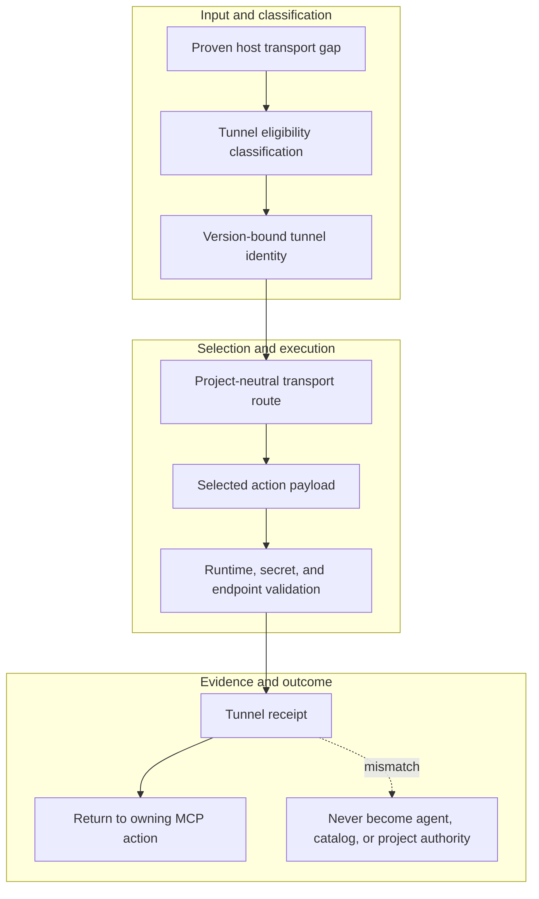

<!-- evidence-lane-public-docs-full-refresh: 3.0.0 / registry-derived-v1 -->

# User tunnel guide

The Evidence Lane tunnel is a version-bound, project-neutral transport used only when the selected Codex host lacks the required direct MCP or host-tool route.

Current counts are derived release facts, not permanent ceilings.

## Boundary

The tunnel does not install the plugin, register projects, expose 91 actions by itself, select workflows, own credentials, schedule work, decide HIL, move pointers, or become another agent. One host-wide tunnel can carry exact project/task identities for multiple independent tasks.

## Setup and prewarm

Use `plugins/evidence-lane-plugin/scripts/windows_tunnel/Install-EvidenceLaneTunnel.ps1` only at the assigned maintainer row. The installer builds the exact hidden runtime, verifies all requirement and native-tool identities, prewarms applicable capabilities, stores masked secret material only through the host secret boundary, and creates the current versioned startup task when required.

Use `Manage-EvidenceLaneTunnel.ps1 -Action Status` for readback. PASS requires the current tunnel ID, runtime key, binary/package hashes, host profile/lifetime, prewarm receipt, and hidden process state. An old scheduled task or runtime is directly removed when the new version becomes active.

FastMCP remains the preferred composition route when eligible; the tunnel carries the selected route and never changes its authority.

## Source-bound workflow map

This page is projected from the same current executable snapshot as the rest of the documentation set. The map is deliberately two-directional: each horizontal district shows peer stages while vertical edges show ownership and state progression.

## Contract and readback

| Phase | Current contract | Required readback |
| --- | --- | --- |
| Input | Proven host transport gap | Exact identity, provenance, and scope |
| Classification | Tunnel eligibility classification | Owning schema, action, lane, skill, or authority |
| Owner | Version-bound tunnel identity | One canonical implementation owner |
| Route | Project-neutral transport route | Condition-true ordered route with no hidden alias |
| Execution | Selected action payload | Real execution or a visible fail-closed result |
| Validation | Runtime, secret, and endpoint validation | Hash, schema, authority-effect, and negative-case checks |
| Receipt | Tunnel receipt | Content-addressed result and provenance receipt |
| Downstream | Return to owning MCP action | Only the explicitly eligible next state |
| Failure | Never become agent, catalog, or project authority | No inferred HIL, candidate acceptance, or pointer movement |

## Canonical source owners

- `toolchains/tunnel-runtime-toolchain.v1.json`
- `tunnel/README.md`
- `src/evidence_lane_plugin/tunnel_identity_routing.py`

### Exact backend readback

| Source contract | Bytes | SHA-256 |
| --- | ---: | --- |
| `toolchains/tunnel-runtime-toolchain.v1.json` | 109554 | `23027693F389A79951194DE4BFA9A64A96F787DB52D302E39D98432679E0AFB1` |
| `tunnel/README.md` | 279 | `9EA8A0EE3C4D12CFEDC583A16F0F1E0799182F0A07E9E2E5B12063798132D90A` |
| `src/evidence_lane_plugin/tunnel_identity_routing.py` | 3915 | `00E8E2BB23045481A9444CDDFF0B2CF4470F112BF8B59A9E4996FB30B6C00719` |

## Cross-surface invariants

- The current snapshot contains 91 public actions, 26 skills, 11 hook events / 44 handlers, 119 tool requirements, 18 sector lanes, and 11 named authorities. These are derived counts, not fixed ceilings.
- Executable ownership stays one-way: skills select, MCP exposes, the outer SDK routes, the internal SDK executes, ENV selects, UOP governs, tools perform bounded work, hooks emit receipts, and the owning authority validates effects.
- Any missing identity, schema, grant, capability, dependency, receipt, or authority proof must fail closed at its owning phase; a later green check cannot retroactively authorize the skipped boundary.
- A changed route refreshes every dependent schema, manifest, generator, test, diagram, and documentation reference; the superseded executable route is directly purged in the same Delta.
- Tests, Git, CI, installation, restart, deployment, discussion, or a rendered page never imply Project HIL, Learning HIL, Goal completion, or pointer movement.

---

This page is a Git-tracked documentation projection. Executable source, SQLite authorities, installed-runtime receipts, and explicit human gates remain the governing evidence.
