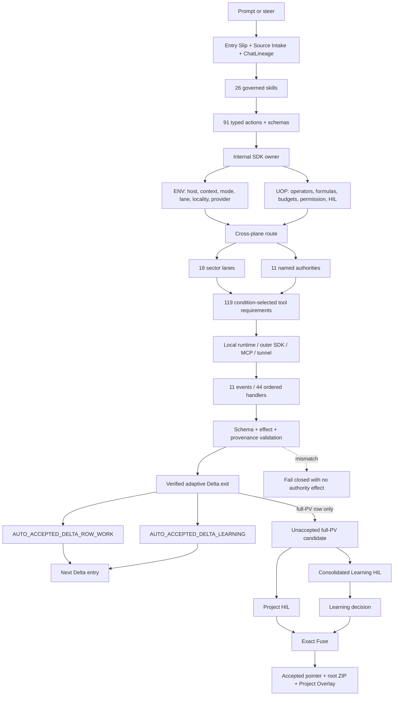

# Evidence Lane plugin 3.0.0

Evidence Lane helps Codex stay oriented through a long project. It remembers
where the evidence came from, which Plan row is active, what changed, what the
project learned, and which decisions still belong to the user. A fresh task can
resume the same project without pretending it is a new project or mixing the
working folder with the project's durable evidence and the installed plugin.

The practical promise is simple:

- work stays traceable to evidence and the active Plan row;
- unfinished work resumes with its Goal, changes, and human gates intact;
- Project Truth, AI Learning, Canon, Memory, instructions, and Git delivery do
  not silently overwrite one another;
- no proposal, rollback, merge, or Project/Learning acceptance is inferred from
  conversation or test success; and
- the user sees the current work and the exact next decision.

Version 3.0.0 is the current governed Codex source release. Source, branch
commit, package, installed runtime, live proposal, and accepted Project Truth
remain separately proven identities. The package provides 91 native actions
(30 read-only and 61 write-capable), 26 governed skills with no separate command layer,
eleven lifecycle event classes with 44 ordered handlers, 119 conditional tool
requirements, CPU/NVIDIA/AMD execution-provider routing, durable project storage,
persistent Plan/Delta continuity, and authority-specific governed HIL policies.

## Full runtime workflow

Each verified ordinary Delta creates two separate automatically admitted inputs:
`AUTO_ACCEPTED_DELTA_ROW_WORK` is the predecessor sub-PV work receipt and
`AUTO_ACCEPTED_DELTA_LEARNING` is bounded procedural Learning for the next
Delta. Neither has an individual HIL, Project Overlay effect, accepted-ZIP
rotation, or full-PV pointer effect. At a full-PV boundary, Project HIL and the
consolidated Learning HIL remain two independent human decisions. Only exact
accepted Project Truth may create the Project Overlay and rotate the accepted
root ZIP; Learning acceptance moves only the Learning pointer. See the
[adaptive Delta contract](../../docs/ADAPTIVE_DELTA_EXECUTION.md) and the
[ENV/UOP execution-plane contract](../../docs/ENV_AND_UOP.md).

## Detailed architecture and governance

Agent Learning is a separate project-scoped authority, not another name for
Project Truth or Canon. It seals evidence-backed candidates, records lifecycle
and decision events append-only, and moves only its own pointer after an exact
Learning HIL decision. Rejection, failure, expiry, revocation, supersession,
and rollback retain immutable history. Project Truth conflicts suppress a
lesson with a receipt; no Learning action can create a Project candidate,
invoke Project HIL, or move the accepted Project PV.
Canon is independently implemented as a typed project/task graph and bounded
input authority. Exact expected contracts auto-admit; undefined or incompatible
packets stop only the receiving top-level task at its three-way `ACCEPT`,
`REJECT`, or `MORE_RESEARCH` Canon Input HIL. Cross-task and cross-project
edges bind exact UUIDs/deep links, return contracts, replay identities, and
source PV seals. They never propagate source-write, Project/Learning HIL,
candidate, Fuse, or pointer authority. Subagents require current user authority
and cannot own HIL. See
[the Canon task graph contract](../../docs/CANON_TASK_GRAPH_AND_INPUT_HIL.md).
The installed runtime prewarm and release validators bind the same governed
console resource, `ui://evidence-lane/governed-console-v6.html`, and fail closed
if that identity drifts.
The generated Python environment and installation receipts live under the
hidden control root `~/.codex/plugins/runtime/evidence-lane-plugin`, outside
Codex's reconstructable package cache. Project/PV authority remains in the
user-selected external root registered once by the initial project workflow;
the source worktree is separate again. Any number of later tasks for that
project, including fresh State Travel destinations, reuse the existing
`project_id` registration and never ask for or create another Project/PV root.
The exact active local-testing or main-Git slot remains source authority.

Every local package exposes inspectable `env/`, `uop/`, `mcp/`, `sdk/`,
`schemas/`, `skills/`, `hooks/`, `toolchains/`, and `src/` roots.
ENV/UOP published folders are byte-exact projections of the locked canonical
authorities. MCP and SDK bindings import the canonical implementation rather
than duplicating it. Command wrappers delegate to their skills. The package
coherence receipt rejects stale generated catalogs, compiled hosts, schemas,
authority members, or mixed-version source.

Hooks transport lifecycle only: SessionStart, SubagentStart, UserPromptSubmit,
PreToolUse, PermissionRequest, PostToolUse, PreCompact, PostCompact,
SubagentStop, Stop, and main-thread-only best-effort SessionEnd. The active
skill owns native PV reads, classification, behavior, and the complete
Plan/CURRENT CHANGE projection. Explicit public actions remain valid with hooks
off; hooks automate or observe them and never become their sole execution path.

Indexed project retrieval is authoritative SQLite FTS5/BM25 over the Plan,
lane, ChatLineage, and project-sector databases. Only bounded query results
with exact pointer/locator provenance enter model context; a PV package or full
database never does. The Windows x86-64 package also carries hash-pinned
`ripgrep` 15.2.0 for bounded pre-index file/content discovery, with an exact
configured-host-binary route and deterministic Python fallback. `ripgrep` is
not the FTS authority. PATH lookup, shell execution, and download during MCP
handshake are forbidden, and no search surface has lifecycle or HIL authority.

The private internal Codex SDK is the full engine-and-contract layer, not a
reduced retrieval wrapper. Its provider-neutral ABI keeps Project Truth, Canon
Input, AI/Agent Learning, ChatLineage, host-entry continuity, lifecycle/hooks,
Plan/Delta/tasks, source/lane retrieval, ENV/UOP plus Formula/PCM/MBA,
storage/connectors, HIL/candidate/pointer, and provider/host adapters in
independent namespaces and replay ledgers. Every call binds the exact
project/session/task/pointer/lineage/ENV-UOP/model/host/write scope. Unsupported
host operations fail explicitly, and Project Truth and Learning retrieval stay
separate. See [the tools and SDK contract](../../docs/TOOLS.md).

The provider-neutral GitHub App boundary is also compiled pre-HIL: a packaged
least-privilege manifest schema, signature-before-parse webhook verifier,
replay-safe installation-token broker, check-run receipt mapper, and signed
tester-artifact entitlement flow. The deterministic adapter uses fixtures only;
it neither registers or installs an app nor stores credentials, grants private
development-repository access, distributes to external testers, publishes, or
promotes any Evidence Lane authority. See
[the Git and CI contract](../../docs/GIT_AND_CI_CD.md).

The same module now exposes a replay-safe production-delivery identity for
maintainer checkpoints. Its public sealer binds the host-managed GitHub App
installation, exact repository ref, green Actions head, package hash/version,
installed branch-commit recovery slot, mutable local slot, and the unchanged
main-merge fallback. The sealer is evidence-only: it never receives credentials
and performs no commit, push, install, candidate, HIL, or pointer action.

Maintainer repository writes use the separate
`github_app_exact_commit_push_v1` route. Its deterministic local preview must
carry the canonical `evidence-lane[bot]` identity as both author and committer;
the selected App then recreates exact blobs, tree, ordered parents, and commit
through GitHub's Git Database API and fast-forwards only the named feature
branch with `force=false`. The remote feature ref must equal the exact parent or
be its server-verified ancestor; divergence fails before object or ref writes.
The route never writes `main`, borrows the downstream project-source push tools,
or silently falls back to a human credential.

After that exact feature head passes the required clean workflows, maintainer
main promotion uses only `github_app_main_fast_forward_v3`, owned by
`scripts/codex_release/fast_forward_github_app_feature_to_main.py`. It checks
the exact source/target refs, strict ancestry, App-bot feature identity, and
exact-head workflow results before advancing `main` with `force=false`. It then
verifies the final main commit/tree. It performs no local main checkout, merge
commit, blob replay, force push, or fallback to the superseded merge route.

Candidate creation, remote Git push, package installation, and pointer movement
are separate governed operations. None of them implies acceptance. Only exact
case-sensitive `APPROVE` at the correct HIL can authorize Fuse.

The maintainer checkpoint route binds the complete source scope, exact branch
commit and tree, governed push, Actions head, deterministic package, and
branch-commit recovery slot. A later release HIL requires installed readback of
91 actions (30 read/61 write), 26 current skills, eleven distinct hook events, and the
migrated command surface. The checkpoint cannot infer HIL, move a Project
pointer, merge `main`, or change the byte-frozen main-merge fallback. That
plugin release/install cadence is not part of an ordinary downstream user's
project PV workflow.

Only the human command `MARK GOAL COMPLETE` may complete a governed Goal, with
`COMPLETE_THIS_TASK_AND_STATE_TRAVEL` or `COMPLETE_FULLY`. HIL, candidate,
tests, Plan/task state, automation, pause, and stall have no Goal-completion
authority. The package ships the maintainer-scoped installer and hidden tunnel
manager, but no restart helper; the sealed install receipt is followed by the
user's manual app restart. A user receives one plugin version and, only when a
measured host-tool gap requires it, one matching tunnel. There is no separate
governed-user Goal-recovery helper/service and no retained executable fallback
helper route. Immutable historical receipts remain outside the installed
runtime. No executable may restart, reload, or navigate Codex during State Travel.

## Codex host and storage matrix

| Execution profile | Primary PV storage | Evidence Lane tunnel |
| --- | --- | --- |
| Interactive Codex app on a local or persistent host with the active `CODEX` surface proven | Durable local SQLite | Not required; package-local native MCP is the lifecycle route |
| Codex CLI or headless API on a local/persistent host | Durable local SQLite when available | Not required |
| Headless API on an ephemeral VM with durable mount | Durable mounted SQLite | Not required |
| Headless API on an ephemeral VM without durable mount | Explicit transactional durable connector | Not required |
| Interactive Codex app on an ephemeral VM | Durable mount or explicit transactional connector | One setup per VM lifetime; never reused by a replacement VM |

Stable Codex (`OpenAI.Codex_2p2nqsd0c76g0!App`) and Codex Beta
(`OpenAI.CodexBeta_2p2nqsd0c76g0!App`) are two app containers for the same
`CODEX_DESKTOP` host profile. They share the same plugin contract and the same
host-wide tunnel; neither receives a per-app, per-project, or per-task tunnel.

When storage is not durable, governed work starts only after one expiring,
secret-safe host-entry envelope is claimed exactly once by the intended task
and host binding. It carries hashes and receipts, not raw paths, credentials,
or private reasoning, and cannot promote Project Truth, accept Canon or Agent
Learning, replay HIL, or move the accepted pointer. Exact retries reuse the
prior receipt. A missing connector, stale generation, different worktree,
unauthorized candidate overlay, expired envelope, or different consumer fails
closed. Durable local Codex continues directly from local SQLite without this
envelope.

Account tier and API billing do not choose the storage route. Runtime state is
project-scoped and remains separate from any optional artifact mirror.

For durable local hosts, the registered project may bind an explicit
user-selected project root outside the plugin control root. That root owns the
accepted pointer and current project authorities, including 18 registry-derived
sector directories plus Plan, ChatLineage, Learning, Canon, Memory, Universe,
sources, snapshots, and receipts. Study Brain is a routing profile and never an
extra stored lane. The Codex marketplace/cache, generated native runtime,
ENV/UOP, tunnel, MCP, and SDK controls remain host-managed and are not copied
into the user project. Initial `project_register` records the user-selected
external Project/PV root; State Travel reuses that exact mapping across tasks.
`storage_connector_inspect` reports the resulting bounded route and layout.

## Bounded Windows tunnel setup

Run tunnel setup only after runtime classification proves a host-tool gap. The
version-matched tunnel and every dependency it needs are provisioned inside the
hidden Codex plugin runtime, never the source workspace or Project/PV root.
Local Codex, CLI, or API profiles with the required native capabilities use the
package-local MCP directly and do not launch a tunnel.

On first use, when no matching tunnel configuration exists, the host may open a
single interactive terminal to guide the user to create and paste the required
API key. The prompt is masked and the value is stored only as a current-user
Windows DPAPI envelope. It is never printed, committed, placed in process
arguments, or copied into project authority.

After configuration the one active host-wide tunnel launches hidden, may survive
Windows sign-in through its exact versioned at-logon scheduled task, prewarms its dependencies
and non-MCP toolchain, and exposes a health receipt. A tunnel is transport only:
it does not install the plugin, select project storage, run State Travel, mutate
Plan/Goal/HIL/pointers, or absorb unrelated OpenAI tooling. Removed tunnel
identities are absent from live routing.

## Package map

- `.codex-plugin/plugin.json` — Codex product and host metadata.
- `.mcp.json` — package-local native MCP launch contract.
- `src/evidence_lane_plugin/` — canonical Python engine, internal SDK, and native server.
- `authorities/` — 18 separate Project Sector packages plus 11 distinct named/root authorities.
- `schemas/` — central source-derived action, authority, lane, hook, skill, ENV/UOP, MCP, and SDK contracts.
- `sdk/` — full internal and outer routing projections, including every public action, authority, workflow, host, hook, rollback, and module binding.
- `mcp/` — thin executable bindings for the current 91-action catalog.
- `skills/` — 26 governed skills, including the native `evi-plan` sidecar; no separate command projections are shipped.
- `hooks/` — eleven event classes with 44 ordered handler actions.
- `toolchains/` and `tunnel/` — the current derived 119-requirement Codex toolchain, separate CPU/NVIDIA/AMD execution-provider routing, licenses, hidden-runtime provisioning, one identity-isolated tunnel contract, and no legacy core-plus-extension split.
- `scripts/codex_release/` — maintainer-only package/install preparation and installed verification routes.

The executable manifest excludes repository-only remote-adapter source, PoCs,
developer tests, virtual environments, caches, `.next`, `node_modules`, and
local evidence. Generated files are rebuilt from the same current source graph;
stale action, schema, SDK, skill, hook, command, and route members are removed.

## Install, activate, and verify

1. Run the bounded source and package parity checks.
2. Use Plugin Creator for every pack and assign one fresh cachebuster version.
3. Materialize only the existing local-testing selector into the hidden Codex
   plugin/cache layer. Do not try a generic plugin-add/cache-backup route first.
4. Build and prewarm the derived hidden runtime from the exact base/toolchain
   locks plus the selected CPU, NVIDIA CUDA, or AMD DirectML provider lock,
   native-tool, model, and license receipts. Normal MCP startup never installs.
5. Produce a pre-restart installed-byte receipt; it is not installed-host proof.
6. Run the maintainer restart preflight outside plugin execution; it validates
   the exact package, task, app channel, and install receipt but never drains
   turns, stops processes, installs, starts the tunnel, or replays State Travel.
7. Persist and visibly complete the response. Only then may the user close and
   reopen the exact selected Codex app channel when restart is required.
8. After restart, verify the installed 91/30/61 catalog, 26 skills, no command layer,
   eleven hook events/44 handlers, 18 sector packages, 11 named authorities,
   central schemas, full SDK, ENV/UOP, tunnel, task/session attachment, and
   canonical Step/Changes relock.
9. Enable/trust only installed hook handlers that pass their own native timing
   and behavior proofs; unrelated passing handlers remain enabled.

Local installation never mutates the main Git slot, Project/PV root, accepted
pointer, candidate, HIL state, Plan, Goal identity, or dirty workspace bytes.
State Travel invokes no install, drain, or restart route.

## Two maintained slots

The current maintainer registry has two roles: one mutable local-testing slot
and one main-Git release slot. This is the current supported topology rather
than a permanent product ceiling. Branch checkpoints are package
evidence, not a third slot. Only one plugin/MCP runtime and one matching tunnel
may be active. Removed slot and failover executors are absent from the current
package; immutable historical receipts remain evidence outside live routing.

## Maintainer-only restart boundary

The installed package has no governed-user Goal-recovery helper or service. A
user receives one current plugin version and, when a measured host-tool gap
requires it, one matching tunnel. The maintainer restart preflight validates
the exact package, task, app channel, root process, and install receipt. It does
not drain turns, stop processes, install, start the tunnel, navigate tasks,
replay State Travel, or mutate project, Plan, Goal, HIL, or pointer authority.

The active response must persist and visibly complete first. The user then
closes and reopens the exact selected Codex app channel when restart is needed.
Post-restart native readback proves the same task and new package identity.
Removed drain, programmatic restart, and recovery-helper routes remain absent
from live dispatch; immutable historical receipts remain non-executable evidence.

## Persistent Plan and change display

The task panel and linked change status are one durable pair. `SessionStart`
rehydrates the exact task binding, `UserPromptSubmit` binds the visible turn,
`PostToolUse` reprojects the active task/Delta display after relevant native
actions, and `Stop` preserves the exit boundary without inventing a decision.
The pair maps to the native right-side Plan artifact and the exact task/worktree-
bound Changes surface. It remains required until the human marks the Goal
complete or a passed task-completion-and-State-Travel handoff transfers the full
projection. Renderer reload, panel loss, partial/stale display, and unexpected
task navigation are deterministic recovery triggers. Restore through native
`update_plan` and exact task binding before work; if the host cannot do so,
report `HOST_CAPABILITY_UNAVAILABLE` rather than claiming UI persistence.

Recovery is deliberately bounded: the plugin reconstructs the panel from the
sealed task binding and canonical Plan Lane, never by hydrating the full chat
history or collaboration/avatar overlay. React-root rerender, thread-hydration
overflow, overlay conflict, or surface loss is a first-class continuity failure
even when the root app process survives. Recovery runs with one active task and
zero subagents, fails closed, and reprojects before work. Host-owned UI survival
cannot be guaranteed by the plugin.

These are two different laws. A successful `pv_plan_steer_delta` is followed by
the existing `PostToolUse` projection of the same Plan/Current Change panel; it
does not prove that the steer was captured before reasoning. Codex routes every
pending `TurnInput::UserInput` through `UserPromptSubmit` before model input,
including `turn/steer`; `thread/goal/set` bypasses that pending-input dispatcher.
The prompt-intake adapter therefore ignores caller `source`, `is_steer`, and `is_goal`
claims and derives first prompt versus same-turn steer from the sealed turn
ledger. Each visible user input needs its own sealed prompt-intake receipt. An
automatic Goal continuation instead binds at its first `PreToolUse` boundary
only when the current exact-task recovery binding, installed package/task
receipt, active Goal, active Plan row, project/session, selector, and pointer all
verify. It stores no raw Goal objective and creates no synthetic prompt; a Goal
marker sent through `UserPromptSubmit` still fails closed. Every exact-task
restart must write the new task-binding receipt, refresh the same task's sealed
Goal binding against that exact receipt, and only then stop the host. A stale
Goal-to-task-binding seal fails closed and cannot be repaired by inventing a
prompt or replaying State Travel. After a steer appends a Delta, `PostToolUse`
separately refreshes the same persistent Goal step list and CURRENT CHANGE panel.

Moving from the active row to its queued successor is a separate, fail-closed
checkpoint. The current run must contain one sealed `task.test.output` or
`task.build.output` event whose checks exactly equal the active row's native
acceptance contract. The checkpoint binds that event to the exact task,
session, accepted pointer, and installed plugin, marks only the active Plan row
done, and activates only the requested queued successor. It never creates a
candidate, infers HIL, or moves the accepted PV pointer; missing or mismatched
evidence leaves the active row unchanged.

The skill classifies a request before Plan mutation. A question, explanation,
small read-only ask, or bounded artifact readback is an ordinary task and does
not append a Plan Delta. Only a change to the active Goal's executable contract,
dependency, acceptance, stop, release route, or HIL path is a Plan steer. That
steer links to the existing logical row when possible and refreshes the complete
panel once.

Delivery commits are dependency-coherent integration bundles rather than one
commit/CI/preview/package/install cycle per Delta row. Row acceptance remains
individual, together with prompt-intake/retrieval, native PV reads, classification,
visible ChatLineage, lifecycle transition, and panel refresh. One logical bundle
joins related changes for cross-Delta testing, and its verification matrix maps
every included task to changed surfaces, tests, remote/installed checks, outcome,
and failure owner. Any included-row failure fails the bundle closed. The bundle
then synchronizes the root README and affected repository-level evidence before
the governed Git and installed-host gates. At that boundary,
`scripts/sync_website_plan_projection.py` regenerates the sealed public
Plan/Delta snapshot and public plugin metadata directly from a passing native
`PLAN_LANE`; the same command with `--check` must report no drift before push.
The TypeScript execution and ledger views consume that snapshot rather than
duplicating row data. A feature-branch preview may render the commit-bound
snapshot, but production publication remains post-HIL. Local packages are
rehearsal-only; the single stable selector updates once at the bundle boundary
from the exact Git commit package, after all configured checks and exact-SHA
preview proof.

The change display reports the active task, linked Delta IDs, source/install/
runtime version, activation and Refresh state, catalog counts, hook inventory,
and skill inventory. Codex owns the final UI placement, so visible placement and
the Evidence Lane icon remain installed-host HIL observations.

## Git boundary

The configured non-default test branch may use standing project authorization
for exact fast-forward pushes through the native prepare/execute route. Each
push still seals the project, branch, commit, tree, remote, and action ID. This
does not authorize force-push, default-branch mutation, merge, publication,
candidate acceptance, pointer movement, or Fuse.

## Release boundary

Historical 1.x commits, packages, PVs, and receipts remain immutable evidence;
they are not extra live slots. A changed v2 source tree receives a fresh
collision-free build identity, a new deterministic package, one coherent CI
cycle, a supported reinstall/restart, and a new installed-host HIL.
